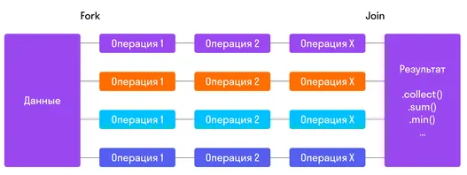

[**<<< 2.4 Java Collections Framework**](/conspect/02_04.md/#24-java-collections-framework) ---
[**2.6 Потоки (Threads) >>>**](/conspect/02_06.md/#26-потоки-threads)

## 2.5 Stream API

> [[_оглавление_]](../README.md)

[**Stream API**](/conspect/definitions.md/#s) - это мощный инструмент, введённый в _Java 8_, который позволяет выполнять
операции на потоках данных (_sequences of elements_) с использованием функциональных интерфейсов.

Он предоставляет богатый набор операций для обработки и манипулирования данными в потоках, таких как фильтрация,
сортировка, преобразование и агрегирование данных, используя функции, такие как `map()`, `filter()`, `reduce()`.
_Stream API_ поддерживает ленивую обработку данных, что улучшает производительность, особенно с большими объёмами
данных. Это упрощает написание кода и делает его более выразительным.

Начиная с _Java 8_, язык стал поддерживать функциональное программирование, частью которого является декларативный
подход.

Декларативное программирование в _Java_ реализуется за счёт следующих инструментов:

- [функциональные интерфейсы](/conspect/02_02.md/#22422-функциональные-интерфейсы);
- [анонимные классы](/conspect/02_02.md/#22421-анонимные-классы);
- [лямбда-выражения](/conspect/02_05.md/#251-лямбда-выражения);
- [ссылки на методы](/conspect/02_05.md/#252-ссылки-на-методы).

_Stream API_ использует не методы, а функции.  
Функция это не то же самое, что и метод, в ООП, несмотря на то, что функция может использоваться как метод, а метод
может использоваться как функция.

Различия между методами объектов и функциями _Stream API_:

|                                                                     **Метод**                                                                     |                                                                                                 **Функция**                                                                                                 |
|:-------------------------------------------------------------------------------------------------------------------------------------------------:|:-----------------------------------------------------------------------------------------------------------------------------------------------------------------------------------------------------------:|
| привязан к классу или экземпляру класса (для вызова нужно создать экземпляр класса, либо (статический) метод может быть доступен через сам класс) |                                                               независимая единица программы, на которую можно ссылаться без привязки к классу                                                               |
|                                помимо собственных параметров, может зависеть от других атрибутов экземпляра класса                                |                                                             не зависит от внешних значений (переменных, объектов) кроме собственных параметров                                                              |
|                                                     могут изменять значения своих параметров                                                      | (чистые) функции не могут изменить ни свои аргументы, ни другие внешние значения (не имеет побочных эффектов) - может только использовать свои параметры для того, чтобы создавать новые значения (объекты) |
|                                                          может изменять исходный объект                                                           |                                              принимает параметр, создаёт его копию, вносит изменения в эту копию, но оригинальный объект остается неизмененным                                              |
|                                     могут быть объединены в цепочку методов только в зависимости от контекста                                     |                                          могут быть объединены в цепочку функций независимо от контекста и эту цепочку можно вынести в отдельный объект (функцию)                                           |

Основные принципы _Stream API_ включают в себя:

- _ленивость вычислений_ - _Stream API_ не выполняет операции над элементами коллекции до тех пор, пока не будет вызван
  терминальный метод;
- _отсутствие хранения данных_ - _Stream API_ лишь использует данные из указанного источника, не изменяя их;
- _однократное использование_ - после того, как была вызвана терминальная операция, поток нельзя использовать повторно,
  для повторного использования нужно создавать новый поток;
- _параллельная обработка_ - _Stream API_ выполняет операции над элементами потока друг за другом, но позволяет
  обрабатывать элементы параллельно, что может ускорить выполнение операций над большими коллекциями;
- _декларативный стиль_ - _Stream API_ не нужно предоставлять конкретную реализацию операций над данными: достаточно
  описать, что нужно с ними сделать.

В _Stream API_ имеются 3 основных понятия:

- **источник данных** - может быть заранее заданный набор данных или динамический генератор, возможно даже бесконечный (
  сам источник никогда не модифицируется последующими операциями);
- **промежуточная (_intermediate_) операция** - модифицирует поток (на одном потоке можно вызвать сколько угодно
  промежуточных операций);
- **терминальная (_terminal_) операция** - «потребляет» поток, она может быть только одна, в конце работы с отдельно
  взятым потоком (_Stream API_ работает лениво – вся цепочка промежуточных операций не начнет выполняться до вызова
  терминальной).

### 2.5.1 Лямбда-выражения

> [[_оглавление_]](../README.md)

[**Лямбда-выражение**](/conspect/definitions.md/#л) - это анонимная реализация какого-то метода функционального
интерфейса.

Синтаксис лямбда-выражений:

- без аргумента:

$\textrm{\color{white}() -> System.\color{purple}out\color{white}.println("Hello")}$

- с одним аргументом:

$\textrm{\color{white}s -> System.\color{purple}out\color{white}.println(s)}$

- с двумя аргументами:

$\textrm{\color{white}(x,y) -> x + y}$

- с открытым типом аргументов:

$\textrm{\color{white}(Integer x, Integer y) -> x + y}$

- множественный оператор:

$\textrm{\color{white}(x,y) ->}$ {  
$\space\space\space\space\space\textrm{System.\color{purple}out\color{white}.println(x);}$  
$\space\space\space\space\space\textrm{System.\color{purple}out\color{white}.println(y);}$  
}

У лямбда-выражений два блока, которые разделены символом-стрелкой $\textrm{\color{white}->}$ :

1. перед $\textrm{\color{white}->}$ указываются параметры метода;
2. после $\textrm{\color{white}->}$ указывается тело метода:
    * если в теле метода одна строка, то его можно не оборачивать в фигурные скобки (`{ }`);
    * если строк две и больше, то по принятому стандарту описания методов нужно обернуть код в фигурные скобки (`{ }`) и
      вызвать оператор $\textrm{\color{orange}return}$ в конце блока (опционально).

> Лямбда-выражения позволяют выявить тип на основе контекста, в котором они применяются, поэтому тип параметров в
> лямбда-выражениях не указывается.

Пример 1:

```java
public static void main(String[] args) {
    Runnable test = () -> System.out.println("Hello World!");
    // Эквивалентный анонимный класс
    Runnable test2 = new Runnable() {
        @Override
        public void run() {
            System.out.println("Hello World!");
        }
    };
    test.run();
    test2.run();
}
```

Вывод:

```text
Hello World!
Hello World!
```

Пример 2:

```java
public static void main(String[] args) {
    BinaryOperator<Integer> sum = (x, y) -> x + y;
    // Эквивалентный анонимный класс
    BinaryOperator<Integer> sum2 = new BinaryOperator<Integer>() {
        @Override
        public Integer apply(Integer x, Integer y) {
            return x + y;
        }
    };
    // Вариант применения, который распечатает на экран число 3
    System.out.println(sum.apply(1, 2));
    // Применение при реализации анонимным классом не отличается
    System.out.println(sum2.apply(1, 2));
}
```

Вывод:

```text
3
3
```

### 2.5.2 Ссылки на методы

> [[_оглавление_]](../README.md)

[**Ссылки на методы (Method References)**](/conspect/definitions.md/#с) - это компактные лямбда-выражения для методов, у
которых уже есть имя.

Типы _Method References_:

- ссылка на нестатический метод любого объекта конкретного типа;

$\textrm{\color{white}ContainingType::\color{purple}methodName}$

- ссылка на нестатический метод конкретного объекта;

$\textrm{\color{white}ContainingObject::\color{purple}instanceMethodName}$

- ссылка на статический метод;

$\textrm{\color{white}ContainingClass::\color{purple}staticMethodName}$

- ссылка на конструктор.

$\textrm{\color{white}ClassName::\color{orange}new}$

### 2.5.3 Stream

> [[_оглавление_]](../README.md)

[**Stream**](/conspect/definitions.md/#s) - это последовательность данных, поддерживающая операции над элементами в
функциональном стиле, такие как фильтрация, сортировка, преобразование и агрегирование.

_Streams_ не хранят данные, а обрабатывают их по мере необходимости, что позволяет работать с большими объёмами данных
без создания дополнительных коллекций.

Стримы могут быть как конечными (например, `sum()`, `collect()`), так и промежуточными (`filter()`, `map()`).

_Stream API_ поддерживает параллельную обработку данных для повышения производительности.

Пример:

```java
private static void streamExample() {
    // Создадим список и заполним его буквами не по алфавиту
    List<String> list = new ArrayList<>();
    list.add("B");
    list.add("D");
    list.add("C");
    list.add("A");
    list.add("E");
    // Создадим копию списка
    List<String> list2 = new ArrayList<>(list);
    // Отсортируем список с помощью метода пузырьковой сортировки
    // Она использует два вложенных цикла и одно сравнение
    for (int i = 0; i < list.size(); i++) {
        for (int j = i + 1; j < list.size(); j++) {
            if (list.get(i).compareTo(list.get(j)) > 0) {
                String temp = list.get(i);
                list.set(i, list.get(j));
                list.set(j, temp);
            }
        }
    }
    System.out.println("Мы отсортировали это для тебя: " + list);
    // Создадим стрим для элементов
    ArrayList<String> sortedElements = list2.stream()
            .sorted()
            // Далее выведем данные в новую коллекцию с помощью коллектора
            .collect(Collectors.toCollection(ArrayList::new));
    System.out.println("Мы отсортировали это для тебя: " + sortedElements + " Исходный список: " + list2);
}
```

Вывод:

```text
Мы отсортировали это для тебя: [A, B, C, D, E]
Мы отсортировали это для тебя: [A, B, C, D, E] Исходный список: [B, D, C, A, E]
```

В применении _Stream_ выделяют 3 этапа:

- создание;
- промежуточные (конвейерные) операции;
- терминальные (конечные) операции.

Основная цель, ради которой в _Java 8_ был добавлен _Stream API_ - удобство многопоточной обработки.  
Обычный _Stream_ будет выполняться параллельно после вызова промежуточной операции `parallel()`. Некоторые стримы
создаются уже многопоточными, например результат вызова `Collection#parallelStream()`. Для распараллеливания
используется единый общий _ForkJoinPool_.  
Внутри реализации потока его _Spliterator_ оборачивается в _AbstractTask_, который и отправляется на выполнение в пул
потоков. _AbstractTask_ при выполнении считывает _estimateSize_ сплитератора и текущую степень параллелизма пула. На
основе этих данных он принимает решение, распараллеливать ли сплиттератор на два методом `trySplit()`.

> У удобства такого решения есть обратная сторона. Так как пул единый, нагрузка распределяется на всех пользователей
> параллельных стримов в программе. Если в одном потоке выполняются долгие блокирующие операции, это может ударить по
> производительности в совершенно несвязанном с ним другом потоке.

Если всё же требуется использовать отдельный пул потоков, сам стрим выполняется как задача этого отдельного пула.

#### 2.5.3.1 Создание Stream

> [[_оглавление_]](../README.md)

_Stream_ создаётся там, где он должен брать данные.

Способы создания _Stream_:

- прикрепление к той коллекции, массиву или методу, с чьими данными он работает:

    * списка:

  $\textrm{\color{white}list.stream()}$

    * карты:

  $\textrm{\color{white}map.entrySet().stream()}$

    * массива:

  $\textrm{\color{white}Arrays.stream(array)}$

    * набора данных:

  $\textrm{\color{white}Stream.of(\color{green}"1"\color{white}, \color{green}"2"\color{white},
  \color{green}"3"\color{white})}$

- явное задание значения:

$\textrm{\color{white}Stream.of(\color{aqua}v1\color{white}, \color{aqua}...\color{white},
\color{aqua}vN\color{white})}$

- специальные стримы для примитивов:

$\textrm{\color{white}IntStream.of(\color{aqua}1\color{white}, \color{aqua}...\color{white},
\color{aqua}N\color{white})}$  
$\textrm{\color{white}DoubleStream.of(\color{aqua}1.1\color{white}, \color{aqua}...\color{white},
\color{aqua}N\color{white})}$

- из файла, где каждая новая строка становится элементом:

$\textrm{\color{white}Files.lines(\color{green}[путь к файлу]\color{white})}$

- с помощью стримбилдера:

$\textrm{\color{white}Stream.builder()}$  
$\space\space\space\space\space\space\space\space\textrm{\color{white}.add(\color{green}[значение]\color{white})}$  
$\space\space\space\space\space\space\space\space\textrm{\color{white}.add(\color{green}[значение]\color{white})}$  
$\space\space\space\space\space\space\space\space\textrm{\color{white}...}$  
$\space\space\space\space\space\space\space\space\textrm{\color{white}.build()}$

- задание последовательности чисел от и до:

    * не включительно:

  $\textrm{\color{white}IntStream rangeS = IntStream.range(\color{aqua}9\color{white}, \color{aqua}91\color{white})}$

    * включительно:

  $\textrm{\color{white}IntStream rangeS = IntStream.rangeClosed(\color{aqua}9\color{white},
  \color{aqua}91\color{white})}$

- создание параллельного стрима:

$\textrm{\color{white}collection.parallelStream()}$

- создание бесконечного стрима:

    * с помощью `Stream.iterate()`, задавая начальное значение и способ получения следующего значения:

  $\textrm{\color{white}Stream<Integer> iterateStream = Stream.iterate(1, m -> m + 1)}$

    * с помощью `Stream.generate()`, задавая условие соответствия получаемых постоянных и случайных значений:

  $\textrm{\color{white}Stream<String> generateStream = Stream.generate(() -> \color{green}"f5"\color{white})}$

#### 2.5.3.2 Промежуточные (конвейерные) операции

> [[_оглавление_]](../README.md)

Промежуточных операций в _Stream API_ может быть сколько угодно.

[**Промежуточные операции Stream**](/conspect/definitions.md/#п) - это операции, которые модифицируют стрим перед
вызовом терминального оператора.

##### 2.5.3.2.1 distinct()

> [[_оглавление_]](../README.md)

Функция `distinct()` проверяет _Stream_ на уникальность элементов (убирает повторы элементов).  
Синтаксис функции выглядит следующим образом:

$\textrm{\color{white}...}$  
$\space\space\space\space\space\space\space\space\textrm{\color{white}.stream()}$  
$\space\space\space\space\space\space\space\space\textrm{\color{white}...}$  
$\space\space\space\space\space\space\space\space\textrm{\color{white}.distinct()}$  
$\space\space\space\space\space\space\space\space\textrm{\color{white}...}$

Пример:

```java
private static void streamMethodsExample() {
    List<Integer> list = new ArrayList<>(List.of(1, 2, 3, 4, 5, 6, 7, 8, 9, 8, 7, 6, 5, 4, 3, 2, 1));
    System.out.println(list);
    List<Integer> sortedList = list.stream()
            .distinct()
            .toList();
    System.out.println(sortedList);
}
```

Вывод:

```text
[1, 2, 3, 4, 5, 6, 7, 8, 9, 8, 7, 6, 5, 4, 3, 2, 1]
[1, 2, 3, 4, 5, 6, 7, 8, 9]
```

##### 2.5.3.2.2 filter()

> [[_оглавление_]](../README.md)

Функция `filter()` фильтрует _Stream_, пропуская только те элементы, что проходят по условию.

`filter()` работает с 1 аргументом и замещает функциональный интерфейс _Predicate_:

```java
public interface Predicate<T> {
    boolean test(T t);
}
```

Синтаксис функции выглядит следующим образом:

$\textrm{\color{white}...}$  
$\space\space\space\space\space\space\space\space\textrm{\color{white}.stream()}$  
$\space\space\space\space\space\space\space\space\textrm{\color{white}...}$  
$\space\space\space\space\space\space\space\space\textrm{\color{white}.filter(\color{green}[условие фильтрации]\color{white})}$  
$\space\space\space\space\space\space\space\space\textrm{\color{white}...}$

Пример:

```java
private static void streamMethodsExample() {
    List<Integer> list = new ArrayList<>(List.of(1, 2, 3, 4, 5, 6, 7, 8, 9, 8, 7, 6, 5, 4, 3, 2, 1));
    System.out.println(list);
    List<Integer> sortedList = list.stream()
            .filter(e -> e % 2 == 0)
            .toList();
    System.out.println(sortedList);
}
```

Вывод:

```text
[1, 2, 3, 4, 5, 6, 7, 8, 9, 8, 7, 6, 5, 4, 3, 2, 1]
[2, 4, 6, 8, 8, 6, 4, 2]
```

##### 2.5.3.2.3 limit()

> [[_оглавление_]](../README.md)

Функция `limit()` ограничивает _Stream_ по количеству элементов, начиная с начала.  
Синтаксис функции выглядит следующим образом:

$\textrm{\color{white}...}$  
$\space\space\space\space\space\space\space\space\textrm{\color{white}.stream()}$  
$\space\space\space\space\space\space\space\space\textrm{\color{white}...}$  
$\space\space\space\space\space\space\space\space\textrm{\color{white}.limit(\color{green}[\color{orange}long
\color{aqua}[количество элементов]\color{green}]\color{white})}$  
$\space\space\space\space\space\space\space\space\textrm{\color{white}...}$

Пример:

```java
private static void streamMethodsExample() {
    List<Integer> list = new ArrayList<>(List.of(1, 2, 3, 4, 5, 6, 7, 8, 9, 8, 7, 6, 5, 4, 3, 2, 1));
    System.out.println(list);
    List<Integer> sortedList = list.stream()
            .limit(9)
            .toList();
    System.out.println(sortedList);
}
```

Вывод:

```text
[1, 2, 3, 4, 5, 6, 7, 8, 9, 8, 7, 6, 5, 4, 3, 2, 1]
[1, 2, 3, 4, 5, 6, 7, 8, 9]
```

##### 2.5.3.2.4 map()

> [[_оглавление_]](../README.md)

Функция `map()` даёт возможность создать и применить к каждому элементу _Stream_ функцию, с помощью которой надо
изменить элементы.

`map()` работает с 1 аргументом и замещает функциональный интерфейс _Function_:

```java
public interface Function<T, R> {
    R apply(T t);
}
```

Синтаксис функции выглядит следующим образом:

$\textrm{\color{white}...}$  
$\space\space\space\space\space\space\space\space\textrm{\color{white}.stream()}$  
$\space\space\space\space\space\space\space\space\textrm{\color{white}...}$  
$\space\space\space\space\space\space\space\space\textrm{\color{white}.map(\color{green}[функция]\color{white})}$  
$\space\space\space\space\space\space\space\space\textrm{\color{white}...}$

Пример:

```java
private static void streamMethodsExample() {
    List<Integer> list = new ArrayList<>(List.of(1, 2, 3, 4, 5, 6, 7, 8, 9, 8, 7, 6, 5, 4, 3, 2, 1));
    System.out.println(list);
    List<Integer> sortedList = list.stream()
            .map((x) -> x * x)
            .toList();
    System.out.println(sortedList);
}
```

Вывод:

```text
[1, 2, 3, 4, 5, 6, 7, 8, 9, 8, 7, 6, 5, 4, 3, 2, 1]
[1, 4, 9, 16, 25, 36, 49, 64, 81, 64, 49, 36, 25, 16, 9, 4, 1]
```

##### 2.5.3.2.5 flatMap()

> [[_оглавление_]](../README.md)

Функция `flatMap()` даёт возможность создать функцию, с помощью которой можно собрать данные из нескольких потоков и
преобразовать их в данные одного потока (привести многомерные структуры данных элементов потока к линейной структуре).

`flatMap()` работает с 1 аргументом и замещает функциональный интерфейс _Function_:

```java
public interface Function<T, R> {
    R apply(T t);
}
```

Синтаксис функции выглядит следующим образом:

$\textrm{\color{white}...}$  
$\space\space\space\space\space\space\space\space\textrm{\color{white}.stream()}$  
$\space\space\space\space\space\space\space\space\textrm{\color{white}...}$  
$\space\space\space\space\space\space\space\space\textrm{\color{white}.flatMap(\color{green}[функция]\color{white})}$  
$\space\space\space\space\space\space\space\space\textrm{\color{white}...}$

Пример:

```java
private static void streamMethodsExample() {
    List<List<Integer>> listOfLists = List.of(
            List.of(1, 2, 3, 4, 5, 6, 7, 8, 9),
            List.of(8, 7, 6, 5, 4, 3, 2, 1)
    );
    System.out.println(listOfLists);
    List<Integer> sortedList = listOfLists.stream()
            .flatMap(List::stream)
            .toList();
    System.out.println(sortedList);
}
```

Вывод:

```text
[[1, 2, 3, 4, 5, 6, 7, 8, 9], [8, 7, 6, 5, 4, 3, 2, 1]]
[1, 2, 3, 4, 5, 6, 7, 8, 9, 8, 7, 6, 5, 4, 3, 2, 1]
```

##### 2.5.3.2.6 skip()

> [[_оглавление_]](../README.md)

Функция `skip()` пропускаем _N_-ное количество элементов _Stream_, начиная с начала.  
Синтаксис функции выглядит следующим образом:

$\textrm{\color{white}...}$  
$\space\space\space\space\space\space\space\space\textrm{\color{white}.stream()}$  
$\space\space\space\space\space\space\space\space\textrm{\color{white}...}$  
$\space\space\space\space\space\space\space\space\textrm{\color{white}.skip(\color{green}[\color{orange}long
\color{aqua}[количество элементов]\color{green}]\color{white})}$  
$\space\space\space\space\space\space\space\space\textrm{\color{white}...}$

Пример:

```java
private static void streamMethodsExample() {
    List<Integer> list = new ArrayList<>(List.of(1, 2, 3, 4, 5, 6, 7, 8, 9, 8, 7, 6, 5, 4, 3, 2, 1));
    System.out.println(list);
    List<Integer> sortedList = list.stream()
            .skip(8)
            .toList();
    System.out.println(sortedList);
}
```

Вывод:

```text
[1, 2, 3, 4, 5, 6, 7, 8, 9, 8, 7, 6, 5, 4, 3, 2, 1]
[9, 8, 7, 6, 5, 4, 3, 2, 1]
```

##### 2.5.3.2.7 sorted()

> [[_оглавление_]](../README.md)

Функция `sorted()` возвращает отсортированный _Stream_ в соответствии с естественным порядком элементов либо заданной
реализацией интерфейса `Comparator`.  
Синтаксис функции выглядит следующим образом:

$\textrm{\color{white}...}$  
$\space\space\space\space\space\space\space\space\textrm{\color{white}.stream()}$  
$\space\space\space\space\space\space\space\space\textrm{\color{white}...}$  
$\space\space\space\space\space\space\space\space\textrm{\color{white}.sorted()}$  
$\space\space\space\space\space\space\space\space\textrm{\color{white}...}$  
$\space\space\space\space\space\space\space\space\textrm{\color{white}.sorted(\color{magenta}[компаратор]\color{white})}$  
$\space\space\space\space\space\space\space\space\textrm{\color{white}...}$

Пример:

```java
private static void streamMethodsExample() {
    List<Integer> list = new ArrayList<>(List.of(1, 2, 3, 4, 5, 6, 7, 8, 9, 8, 7, 6, 5, 4, 3, 2, 1));
    System.out.println(list);
    List<Integer> sortedList = list.stream()
            .sorted(Comparator.reverseOrder())
            .toList();
    System.out.println(sortedList);
}
```

Вывод:

```text
[1, 2, 3, 4, 5, 6, 7, 8, 9, 8, 7, 6, 5, 4, 3, 2, 1]
[9, 8, 8, 7, 7, 6, 6, 5, 5, 4, 4, 3, 3, 2, 2, 1, 1]
```

#### 2.5.3.3 Терминальные (конечные) операции

> [[_оглавление_]](../README.md)

Терминальная операция в _Stream_ может быть только одна.

[**Терминальные (конечные) операции Stream**](/conspect/definitions.md/#т) - это операции, которые завершают _Stream_ и
выдают конечный результат вычислений.

##### 2.5.3.3.1 allMatch()

> [[_оглавление_]](../README.md)

Функция `allMatch()` возвращает $\textrm{\color{orange}true}$, если все элементы _Stream_ удовлетворяют условию, иначе -
$\textrm{\color{orange}false}$.

`allMatch()` работает с 1 аргументом и замещает функциональный интерфейс _Predicate_:

```java
public interface Predicate<T> {
    boolean test(T t);
}
```

Синтаксис функции выглядит следующим образом:

$\textrm{\color{orange}boolean \color{magenta}[название переменной]
\color{white}= ...}$  
$\space\space\space\space\space\space\space\space\space\space\space\space\space\space\space\space\space\space\space\space\space\space\space\space\space\space\space\space\space\space\space\space\space\space\space\space\space\space\space\space\space\space\space\space\space\space\space\space\space\space\space\space\space\space\space\space\space\space\space\space\space\space\space\space\space\space\space\textrm{\color{white}.stream()}$  
$\space\space\space\space\space\space\space\space\space\space\space\space\space\space\space\space\space\space\space\space\space\space\space\space\space\space\space\space\space\space\space\space\space\space\space\space\space\space\space\space\space\space\space\space\space\space\space\space\space\space\space\space\space\space\space\space\space\space\space\space\space\space\space\space\space\space\space\textrm{\color{white}...}$  
$\space\space\space\space\space\space\space\space\space\space\space\space\space\space\space\space\space\space\space\space\space\space\space\space\space\space\space\space\space\space\space\space\space\space\space\space\space\space\space\space\space\space\space\space\space\space\space\space\space\space\space\space\space\space\space\space\space\space\space\space\space\space\space\space\space\space\space\textrm{\color{white}.allMatch(\color{green}[условие соответствия]\color{white})}$

Пример:

```java
private static void streamMethodsExample() {
    List<Integer> list = new ArrayList<>(List.of(1, 2, 3, 4, 5, 6, 7, 8, 9, 8, 7, 6, 5, 4, 3, 2, 1));
    System.out.println(list);
    boolean b = list.stream()
            .allMatch((x) -> x < 8);
    System.out.println(b);
}
```

Вывод:

```text
[1, 2, 3, 4, 5, 6, 7, 8, 9, 8, 7, 6, 5, 4, 3, 2, 1]
false
```

##### 2.5.3.3.2 anyMatch()

> [[_оглавление_]](../README.md)

Функция `anyMatch()` возвращает $\textrm{\color{orange}true}$, если хоть один элемент _Stream_ удовлетворяет условию,
иначе - $\textrm{\color{orange}false}$.

`anyMatch()` работает с 1 аргументом и замещает функциональный интерфейс _Predicate_:

```java
public interface Predicate<T> {
    boolean test(T t);
}
```

Синтаксис функции выглядит следующим образом:

$\textrm{\color{orange}boolean \color{magenta}[название переменной]
\color{white}= ...}$  
$\space\space\space\space\space\space\space\space\space\space\space\space\space\space\space\space\space\space\space\space\space\space\space\space\space\space\space\space\space\space\space\space\space\space\space\space\space\space\space\space\space\space\space\space\space\space\space\space\space\space\space\space\space\space\space\space\space\space\space\space\space\space\space\space\space\space\space\textrm{\color{white}.stream()}$  
$\space\space\space\space\space\space\space\space\space\space\space\space\space\space\space\space\space\space\space\space\space\space\space\space\space\space\space\space\space\space\space\space\space\space\space\space\space\space\space\space\space\space\space\space\space\space\space\space\space\space\space\space\space\space\space\space\space\space\space\space\space\space\space\space\space\space\space\textrm{\color{white}...}$  
$\space\space\space\space\space\space\space\space\space\space\space\space\space\space\space\space\space\space\space\space\space\space\space\space\space\space\space\space\space\space\space\space\space\space\space\space\space\space\space\space\space\space\space\space\space\space\space\space\space\space\space\space\space\space\space\space\space\space\space\space\space\space\space\space\space\space\space\textrm{\color{white}.anyMatch(\color{green}[условие соответствия]\color{white})}$

Пример:

```java
private static void streamMethodsExample() {
    List<Integer> list = new ArrayList<>(List.of(1, 2, 3, 4, 5, 6, 7, 8, 9, 8, 7, 6, 5, 4, 3, 2, 1));
    System.out.println(list);
    boolean b = list.stream()
            .anyMatch((x) -> x < 8);
    System.out.println(b);
}
```

Вывод:

```text
[1, 2, 3, 4, 5, 6, 7, 8, 9, 8, 7, 6, 5, 4, 3, 2, 1]
true
```

##### 2.5.3.3.3 collect()

> [[_оглавление_]](../README.md)

Функция `collect()` собирает все элементы _Stream_ в коллекцию, карту или массив, сгруппировывает элементы по
какому-нибудь критерию, объединяет всё в строку и т.д.  
Синтаксис функции выглядит следующим образом:

$\textrm{\color{white}[Коллекция]<\color{orange}[тип элементов]\color{white}> \color{magenta}[название переменной]
\color{white}= ...}$  
$\space\space\space\space\space\space\space\space\space\space\space\space\space\space\space\space\space\space\space\space\space\space\space\space\space\space\space\space\space\space\space\space\space\space\space\space\space\space\space\space\space\space\space\space\space\space\space\space\space\space\space\space\space\space\space\space\space\space\space\space\space\space\space\space\space\space\space\space\space\space\space\space\space\space\space\space\space\space\space\space\space\space\space\space\space\space\space\space\space\space\space\space\space\space\space\space\space\space\space\space\space\space\space\space\space\space\space\space\space\space\space\textrm{\color{white}.stream()}$  
$\space\space\space\space\space\space\space\space\space\space\space\space\space\space\space\space\space\space\space\space\space\space\space\space\space\space\space\space\space\space\space\space\space\space\space\space\space\space\space\space\space\space\space\space\space\space\space\space\space\space\space\space\space\space\space\space\space\space\space\space\space\space\space\space\space\space\space\space\space\space\space\space\space\space\space\space\space\space\space\space\space\space\space\space\space\space\space\space\space\space\space\space\space\space\space\space\space\space\space\space\space\space\space\space\space\space\space\space\space\space\space\textrm{\color{white}...}$  
$\space\space\space\space\space\space\space\space\space\space\space\space\space\space\space\space\space\space\space\space\space\space\space\space\space\space\space\space\space\space\space\space\space\space\space\space\space\space\space\space\space\space\space\space\space\space\space\space\space\space\space\space\space\space\space\space\space\space\space\space\space\space\space\space\space\space\space\space\space\space\space\space\space\space\space\space\space\space\space\space\space\space\space\space\space\space\space\space\space\space\space\space\space\space\space\space\space\space\space\space\space\space\space\space\space\space\space\space\space\space\space\textrm{\color{white}.collect(\color{green}[порядок сбора элементов]\color{white})}$

Пример:

```java
private static void streamMethodsExample() {
    List<Integer> list = new ArrayList<>(List.of(1, 2, 3, 4, 5, 6, 7, 8, 9, 8, 7, 6, 5, 4, 3, 2, 1));
    System.out.println(list);
    List<Integer> sortedlist = list.stream()
            .distinct()
            .collect(Collectors.toList());
    System.out.println(sortedlist);
}
```

Вывод:

```text
[1, 2, 3, 4, 5, 6, 7, 8, 9, 8, 7, 6, 5, 4, 3, 2, 1]
[1, 2, 3, 4, 5, 6, 7, 8, 9]
```

##### 2.5.3.3.4 count()

> [[_оглавление_]](../README.md)

Функция `count()` возвращает количество элементов в _Stream_.  
Синтаксис функции выглядит следующим образом:

$\textrm{\color{orange}long \color{magenta}[название переменной] \color{white}= ...}$  
$\space\space\space\space\space\space\space\space\space\space\space\space\space\space\space\space\space\space\space\space\space\space\space\space\space\space\space\space\space\space\space\space\space\space\space\space\space\space\space\space\space\space\space\space\space\space\space\space\space\space\space\space\space\space\space\space\space\space\space\space\textrm{\color{white}.stream()}$  
$\space\space\space\space\space\space\space\space\space\space\space\space\space\space\space\space\space\space\space\space\space\space\space\space\space\space\space\space\space\space\space\space\space\space\space\space\space\space\space\space\space\space\space\space\space\space\space\space\space\space\space\space\space\space\space\space\space\space\space\space\textrm{\color{white}...}$  
$\space\space\space\space\space\space\space\space\space\space\space\space\space\space\space\space\space\space\space\space\space\space\space\space\space\space\space\space\space\space\space\space\space\space\space\space\space\space\space\space\space\space\space\space\space\space\space\space\space\space\space\space\space\space\space\space\space\space\space\space\textrm{\color{white}.count()}$

Пример:

```java
private static void streamMethodsExample() {
    List<Integer> list = new ArrayList<>(List.of(1, 2, 3, 4, 5, 6, 7, 8, 9, 8, 7, 6, 5, 4, 3, 2, 1));
    System.out.println(list);
    long count = list.stream()
            .distinct()
            .count();
    System.out.println(count);
}
```

Вывод:

```text
[1, 2, 3, 4, 5, 6, 7, 8, 9, 8, 7, 6, 5, 4, 3, 2, 1]
9
```

##### 2.5.3.3.5 findFirst()

> [[_оглавление_]](../README.md)

Функция `findFirst()` возвращает первый элемент из _Stream_.  
Синтаксис функции выглядит следующим образом:

$\textrm{\color{orange}[тип элемента] \color{magenta}[название переменной] \color{white}= ...}$  
$\space\space\space\space\space\space\space\space\space\space\space\space\space\space\space\space\space\space\space\space\space\space\space\space\space\space\space\space\space\space\space\space\space\space\space\space\space\space\space\space\space\space\space\space\space\space\space\space\space\space\space\space\space\space\space\space\space\space\space\space\space\space\space\space\space\space\space\space\space\space\space\space\space\space\space\space\space\space\space\space\textrm{\color{white}.stream()}$  
$\space\space\space\space\space\space\space\space\space\space\space\space\space\space\space\space\space\space\space\space\space\space\space\space\space\space\space\space\space\space\space\space\space\space\space\space\space\space\space\space\space\space\space\space\space\space\space\space\space\space\space\space\space\space\space\space\space\space\space\space\space\space\space\space\space\space\space\space\space\space\space\space\space\space\space\space\space\space\space\space\textrm{\color{white}...}$  
$\space\space\space\space\space\space\space\space\space\space\space\space\space\space\space\space\space\space\space\space\space\space\space\space\space\space\space\space\space\space\space\space\space\space\space\space\space\space\space\space\space\space\space\space\space\space\space\space\space\space\space\space\space\space\space\space\space\space\space\space\space\space\space\space\space\space\space\space\space\space\space\space\space\space\space\space\space\space\space\space\textrm{\color{white}.findFirst()}$

Пример:

```java
private static void streamMethodsExample() {
    List<Integer> list = new ArrayList<>(List.of(1, 2, 3, 4, 5, 6, 7, 8, 9, 8, 7, 6, 5, 4, 3, 2, 1));
    System.out.println(list);
    Integer count = list.stream()
            .distinct()
            .findFirst()
            .get();
    System.out.println(count);
}
```

Вывод:

```text
[1, 2, 3, 4, 5, 6, 7, 8, 9, 8, 7, 6, 5, 4, 3, 2, 1]
1
```

##### 2.5.3.3.6 findAny()

> [[_оглавление_]](../README.md)

Функция `findAny()` возвращает первый попавшийся элемент из _Stream_.  
Синтаксис функции выглядит следующим образом:

$\textrm{\color{orange}[тип элемента] \color{magenta}[название переменной] \color{white}= ...}$  
$\space\space\space\space\space\space\space\space\space\space\space\space\space\space\space\space\space\space\space\space\space\space\space\space\space\space\space\space\space\space\space\space\space\space\space\space\space\space\space\space\space\space\space\space\space\space\space\space\space\space\space\space\space\space\space\space\space\space\space\space\space\space\space\space\space\space\space\space\space\space\space\space\space\space\space\space\space\space\space\space\textrm{\color{white}.stream()}$  
$\space\space\space\space\space\space\space\space\space\space\space\space\space\space\space\space\space\space\space\space\space\space\space\space\space\space\space\space\space\space\space\space\space\space\space\space\space\space\space\space\space\space\space\space\space\space\space\space\space\space\space\space\space\space\space\space\space\space\space\space\space\space\space\space\space\space\space\space\space\space\space\space\space\space\space\space\space\space\space\space\textrm{\color{white}...}$  
$\space\space\space\space\space\space\space\space\space\space\space\space\space\space\space\space\space\space\space\space\space\space\space\space\space\space\space\space\space\space\space\space\space\space\space\space\space\space\space\space\space\space\space\space\space\space\space\space\space\space\space\space\space\space\space\space\space\space\space\space\space\space\space\space\space\space\space\space\space\space\space\space\space\space\space\space\space\space\space\space\textrm{\color{white}.findAny()}$

Пример:

```java
private static void streamMethodsExample() {
    List<Integer> list = new ArrayList<>(List.of(1, 2, 3, 4, 5, 6, 7, 8, 9, 8, 7, 6, 5, 4, 3, 2, 1));
    System.out.println(list);
    Integer count = list.stream()
            .distinct()
            .findAny()
            .get();
    System.out.println(count);
}
```

Вывод:

```text
[1, 2, 3, 4, 5, 6, 7, 8, 9, 8, 7, 6, 5, 4, 3, 2, 1]
1
```

##### 2.5.3.3.7 forEach()

> [[_оглавление_]](../README.md)

Функция `forEach(Consumer<? super T> action)` выполняет действие с каждым элементом _Stream_.

`forEach()` работает с 1 аргументом и замещает функциональный интерфейс _Consumer_:

```java
public interface Consumer<T> {
    void accept(T t);
}
```

Синтаксис функции выглядит следующим образом:

$\textrm{\color{white}...}$  
$\space\space\space\textrm{\color{white}.stream()}$  
$\space\space\space\textrm{\color{white}...}$  
$\space\space\space\textrm{\color{white}.forEach(\color{green}[действие с элементом]\color{white})}$

Пример:

```java
private static void streamMethodsExample() {
    List<Integer> list = new ArrayList<>(List.of(1, 2, 3, 4, 5, 6, 7, 8, 9, 8, 7, 6, 5, 4, 3, 2, 1));
    System.out.println(list);
    list.stream()
            .filter((e) -> e < 2)
            .forEach(System.out::println);
}
```

Вывод:

```text
[1, 2, 3, 4, 5, 6, 7, 8, 9, 8, 7, 6, 5, 4, 3, 2, 1]
1
1
```

##### 2.5.3.3.8 max()

> [[_оглавление_]](../README.md)

Функция `max()` возвращает _Optional_ от максимального элемента из _Stream_ согласно заданной реализации интерфейса
`Comparator`.  
Синтаксис функции выглядит следующим образом:

$\textrm{\color{white}Optional<\color{orange}[тип элемента]\color{white}> \color{magenta}[название переменной]
\color{white}= ...}$  
$\space\space\space\space\space\space\space\space\space\space\space\space\space\space\space\space\space\space\space\space\space\space\space\space\space\space\space\space\space\space\space\space\space\space\space\space\space\space\space\space\space\space\space\space\space\space\space\space\space\space\space\space\space\space\space\space\space\space\space\space\space\space\space\space\space\space\space\space\space\space\space\space\space\space\space\space\space\space\space\space\space\space\space\space\space\space\space\space\space\space\space\space\space\space\space\space\space\space\space\space\space\textrm{\color{white}.stream()}$  
$\space\space\space\space\space\space\space\space\space\space\space\space\space\space\space\space\space\space\space\space\space\space\space\space\space\space\space\space\space\space\space\space\space\space\space\space\space\space\space\space\space\space\space\space\space\space\space\space\space\space\space\space\space\space\space\space\space\space\space\space\space\space\space\space\space\space\space\space\space\space\space\space\space\space\space\space\space\space\space\space\space\space\space\space\space\space\space\space\space\space\space\space\space\space\space\space\space\space\space\space\space\textrm{\color{white}...}$  
$\space\space\space\space\space\space\space\space\space\space\space\space\space\space\space\space\space\space\space\space\space\space\space\space\space\space\space\space\space\space\space\space\space\space\space\space\space\space\space\space\space\space\space\space\space\space\space\space\space\space\space\space\space\space\space\space\space\space\space\space\space\space\space\space\space\space\space\space\space\space\space\space\space\space\space\space\space\space\space\space\space\space\space\space\space\space\space\space\space\space\space\space\space\space\space\space\space\space\space\space\space\textrm{\color{white}.max(\color{magenta}[компаратор]\color{white})}$

Пример:

```java
private static void streamMethodsExample() {
    List<Integer> list = new ArrayList<>(List.of(1, 2, 3, 4, 5, 6, 7, 8, 9, 8, 7, 6, 5, 4, 3, 2, 1));
    System.out.println(list);
    Integer i = list.stream().max(Comparator.naturalOrder()).get();
    System.out.println(i);
}
```

Вывод:

```text
[1, 2, 3, 4, 5, 6, 7, 8, 9, 8, 7, 6, 5, 4, 3, 2, 1]
9
```

##### 2.5.3.3.9 min()

> [[_оглавление_]](../README.md)

Функция `min()` возвращает _Optional_ от минимального элемента из _Stream_ согласно заданной реализации интерфейса
`Comparator`.  
Синтаксис функции выглядит следующим образом:

$\textrm{\color{white}Optional<\color{orange}[тип элемента]\color{white}> \color{magenta}[название переменной]
\color{white}= ...}$  
$\space\space\space\space\space\space\space\space\space\space\space\space\space\space\space\space\space\space\space\space\space\space\space\space\space\space\space\space\space\space\space\space\space\space\space\space\space\space\space\space\space\space\space\space\space\space\space\space\space\space\space\space\space\space\space\space\space\space\space\space\space\space\space\space\space\space\space\space\space\space\space\space\space\space\space\space\space\space\space\space\space\space\space\space\space\space\space\space\space\space\space\space\space\space\space\space\space\space\space\space\space\textrm{\color{white}.stream()}$  
$\space\space\space\space\space\space\space\space\space\space\space\space\space\space\space\space\space\space\space\space\space\space\space\space\space\space\space\space\space\space\space\space\space\space\space\space\space\space\space\space\space\space\space\space\space\space\space\space\space\space\space\space\space\space\space\space\space\space\space\space\space\space\space\space\space\space\space\space\space\space\space\space\space\space\space\space\space\space\space\space\space\space\space\space\space\space\space\space\space\space\space\space\space\space\space\space\space\space\space\space\space\textrm{\color{white}...}$  
$\space\space\space\space\space\space\space\space\space\space\space\space\space\space\space\space\space\space\space\space\space\space\space\space\space\space\space\space\space\space\space\space\space\space\space\space\space\space\space\space\space\space\space\space\space\space\space\space\space\space\space\space\space\space\space\space\space\space\space\space\space\space\space\space\space\space\space\space\space\space\space\space\space\space\space\space\space\space\space\space\space\space\space\space\space\space\space\space\space\space\space\space\space\space\space\space\space\space\space\space\space\textrm{\color{white}.min(\color{magenta}[компаратор]\color{white})}$

Пример:

```java
private static void streamMethodsExample() {
    List<Integer> list = new ArrayList<>(List.of(1, 2, 3, 4, 5, 6, 7, 8, 9, 8, 7, 6, 5, 4, 3, 2, 1));
    System.out.println(list);
    Integer i = list.stream().min(Comparator.naturalOrder()).get();
    System.out.println(i);
}
```

Вывод:

```text
[1, 2, 3, 4, 5, 6, 7, 8, 9, 8, 7, 6, 5, 4, 3, 2, 1]
1
```

##### 2.5.3.3.10 noneMatch()

> [[_оглавление_]](../README.md)

Функция `noneMatch()` возвращает $\textrm{\color{orange}true}$, если ни один элемент _Stream_ не удовлетворяет условию,
иначе - $\textrm{\color{orange}false}$.

`noneMatch()` работает с 1 аргументом и замещает функциональный интерфейс _Predicate_:

```java
public interface Predicate<T> {
    boolean test(T t);
}
```

Синтаксис функции выглядит следующим образом:

$\textrm{\color{orange}boolean \color{magenta}[название переменной]
\color{white}= ...}$  
$\space\space\space\space\space\space\space\space\space\space\space\space\space\space\space\space\space\space\space\space\space\space\space\space\space\space\space\space\space\space\space\space\space\space\space\space\space\space\space\space\space\space\space\space\space\space\space\space\space\space\space\space\space\space\space\space\space\space\space\space\space\space\space\space\space\space\space\textrm{\color{white}.stream()}$  
$\space\space\space\space\space\space\space\space\space\space\space\space\space\space\space\space\space\space\space\space\space\space\space\space\space\space\space\space\space\space\space\space\space\space\space\space\space\space\space\space\space\space\space\space\space\space\space\space\space\space\space\space\space\space\space\space\space\space\space\space\space\space\space\space\space\space\space\textrm{\color{white}...}$  
$\space\space\space\space\space\space\space\space\space\space\space\space\space\space\space\space\space\space\space\space\space\space\space\space\space\space\space\space\space\space\space\space\space\space\space\space\space\space\space\space\space\space\space\space\space\space\space\space\space\space\space\space\space\space\space\space\space\space\space\space\space\space\space\space\space\space\space\textrm{\color{white}.noneMatch(\color{green}[условие соответствия]\color{white})}$

Пример:

```java
private static void streamMethodsExample() {
    List<Integer> list = new ArrayList<>(List.of(1, 2, 3, 4, 5, 6, 7, 8, 9, 8, 7, 6, 5, 4, 3, 2, 1));
    System.out.println(list);
    boolean b = list.stream().noneMatch((x) -> x > 12);
    System.out.println(b);
}
```

Вывод:

```text
[1, 2, 3, 4, 5, 6, 7, 8, 9, 8, 7, 6, 5, 4, 3, 2, 1]
true
```

##### 2.5.3.3.11 toArray()

> [[_оглавление_]](../README.md)

Функция `toArray()` возвращает массив из элементов _Stream_ или их значениями согласно заданного генератора.

`toArray()` работает с 1 аргументом и замещает функциональный интерфейс _IntFunction_:

```java
public interface IntFunction<R> {
    R apply(int value);
}
```

Синтаксис функции выглядит следующим образом:

$\textrm{\color{orange}[тип элементов]\color{white}[] \color{magenta}[название переменной] \color{white}= ...}$  
$\space\space\space\space\space\space\space\space\space\space\space\space\space\space\space\space\space\space\space\space\space\space\space\space\space\space\space\space\space\space\space\space\space\space\space\space\space\space\space\space\space\space\space\space\space\space\space\space\space\space\space\space\space\space\space\space\space\space\space\space\space\space\space\space\space\space\space\space\space\space\space\space\space\space\space\space\space\space\space\space\space\space\space\space\space\textrm{\color{white}.stream()}$  
$\space\space\space\space\space\space\space\space\space\space\space\space\space\space\space\space\space\space\space\space\space\space\space\space\space\space\space\space\space\space\space\space\space\space\space\space\space\space\space\space\space\space\space\space\space\space\space\space\space\space\space\space\space\space\space\space\space\space\space\space\space\space\space\space\space\space\space\space\space\space\space\space\space\space\space\space\space\space\space\space\space\space\space\space\space\textrm{\color{white}...}$  
$\space\space\space\space\space\space\space\space\space\space\space\space\space\space\space\space\space\space\space\space\space\space\space\space\space\space\space\space\space\space\space\space\space\space\space\space\space\space\space\space\space\space\space\space\space\space\space\space\space\space\space\space\space\space\space\space\space\space\space\space\space\space\space\space\space\space\space\space\space\space\space\space\space\space\space\space\space\space\space\space\space\space\space\space\space\textrm{\color{white}.toArray()}$  
$\textrm{\color{orange}[тип элементов]\color{white}[] \color{magenta}[название переменной] \color{white}= ...}$  
$\space\space\space\space\space\space\space\space\space\space\space\space\space\space\space\space\space\space\space\space\space\space\space\space\space\space\space\space\space\space\space\space\space\space\space\space\space\space\space\space\space\space\space\space\space\space\space\space\space\space\space\space\space\space\space\space\space\space\space\space\space\space\space\space\space\space\space\space\space\space\space\space\space\space\space\space\space\space\space\space\space\space\space\space\space\textrm{\color{white}.stream()}$  
$\space\space\space\space\space\space\space\space\space\space\space\space\space\space\space\space\space\space\space\space\space\space\space\space\space\space\space\space\space\space\space\space\space\space\space\space\space\space\space\space\space\space\space\space\space\space\space\space\space\space\space\space\space\space\space\space\space\space\space\space\space\space\space\space\space\space\space\space\space\space\space\space\space\space\space\space\space\space\space\space\space\space\space\space\space\textrm{\color{white}...}$  
$\space\space\space\space\space\space\space\space\space\space\space\space\space\space\space\space\space\space\space\space\space\space\space\space\space\space\space\space\space\space\space\space\space\space\space\space\space\space\space\space\space\space\space\space\space\space\space\space\space\space\space\space\space\space\space\space\space\space\space\space\space\space\space\space\space\space\space\space\space\space\space\space\space\space\space\space\space\space\space\space\space\space\space\space\space\textrm{\color{white}.toArray(\color{green}[генератор]\color{white})}$  

Пример:

```java
private static void streamMethodsExample() {
    List<Integer> list = new ArrayList<>(List.of(1, 2, 3, 4, 5, 6, 7, 8, 9, 8, 7, 6, 5, 4, 3, 2, 1));
    System.out.println(list);
    int[] array = list.stream().mapToInt(Integer::intValue).toArray();
    System.out.println(Arrays.toString(array));
    Integer[] array2 = list.stream().toArray(Integer[]::new);
    System.out.println(Arrays.toString(array2));
}
```

Вывод:

```text
[1, 2, 3, 4, 5, 6, 7, 8, 9, 8, 7, 6, 5, 4, 3, 2, 1]
[1, 2, 3, 4, 5, 6, 7, 8, 9, 8, 7, 6, 5, 4, 3, 2, 1]
[1, 2, 3, 4, 5, 6, 7, 8, 9, 8, 7, 6, 5, 4, 3, 2, 1]
```

##### 2.5.3.3.12 toList()

> [[_оглавление_]](../README.md)

Функция `toList()` возвращает неизменяемый список из элементов _Stream_.  
Синтаксис функции выглядит следующим образом:

$\textrm{\color{white}List<\color{orange}[тип элементов]\color{white}> \color{magenta}[название переменной] \color{white}= ...}$  
$\space\space\space\space\space\space\space\space\space\space\space\space\space\space\space\space\space\space\space\space\space\space\space\space\space\space\space\space\space\space\space\space\space\space\space\space\space\space\space\space\space\space\space\space\space\space\space\space\space\space\space\space\space\space\space\space\space\space\space\space\space\space\space\space\space\space\space\space\space\space\space\space\space\space\space\space\space\space\space\space\space\space\space\space\space\space\space\space\space\space\space\space\space\space\space\space\textrm{\color{white}.stream()}$  
$\space\space\space\space\space\space\space\space\space\space\space\space\space\space\space\space\space\space\space\space\space\space\space\space\space\space\space\space\space\space\space\space\space\space\space\space\space\space\space\space\space\space\space\space\space\space\space\space\space\space\space\space\space\space\space\space\space\space\space\space\space\space\space\space\space\space\space\space\space\space\space\space\space\space\space\space\space\space\space\space\space\space\space\space\space\space\space\space\space\space\space\space\space\space\space\space\textrm{\color{white}...}$  
$\space\space\space\space\space\space\space\space\space\space\space\space\space\space\space\space\space\space\space\space\space\space\space\space\space\space\space\space\space\space\space\space\space\space\space\space\space\space\space\space\space\space\space\space\space\space\space\space\space\space\space\space\space\space\space\space\space\space\space\space\space\space\space\space\space\space\space\space\space\space\space\space\space\space\space\space\space\space\space\space\space\space\space\space\space\space\space\space\space\space\space\space\space\space\space\space\textrm{\color{white}.toList()}$  

Пример:

```java
private static void streamMethodsExample() {
  List<Integer> list = new ArrayList<>(List.of(1, 2, 3, 4, 5, 6, 7, 8, 9, 8, 7, 6, 5, 4, 3, 2, 1));
  System.out.println(list);
  List<Integer> list1 = list.stream()
          .filter(e -> e % 2 == 0)
          .toList();
  System.out.println(list1);
}
```

Вывод:

```text
[1, 2, 3, 4, 5, 6, 7, 8, 9, 8, 7, 6, 5, 4, 3, 2, 1]
[2, 4, 6, 8, 8, 6, 4, 2]
```

### 2.5.4 Collectors

> [[_оглавление_]](../README.md)

Класс _Collectors_ предназначен для сбора данных, с которыми выполнялись операции в стриме, и их упаковки в коллекцию
какого-либо типа, мапу или строку.

Параметры статических методов класса _Collectors_ передаются в терминальный метод _Stream_ `.collect()`.

Например:

```java
private static void streamMethodsExample() {
    List<Integer> list = new ArrayList<>(List.of(1, 2, 3, 4, 5, 6, 7, 8, 9, 8, 7, 6, 5, 4, 3, 2, 1));
    System.out.println(list);
    Map<String, Integer> map = list.stream()
            .distinct()
            .collect(Collectors.toMap(String::valueOf, x -> x));
    System.out.println(map);
}
```

Основные методы класса _Collectors_:

- _toList()_ - преобразует поток в список;
- _toSet()_ - преобразует поток во множество;
- _toMap()_ - преобразует поток в ассоциативный массив;
- _joining()_ - склеивает элементы потока в строку;

```java
private static void streamMethodsExample() {
    List<Integer> list = new ArrayList<>(List.of(1, 2, 3, 4, 5, 6, 7, 8, 9, 8, 7, 6, 5, 4, 3, 2, 1));
    System.out.println(list);
    String str = list.stream()
            .distinct()
            .map(String::valueOf)
            .collect(Collectors.joining(""));
    System.out.println(str);
}
```

- _mapping()_ - конвертирует элементы потока;

```java
private static void streamMethodsExample() {
    List<Integer> list = new ArrayList<>(List.of(1, 2, 3, 4, 5, 6, 7, 8, 9, 8, 7, 6, 5, 4, 3, 2, 1));
    System.out.println(list);
    List<String> stringList = list.stream()
            .distinct()
            .collect(Collectors.mapping(String::valueOf, Collectors.toList()));
    System.out.println(stringList);
}
```

- _groupingBy()_ - группирует элементы потока.

### 2.5.5 Optional

> [[_оглавление_]](../README.md)

[**Optional**](/conspect/definitions.md/#o) - это специальный класс-контейнер, который может содержать или определенное
ненулевое значение, или `null` вместо него.

#### 2.5.5.1 Создание Optional

> [[_оглавление_]](../README.md)

Существует несколько способов создания _Optional_:

- метод `empty()` - создаёт пустой объект _Optional_:

```java
Optional<String> empty = Optional.empty();
```

- метод `of()` - создаёт объект _Optional_ на основе другого объекта (который должен быть не `null`, иначе будет
  выброшено исключение `NullPointerException`):

```java
String name = "Wine";
Optional<String> opt = Optional.of(name);
```

- метод `ofNullable()` - создаёт объект _Optional_ на основе другого объекта, который может быть `null`:

```java
String name = "One more wine";
Optional<String> opt = Optional.ofNullable(name);
```

#### 2.5.5.2 isPresent() и isEmpty()

> [[_оглавление_]](../README.md)

Методы `isPresent()` и `isEmpty()` применяются для проверки наличия объекта внутри _Optional_.

Пример:

```java
private static void optionalExample() {
    Optional<String> opt = Optional.of("Rioja wine region");
    System.out.println(opt.isPresent());
    System.out.println(opt.isEmpty());
    System.out.println();
    Optional<String> opt2 = Optional.ofNullable(null);
    System.out.println(opt2.isPresent());
    System.out.println(opt2.isEmpty());
}
```

Результат:

```text
true
false

false
true
```

Метод `isPresent()` вернёт `true`, если _Optional_ не пустой, иначе - `false`.  
Метод `isEmpty()` вернёт `false`, если _Optional_ не пустой, иначе - `true`.

#### 2.5.5.3 ifPresent()

> [[_оглавление_]](../README.md)

Метод `ifPresent()` позволяет выполнить действия над объектом внутри _Optional_.

Пример:

```java
private static void optionalExample() {
    Optional<String> opt = Optional.of("Rioja wine region");
    Optional<String> opt2 = Optional.ofNullable(null);
    opt.ifPresent(name -> System.out.println(name.length()));
    opt2.ifPresent(name -> System.out.println(name.length()));
}
```

Результат:

```text
17
```

Метод `ifPresent()` проведёт проверку на `null`, и если объект _Optional_ не пустой, то проведёт над ним операции,
иначе - операции выполнены не будут.

#### 2.5.5.4 orElse()

> [[_оглавление_]](../README.md)

Метод `orElse()` используется для задания значения по умолчанию для значения, которое находится внутри _Optional_.

Пример:

```java
private static void optionalExample() {
    Optional<String> opt2 = Optional.ofNullable(null);
    String name = opt2.orElse("Boris the Blade");
    System.out.println(name);
}
```

Результат:

```text
Boris the Blade
```

Метод `orElse()` проведёт проверку на `null`, и если объект _Optional_ пустой, то вернёт значение по умолчанию.

#### 2.5.5.5 orElseGet()

> [[_оглавление_]](../README.md)

Метод `orElseGet()` вместо значения по умолчанию, которое передается в качестве аргумента, метод принимает
функциональный интерфейс _Supplier_, который вызывает определенное действие.  
Метод `orElseGet()` работает с 1 аргументом интерфейса _Supplier_:

```java
public interface Supplier<T> {

    T get();
}
```

Пример:

```java
private static void optionalExample() {
    String nullName = null;
    String name = Optional.ofNullable(nullName).orElseGet(() -> "Boris");
    System.out.println(name);
}
```

Результат:

```text
Boris
```

Метод `orElseGet()` проведёт проверку на `null`, и если объект _Optional_ пустой, то выполнит операции и вернёт значение
по умолчанию.

> Отличие метода `orElseGet()` от метода `orElse()` в том, что в случае, если объект не `null`, метод `orElse()` всё
> равно создаст объект, который не будет использоваться, а метод `orElseGet()` - нет.

#### 2.5.5.6 orElseThrow()

> [[_оглавление_]](../README.md)

Метод `orElseThrow()` вместо предоставления дефолтного метода выбрасывает исключение.

Пример:

```java
private static void optionalExample() {
    String nullName = null;
    String name = Optional.ofNullable(nullName).orElseThrow(IllegalArgumentException::new);
    System.out.println(name);
}
```

Метод `orElseThrow()` поддерживает пустой конструктор: по умолчанию выбрасывается _NoSuchElementException_.

#### 2.5.5.7 get()

> [[_оглавление_]](../README.md)

Метод `get()` позволяет получить значение из _Optional_.

Пример:

```java
private static void optionalExample() {
    Optional<String> opt = Optional.of("Boris");
    String name = opt.get();
    System.out.println(name);
}
```

Результат:

```text
Boris
```

Метод `get()` возвращает значение только если оно не `null`, в противном случае выбрасывается
исключение `NoSuchElementException`.

#### 2.5.5.8 filter()

> [[_оглавление_]](../README.md)

Метод `filter()` принимает условие в качестве аргумента и возвращает объект типа _Optional_.

Пример:

```java
private static void optionalExample() {
    Optional<String> opt = Optional.of("Boris");
    String name = opt
            .filter((e) -> e != "Andrew")
            .get();
    System.out.println(name);
    name = opt
            .filter((e) -> e != "Boris")
            .get();
    System.out.println(name);
}
```

Результат:

```text
Boris
Exception in thread "main" java.util.NoSuchElementException: No value present
```

Метод `filter()` возвращает тот же _Optional_, если он подходит по условиям, или пустой _Optional_ - если нет.

#### 2.5.5.9 map()

> [[_оглавление_]](../README.md)

Метод `map()` применяется для изменения значения внутри _Optional_ или его типа.

Пример:

```java
private static void optionalExample() {
    List<String> companyNames = Arrays.asList(
            "paypal", "oracle", "", "microsoft", "", "apple");
    Optional<List<String>> listOptional = Optional.of(companyNames);
    int size = listOptional
            .map(List::size)
            .orElse(0);
    System.out.println(size);
}
```

Результат:

```text
6
```

Метод `map()` возвращает результат вычислений, завернутый внутрь _Optional_.  
Можно комбинировать методы `map()` и `filter()` в цепочки, чтобы сделать какую-то более сложную операцию.

#### 2.5.5.10 flatMap()

> [[_оглавление_]](../README.md)

Метод `flatMap()` очень похож на метод `map()`.  
Разница заключается в том, что метод `map()` заворачивает результат в _Optional_, а метод `flatMap()` производит
распаковку результата. По этой причине `flatMap()` работает с объектом только если он не `null`.

### 2.5.6 Параллельные стримы

> [[_оглавление_]](../README.md)

Распараллеливание потоков позволяет задействовать несколько ядер процессора (если целевая машина многоядерная) и тем
самым может повысить производительность и ускорить вычисления. В то же время говорить, что применение параллельных
потоков на многоядерных машинах однозначно повысит производительность - не совсем корректно. В каждом конкретном случае
надо проверять и тестировать.

В _Stream API_ присутствует возможность распараллеливания. Для этого используется метод `parallel()`. Этот метод
использует концепцию _ForkJoinPool_.

[**ForkJoinPool**](/conspect/definitions.md/#f) - это часть пакета `java.util.concurrent`, предназначенная для
реализации параллельного выполнения задач, основанных на разделении и объединении (_fork-join_).  
Он представляет собой специализированный пул потоков, который может эффективно обрабатывать задачи, которые разбиваются
на более мелкие подзадачи.



Для распараллеливания выполнения задачи исходные данные разбиваются на равные части по потокам. Эта операция называется
_Fork_.  
Перед агрегирующей (терминальной) функцией все потоки ждут завершения всех остальных. После того как все расчеты
совершены параллельно, данные снова объединяются. Эта операция называется _Join_.  
Слово _Pool_ означает, что есть ограниченное количество потоков (пул потоков) и ограничено оно количеством ядер
процессора.

Преимущество распараллеливания обработки задач - ускорение самого процесса обработки.

Недостатки использования _ForkJoinPool_ заключаются в том, что процессы разделения (_fork_) и объединения (_join_)
требуют затрат ресурсов и времени, из-за чего:

- распараллеливание процесса обработки может привести к большему времени выполнения, чем последовательная обработка;
- в ЭВМ существует один пул потоков на выполнение всех процессов, в связи с чем процесс распараллеливания выполнения
  задач в одном модуле приложения может помешать выполнению других процессов приложения.

[**<<< 2.4 Java Collections Framework**](/conspect/02_04.md/#24-java-collections-framework) ---
[**2.6 Потоки (Threads) >>>**](/conspect/02_06.md/#26-потоки-threads)