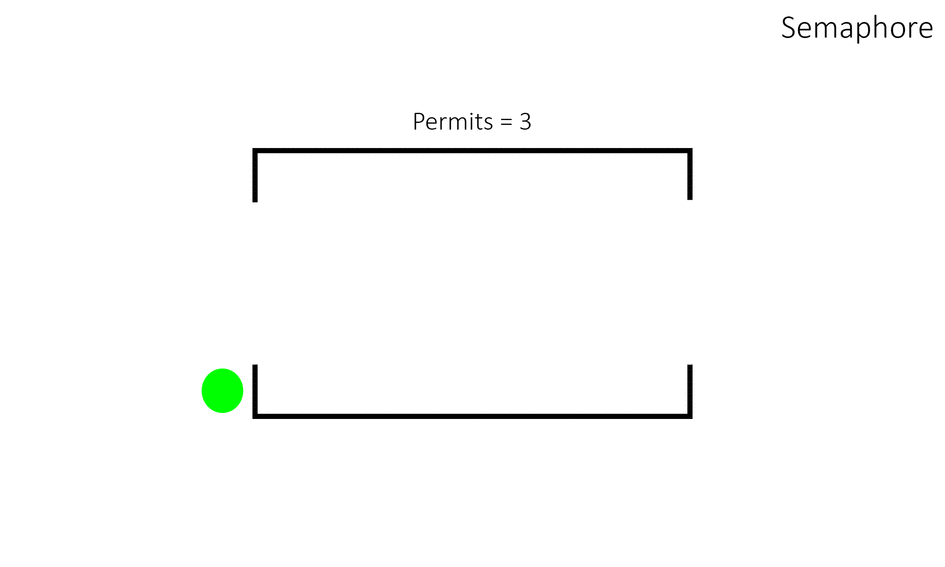
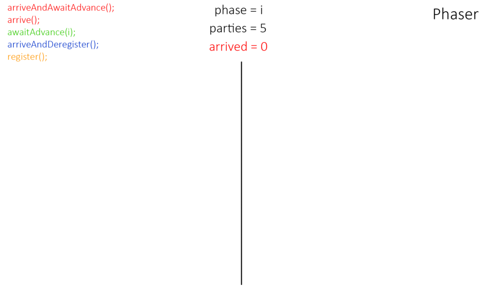

[**<<< 2.5 Stream API**](/conspect/02_05.md/#25-stream-api) ---
[**2.7 Транзакции >>>**](/conspect/02_07.md/#27-транзакции)

## 2.6 Многопоточность (Multithreading)

> [[_оглавление_]](../README.md)

[**Многопоточность**](/conspect/definitions.md/#м) - это свойство платформы (например, операционной системы, виртуальной
машины и т.д.) или приложения, состоящее в том, что процесс, порождённый в операционной системе, может состоять из
нескольких потоков, выполняющихся параллельно, то есть без предписанного порядка во времени.

[**Процесс**](/conspect/definitions.md/#п) - это экземпляр запущенной программы, имеющий собственное адресное
пространство памяти, ресурсы, выделяемые операционной системой, и как минимум один поток исполнения.

Каждый процесс существует независимо от других, и для управления его ресурсами используется операционная система. При
запуске приложения, создаётся процесс, в котором могут параллельно выполняться несколько потоков, использующих общее
пространство памяти этого процесса.

[**Поток**](/conspect/definitions.md/#п) - это наименьшая единица выполнения команд в программе, последовательность
инструкций, которая может работать параллельно с другими потоками в рамках одного процесса.

Потоки позволяют реализовывать многозадачность, выполняя операции одновременно, например, фоновые задачи и
взаимодействие с пользователем, и управляются с помощью класса `java.lang.Thread` или интерфейса `Runnable`.

Планировщик операционной системы выделяет каждому потоку кванты.

[**Квант**](/conspect/definitions.md/#к) - это небольшой, заранее установленный операционной системой отрезок времени
для работы потока.

Когда квант истекает, процессорное время передаётся другому потоку, ожидающему своей очереди.

[**Квантование времени выполнения**](/conspect/definitions.md/#к) - это механизм планирования операционной системы, при
котором каждому потоку выделяется определённый, фиксированный временной интервал (квант) для выполнения на процессоре,
после чего управление передаётся другому потоку, даже если первый ещё не завершил свою работу.

Квантование времени выполнения позволяет обеспечить одновременное выполнение нескольких потоков и избежать ситуации,
когда один поток захватывает процессор на неограниченное время, улучшая отзывчивость системы и распределение ресурсов.

Потоки могут быть вытеснены не только по истечении кванта, но и если поток с более высоким приоритетом становится
готовым к выполнению.

В _Java_ каждый поток имеет свой монитор потока.  
[**Монитор потока**](/conspect/definitions.md/#м) - это механизм синхронизации, который обеспечивает эксклюзивный доступ
к общим ресурсам для одного потока в многопоточной среде.

Каждый объект в _Java_ имеет ассоциированный с ним монитор (_mutex_, объект синхронизации), а ключевое слово
$\textrm{\color{orange}synchronized}$ используется для управления этим монитором, блокируя доступ к коду, пока он
удерживается одним потоком, и позволяя другим потокам ожидать своей очереди.

Преимущества многопоточности:

- _повышение производительности_ - многопоточность позволяет выполнять несколько задач одновременно, что может
  значительно сократить время выполнения сложных программ, особенно на многоядерных процессорах;
- _эффективное использование ресурсов_ - приложения могут более эффективно использовать ресурсы процессора, распределяя
  задачи между ядрами: пока один поток ожидает завершения блокирующей операции (например, ввод-вывод), другие потоки
  могут продолжать работу;
- _улучшенная отзывчивость_ - особенно важно для графических интерфейсов (_GUI_); сложные или долгие фоновые задачи
  могут выполняться в отдельных потоках, не блокируя основной поток интерфейса и сохраняя отзывчивость приложения;
- _улучшенный пользовательский опыт_ - пользователь может продолжать работать с приложением, пока в фоне выполняются
  ресурсоёмкие операции, что делает взаимодействие с программой более плавным и приятным;
- _параллельное выполнение операций_ - можно создавать веб-сервер, где каждый входящий запрос обрабатывается в отдельном
  потоке, что позволяет серверу обрабатывать несколько клиентских запросов одновременно;
- _улучшенная структура и читаемость кода_ - при правильном подходе многопоточность может помочь создать более
  структурированный и поддерживаемый код, хотя и требует тщательной организации взаимодействия потоков.

Недостатки многопоточности:

- _сложность проектирования_ - создание и управление многопоточными приложениями намного сложнее по сравнению с
  однопоточными, что увеличивает затраты на разработку;
- _проблемы с отладкой_ - отслеживание ошибок в многопоточных программах затруднено, так как их возникновение зависит от
  порядка выполнения отдельных частей кода;
- _синхронизация_ - потоки, работая с одними и теми же данными в общей памяти, требуют строгой синхронизации для
  поддержания их согласованности;
- _состояние гонки (**race condition**)_ - ошибка, возникающая, когда результат работы программы зависит от
  непредсказуемого порядка выполнения потоков;
- _взаимная блокировка (**deadlock**)_ - ситуация, когда два или более потоков находятся в состоянии ожидания друг
  друга, и ни один из них не может продолжить выполнение;
- _нагрузка на процессор_ - операционной системе приходится часто переключаться между потоками (переключение контекста),
  что является дорогостоящей операцией и отнимает процессорное время, замедляя выполнение полезных задач;
- _конкуренция за ресурсы_ - при увеличении числа потоков возрастает конкуренция за ограниченные ресурсы системы, такие
  как процессор, память и другие;
- _снижение производительности_ - чрезмерное использование многопоточности может не улучшить, а наоборот, ухудшить
  производительность программы из-за накладных расходов на управление потоками.

### 2.6.1 Класс Thread

> [[_оглавление_]](../README.md)

Каждый новый поток в _Java_ является экземпляром класса `Thread`, главного класса, относящегося к многопоточности.  
Класс `Thread` располагается в пакете `java.lang.Thread`.

Потоки имеют уникальный идентификатор и имя. Идентификатор генерируется при создании потока и не может быть изменён. Имя
потока можно указать при создании потока или изменить позже.

Поток может быть запущен не более одного раза. В частности, поток нельзя перезапустить после его завершения.

Каждый поток _Java_ имеет приоритет, который помогает операционной системе определять порядок, в котором планируются
потоки. По умолчанию при запуске поток наследует приоритет, установленный для потока, в котором он был вызван.  
Приоритеты потоков _Java_ находятся в диапазоне от _MIN_PRIORITY_ (константа 1) до _MAX_PRIORITY_ (константа 10). По
умолчанию каждому потоку устанавливается приоритет _NORM_PRIORITY_ (константа 5).  
Потоки с более высоким приоритетом более важны для программы, и в первую очередь им должно выделяться процессорное
время. Однако приоритеты потоков не могут гарантировать порядок, в котором выполняются потоки, и очень сильно зависят от
платформы (операционной системы).

#### 2.6.1.1 Состояния потока

> [[_оглавление_]](../README.md)

Потоки могут пребывать в нескольких состояниях:

Поток в _Java_ может находиться в одном из следующих состояний, определённых перечислением `Thread.State`:

- **NEW** - поток создан, но ещё не запущен (метод `start()` не вызывался);
- **RUNNABLE** - поток готов к выполнению и может быть выбран планировщиком для исполнения (состояние объединяет как
  активные, так и ожидающие исполнения потоки);
- **BLOCKED** - поток ожидает монитора, чтобы войти в синхронизированный блок/метод, занятый другим потоком;
- **WAITING** - поток ожидает, пока другой поток не вызовет `notify()`, `notifyAll()` или `join()` на объекте;
- **TIMED_WAITING** - как _WAITING_, но с таймаутом;
- **TERMINATED** - поток завершил выполнение либо нормально (метод `run()` завершён), либо из-за необработанного
  исключения.

Эти состояния отражают внутреннюю модель выполнения _JVM_ и используются для анализа поведения многопоточных программ.

#### 2.6.1.2 Создание потока

> [[_оглавление_]](../README.md)

Создать поток можно двумя способами:

- создать класс-наследник класса `Thread`, с переопределением в нём метода `run()`:
    * создавая новый класс с прямым переопределением метода `run()`;
    * используя анонимный класс с переопределением метода `run()`с помощью лямбда-выражения;
    * используя анонимный класс с прямым переопределением метода `run()`:
- путём создания реализации интерфейса `Runnable`и передачи её в конструктор класса `Thread`.

Пример:

```java
private static class MyThread extends Thread {
    @Override
    public void run() {
        System.out.println("Thread " + Thread.currentThread().getName() + " is running!");
    }
}

public static void main(String[] args) {
    // 1. Класс-наследник класса Thread с переопределённым напрямую методом run()
    Thread thread1 = new MyThread();
    thread1.start();
    try {
        thread1.join();
    } catch (InterruptedException e) {
        e.printStackTrace();
    }
    // 2. Анонимный класс-наследник класса Thread с переопределённым методом run() с использованием лямбда-выражения
    Thread thread2 = new Thread(() -> System.out.println("Thread " + Thread.currentThread().getName() + " is running!"));
    thread2.start();
    try {
        thread2.join();
    } catch (InterruptedException e) {
        e.printStackTrace();
    }
    // 3. Анонимный класс-наследник класса Thread с переопределённым напрямую методом run()
    Thread thread3 = new Thread() {
        @Override
        public void run() {
            System.out.println("Thread " + Thread.currentThread().getName() + " is running!");
        }
    };
    thread3.start();
    try {
        thread3.join();
    } catch (InterruptedException e) {
        e.printStackTrace();
    }
    // 4. Создание реализации интерфейса Runnable и передача её в конструктор класса Thread
    Runnable runnable = new Runnable() {
        @Override
        public void run() {
            System.out.println("Thread " + Thread.currentThread().getName() + " is running!");
        }
    };
    Thread thread4 = new Thread(runnable);
    thread4.start();
    try {
        thread4.join();
    } catch (InterruptedException e) {
        e.printStackTrace();
    }
    System.out.println("Thread " + Thread.currentThread().getName() + " is running!");
}
```

Вывод:

```text
Thread Thread-0 is running!
Thread Thread-1 is running!
Thread Thread-2 is running!
Thread Thread-3 is running!
Thread main is running!
```

Запуск потока осуществляется с помощью метода `start()`.  
Приостановка выполнения текущего потока до конца выполнения запущенного потока осуществляется с помощью метода `join()`
запущенного потока.

> [!IMPORTANT]
>
> Каждый создаваемый и запускаемый поток сам может создавать и запускать другие потоки;
>
> Пример:
>
> ```java
> private static final int THREADS_COUNT = 10;
> 
> public static void main(String[] args) {
>     Runnable task = () -> System.out.println("Thread " + Thread.currentThread().getName() + " is running!");
>     for (int i = 0; i < THREADS_COUNT; i++) {
>         startThread(task);
>     }
>     task.run();
> }
> 
> private static void startThread(Runnable task) {
>     Thread thread = new Thread(task);
>     thread.start();
>     try {
>         thread.join();
>     } catch (InterruptedException e) {
>         e.printStackTrace();
>     }
> }
> ```
>
> Вывод:
>
> ```text
> Thread Thread-0 is running!
> Thread Thread-1 is running!
> Thread Thread-2 is running!
> Thread Thread-3 is running!
> Thread Thread-4 is running!
> Thread Thread-5 is running!
> Thread Thread-6 is running!
> Thread Thread-7 is running!
> Thread Thread-8 is running!
> Thread Thread-9 is running!
> Thread main is running!
> ```

> [!CAUTION]
>
> Способ создания потоков посредством создания реализации интерфейса `Runnable` и передачи её в поток является более
> предпочтительным. Создание задачи, выполнение которой будет происходить параллельно, должно быть отделено от
> механизма её выполнения. Если имеется большое количество каких либо задач, то более эффективным способом является
> создание заранее подготовленного пула потоков, меньшего количества выполняемых задач, и этим потокам по очереди
> давать задачи для их выполнения.

#### 2.6.1.3 start()

> [[_оглавление_]](../README.md)

Метод `start()` класса `Thread` позволяет запустить данный поток независимо от текущего потока.  
Синтаксис метода выглядит следующим образом:

$\textrm{\color{white}thread.start()}$

Пример:

```java
public static void main(String[] args) {
    Runnable task = () -> System.out.println("Thread " + Thread.currentThread().getName() + " is running!");
    Thread thread = new Thread(task);
    thread.start();
    System.out.println("Thread " + Thread.currentThread().getName() + " is running!");
}
```

Вывод:

```text
Thread main is running!
Thread Thread-0 is running!
```

Данный метод выбрасывает исключение _IllegalThreadStateException_, если поток уже был запущен.

#### 2.6.1.4 run()

> [[_оглавление_]](../README.md)

Метод `run()` класса `Thread` позволяет запустить переопределённый метод `run()` данного потока в рамках текущего
потока.  
Синтаксис метода выглядит следующим образом:

$\textrm{\color{white}thread.run()}$

Пример:

```java
public static void main(String[] args) {
    Runnable task = () -> System.out.println("Thread " + Thread.currentThread().getName() + " is running!");
    Thread thread = new Thread(task);
    thread.run();
    System.out.println("Thread " + Thread.currentThread().getName() + " is running!");
}
```

Вывод:

```text
Thread main is running!
Thread main is running!
```

#### 2.6.1.5 join()

> [[_оглавление_]](../README.md)

Метод `join()` класса `Thread` приостанавливает выполнение текущего потока до завершения выполнения потока, для которого
вызван метод, либо не более указанного количества времени.  
Синтаксис метода выглядит следующим образом:

$\textrm{\color{white}thread.join()}$  
$\textrm{\color{white}thread.join(\color{green}[миллисекунды]\color{white})}$  
$\textrm{\color{white}thread.join(\color{green}[миллисекунды]\color{white}, \color{green}[наносекунды]\color{white})}$  
$\textrm{\color{white}thread.join(\color{green}[продолжительность]\color{white})}$

Пример с вызовом метода `join()`:

```java
public static void main(String[] args) {
    Runnable task = () -> System.out.println("Thread " + Thread.currentThread().getName() + " is running!");
    Thread thread0 = new Thread(task);
    thread0.start();
    Thread thread1 = new Thread(task);
    thread1.start();
    Thread thread2 = new Thread(task);
    thread2.start();
    Thread thread3 = new Thread(task);
    thread3.start();
    try {
        thread0.join();
        thread1.join(100);
        thread2.join(100, 500);
        thread3.join(Duration.ofMillis(100));
    } catch (InterruptedException e) {
        e.printStackTrace();
    }
    System.out.println("Thread " + Thread.currentThread().getName() + " is running!");
}
```

Вывод:

```text
Thread Thread-2 is running!
Thread Thread-3 is running!
Thread Thread-1 is running!
Thread Thread-0 is running!
Thread main is running!
```

Пример без вызова метода `join()`:

```java
public static void main(String[] args) {
    Runnable task = () -> System.out.println("Thread " + Thread.currentThread().getName() + " is running!");
    Thread thread0 = new Thread(task);
    thread0.start();
    Thread thread1 = new Thread(task);
    thread1.start();
    Thread thread2 = new Thread(task);
    thread2.start();
    Thread thread3 = new Thread(task);
    thread3.start();
    System.out.println("Thread " + Thread.currentThread().getName() + " is running!");
}
```

Вывод:

```text
Thread main is running!
Thread Thread-2 is running!
Thread Thread-1 is running!
Thread Thread-0 is running!
Thread Thread-3 is running!
```

Метод выбрасывает исключение _InterruptedException_, если какой-либо поток прервал текущий поток.

#### 2.6.1.6 sleep()

> [[_оглавление_]](../README.md)

Метод `sleep()` класса `Thread` переводит выполняющийся в данный момент поток в спящий режим (временно прекращает
выполнение) на указанный промежуток времени.  
Синтаксис метода выглядит следующим образом:

$\textrm{\color{white}thread.sleep(\color{green}[миллисекунды]\color{white})}$  
$\textrm{\color{white}thread.sleep(\color{green}[миллисекунды]\color{white}, \color{green}[наносекунды]\color{white})}$  
$\textrm{\color{white}thread.sleep(\color{green}[продолжительность]\color{white})}$

Пример:

```java
public static void main(String[] args) {
    Runnable task0 = () -> {
        try {
            Thread.sleep(50);
        } catch (InterruptedException e) {
            e.printStackTrace();
        }
        System.out.println("Thread " + Thread.currentThread().getName() + " is running!");
    };
    Runnable task1 = () -> {
        try {
            Thread.sleep(50, 100);
        } catch (InterruptedException e) {
            e.printStackTrace();
        }
        System.out.println("Thread " + Thread.currentThread().getName() + " is running!");
    };
    Runnable task2 = () -> {
        try {
            Thread.sleep(Duration.ofMillis(100));
        } catch (InterruptedException e) {
            e.printStackTrace();
        }
        System.out.println("Thread " + Thread.currentThread().getName() + " is running!");
    };
    Thread thread0 = new Thread(task0);
    thread0.start();
    Thread thread1 = new Thread(task1);
    thread1.start();
    Thread thread2 = new Thread(task2);
    thread2.start();
    System.out.println("Thread " + Thread.currentThread().getName() + " is running!");
}
```

Вывод:

```text
Thread main is running!
Thread Thread-0 is running!
Thread Thread-1 is running!
Thread Thread-2 is running!
```

Данный метод приостанавливает работу текущего потока на указанное время, при этом поток не теряет права владения
никакими мониторами (синхронизированными блоками).  
Метод выбрасывает исключение _InterruptedException_, если какой-либо поток прервал текущий поток, и
_IllegalArgumentException_, если указанный промежуток времени отрицательный.

#### 2.6.1.7 wait()

> [[_оглавление_]](../README.md)

Метод `wait()` класса `Object` освобождает данный монитор (объект синхронизации) для других потоков до тех пор, пока для
монитора в них не будут вызваны методы `notify()` или `notifyAll()`, или на указанный промежуток времени.  
Синтаксис метода выглядит следующим образом:

$\textrm{\color{white}lock.wait()}$  
$\textrm{\color{white}lock.wait(\color{green}[миллисекунды]\color{white})}$  
$\textrm{\color{white}lock.wait(\color{green}[миллисекунды]\color{white}, \color{green}[наносекунды]\color{white})}$

Пример:

```java
private static final Object lock = new Object();

public static void main(String[] args) {
    Runnable task0 = () -> {
        synchronized (lock) {
            try {
                lock.wait();
            } catch (InterruptedException e) {
                throw new RuntimeException(e);
            }
            System.out.println("Thread " + Thread.currentThread().getName() + " is running!");
        }
    };
    Runnable task1 = () -> {
        synchronized (lock) {
            try {
                lock.wait(100);
            } catch (InterruptedException e) {
                throw new RuntimeException(e);
            }
            System.out.println("Thread " + Thread.currentThread().getName() + " is running!");
        }
    };
    Runnable task2 = () -> {
        synchronized (lock) {
            try {
                lock.wait(100, 100);
            } catch (InterruptedException e) {
                throw new RuntimeException(e);
            }
            System.out.println("Thread " + Thread.currentThread().getName() + " is running!");
        }
    };
    Thread thread0 = new Thread(task0);
    thread0.start();
    Thread thread1 = new Thread(task1);
    thread1.start();
    Thread thread2 = new Thread(task2);
    thread2.start();
    try {
        Thread.sleep(200);
    } catch (InterruptedException e) {
        e.printStackTrace();
    }
    synchronized (lock) {
        System.out.println("Thread " + Thread.currentThread().getName() + " is running!");
        lock.notify();
    }
}
```

Вывод:

```text
Thread Thread-1 is running!
Thread Thread-2 is running!
Thread main is running!
Thread Thread-0 is running!
```

> В данном примере все 4 потока (_main_, _Thread-0_, _Thread-1_ и _Thread-2_) синхронизируются посредством монитора
> _lock_, при помощи которого производится блокировка выполнения ими $\textrm{\color{orange}synchronized}$ блоков. При
> этом потоки _Thread-1_ и _Thread-2_ высвобождают монитор на $\textrm{\color{aqua}100 мс}$ и
> $\textrm{\color{aqua}100,1 мс}$, соответственно, или до момента вызова методов `notify()` или `notifyAll()` на объекте
> синхронизации, а поток _Thread-0_ - только до момента вызова методов `notify()` или `notifyAll()` на объекте
> синхронизации.  
> Поскольку поток _main_ находится в состоянии **WAITING** дольше, чем монитор _lock_ свободен, то первыми занимают
> монитор сначала поток _Thread-1_, а затем _Thread-2_, после чего оба переходят в состояние **TERMINATED**.  
> Поскольку поток _Thread-0_ освобождает монитор на неограниченное количество времени, он не может продолжить своё
> выполнение до тех пор, пока поток _main_ не выполнит свой $\textrm{\color{orange}synchronized}$ блок и не освободит
> монитор вызовом метода `notify()` объекта синхронизации.  
> Таким образом, последовательность выполнения потоков всегда будет оставаться одинаковой.

Данный метод может быть вызван только внутри $\textrm{\color{orange}synchronized}$ блока у объекта синхронизации
(монитора) и освобождает данный объект синхронизации для других потоков на указанное время или до момента прерывания
текущего потока.    
Метод выбрасывает исключение _InterruptedException_, если какой-либо поток прервал текущий поток, и
_IllegalMonitorStateException_, если в момент вызова метода текущий поток не являлся владельцем данного монитора
(объекта синхронизации).

#### 2.6.1.8 notify()

> [[_оглавление_]](../README.md)

Метод `notify()` класса `Object` разблокирует данный монитор (объект синхронизации) для одного из других потоков
(для запуска выбирается один из ожидающих потоков в произвольном порядке), для которых на нём были вызваны методы
`wait()`.  
Синтаксис метода выглядит следующим образом:

$\textrm{\color{white}lock.notify()}$

Пример:

```java
private static final Object lock = new Object();

public static void main(String[] args) {
    Runnable task0 = () -> {
        synchronized (lock) {
            try {
                lock.wait();
            } catch (InterruptedException e) {
                throw new RuntimeException(e);
            }
            System.out.println("Thread " + Thread.currentThread().getName() + " is running!");
        }
    };
    Thread thread0 = new Thread(task0);
    thread0.start();
    try {
        Thread.sleep(100);
    } catch (InterruptedException e) {
        e.printStackTrace();
    }
    synchronized (lock) {
        System.out.println("Thread " + Thread.currentThread().getName() + " is running!");
        lock.notify();
    }
}
```

Вывод:

```text
Thread main is running!
Thread Thread-0 is running!
```

> В данном примере возникла необходимость перевести поток _main_ в состояние **TIMED_WAITING**, поскольку поток
> _Thread-0_ не успел встать в очередь ожидания монитора (вызвать метод `wait()` для объекта синхронизации) к моменту
> его освобождения (вызова метода `notify()`) потоком _main_.

Данный метод может быть вызван только внутри $\textrm{\color{orange}synchronized}$ блока у объекта синхронизации
(монитора) и разблокирует данный объект синхронизации для других потоков.  
Метод выбрасывает исключение _IllegalMonitorStateException_, если в момент вызова метода текущий поток не являлся
владельцем данного монитора (объекта синхронизации).

#### 2.6.1.9 notifyAll()

> [[_оглавление_]](../README.md)

Метод `notifyAll()` класса `Object` разблокирует данный монитор (объект синхронизации) для всех других потоков, для
которых на нём были вызваны методы `wait()`.  
Синтаксис метода выглядит следующим образом:

$\textrm{\color{white}lock.notifyAll()}$

Пример:

```java
private static final Object lock = new Object();

public static void main(String[] args) {
    Runnable task0 = () -> {
        synchronized (lock) {
            try {
                lock.wait();
            } catch (InterruptedException e) {
                throw new RuntimeException(e);
            }
            System.out.println("Thread " + Thread.currentThread().getName() + " is running!");
        }
    };
    Thread thread0 = new Thread(task0);
    thread0.start();
    try {
        Thread.sleep(100);
    } catch (InterruptedException e) {
        e.printStackTrace();
    }
    synchronized (lock) {
        System.out.println("Thread " + Thread.currentThread().getName() + " is running!");
        lock.notifyAll();
    }
}
```

Вывод:

```text
Thread main is running!
Thread Thread-0 is running!
```

> В данном примере возникла необходимость перевести поток _main_ в состояние **TIMED_WAITING**, поскольку поток
> _Thread-0_ не успел встать в очередь ожидания монитора (вызвать метод `wait()` для объекта синхронизации) к моменту
> его освобождения (вызова метода `notifyAll()`) потоком _main_.

Данный метод может быть вызван только внутри $\textrm{\color{orange}synchronized}$ блока у объекта синхронизации
(монитора) и разблокирует данный объект синхронизации для других потоков.  
Метод выбрасывает исключение _IllegalMonitorStateException_, если в момент вызова метода текущий поток не являлся
владельцем данного монитора (объекта синхронизации).

#### 2.6.1.10 interrupt()

> [[_оглавление_]](../README.md)

Метод `interrupt()` класса `Thread` позволяет прервать выполнение запущенного потока.  
Синтаксис метода выглядит следующим образом:

$\textrm{\color{white}thread.interrupt()}$

Пример:

```java
public static void main(String[] args) {
    Runnable task0 = () -> {
        while (!Thread.currentThread().isInterrupted()) {
            System.out.println("Thread " + Thread.currentThread().getName() + " is running!");
            try {
                Thread.sleep(10);
            } catch (InterruptedException e) {
                System.out.println("Thread " + Thread.currentThread().getName() + " is interrupted!");
                Thread.currentThread().interrupt();
            }
        }
    };
    Thread thread0 = new Thread(task0);
    thread0.start();
    try {
        Thread.sleep(100);
    } catch (InterruptedException e) {
        e.printStackTrace();
    }
    thread0.interrupt();
    System.out.println("Thread " + Thread.currentThread().getName() + " is running!");
}
```

Вывод:

```text
Thread Thread-0 is running!
Thread Thread-0 is running!
Thread Thread-0 is running!
Thread Thread-0 is running!
Thread Thread-0 is running!
Thread Thread-0 is running!
Thread Thread-0 is running!
Thread Thread-0 is running!
Thread Thread-0 is running!
Thread Thread-0 is running!
Thread main is running!
Thread Thread-0 is interrupted!
```

Данный метод выбрасывает в запущенном потоке исключение _InterruptedException_, а также переводит флаг потока
_interrupted_ в $\textrm{\color{orange}true}$.

#### 2.6.1.11 currentThread()

> [[_оглавление_]](../README.md)

Метод `currentThread()` класса `Thread` возвращает экземпляр текущего потока.  
Синтаксис метода выглядит следующим образом:

$\textrm{\color{white}Thread \color{magenta}[название переменной] \color{white}= Thread.currentThread()}$

#### 2.6.1.12 isInterrupted()

> [[_оглавление_]](../README.md)

Метод `isInterrupted()` класса `Thread` возвращает булево значение влага прерывания (поля _interrupted_) потока.  
Синтаксис метода выглядит следующим образом:

$\textrm{\color{orange}boolean \color{magenta}[название переменной] \color{white}= Thread.isInterrupted()}$

Пример:

```java
public static void main(String[] args) {
    Runnable task0 = () -> {
        while (!Thread.currentThread().isInterrupted()) {
            System.out.println("Thread " + Thread.currentThread().getName() + " is interrupted: " + Thread.currentThread().isInterrupted());
            try {
                Thread.sleep(10);
            } catch (InterruptedException e) {
                Thread.currentThread().interrupt();
                System.out.println("Thread " + Thread.currentThread().getName() + " is interrupted: " + Thread.currentThread().isInterrupted());
            }
        }
    };
    Thread thread0 = new Thread(task0);
    thread0.start();
    try {
        Thread.sleep(100);
    } catch (InterruptedException e) {
        e.printStackTrace();
    }
    thread0.interrupt();
    System.out.println("Thread " + Thread.currentThread().getName() + " is running!");
}
```

Вывод:

```text
Thread Thread-0 is interrupted: false
Thread Thread-0 is interrupted: false
Thread Thread-0 is interrupted: false
Thread Thread-0 is interrupted: false
Thread Thread-0 is interrupted: false
Thread Thread-0 is interrupted: false
Thread Thread-0 is interrupted: false
Thread Thread-0 is interrupted: false
Thread Thread-0 is interrupted: false
Thread Thread-0 is interrupted: true
Thread main is running!
```

Данный метод возвращает $\textrm{\color{orange}true}$, если поток прерван, иначе - $\textrm{\color{orange}false}$.

#### 2.6.1.13 setDaemon()

> [[_оглавление_]](../README.md)

Метод `setDaemon()` класса `Thread` помечает этот поток как поток-демон или не-демон.  
Синтаксис метода выглядит следующим образом:

$\textrm{\color{white}thread.setDaemon(\color{orange}[булев флаг]\color{white})}$

Пример:

```java
private static class DaemonTask implements Runnable {
    @Override
    public void run() {
        while (!Thread.currentThread().isInterrupted()) {
            System.out.println("Daemon thread " + Thread.currentThread().getName() + " is running!");
            try {
                TimeUnit.SECONDS.sleep(1);
            } catch (InterruptedException e) {
                Thread.currentThread().interrupt();
            }
        }
    }
}

public static void main(String[] args) {
    Runnable task = new DaemonTask();
    Thread thread = new Thread(task);
    thread.setDaemon(true);
    thread.start();
    System.out.println("Thread " + Thread.currentThread().getName() + " is stopped!");
}
```

Вывод:

```text
Thread main is stopped!
Daemon thread Thread-0 is running!
```

Этот метод должен быть вызван перед запуском потока. Поведение этого метода при завершении потока не определено.  
Метод выбрасывает исключение _IllegalArgumentException_, если поток является виртуальным и для него устанавливается
значение $\textrm{\color{orange}false}$, и исключение _IllegalThreadStateException_, если данный поток уже запущен.

#### 2.6.1.14 isDaemon()

> [[_оглавление_]](../README.md)

Метод `isDaemon()` класса `Thread` возвращает $\textrm{\color{orange}true}$, если поток запущен как поток-демон, иначе -
$\textrm{\color{orange}false}$.  
Синтаксис метода выглядит следующим образом:

$\textrm{\color{orange}boolean \color{magenta}[название переменной] \color{white}= thread.isDaemon()}$

Пример:

```java
private static class DaemonTask implements Runnable {
    @Override
    public void run() {
        while (!Thread.currentThread().isInterrupted()) {
            System.out.println("Thread " + Thread.currentThread().getName() + " is daemon - " + Thread.currentThread().isDaemon());
            try {
                TimeUnit.SECONDS.sleep(1);
            } catch (InterruptedException e) {
                Thread.currentThread().interrupt();
            }
        }
    }
}

public static void main(String[] args) {
    Runnable task = new DaemonTask();
    Thread thread = new Thread(task);
    thread.setDaemon(true);
    thread.start();
    System.out.println("Thread " + Thread.currentThread().getName() + " is daemon - " + Thread.currentThread().isDaemon());
}
```

Вывод:

```text
Thread Thread-0 is daemon - true
Thread main is daemon - false
```

### 2.6.1.15 setUncaughtExceptionHandler()

> [[_оглавление_]](../README.md)

Метод `setUncaughtExceptionHandler()` класса `Thread` позволяет создать реализацию обработчика непроверяемых исключений 
(интерфейса `Thread.UncaughtExceptionHandler`) и установить его для обработки непроверяемых исключений данного потока.  
Синтаксис метода выглядит следующим образом:

$\textrm{\color{white}thread.setUncaughtExceptionHandler(\color{purple}[обработчик непроверяемых исключений]\color{white})}$

Пример:

```java
// Шаблон сообщения исключения
private static final String EXCEPTION_MESSAGE_TEMPLATE = "Exception message: %s in thread %s\n\r";

// Обработчик непроверяемых исключений
private static class ExceptionHandler implements Thread.UncaughtExceptionHandler {
    @Override
    public void uncaughtException(Thread t, Throwable e) {
        System.out.println(String.format(EXCEPTION_MESSAGE_TEMPLATE, e.getMessage(), t.getName()));
    }
}

// Задача, выбрасывающая непроверяемое исключение
private static class Task implements Runnable {
    private int counter = 10;
    private int result;

    @Override
    public void run() {
        while (!Thread.currentThread().isInterrupted()) {
            result = 10 / counter;
            counter /= 2;
            System.out.println(result);
            try {
                TimeUnit.MILLISECONDS.sleep(100);
            } catch (InterruptedException e) {
                Thread.currentThread().interrupt();
            }
        }
    }
}

public static void main(String[] args) {
    // Создание потока
    Runnable task = new Task();
    Thread thread = new Thread(task);
    // Установка обработчика непроверяемых исключений для потока
    Thread.UncaughtExceptionHandler exceptionHandler = new ExceptionHandler();
    thread.setUncaughtExceptionHandler(exceptionHandler);
    // Запуск потока
    thread.start();
    try {
        thread.join();
    } catch (InterruptedException e) {
        throw new RuntimeException(e);
    }
    System.out.println("Thread " + Thread.currentThread().getName() + " is closed!");
}
```

Вывод:

```text
1
2
5
10
Exception message: / by zero in thread Thread-0

Thread main is closed!
```

### 2.6.1.16 setDefaultUncaughtExceptionHandler()

> [[_оглавление_]](../README.md)

Метод `setDefaultUncaughtExceptionHandler()` класса `Thread` позволяет создать реализацию обработчика непроверяемых
исключений (интерфейса `Thread.UncaughtExceptionHandler`) и установить его по умолчанию для обработки непроверяемых
исключений всех потоков.  
Синтаксис метода выглядит следующим образом:

$\textrm{\color{white}Thread.setUncaughtExceptionHandler(\color{purple}[обработчик непроверяемых исключений]\color{white})}$

Пример:

```java
// Шаблон сообщения исключения
private static final String EXCEPTION_MESSAGE_TEMPLATE = "Exception message: %s in thread %s\n\r";

// Обработчик непроверяемых исключений
private static class ExceptionHandler implements Thread.UncaughtExceptionHandler {
    @Override
    public void uncaughtException(Thread t, Throwable e) {
        System.out.println(String.format(EXCEPTION_MESSAGE_TEMPLATE, e.getMessage(), t.getName()));
    }
}

// Задача, выбрасывающая непроверяемое исключение
private static class Task implements Runnable {
    private int counter = 10;
    private int result = 0;

    @Override
    public void run() {
        while (!Thread.currentThread().isInterrupted()) {
            result = 10 / counter;
            counter /= 2;
            System.out.println(result);
            try {
                TimeUnit.MILLISECONDS.sleep(100);
            } catch (InterruptedException e) {
                Thread.currentThread().interrupt();
            }
        }
    }
}

public static void main(String[] args) {
    // Создание потоков
    Runnable task0 = new Task();
    Runnable task1 = new Task();
    Thread thread0 = new Thread(task0);
    Thread thread1 = new Thread(task1);
    // Установка обработчика непроверяемых исключений для всех потоков
    Thread.UncaughtExceptionHandler exceptionHandler = new ExceptionHandler();
    Thread.setDefaultUncaughtExceptionHandler(exceptionHandler);
    // Запуск потоков
    thread0.start();
    try {
        thread0.join();
    } catch (InterruptedException e) {
        throw new RuntimeException(e);
    }
    thread1.start();
    try {
        thread1.join();
    } catch (InterruptedException e) {
        throw new RuntimeException(e);
    }
    System.out.println("Thread " + Thread.currentThread().getName() + " is closed!");
}
```

Вывод:

```text
1
2
5
10
Exception message: / by zero in thread Thread-0

1
2
5
10
Exception message: / by zero in thread Thread-1

Thread main is closed!
```

### 2.6.2 Потоки-демоны

> [[_оглавление_]](../README.md)

[**Поток-демон (Daemon Thread)**](/conspect/definitions.md/#п) - это низкоприоритетный фоновый поток, который не мешает
завершению работы приложения после того, как все остальные (пользовательские) потоки завершились.

Статус демона виртуального потока всегда равен $\textrm{\color{orange}true}$ и не может быть изменён с помощью метода
`setDaemon()` на $\textrm{\color{orange}false}$.

Демоны применяют для таких действий, как сборка мусора, мониторинг ресурсов и выполнения периодических задач (очистка
кэша, периодические проверки и т.д.).  
Демоны не должны использоваться для выполнения важных операций, так как они могут быть внезапно остановлены. Они имеют
низкий приоритет и выполняются, когда нет более важных задач.

Демоны работают в фоновом режиме, не блокируя основной поток выполнения приложения.

Пример:

```java
private static class DaemonTask implements Runnable {
    @Override
    public void run() {
        while (!Thread.currentThread().isInterrupted()) {
            System.out.println("Daemon thread " + Thread.currentThread().getName() + " is running!");
            try {
                TimeUnit.SECONDS.sleep(1);
            } catch (InterruptedException e) {
                Thread.currentThread().interrupt();
            }
        }
    }
}

public static void main(String[] args) {
    Runnable task = new DaemonTask();
    Thread thread = new Thread(task);
    thread.start();
    System.out.println("Thread " + Thread.currentThread().getName() + " is stopped!");
}
```

Вывод:

```text
Daemon thread Thread-0 is running!
Thread main is stopped!
Daemon thread Thread-0 is running!
Daemon thread Thread-0 is running!
Daemon thread Thread-0 is running!
...
```

Виртуальная машина _Java_ (_JVM_) сама завершает работу потоков-демонов, когда все пользовательские потоки завершены,
даже если демоны ещё работают.

Пример:

```java
private static class DaemonTask implements Runnable {
    @Override
    public void run() {
        while (!Thread.currentThread().isInterrupted()) {
            System.out.println("Daemon thread " + Thread.currentThread().getName() + " is running!");
            try {
                TimeUnit.SECONDS.sleep(1);
            } catch (InterruptedException e) {
                Thread.currentThread().interrupt();
            }
        }
    }
}

public static void main(String[] args) {
    Runnable task = new DaemonTask();
    Thread thread = new Thread(task);
    thread.setDaemon(true);
    thread.start();
    System.out.println("Thread " + Thread.currentThread().getName() + " is stopped!");
}
```

Вывод:

```text
Thread main is stopped!
Daemon thread Thread-0 is running!
```

По умолчанию потоки наследуют демон-статус от потока, в котором они запускаются.

> [!NOTE]
>
> В случае наличия в потоке-демоне блока $\textrm{\color{orange}finally}$ при завершении его работы _JVM_ содержащийся в
> блоке код не выполнит.  
> Необходимо учитывать эту особенность при использовании потоков-демонов в приложении.

### 2.6.3 Обработчики непроверяемых исключений

> [[_оглавление_]](../README.md)

Спецификация языка программирования _Java_ (а также и компилятор) не требует обработки непроверяемых исключений.  
При использовании нескольких потоков бывают ситуации, когда надо знать, как поток завершился: если это произошло из-за 
исключения, то из-за какого именно.

Для этой цели начиная с версии _Java_ 5 существует специальный функциональный интерфейс - 
`Thread.UncaughtExceptionHandler`.

Интерфейс предназначен для перехвата непроверяемых исключений, вызвавших завершение потока. Создав его реализацию можно 
перехватить и обработать исключение, которое возникло в другом запущенном потоке, если он не перехватил его сам.

Установка обработчика для потока производится вызовом его метода `setUncaughtExceptionHandler()` перед его запуском.  
Установка обработчика по умолчанию для всех потоков производится вызовом статического метода 
`setDefaultUncaughtExceptionHandler()` класса `Thread` перед созданием потоков.

Обработчик непроверяемых исключений по умолчанию для потока наследуется от потока, в котором он создан.

Пример:

```java
// Шаблон сообщения исключения
private static final String EXCEPTION_MESSAGE_TEMPLATE = "Exception message: %s in thread %s\n\r";

// Обработчик непроверяемых исключений
private static class ExceptionHandler implements Thread.UncaughtExceptionHandler {
    @Override
    public void uncaughtException(Thread t, Throwable e) {
        System.out.println(String.format(EXCEPTION_MESSAGE_TEMPLATE, e.getMessage(), t.getName()));
    }
}

// Задача, выбрасывающая непроверяемое исключение
private static class Task implements Runnable {
    private int counter = 10;
    private int result;

    @Override
    public void run() {
        while (!Thread.currentThread().isInterrupted()) {
            result = 10 / counter;
            counter /= 2;
            System.out.println(result);
            try {
                TimeUnit.MILLISECONDS.sleep(100);
            } catch (InterruptedException e) {
                Thread.currentThread().interrupt();
            }
        }
    }
}

public static void main(String[] args) {
    // Создание потока
    Runnable task = new Task();
    Thread thread = new Thread(task);
    // Установка обработчика непроверяемых исключений для потока
    Thread.UncaughtExceptionHandler exceptionHandler = new ExceptionHandler();
    thread.setUncaughtExceptionHandler(exceptionHandler);
    // Запуск потока
    thread.start();
    try {
        thread.join();
    } catch (InterruptedException e) {
        throw new RuntimeException(e);
    }
    System.out.println("Thread " + Thread.currentThread().getName() + " is closed!");
}
```

Вывод:

```text
1
2
5
10
Exception message: / by zero in thread Thread-0

Thread main is closed!
```

### 2.9.3 Синхронизация потоков

> [[_оглавление_]](../README.md)

Синхронизация потоков необходима для предотвращения одновременного доступа потоков к выполнению каких-либо операций.

В Java синхронизация потоков осуществляется с помощью ключевого слова `synchronized`.

> [**synchronized**](/conspect/definitions.md/#s) – это ключевое слово, которое применяется для ограничения
> одновременного доступа к методу или блоку кода различных потоков приложения.

Ключевое слово `synchronized` может использоваться для:

- метода - в этом случае любой поток, пытающийся вызвать синхронизированный метод, будет вынужден ждать, пока этот метод
  не выполнится в другом потоке, вызвавшем этот метод ранее:

```java
private static synchronized void doSynchronizedCounterOperation(int i) {
    System.out.println("Operation " + i + " counter " + counter);
    String s = "";
    for (int j = 0; j < 100_000; j++) {
        s += j + " ";
    }
    counter++;
}
```

- блоку кода в методе - в этом случае любой поток, пытающийся выполнить синхронизированный блок кода, будет вынужден
  ждать, пока этот блок кода не выполнится в другом потоке, вызвавшем этот блок ранее; при этом, синхронизация
  выполнения блока кода должна производиться за счёт использования какого-либо объекта, которым могут быть:
    * класс, содержащий метод с синхронизированным блоком:
  ```java
  private static void doSynchronizedBlockCounterOperation(int i) {
          synchronized (Main.class) {
              System.out.println("Operation " + i + " counter " + counter);
              counter++;
          }
          String s = "";
          for (int j = 0; j < 100_000; j++) {
              s += j + " ";
          }
      }
  ```

    * специально созданный объект класса, содержащего метод с синхронизированным блоком:
  ```java
  static final Object lock = new Object();  
  private static void doSynchronizedBlockCounterOperation(int i) {
            synchronized (lock) {
                System.out.println("Operation " + i + " counter " + counter);
                counter++;
            }
            String s = "";
            for (int j = 0; j < 100_000; j++) {
                s += j + " ";
            }
        }
    ```

#### 2.9.3.1 Deadlock

> [[_оглавление_]](../README.md)

При использовании синхронизации с использованием объектов, количество этих самых объектов синхронизации не ограничено.  
При этом необходимо быть осторожным в применении синхронизированных блоков, поскольку можно вызвать _Deadlock_.

[**Deadlock**](/conspect/definitions.md/#d) - это ошибка, возникающая в случае когда потоки имеют циклическую
зависимость от пары синхронизированных объектов.

Пример организации _Deadlock_:

```java
static final Object lock_1 = new Object();
static final Object lock_2 = new Object();

deadLockExample();

private static void doSynchronizedDeadLockOperation(int i) {
    synchronized (lock_1) {
        try {
            Thread.currentThread().sleep(2000);
        } catch (InterruptedException e) {
            throw new RuntimeException(e);
        }
        synchronized (lock_2) {
            System.out.println("Operation " + i + " counter " + counter);
            counter++;
        }
    }
    synchronized (lock_2) {
        try {
            Thread.currentThread().sleep(2000);
        } catch (InterruptedException e) {
            throw new RuntimeException(e);
        }
        String s = "";
        synchronized (lock_1) {
            for (int j = 0; j < 100_000; j++) {
                s += j + " ";
            }
        }
    }
}

private static void deadLockExample() {
    doSynchronizedDeadLockOperation(0);
    //
    Thread thread_1 = new Thread() {
        @Override
        public void run() {
            if (!Thread.currentThread().isInterrupted()) {
                doSynchronizedDeadLockOperation(1);
            }
            if (!Thread.currentThread().isInterrupted()) {
                doSynchronizedDeadLockOperation(2);
            }
            if (!Thread.currentThread().isInterrupted()) {
                doSynchronizedDeadLockOperation(3);
            }
        }
    };
    thread_1.start();
    //
    Thread thread_2 = new Thread(() -> {
        if (Thread.currentThread().isInterrupted()) {
            throw new RuntimeException();
        }
        doSynchronizedDeadLockOperation(4);
        if (Thread.currentThread().isInterrupted()) {
            throw new RuntimeException();
        }
        doSynchronizedDeadLockOperation(5);
        if (Thread.currentThread().isInterrupted()) {
            throw new RuntimeException();
        }
        doSynchronizedDeadLockOperation(6);
    });
    thread_2.start();
    //
    //
    doSynchronizedDeadLockOperation(7);
    doSynchronizedDeadLockOperation(8);
    doSynchronizedDeadLockOperation(9);
}
```

#### 2.9.3.2 Синхронизаторы

> [[_оглавление_]](../README.md)

В `java.util.concurrent` много различных классов, которые по функционалу можно поделить на группы: _Concurrent
Collections_, _Executors_, _Atomics_ и т.д. Одной из этих групп будет _Synchronizers_ (синхронизаторы).

[**Синхронизаторы**](/conspect/definitions.md/#с) - это вспомогательные утилиты для синхронизации потоков, которые дают
возможность разработчику регулировать и/или ограничивать работу потоков и предоставляют более высокий уровень
абстракции, чем основные примитивы языка (мониторы).


##### 2.9.3.2.1 Semaphore

> [[_оглавление_]](../README.md)

Синхронизатор _Semaphore_ реализует шаблон синхронизации "Семафор". Чаще всего, семафоры необходимы, когда нужно
ограничить доступ к некоторому общему ресурсу.  
В конструктор этого класса (`Semaphore(int permits)` или `Semaphore(int permits, boolean fair)`) обязательно передается
количество потоков, которому семафор будет разрешать одновременно использовать заданный ресурс.



Доступ управляется с помощью счётчика: изначально значение счётчика равно `int permits`, когда поток заходит в заданный
блок кода, то значение счётчика уменьшается на единицу, когда поток его покидает, то увеличивается. Если значение
счётчика равно нулю, то текущий поток блокируется, пока кто-нибудь не выйдет из блока.

Пример использования:

```java
// устанавливаем ограничение на количество одновременно выполняемых потоков
// устанавливаем флаг "справедливый" на true
// метод aсquire() будет раздавать разрешения в порядке очереди
static final Semaphore semaphore = new Semaphore(2, true);

semaphoreExample();

private static void doSemaphoreOperation(int i) {
    //acquire() запрашивает доступ к следующему за вызовом этого метода блоку кода,
    //если доступ не разрешен, поток вызвавший этот метод блокируется до тех пор,
    //пока семафор не разрешит доступ
    try {
        semaphore.acquire();
    } catch (InterruptedException e) {
        e.printStackTrace();
    }
    System.out.println("Operation " + i);
    String s = "";
    for (int j = 0; j < 100_000; j++) {
        s += j + " ";
    }
    //release(), напротив, освобождает ресурс
    semaphore.release();
}

private static void semaphoreExample() {
    doSemaphoreOperation(0);
    //
    Thread thread_1 = new Thread() {
        @Override
        public void run() {
            doSemaphoreOperation(1);
            doSemaphoreOperation(2);
            doSemaphoreOperation(3);
        }
    };
    thread_1.start();
    //
    new Thread(() -> {
        doSemaphoreOperation(4);
        doSemaphoreOperation(5);
        doSemaphoreOperation(6);
    }).start();
    //
    doSemaphoreOperation(7);
    doSemaphoreOperation(8);
    doSemaphoreOperation(9);
}
```

##### 2.9.3.2.2 CountDownLatch

> [[_оглавление_]](../README.md)

_CountDownLatch_ (замок с обратным отсчетом) предоставляет возможность любому количеству потоков в блоке кода ожидать до
тех пор, пока не завершится определенное количество операций, выполняющихся в других потоках, перед тем как они будут
«отпущены», чтобы продолжить свою деятельность. В конструктор _CountDownLatch_ (`CountDownLatch(int count)`) обязательно
передается количество операций, которое должно быть выполнено, чтобы замок «отпустил» заблокированные потоки.


Блокировка потоков снимается с помощью счётчика: любой действующий поток, при выполнении определенной операции уменьшает
значение счётчика. Когда счётчик достигает `0`, все ожидающие потоки разблокируются и продолжают выполняться (примером
_CountDownLatch_ из жизни может служить сбор экскурсионной группы: пока не наберется определенное количество человек,
экскурсия не начнется).

Пример использования:

```java
//Создаём CountDownLatch на 2 условия
static final CountDownLatch countDownLatch = new CountDownLatch(2);

exampleCountDownLatch();

private static void doCountDownLatchOperation(int i) {
    countDownLatch.countDown(); // команда уменьшает счётчик на 1
    System.out.println("Operation " + i);
    String s = "";
    for (int j = 0; j < 100_000; j++) {
        s += j + " ";
    }
    countDownLatch.countDown(); // команда уменьшает счётчик на 1
    // счётчик становится равным нулю, и все ожидающие потоки одновременно разблокируются
    //
    // метод await() блокирует поток, вызвавший его, до тех пор, пока
    // счётчик CountDownLatch не станет равен 0
    try {
        countDownLatch.await();
    } catch (InterruptedException e) {
        e.printStackTrace();
    }
}

private static void exampleCountDownLatch() {
    doCountDownLatchOperation(0);
    Thread thread_1 = new Thread() {
        @Override
        public void run() {
            doCountDownLatchOperation(1);
            doCountDownLatchOperation(2);
            doCountDownLatchOperation(3);
        }
    };
    thread_1.start();
    //
    new Thread(() -> {
        doCountDownLatchOperation(4);
        doCountDownLatchOperation(5);
        doCountDownLatchOperation(6);
    }).start();
    //
    doCountDownLatchOperation(7);
    doCountDownLatchOperation(8);
    doCountDownLatchOperation(9);
}
```

_CountDownLatch_ может быть использован в самых разных схемах синхронизации: к примеру, чтобы пока один поток выполняет
работу, заставить другие потоки ждать или, наоборот, чтобы заставить поток ждать других, чтобы выполнить работу.

##### 2.9.3.2.3 CyclicBarrier

> [[_оглавление_]](../README.md)

_CyclicBarrier_ реализует шаблон синхронизации "Барьер". Циклический барьер является точкой синхронизации, в которой
указанное количество параллельных потоков встречается и блокируется. Как только все потоки прибыли, выполняется
опционное действие (или не выполняется, если барьер был инициализирован без него), и, после того, как оно выполнено,
барьер ломается и ожидающие потоки «освобождаются». В конструктор барьера (`CyclicBarrier(int parties)`
и `CyclicBarrier(int parties, Runnable barrierAction)`) обязательно передается количество сторон, которые должны
«встретиться», и, опционально, действие, которое должно произойти, когда стороны встретились, но перед тем когда они
будут «отпущены».


Барьер похож на _CountDownLatch_, но главное различие между ними в том, что нельзя заново использовать «замок» после
того, как его счётчик достигнет нуля, а барьер можно использовать снова, даже после того, как он сломается.
_CyclicBarrier_ является альтернативой метода `join()`, который «собирает» потоки только после того, как они
выполнились.

Пример использования:

```java
static final CountDownLatch countDownLatch = new CountDownLatch(2);
// Инициализируем барьер на 2 потока и (опционально) задачей, которая будет выполняться, 
// когда у барьера соберётся 2 потока, после чего они будут освобождены
static final CyclicBarrier cyclicBarrier = new CyclicBarrier(2, new Runnable() {
    public void run() {
        try {
            Thread.sleep(500);
        } catch (InterruptedException e) {
        }
    }
});

exampleCyclicBarrier();

private static void doCyclicBarrierOperation(int i) {
    // Для указания потоку о том что он достиг барьера, нужно вызвать метод await()
    // После этого данный поток блокируется, и ждет пока остальные потоки достигнут барьера
    try {
        cyclicBarrier.await();
    } catch (InterruptedException | BrokenBarrierException e) {
        e.printStackTrace();
    }
    System.out.println("Operation " + i);
    String s = "";
    for (int j = 0; j < 100_000; j++) {
        s += j + " ";
    }
}

private static void exampleCyclicBarrier() {
    Thread thread_1 = new Thread() {
        @Override
        public void run() {
            doCyclicBarrierOperation(1);
            doCyclicBarrierOperation(2);
            doCyclicBarrierOperation(3);
        }
    };
    thread_1.start();
    //
    new Thread(() -> {
        doCyclicBarrierOperation(4);
        doCyclicBarrierOperation(5);
        doCyclicBarrierOperation(6);
    }).start();
    //
    doCyclicBarrierOperation(0);
    doCyclicBarrierOperation(7);
    doCyclicBarrierOperation(8);
    doCyclicBarrierOperation(9);
}
```

_CyclicBarrier_ используется в программах, имеющих фиксированное количество потоков, которые должны ждать друг друга,
пока не достигнет общая точка, прежде чем продолжить выполнение.

##### 2.9.3.2.4 Exchanger

> [[_оглавление_]](../README.md)

_Exchanger_ (обменник) может понадобиться, для того, чтобы обменяться данными между двумя потоками в определенной точки
работы обоих потоков. Обменник - обобщенный класс, он параметризируется типом объекта для передачи.


Обменник является точкой синхронизации пары потоков: поток, вызывающий у обменника метод `exchange()` блокируется и ждет
другой поток. Когда другой поток вызовет тот же метод, произойдет обмен объектами: каждый из них получит аргумент
другого из метода `exchange()`. Стоит отметить, что обменник поддерживает передачу `null` значений. Это даёт возможность
использовать его для передачи объекта в одну сторону, или, просто как точку синхронизации двух потоков.

Пример использования:

```java
// Создаём обменник, который будет обмениваться типом Integer
private static final Exchanger<Integer> exchanger = new Exchanger<>();

exchangerExample();

private static void doExchangerOperation(int i) {
    Integer result = Integer.valueOf(i);
    String s = "";
    for (int j = 0; j < 100_000; j++) {
        s += j + " ";
    }
    // При вызове exchange() поток блокируется и ждёт пока другой поток
    // вызовет exchange(), после этого произойдет обмен объектами
    try {
        result = exchanger.exchange(result);
    } catch (InterruptedException e) {
        e.printStackTrace();
    }
    System.out.println("Operation " + i + " Got value from operation " + result);
}

private static void exchangerExample() {
    Thread thread_1 = new Thread() {
        @Override
        public void run() {
            doExchangerOperation(1);
            doExchangerOperation(2);
            doExchangerOperation(3);
        }
    };
    thread_1.start();
    //
    new Thread(() -> {
        doExchangerOperation(4);
        doExchangerOperation(5);
        doExchangerOperation(6);
    }).start();
    //
    doExchangerOperation(0);
    doExchangerOperation(7);
    doExchangerOperation(8);
    doExchangerOperation(9);
}
```

_Exchanger_ производит попарную синхронизацию потоков: каждый из потоков останавливает своё выполнение на
методе `exchange()` до тех пор, пока этот же метод не будет вызван в любом другом потоке.

##### 2.9.3.2.5 Phaser

> [[_оглавление_]](../README.md)

_Phaser_ (фазер), как и _CyclicBarrier_, является реализацией шаблона синхронизации "Барьер", но (в отличии от
_CyclicBarrier_) предоставляет больше гибкости. Этот класс позволяет синхронизировать потоки, представляющие отдельную
фазу или стадию выполнения общего действия. Как и _CyclicBarrier_, _Phaser_ является точкой синхронизации, в которой
встречаются потоки-участники. Когда все стороны прибыли, _Phaser_ переходит к следующей фазе и снова ожидает ее
завершения.

Если сравнить _Phaser_ и _CyclicBarrier_, то можно выделить следующие важные особенности _Phaser_:

- каждая фаза (цикл синхронизации) имеет номер;
- количество сторон-участников жёстко не задано и может меняться: поток может регистрироваться в качестве участника и
  отменять своё участие;
- участник не обязан ожидать, пока все остальные участники соберутся на барьере: чтобы продолжить свою работу достаточно
  сообщить о своём прибытии;
- случайные свидетели могут следить за активностью в барьере;
- поток может и не быть стороной-участником барьера, чтобы ожидать его преодоления;
- у фазера нет опционального действия.

Объект _Phaser_ создается с помощью одного из конструкторов `Phaser()` или `Phaser(int parties)`.  
Параметр `parties` указывает на количество сторон-участников, которые будут выполнять фазы действия. Первый конструктор
создает объект _Phaser_ без каких-либо сторон, при этом барьер в этом случае тоже «закрыт». Второй конструктор
регистрирует передаваемое в конструктор количество сторон. Барьер открывается когда все стороны прибыли, или если
снимается последний участник.



Основные методы класса _Phaser_:

- `int register()` - регистрирует нового участника, который выполняет фазы - возвращает номер текущей фазы;
- `int getPhase()` - возвращает номер текущей фазы;
- `int arriveAndAwaitAdvance()` - указывает, что поток завершил выполнение фазы: поток приостанавливается до момента,
  пока все остальные стороны не закончат выполнять данную фазу (точный аналог `CyclicBarrier.await()`) - возвращает
  номер текущей фазы;
- `int arrive()` - сообщает, что сторона завершила фазу, и возвращает номер фазы (при вызове данного метода поток не
  приостанавливается, а продолжает выполняться);
- `int arriveAndDeregister()` - сообщает о завершении всех фаз стороной и снимает ее с регистрации. Возвращает номер
  текущей фазы;
- `int awaitAdvance(int phase)` - если `phase` равно номеру текущей фазы, приостанавливает вызвавший его поток до её
  окончания, в противном случае - сразу возвращает аргумент.

Пример использования:

```java
// Создаём фазер. При создании экземпляра Phaser из основного потока
// передаём в качестве аргумента 1 - это эквивалентно вызову метода
// register() из текущего потока
private static final Phaser phaser = new Phaser(1);

phaserExample();

private static void doPhaserOperation(int i) {
    System.out.println("Operation " + i);
    // Сообщаем, что поток выполнил ещё одну фазу
    phaser.arrive();
    String s = "";
    // Приостанавливаем выполнение потока, пока все
    // потоки-участники не выполнят данную фазу
    phaser.arriveAndAwaitAdvance();
    for (int j = 0; j < 100_000; j++) {
        s += j + " ";
    }
    // Приостанавливаем выполнение потока, пока все
    // потоки-участники не выполнят данную фазу
    phaser.arriveAndAwaitAdvance();
}

private static void phaserExample() {
    doPhaserOperation(0);
    Thread thread_1 = new Thread() {
        @Override
        public void run() {
            // Регистрируем этот поток с помощью метода register()
            phaser.register();
            // Приостанавливаем выполнение потока, пока все
            // потоки-участники не выполнят данную фазу
            phaser.arriveAndAwaitAdvance();
            doPhaserOperation(1);
            doPhaserOperation(2);
            doPhaserOperation(3);
            // Снимаем поток с регистрации методом arriveAndDeregister()
            phaser.arriveAndDeregister();
        }
    };
    thread_1.start();
    //
    new Thread(() -> {
        // Регистрируем этот поток с помощью метода register()
        phaser.register();
        // Приостанавливаем выполнение потока, пока все
        // потоки-участники не выполнят данную фазу
        phaser.arriveAndAwaitAdvance();
        doPhaserOperation(4);
        doPhaserOperation(5);
        doPhaserOperation(6);
        // Снимаем поток с регистрации методом arriveAndDeregister()
        phaser.arriveAndDeregister();
    }).start();
    //
    // Приостанавливаем выполнение потока, пока все
    // потоки-участники не выполнят данную фазу
    phaser.arriveAndAwaitAdvance();
    doPhaserOperation(7);
    doPhaserOperation(8);
    doPhaserOperation(9);
    // Снимаем поток с регистрации методом arriveAndDeregister()
    phaser.arriveAndDeregister();
}
```

_Phaser_ позволяет строить логику, в которой потоки должны ожидать достижения барьера, прежде чем перейти к следующему
шагу выполнения. При этом синхронизация потоков напрямую взаимосвязана с их количеством.

[**<<< 2.5 Stream API**](/conspect/02_05.md/#25-stream-api) ---
[**2.7 Транзакции >>>**](/conspect/02_07.md/#27-транзакции)