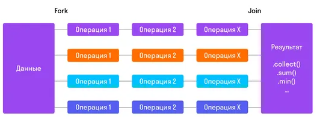

## 2.8 Stream API

> [[_оглавление_]](../README.md/#28-stream-api)

[**Декларативное программирование**](/conspect/definitions.md/#д) - это стиль программирования, в котором описывается
желаемый результат, а не порядок шагов для его достижения.

Декларативное программирование реализуется за счёт следующих инструментов:

- [функциональные интерфейсы](/conspect/02_02.md/#22422-функциональные-интерфейсы);
- [анонимные классы](/conspect/02_02.md/#22421-анонимные-классы);
- [лямбда-выражения](/conspect/02_08.md/#281-лямбда-выражения);
- [ссылки на методы](/conspect/02_08.md/#282-ссылки-на-методы).

### 2.8.1 Лямбда-выражения

> [[_оглавление_]](../README.md/#28-stream-api)

[**Лямбда-выражение**](/conspect/definitions.md/#л) - это анонимная реализация какого-то метода функционального
интерфейса.

Синтаксис лямбда-выражений:

- без аргумента:

```text
() -> System.out.println("Hello");
```

- с одним аргументом:

```text
s -> System.out.println(s);
```

- с двумя аргументами:

```text
(x,y) -> x + y;
```

- с открытым типом аргументов:

```text
(Integer x, Integer y) -> x + y;
```

- множественный оператор:

```text
(x, y) -> {
System.out.println(x);
System.out.println(y);
return (x + y);
}
```

У лямбда-выражений два блока, которые разделены символом-стрелкой `->`:

1. перед `->` указываются параметры метода;
2. после `->` указывается тело метода:
    * если в теле метода одна строка, то его можно не оборачивать в фигурные скобки (`{ }`);
    * если строк две и больше, то по принятому стандарту описания методов нужно обернуть код в фигурные скобки (`{ }`) и
      вызвать `return` в конце блока (опционально).

> [[_Примеры использования_]](/conspect/example_2.md/#пример-1)

> Лямбда-выражения позволяют выявить тип на основе контекста, в котором они применяются, поэтому тип параметров в
> лямбда-выражениях не указывается.

### 2.8.2 Ссылки на методы

> [[_оглавление_]](../README.md/#28-stream-api)

[**Ссылки на методы (Method References)**](/conspect/definitions.md/#с) - это компактные лямбда-выражения для методов, у
которых уже есть имя.

Типы _Method References_:

- ссылка на нестатический метод любого объекта конкретного типа;

```java
ContainingType::methodName
```

- ссылка на нестатический метод конкретного объекта;

```java
containingObject::instanceMethodName
```

- ссылка на статический метод;

```java
ContainingClass::staticMethodName
```

- ссылка на конструктор.

```java
ClassName::new
```

### 2.8.3 Stream

> [[_оглавление_]](../README.md/#28-stream-api)

[**Stream API**](/conspect/definitions.md/#s) - это универсальный инструмент для работы с данными, который позволяет
быстро и просто сортировать, перегруппировывать и фильтровать данные.

_Stream_ является инструментом по работе с коллекциями.

> Источник данных при применении _Stream_ не изменяется.

_Stream_ позволяет сделать преобразования без циклов и условных операторов.

Преимущества _Stream_:

- слабая связанность классов;
- потоки не изменяют исходные коллекции.

Пример:

```java
private static void streamExample() {
    // Создадим список и заполним его буквами не по алфавиту
    List<String> list = new ArrayList<>();
    list.add("B");
    list.add("D");
    list.add("C");
    list.add("A");
    list.add("E");
    List<String> list2 = new ArrayList<>(list);
    // Отсортируем список с помощью метода пузырьковой сортировки.
    // Она использует два вложенных цикла и одно сравнение.
    for (int i = 0; i < list.size(); i++) {
        for (int j = i + 1; j < list.size(); j++) {
            if (list.get(i).compareTo(list.get(j)) > 0) {
                String temp = list.get(i);
                list.set(i, list.get(j));
                list.set(j, temp);
            }
        }
    }
    System.out.println("Мы отсортировали это для тебя: " + list);
    // Создадим стрим для элементов
    ArrayList<String> sortedElements = list2.stream()
            .sorted()
            // Далее выведем данные в новую коллекцию с помощью коллектора
            .collect(Collectors.toCollection(ArrayList::new));
    System.out.println("Мы отсортировали это для тебя: " + sortedElements + " Исходный список: " + list2);
}
```

В применении _Stream_ выделяют 3 этапа:

- создание;
- промежуточные (конвеерные) операции;
- терминальные (конечные) операции.

#### 2.8.3.1 Создание Stream

> [[_оглавление_]](../README.md/#28-stream-api)

_Stream_ создается там, где он должен брать данные.  
Способы создания _Stream_:

- прикрепление к той коллекции, массиву или методу, с чьими данными он работает:

    * списка:

  ```text
  list.stream()
  ```

    * мапы:

  ```text
  map.entrySet().stream()
  ```

    * массива:

  ```text
  Arrays.stream(array)
  ```

    * набора данных:

  ```text
  Stream.of("1", "2", "3")
  ```

- явное задание значения:

```text
Stream.of(v1,… vN)
```

- специальные стримы для примитивов:

```text
IntStream.of(1, … N);
DoubleStream.of(1.1, … N);
```

- из файла, где каждая новая строка становится элементом:

```text
Files.lines(file_path)
```

- с помощью стримбилдера:

```text
Stream.builder().add(...)....build()
```

- задание последовательности чисел от и до:

```text
IntStream rangeS = IntStream.range(9, 91);       // не включительно
IntStream rangeS = IntStream.rangeClosed(9, 91); // включительно
```

- создание параллельного стрима:

```text
collection.parallelStream()
```

- создание бесконечного стрима:

    * с помощью `Stream.iterate`, задавая начальное значение и способ получения следующего значения:

  ```text
  Stream<Integer> iterStream = Stream.iterate(1, m -> m + 1)
  ```

    * с помощью `Stream.generate`, задавая условие соответствия получаемых постоянных и случайных значений:

  ```text
  Stream<String> generateStream = Stream.generate(() -> "f5")
  ```

#### 2.8.3.2 Промежуточные (конвеерные) операции Stream

> [[_оглавление_]](../README.md/#28-stream-api)

Промежуточных методов в стриме может быть сколько угодно.  
[**Промежуточные операции Stream**](/conspect/definitions.md/#п) - это операции, которые модифицируют стрим перед
вызовом терминального оператора.

##### 2.8.3.2.1 distinct()

> [[_оглавление_]](../README.md/#28-stream-api)

`.distinct()` проверяет стрим на уникальность элементов (убирает повторы элементов).

Пример:

```java
private static void streamMethodsExample() {
    List<Integer> list = new ArrayList<>(List.of(1, 2, 3, 4, 5, 6, 7, 8, 9, 8, 7, 6, 5, 4, 3, 2, 1));
    System.out.println(list);
    List<Integer> sortedList = list.stream()
            .distinct()
            .toList();
    System.out.println(sortedList);
}
```

Результат:

```text
[1, 2, 3, 4, 5, 6, 7, 8, 9, 8, 7, 6, 5, 4, 3, 2, 1]
[1, 2, 3, 4, 5, 6, 7, 8, 9]
```

##### 2.8.3.2.2 filter()

> [[_оглавление_]](../README.md/#28-stream-api)

`.filter(Predicate<? super T> predicate)` фильтрует стрим, пропуская только те элементы, что проходят по условию.

`.filter()` работает с 1 аргументом и замещает функциональный интерфейс _Function_:

```java
public interface Predicate<T> {
    boolean test(T t);
}
```

Пример:

```java
private static void streamMethodsExample() {
    List<Integer> list = new ArrayList<>(List.of(1, 2, 3, 4, 5, 6, 7, 8, 9, 8, 7, 6, 5, 4, 3, 2, 1));
    System.out.println(list);
    List<Integer> sortedList = list.stream()
            .filter(e -> e % 2 == 0)
            .toList();
    System.out.println(sortedList);
}
```

Результат:

```text
[1, 2, 3, 4, 5, 6, 7, 8, 9, 8, 7, 6, 5, 4, 3, 2, 1]
[2, 4, 6, 8, 8, 6, 4, 2]
```

##### 2.8.3.2.3 limit()

> [[_оглавление_]](../README.md/#28-stream-api)

`.limit(long maxSize)` ограничивает стрим по количеству элементов.

Пример:

```java
private static void streamMethodsExample() {
    List<Integer> list = new ArrayList<>(List.of(1, 2, 3, 4, 5, 6, 7, 8, 9, 8, 7, 6, 5, 4, 3, 2, 1));
    System.out.println(list);
    List<Integer> sortedList = list.stream()
            .limit(9)
            .toList();
    System.out.println(sortedList);
}
```

Результат:

```text
[1, 2, 3, 4, 5, 6, 7, 8, 9, 8, 7, 6, 5, 4, 3, 2, 1]
[1, 2, 3, 4, 5, 6, 7, 8, 9]
```

##### 2.8.3.2.4 map()

> [[_оглавление_]](../README.md/#28-stream-api)

`.map(Function<? super T,? extends R> mapper)` даёт возможность создать функцию, с помощью которой надо изменить каждый
элемент и пропускать его дальше.

`.map()` работает с 1 аргументом и замещает функциональный интерфейс _Function_:

```java
public interface Function<T, R> {
    R apply(T t);
}
```

Пример:

```java
private static void streamMethodsExample() {
    List<Integer> list = new ArrayList<>(List.of(1, 2, 3, 4, 5, 6, 7, 8, 9, 8, 7, 6, 5, 4, 3, 2, 1));
    System.out.println(list);
    List<Integer> sortedList = list.stream()
            .map((x) -> x * x)
            .toList();
    System.out.println(sortedList);
}
```

Результат:

```text
[1, 2, 3, 4, 5, 6, 7, 8, 9, 8, 7, 6, 5, 4, 3, 2, 1]
[1, 4, 9, 16, 25, 36, 49, 64, 81, 64, 49, 36, 25, 16, 9, 4, 1]
```

##### 2.8.3.2.5 flatMap()

> [[_оглавление_]](../README.md/#28-stream-api)

`.flatMap(Function<? super T, ? extends Stream<? extends R>> mapper)` даёт возможность создать функцию, с помощью
которой можно собрать данные из нескольких потоков в один.

`.flatMap()` работает с 1 аргументом и замещает функциональный интерфейс _Function_:

```java
public interface Function<T, R> {
    R apply(T t);
}
```

Пример:

```java
private static void streamMethodsExample() {
    List<List<Integer>> listOfLists = List.of(
            List.of(1, 2, 3, 4, 5, 6, 7, 8, 9),
            List.of(8, 7, 6, 5, 4, 3, 2, 1)
    );
    System.out.println(listOfLists);
    List<Integer> sortedList = listOfLists.stream()
            .flatMap(List::stream)
            .toList();
    System.out.println(sortedList);
}
```

Результат:

```text
[[1, 2, 3, 4, 5, 6, 7, 8, 9], [8, 7, 6, 5, 4, 3, 2, 1]]
[1, 2, 3, 4, 5, 6, 7, 8, 9, 8, 7, 6, 5, 4, 3, 2, 1]
```

##### 2.8.3.2.6 skip()

> [[_оглавление_]](../README.md/#28-stream-api)

`.skip(long n)` пропускаем n элементов.

Пример:

```java
private static void streamMethodsExample() {
    List<Integer> list = new ArrayList<>(List.of(1, 2, 3, 4, 5, 6, 7, 8, 9, 8, 7, 6, 5, 4, 3, 2, 1));
    System.out.println(list);
    List<Integer> sortedList = list.stream()
            .skip(8)
            .toList();
    System.out.println(sortedList);
}
```

Результат:

```text
[1, 2, 3, 4, 5, 6, 7, 8, 9, 8, 7, 6, 5, 4, 3, 2, 1]
[9, 8, 7, 6, 5, 4, 3, 2, 1]
```

##### 2.8.3.2.7 sorted()

> [[_оглавление_]](../README.md/#28-stream-api)

`.sorted()` и `.sorted(Comparator<? super T> comparator)` возвращает отсортированный поток.

Пример:

```java
private static void streamMethodsExample() {
    List<Integer> list = new ArrayList<>(List.of(1, 2, 3, 4, 5, 6, 7, 8, 9, 8, 7, 6, 5, 4, 3, 2, 1));
    System.out.println(list);
    List<Integer> sortedList = list.stream()
            .sorted(Comparator.reverseOrder())
            .toList();
    System.out.println(sortedList);
}
```

Результат:

```text
[1, 2, 3, 4, 5, 6, 7, 8, 9, 8, 7, 6, 5, 4, 3, 2, 1]
[9, 8, 8, 7, 7, 6, 6, 5, 5, 4, 4, 3, 3, 2, 2, 1, 1]
```

#### 2.8.3.3 Терминальные (конечные) операции Stream

> [[_оглавление_]](../README.md/#28-stream-api)

Терминальная операция в стриме может быть только одна.  
[**Терминальные (конечные) операции Stream**](/conspect/definitions.md/#т) - это операции, которые завершают _Stream_ и
выдают конечный результат вычислений.

##### 2.8.3.3.1 allMatch()

> [[_оглавление_]](../README.md/#28-stream-api)

`.allMatch(Predicate<? super T> predicate)` возвращает `true` если все элементы удовлетворяют условию, иначе - `false`.

Пример:

```java
private static void streamMethodsExample() {
    List<Integer> list = new ArrayList<>(List.of(1, 2, 3, 4, 5, 6, 7, 8, 9, 8, 7, 6, 5, 4, 3, 2, 1));
    System.out.println(list);
    boolean b = list.stream()
            .allMatch((x) -> x < 8);
    System.out.println(b);
}
```

Результат:

```text
[1, 2, 3, 4, 5, 6, 7, 8, 9, 8, 7, 6, 5, 4, 3, 2, 1]
false
```

##### 2.8.3.3.2 anyMatch()

> [[_оглавление_]](../README.md/#28-stream-api)

`.anyMatch(Predicate<? super T> predicate)` возвращает `true` если хоть один элемент удовлетворяет условию,
иначе - `false`.

Пример:

```java
private static void streamMethodsExample() {
    List<Integer> list = new ArrayList<>(List.of(1, 2, 3, 4, 5, 6, 7, 8, 9, 8, 7, 6, 5, 4, 3, 2, 1));
    System.out.println(list);
    boolean b = list.stream()
            .anyMatch((x) -> x < 8);
    System.out.println(b);
}
```

Результат:

```text
[1, 2, 3, 4, 5, 6, 7, 8, 9, 8, 7, 6, 5, 4, 3, 2, 1]
true
```

##### 2.8.3.3.3 collect()

> [[_оглавление_]](../README.md/#28-stream-api)

`.collect(Collector<? super T,A,R> collector)` собирает все элементы в список, множество или другую коллекцию,
сгруппировывает элементы по какому-нибудь критерию, объединяет всё в строку и т.д.

Пример:

```java
private static void streamMethodsExample() {
    List<Integer> list = new ArrayList<>(List.of(1, 2, 3, 4, 5, 6, 7, 8, 9, 8, 7, 6, 5, 4, 3, 2, 1));
    System.out.println(list);
    List<Integer> sortedlist = list.stream()
            .distinct()
            .collect(Collectors.toList());
    System.out.println(sortedlist);
}
```

Результат:

```text
[1, 2, 3, 4, 5, 6, 7, 8, 9, 8, 7, 6, 5, 4, 3, 2, 1]
[1, 2, 3, 4, 5, 6, 7, 8, 9]
```

##### 2.8.3.3.4 count()

> [[_оглавление_]](../README.md/#28-stream-api)

`.count()` возвращает количество элементов стрима.

Пример:

```java
private static void streamMethodsExample() {
    List<Integer> list = new ArrayList<>(List.of(1, 2, 3, 4, 5, 6, 7, 8, 9, 8, 7, 6, 5, 4, 3, 2, 1));
    System.out.println(list);
    long count = list.stream()
            .distinct()
            .count();
    System.out.println(count);
}
```

Результат:

```text
[1, 2, 3, 4, 5, 6, 7, 8, 9, 8, 7, 6, 5, 4, 3, 2, 1]
9
```

##### 2.8.3.3.5 findFirst()

> [[_оглавление_]](../README.md/#28-stream-api)

`.findFirst()` возвращает первый элемент из потока.

Пример:

```java
private static void streamMethodsExample() {
    List<Integer> list = new ArrayList<>(List.of(1, 2, 3, 4, 5, 6, 7, 8, 9, 8, 7, 6, 5, 4, 3, 2, 1));
    System.out.println(list);
    Integer count = list.stream()
            .distinct()
            .findFirst()
            .get();
    System.out.println(count);
}
```

Результат:

```text
[1, 2, 3, 4, 5, 6, 7, 8, 9, 8, 7, 6, 5, 4, 3, 2, 1]
1
```

##### 2.8.3.3.6 findAny()

> [[_оглавление_]](../README.md/#28-stream-api)

`.findAny()` возвращает первый попавшийся элемент из потока.

Пример:

```java
private static void streamMethodsExample() {
    List<Integer> list = new ArrayList<>(List.of(1, 2, 3, 4, 5, 6, 7, 8, 9, 8, 7, 6, 5, 4, 3, 2, 1));
    System.out.println(list);
    Integer count = list.stream()
            .distinct()
            .findAny()
            .get();
    System.out.println(count);
}
```

Результат:

```text
[1, 2, 3, 4, 5, 6, 7, 8, 9, 8, 7, 6, 5, 4, 3, 2, 1]
1
```

##### 2.8.3.3.7 forEach()

> [[_оглавление_]](../README.md/#28-stream-api)

`.forEach(Consumer<? super T> action)` возвращает первый попавшийся элемент из потока.

`.forEach()` работает с 1 аргументом и замещает функциональный интерфейс _Consumer_:

```java
public interface Consumer<T> {
    void accept(T t);
}
```

Пример:

```java
private static void streamMethodsExample() {
    List<Integer> list = new ArrayList<>(List.of(1, 2, 3, 4, 5, 6, 7, 8, 9, 8, 7, 6, 5, 4, 3, 2, 1));
    System.out.println(list);
    list.stream()
            .filter((e) -> e < 2)
            .forEach(System.out::println);
}
```

Результат:

```text
[1, 2, 3, 4, 5, 6, 7, 8, 9, 8, 7, 6, 5, 4, 3, 2, 1]
1
1
```

##### 2.8.3.3.8 max()

> [[_оглавление_]](../README.md/#28-stream-api)

`.max(Comparator<? super T> comparator)` возвращает максимальный элемент из потока.

Пример:

```java
private static void streamMethodsExample() {
    List<Integer> list = new ArrayList<>(List.of(1, 2, 3, 4, 5, 6, 7, 8, 9, 8, 7, 6, 5, 4, 3, 2, 1));
    System.out.println(list);
    Integer i = list.stream().max(Comparator.naturalOrder()).get();
    System.out.println(i);
}
```

Результат:

```text
[1, 2, 3, 4, 5, 6, 7, 8, 9, 8, 7, 6, 5, 4, 3, 2, 1]
9
```

##### 2.8.3.3.9 min()

> [[_оглавление_]](../README.md/#28-stream-api)

`.min(Comparator<? super T> comparator)` возвращает минимальный элемент из потока.

Пример:

```java
private static void streamMethodsExample() {
    List<Integer> list = new ArrayList<>(List.of(1, 2, 3, 4, 5, 6, 7, 8, 9, 8, 7, 6, 5, 4, 3, 2, 1));
    System.out.println(list);
    Integer i = list.stream().min(Comparator.naturalOrder()).get();
    System.out.println(i);
}
```

Результат:

```text
[1, 2, 3, 4, 5, 6, 7, 8, 9, 8, 7, 6, 5, 4, 3, 2, 1]
1
```

##### 2.8.3.3.10 noneMatch()

> [[_оглавление_]](../README.md/#28-stream-api)

`.noneMatch(Predicate<? super T> predicate)` возвращает `true` если ни один элемент не удовлетворяет условию,
иначе - `false`.

Пример:

```java
private static void streamMethodsExample() {
    List<Integer> list = new ArrayList<>(List.of(1, 2, 3, 4, 5, 6, 7, 8, 9, 8, 7, 6, 5, 4, 3, 2, 1));
    System.out.println(list);
    boolean b = list.stream().noneMatch((x) -> x > 12);
    System.out.println(b);
}
```

Результат:

```text
[1, 2, 3, 4, 5, 6, 7, 8, 9, 8, 7, 6, 5, 4, 3, 2, 1]
true
```

##### 2.8.3.3.11 toArray()

> [[_оглавление_]](../README.md/#28-stream-api)

`.toArray()` возвращает массив из элементов потока.

Пример:

```java
private static void streamMethodsExample() {
    List<Integer> list = new ArrayList<>(List.of(1, 2, 3, 4, 5, 6, 7, 8, 9, 8, 7, 6, 5, 4, 3, 2, 1));
    System.out.println(list);
    Integer[] array = list.stream().toArray(Integer[]::new);
    System.out.println(Arrays.toString(array));
}
```

Результат:

```text
[1, 2, 3, 4, 5, 6, 7, 8, 9, 8, 7, 6, 5, 4, 3, 2, 1]
[1, 2, 3, 4, 5, 6, 7, 8, 9, 8, 7, 6, 5, 4, 3, 2, 1]
```

### 2.8.4 Collectors

> [[_оглавление_]](../README.md/#28-stream-api)

Класс _Collectors_ предназначен для сбора данных, с которыми выполнялись операции в стриме, и их упаковки в коллекцию
какого-либо типа, мапу или строку.

Параметры статических методов класса _Collectors_ передаются в терминальный метод _Stream_ `.collect()`.

Например:

```java
private static void streamMethodsExample() {
    List<Integer> list = new ArrayList<>(List.of(1, 2, 3, 4, 5, 6, 7, 8, 9, 8, 7, 6, 5, 4, 3, 2, 1));
    System.out.println(list);
    Map<String, Integer> map = list.stream()
            .distinct()
            .collect(Collectors.toMap(String::valueOf, x -> x));
    System.out.println(map);
}
```

Основные методы класса _Collectors_:

- _toList()_ - преобразует поток в список;
- _toSet()_ - преобразует поток во множество;
- _toMap()_ - преобразует поток в ассоциативный массив;
- _joining()_ - склеивает элементы потока в строку;

```java
private static void streamMethodsExample() {
    List<Integer> list = new ArrayList<>(List.of(1, 2, 3, 4, 5, 6, 7, 8, 9, 8, 7, 6, 5, 4, 3, 2, 1));
    System.out.println(list);
    String str = list.stream()
            .distinct()
            .map(String::valueOf)
            .collect(Collectors.joining(""));
    System.out.println(str);
}
```

- _mapping()_ - конвертирует элементы потока;

```java
private static void streamMethodsExample() {
    List<Integer> list = new ArrayList<>(List.of(1, 2, 3, 4, 5, 6, 7, 8, 9, 8, 7, 6, 5, 4, 3, 2, 1));
    System.out.println(list);
    List<String> stringList = list.stream()
            .distinct()
            .collect(Collectors.mapping(String::valueOf, Collectors.toList()));
    System.out.println(stringList);
}
```

- _groupingBy()_ - группирует элементы потока.

### 2.8.5 Optional

> [[_оглавление_]](../README.md/#28-stream-api)

[**Optional**](/conspect/definitions.md/#o) - это специальный класс-контейнер, который может содержать или определенное
ненулевое значение, или `null` вместо него.

#### 2.8.5.1 Создание Optional

> [[_оглавление_]](../README.md/#28-stream-api)

Существует несколько способов создания _Optional_:

- метод `empty()` - создаёт пустой объект _Optional_:

```java
Optional<String> empty = Optional.empty();
```

- метод `of()` - создаёт объект _Optional_ на основе другого объекта (который должен быть не `null`, иначе будет
  выброшено исключение `NullPointerException`):

```java
String name = "Wine";
Optional<String> opt = Optional.of(name);
```

- метод `ofNullable()` - создаёт объект _Optional_ на основе другого объекта, который может быть `null`:

```java
String name = "One more wine";
Optional<String> opt = Optional.ofNullable(name);
```

#### 2.8.5.2 isPresent() и isEmpty()

> [[_оглавление_]](../README.md/#28-stream-api)

Методы `isPresent()` и `isEmpty()` применяются для проверки наличия объекта внутри _Optional_.

Пример:

```java
private static void optionalExample() {
    Optional<String> opt = Optional.of("Rioja wine region");
    System.out.println(opt.isPresent());
    System.out.println(opt.isEmpty());
    System.out.println();
    Optional<String> opt2 = Optional.ofNullable(null);
    System.out.println(opt2.isPresent());
    System.out.println(opt2.isEmpty());
}
```

Результат:

```text
true
false

false
true
```

Метод `isPresent()` вернёт `true`, если _Optional_ не пустой, иначе - `false`.  
Метод `isEmpty()` вернёт `false`, если _Optional_ не пустой, иначе - `true`.

#### 2.8.5.3 ifPresent()

> [[_оглавление_]](../README.md/#28-stream-api)

Метод `ifPresent()` позволяет выполнить действия над объектом внутри _Optional_.

Пример:

```java
private static void optionalExample() {
    Optional<String> opt = Optional.of("Rioja wine region");
    Optional<String> opt2 = Optional.ofNullable(null);
    opt.ifPresent(name -> System.out.println(name.length()));
    opt2.ifPresent(name -> System.out.println(name.length()));
}
```

Результат:

```text
17
```

Метод `ifPresent()` проведёт проверку на `null`, и если объект _Optional_ не пустой, то проведёт над ним операции,
иначе - операции выполнены не будут.

#### 2.8.5.4 orElse()

> [[_оглавление_]](../README.md/#28-stream-api)

Метод `orElse()` используется для задания значения по умолчанию для значения, которое находится внутри _Optional_.

Пример:

```java
private static void optionalExample() {
    Optional<String> opt2 = Optional.ofNullable(null);
    String name = opt2.orElse("Boris the Blade");
    System.out.println(name);
}
```

Результат:

```text
Boris the Blade
```

Метод `orElse()` проведёт проверку на `null`, и если объект _Optional_ пустой, то вернёт значение по умолчанию.

#### 2.8.5.5 orElseGet()

> [[_оглавление_]](../README.md/#28-stream-api)

Метод `orElseGet()` вместо значения по умолчанию, которое передается в качестве аргумента, метод принимает
функциональный интерфейс _Supplier_, который вызывает определенное действие.  
Метод `orElseGet()` работает с 1 аргументом интерфейса _Supplier_:

```java
public interface Supplier<T> {

    T get();
}
```

Пример:

```java
private static void optionalExample() {
    String nullName = null;
    String name = Optional.ofNullable(nullName).orElseGet(() -> "Boris");
    System.out.println(name);
}
```

Результат:

```text
Boris
```

Метод `orElseGet()` проведёт проверку на `null`, и если объект _Optional_ пустой, то выполнит операции и вернёт значение
по умолчанию.

> Отличие метода `orElseGet()` от метода `orElse()` в том, что в случае, если объект не `null`, метод `orElse()` всё
> равно создаст объект, который не будет использоваться, а метод `orElseGet()` - нет.

#### 2.8.5.6 orElseThrow()

> [[_оглавление_]](../README.md/#28-stream-api)

Метод `orElseThrow()` вместо предоставления дефолтного метода выбрасывает исключение.

Пример:

```java
private static void optionalExample() {
    String nullName = null;
    String name = Optional.ofNullable(nullName).orElseThrow(IllegalArgumentException::new);
    System.out.println(name);
}
```

Метод `orElseThrow()` поддерживает пустой конструктор: по умолчанию выбрасывается _NoSuchElementException_.

#### 2.8.5.7 get()

> [[_оглавление_]](../README.md/#28-stream-api)

Метод `get()` позволяет получить значение из _Optional_.

Пример:

```java
private static void optionalExample() {
    Optional<String> opt = Optional.of("Boris");
    String name = opt.get();
    System.out.println(name);
}
```

Результат:

```text
Boris
```

Метод `get()` возвращает значение только если оно не `null`, в противном случае выбрасывается
исключение `NoSuchElementException`.

#### 2.8.5.8 filter()

> [[_оглавление_]](../README.md/#28-stream-api)

Метод `filter()` принимает условие в качестве аргумента и возвращает объект типа _Optional_.

Пример:

```java
private static void optionalExample() {
    Optional<String> opt = Optional.of("Boris");
    String name = opt
            .filter((e) -> e != "Andrew")
            .get();
    System.out.println(name);
    name = opt
            .filter((e) -> e != "Boris")
            .get();
    System.out.println(name);
}
```

Результат:

```text
Boris
Exception in thread "main" java.util.NoSuchElementException: No value present
```

Метод `filter()` возвращает тот же _Optional_, если он подходит по условиям, или пустой _Optional_ - если нет.

#### 2.8.5.9 map()

> [[_оглавление_]](../README.md/#28-stream-api)

Метод `map()` применяется для изменения значения внутри _Optional_ или его типа.

Пример:

```java
private static void optionalExample() {
    List<String> companyNames = Arrays.asList(
            "paypal", "oracle", "", "microsoft", "", "apple");
    Optional<List<String>> listOptional = Optional.of(companyNames);
    int size = listOptional
            .map(List::size)
            .orElse(0);
    System.out.println(size);
}
```

Результат:

```text
6
```

Метод `map()` возвращает результат вычислений, завернутый внутрь _Optional_.  
Можно комбинировать методы `map()` и `filter()` в цепочки, чтобы сделать какую-то более сложную операцию.

#### 2.8.5.10 flatMap()

> [[_оглавление_]](../README.md/#28-stream-api)

Метод `flatMap()` очень похож на метод `map()`.  
Разница заключается в том, что метод `map()` заворачивает результат в _Optional_, а метод `flatMap()` производит
распаковку результата. По этой причине `flatMap()` работает с объектом только если он не `null`.

### 2.8.6 Параллельные стримы

> [[_оглавление_]](../README.md/#28-stream-api)

Распараллеливание потоков позволяет задействовать несколько ядер процессора (если целевая машина многоядерная) и тем
самым может повысить производительность и ускорить вычисления. В то же время говорить, что применение параллельных
потоков на многоядерных машинах однозначно повысит производительность - не совсем корректно. В каждом конкретном случае
надо проверять и тестировать.

В _Stream API_ присутствует возможность распараллеливания. Для этого используется метод `parallel()`. Этот метод
использует концепцию _ForkJoinPool_.

[**ForkJoinPool**](/conspect/definitions.md/#f) - это часть пакета `java.util.concurrent`, предназначенная для
реализации параллельного выполнения задач, основанных на разделении и объединении (_fork-join_).  
Он представляет собой специализированный пул потоков, который может эффективно обрабатывать задачи, которые разбиваются
на более мелкие подзадачи.



Для распараллеливания выполнения задачи исходные данные разбиваются на равные части по потокам. Эта операция называется
_Fork_.  
Перед агрегирующей (терминальной) функцией все потоки ждут завершения всех остальных. После того как все расчеты
совершены параллельно, данные снова объединяются. Эта операция называется _Join_.  
Слово _Pool_ означает, что есть ограниченное количество потоков (пул потоков) и ограничено оно количеством ядер
процессора.

Преимущество распараллеливания обработки задач - ускорение самого процесса обработки.

Недостатки использования _ForkJoinPool_ заключаются в том, что процессы разделения (_fork_) и объединения (_join_)
требуют затрат ресурсов и времени, из-за чего:

- распараллеливание процесса обработки может привести к большему времени выполнения, чем последовательная обработка;
- в ЭВМ существует один пул потоков на выполнение всех процессов, в связи с чем процесс распараллеливания выполнения
  задач в одном модуле приложения может помешать выполнению других процессов приложения.