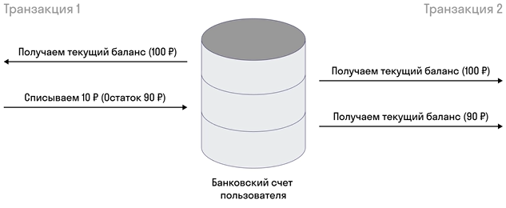
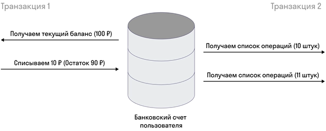

## 2.10 Транзакции

> [[_оглавление_]](../README.md/#210-транзакции)

[**Транзакция**](/conspect/definitions.md/#т) - это минимальная логическая операция, которая имеет смысл и может быть
совершена только полностью; группа последовательных операций с базой данных, которая может быть выполнена либо целиком и
успешно, либо не выполнена вообще и тогда не должна произвести никакого эффекта.

### 2.10.1 ACID

> [[_оглавление_]](../README.md/#210-транзакции)

Каждая транзакция в Java должна удовлетворять четырём основным свойствам транзакций. Если транзакция не удовлетворяет
всем четырём свойствам, то она транзакцией не является.

Свойства транзакций (_ACID_):

| **Наименование свойства** | **Русская транскрипция** | **Значение**                                                                                     |
|:--------------------------|:-------------------------|:-------------------------------------------------------------------------------------------------|
| **A**_tomicity_           | _Атомарность_            | либо все операции выполняются успешно, либо - ни одной                                           |
| **C**_onsistency_         | _Согласованность_        | после завершения транзакции все данные должны оставаться в согласованном виде                    |
| **I**_solation_           | _Изолированность_        | никакие параллельно выполняющиеся транзакции не должны оказывать влияния на результат друг друга |
| **D**_urability_          | _Прочность_              | все изменения успешно выполненной транзакции не могут быть отменены в результате сбоя            |

### 2.10.2 Уровни изоляции транзакций

> [[_оглавление_]](../README.md/#210-транзакции)

При выполнении транзакций возникают четыре основных группы проблем:

| **Наименование проблемы** | **Русская транскрипция** | **Значение**                                                                                                     |          **Пример**           |
|:--------------------------|:-------------------------|:-----------------------------------------------------------------------------------------------------------------|:-----------------------------:|
| _Lost update_             | Потерянное обновление    | Две параллельные транзакции меняют одни и те же данные. Итоговый результат обновления предсказать невозможно.    |  |
| _Dirty read_              | Грязное чтение           | В результатах запроса появляются промежуточные результаты параллельной транзакции, которая ещё не завершилась.   |  |
| _Non-repeatable read_     | Неповторяющееся чтение   | Запрос с одними и теми же условиями даёт неодинаковые результаты в рамках транзакции.                            |  |            
| _Phantom read_            | Фантомное чтение         | В результатах повторяющегося запроса появляются и исчезают строки, которые модифицирует параллельная транзакция. |  |            

Для решения проблем, возникающих при выполнении транзакций, было введено понятие _уровней изоляции транзакций_:

| **Уровень изоляции** | **Русская транскрипция**        |                        **Решает проблемы**                         | **Принцип работы**                                                                                                                                                                                                                                                                                                                                                                                                                        |
|:--------------------:|:--------------------------------|:------------------------------------------------------------------:|:------------------------------------------------------------------------------------------------------------------------------------------------------------------------------------------------------------------------------------------------------------------------------------------------------------------------------------------------------------------------------------------------------------------------------------------|
|  _Read uncommitted_  | Чтение незафиксированных данных |                           _Lost update_                            | Каждая транзакция видит незафиксированные изменения другой транзакции (феномен грязного чтения). Запись результатов выполнения транзакций происходит последовательно.                                                                                                                                                                                                                                                                     |
|   _Read committed_   | Чтение фиксированных данных     |                    _Lost update_, _Dirty read_                     | Исполняющиеся транзакции видят только зафиксированные изменения из других транзакций. Входные данные для последующей транзакции считываются только после того, как успешно завершится предыдущая транзакция и будет записан результат её выполнения.                                                                                                                                                                                      |
|  _Repeatable read_   | Повторяющееся чтение            |         _Lost update_, _Dirty read_, _Non-repeatable read_         | Исполняющиеся транзакции не видят изменённые и удаленные записи другой транзакцией, но видят вставленные записи из другой транзакции. Все транзакции выполняются параллельно и получают на вход одни и те же входные данные, однако при записи результата выполнения транзакции идёт проверка на наличие изменений во входных данных в результате выполнения предыдущих транзакций, и если они были транзакции полностью перезапускаются. |            
|    _Serializable_    | Упорядочивание                  | _Lost update_, _Dirty read_, _Non-repeatable read_, _Phantom read_ | Транзакции ведут себя как будто ничего более не существует, никакого влияния друг на друга нет. Все транзакции полностью выполняются строго последовательно в одном потоке.                                                                                                                                                                                                                                                               |

Чем выше уровень изоляции, тем медленнее работает приложение из-за роста накладных расходов на выполнение транзакций.
Поэтому необходимо выбирать оптимальный уровень в зависимости от возможности возникновения проблем при выполнении
транзакций в приложении.

### 2.10.3 Управление транзакциями в Spring

> [[_оглавление_]](../README.md/#210-транзакции)

Управление транзакциями в приложениях _Spring_ производится с помощью аннотации `@Transacional` из
пакета `org.springframework.transaction.annotation`.

> Уровень изоляции транзакций задаётся посредством атрибута `isolation` аннотации `@Transactional`.

В _Spring_-приложениях при работе с базами данных не имеет значения, используется ли аннотация `@Transactional` от
_Spring_, обычный _Hibernate_, _jOOQ_ или любая другая библиотека баз данных - все они открывают и закрывают транзакции
базы данных.

При использовании аннотации `@Transacional` _Spring_ производит каждый раз следующие операции:

```java
import java.sql.Connection;

public void setConnection(Connection connection) {
    Connection connection = dataSource.getConnection(); // Spring создаёт подключение к БД при первом подключении к ней
    try (connection) {
        connection.setAutoCommit(false); // Ручная инициализация транзакции
        // выполнить несколько SQL-запросов...
        connection.commit(); // Фиксация транзакции

    } catch (SQLException e) {
        connection.rollback(); // Откат транзакции, если получена ошибка
    }
}
```

_Spring_ не может переписать класс Java, чтобы вставить код подключения к базе данных. Вместо этого _IoC_-контейнер
_Spring_ инстанцирует (создаёт экземпляр класса) Java-класс вместе с транзакционным прокси этого класса с помощью
метода `proxy-through-subclassing()` библиотеки _Cglib_.

У конкретного прокси есть одна задача - открытие и закрытие соединений/транзакций с базой данных, а затем делегирование
настоящему _bean_-компоненту (Java классу).  
Другие бины, никогда не знают, что они обмениваются данными с прокси, а не с настоящим _bean_-компонентом.

Каждый _bean_-компонент проксируется на лету, и прокси управляет транзакциями. Но не сам прокси управляет всем этим
транзакционным состоянием (открыть, зафиксировать, закрыть), прокси делегирует эту работу менеджеру транзакций.  
_Spring_ предлагает интерфейс _PlatformTransactionManager_ (_TransactionManager_), который по умолчанию поставляется с
парой удобных реализаций. Одна из них - менеджер транзакций источника данных.

Если _Spring_ обнаруживает аннотацию `@Transactional` над _bean_-компонентом, он создаёт динамический прокси этого
бина.  
Прокси имеет доступ к менеджеру транзакций и будет просить его открывать и закрывать транзакции/соединения.  
Сам менеджер транзакций будет просто управлять соединением [_JDBC_](/conspect/08.md/#821-jdbc).

Для ручной настройки транзакций при отправке запросов в БД в приложении _Spring_, помимо непосредственного использования
аннотации `@Transactional`, необходимо создать конфигурацию транзакций.

```java

@Configuration
@EnableTransactionManagement
public static class MyAppConfig {

    @Bean
    // Spring создаёт здесь динамический CGLib-прокси класса UserService, 
    // который может открывать и закрывать транзакции базы данных
    public UserService userService() {
        return new UserService();
    }

    @Bean
    // Здесь создаётся источник данных, специфичный для базы данных или для пула соединений 
    // (в данном примере используется MySQL).
    public DataSource dataSource() {
        return new MysqlDataSource();
    }

    @Bean
    // Здесь создаётся свой менеджер транзакций, которому нужен источник данных, 
    // чтобы иметь возможность управлять транзакциями.
    public PlatformTransactionManager txManager() {
        return new DataSourceTransactionManager(dataSource());
    }

}
```

Для автоматической конфигурации транзакций вместо использования `DataSourcePlatformTransactionManager` в конфигурации
_Spring_ нужно использовать `HibernateTransactionManager` (при использовании обычного _Hibernate_)
или `JpaTransactionManager` (при использовании _Hibernate_ через _JPA_).