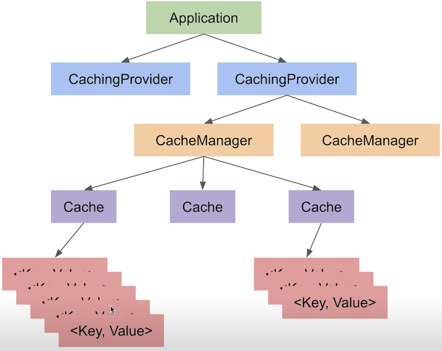

## 3.2 Spring Boot

> [[_оглавление_]](../README.md/#32-spring-boot)

_Spring Boot_ предназначен для упрощения создания автономных приложений на базе _Spring_.

Модуль _Spring Boot_ выполняет следующие функции:

- создание автономных приложений _Spring_;
- прямое встраивание _Tomcat_, _Jetty_ или _Undertow_ (освобождая от необходимости развертывать файлы _WAR_);
- предоставление необходимых зависимостей стартеру для упрощения конфигурации сборки;
- автоматическая настройка _Spring_ и сторонних библиотек, когда это возможно;
- предоставление настроенных и готовых к использованию функций (метрики, проверки работоспособности и внешняя
  конфигурация);
- обеспечение независимости от генерации кода и требований к XML-конфигурации.

_Spring Boot_ просматривает classpath и bean-компоненты, которые были настроены, делает обоснованные предположения о
том, чего в них не хватает, и добавляет эти элементы.

[**Apache Tomcat**](/conspect/definitions.md/#t) - это открытое программное обеспечение, реализующее спецификации _Java
Servlet_, _JSP_ и _Java WebSocket_, предоставляя таким образом платформу для запуска веб-приложений, написанных на языке
Java. Разработанный и поддерживаемый _Apache Software Foundation_, _Tomcat_ служит контейнером сервлетов, который
позволяет веб-приложениям использовать Java для создания динамичных веб-страниц.  
[**Сервлет (Servlet)**](/conspect/definitions.md/#с) - это класс, который умеет получать запросы от клиента и возвращать
ему ответы.  
[**Java Servlet API**](/conspect/definitions.md/#j) - это стандартизированный _API_, предназначенный для реализации на
сервере и работе с клиентом по схеме запрос-ответ.  
[**API (application programming interface)**](/conspect/definitions.md/#a) - это программный интерфейс приложения; набор
способов и правил, по которым различные программы общаются между собой и обмениваются данными.  
[**JSP (Java Server Pages)**](/conspect/definitions.md/#j) - это технология, позволяющая web-разработчикам создавать
содержимое, которое имеет как статические, так и динамические компоненты.  
Страница _JSP_ содержит текст двух типов: статические исходные данные, которые могут быть оформлены в одном из текстовых
форматов _HTML_, _SVG_, _WML_, или _XML_, и _JSP_-элементы, которые конструируют динамическое содержимое. Кроме этого
могут использоваться библиотеки _JSP_-тегов, а также _Expression Language (EL)_ для внедрения Java-кода в статичное
содержимое _JSP_-страниц.  
[**WebSocket (RFC 6455)**](/conspect/definitions.md/#w) - это независимый протокол, основанный на протоколе _TCP_ и
предназначенный для обмена сообщениями между браузером и web-сервером в режиме реального времени. Таким образом,
изначально синхронный протокол _HTTP_, построенный на модели «запрос — ответ», становится полностью асинхронным и
симметричным. При использовании _WebSocket_ нет клиента и сервера с фиксированными ролями, а есть два равноправных
участника обмена данными. Каждый участник функционирует самостоятельно: отправил сообщение и продолжил выполнять свои
функции. Участник, получивший сообщение, может вообще не отвечать: протокол дает полную свободу в обмене данными.  
[**Jetty**](/conspect/definitions.md/#j) - это веб-сервер и контейнер сервлетов, который позволяет запускать
web-приложения на Java. Он был разработан _Morteza Hosseini_ и известен своей легковесностью и высокой
производительностью.  
[**Undertow**](/conspect/definitions.md/#u) - это гибкий, быстрый web-сервер, написанный на Java, который основан на
_API_ нового ввода-вывода _J2SE_. _Undertow_ разработан на основе композиционной архитектуры, которая позволяет
создавать полнофункциональный web-сервер путем объединения небольших отдельных компонентов, называемых обработчиками.
Эти обработчики объединяются в цепочку, образуя либо полностью функциональный контейнер сервлета _Java EE 3.1_, либо
более простой обработчик процесса _HTTP_, встроенный в код.  
[**WAR (Web Application Resource)**](/conspect/definitions.md/#w) - это формат файла, описывающий, как полное
web-приложение упаковывается в соответствии со спецификацией Java-сервлетов в файл в формате _JAR_ или _ZIP_.

_Spring Boot_ не генерирует код и не вносит изменения в файлы. При запуске приложения _Spring Boot_ динамически
подключает бины и настройки и применяет их к контексту приложения.

Запуск приложений _Spring Boot_ с помощью:

- Gradle:

```text
./gradlew bootRun
```

- Maven:

```text
./mvnw spring-boot:run
```

### 3.2.1 Spring Boot Caching

> [[_оглавление_]](../README.md/#32-spring-boot)

[**Кэш**](/conspect/definitions.md/#к) - это промежуточное хранилище данных (как правило, в оперативной памяти), откуда
можно быстро получить доступ к часто используемой информации.  
Данные в кэше хранятся в виде пар "ключ:значение".

Основная идея кэширования - сократить время доступа к данным, сохраняя их в более быстром хранилище.

При запросе данных система сначала проверяет, есть ли эти данные в кэше. Если данные найдены, это называется «попаданием
в кэш» (_cache hit_). Если данных нет, это называется «промахом кэша» (_cache miss_). В случае промаха, система
обращается к исходному источнику данных, а затем обычно сохраняет эти данные в кэше для будущих запросов.

Кэширование применяется для:

- сохранения результатов больших вычислений;
- уменьшения количества запросов к жёсткому диску;
- уменьшения количества запросов к сторонним сервисам и приложениям;
- уменьшения времени ответа сервера;
- сокращения объёма трафика;
- экономии процессорного времени;
- увеличения скорости работы приложения.

Вся информация, хранящаяся в кэше, является временной, поэтому кэш должен содержать в себе только ту информацию, потеря
которой не повлечёт критичных последствий.

Структура кэширования в _Spring Framework_:



[**Провайдер кэша**](/conspect/definitions.md/#п) - это приложение, библиотека или фреймворк, который содержит в себе
всю логику по кэшированию.

_Spring_ в данном случае выступает некоторой абстракцией: то есть _Spring_ предоставляет _API_, правильные аннотации,
интерфейсы и какие-то абстрактные классы, но саму реализацию этих интерфейсов и классов _Spring_ не несёт.

[**Кэш-менеджер**](/conspect/definitions.md/#к) - это класс, который занимается регуляцией кэша, то есть позволяет
непосредственно работать с хранилищем.

В _Spring Boot_ приложении может быть несколько кэш-провайдеров, каждый из которых может содержать по несколько
кэш-менеджеров, а каждый кэш-менеджер может содержать один или несколько кэшей.

|   **Участник**   | **Функция**                                                                              |
|:----------------:|:-----------------------------------------------------------------------------------------|
|  _CacheManager_  | Управляет различными кэшами.<br/>В проекте может быть использовано несколько менеджеров. |
|     _Cache_      | Интерфейс, описывающий структуру кэша.<br/>Существует несколько стандартных реализаций.  |
|  _KeyGenerator_  | Алгоритм генерации ключей для объектов кэша.                                             |
|   _Serializer_   | Вариант сериализации данных при кэшировании.                                             |
| `@EnableCaching` | Включает кэширование на уровне приложения.                                               |
|   `@Cacheable`   | Включает кэширование определённого метода и конфигурирует его.                           |
|   `@CachePut`    | Добавляет или изменяет данные в кэше.                                                    |
|  `@CacheEvict`   | Удаляет данные из кэша.                                                                  |
|    `@Caching`    | Позволяет конфигурировать кэширование и объединять аннотации, указанные выше в таблице.  |
|  `@CacheConfig`  | Конфигурирует кэширование для всего класса.                                              |

Метаданные для _Spring Expression Language (SpEL)_:

|      **Тип**      |                      **Описание проверки**                      | **Пример**                                               |
|:-----------------:|:---------------------------------------------------------------:|:---------------------------------------------------------|
| _Название метода_ |       Название метода, который в данный момент вызывается       | `#root.methodName`<br/>`#root.method.name`               |
| _Целевой объект_  |           Объект, который предполагается закэшировать           | `#root.target`                                           |
|  _Класс объекта_  |                    Класс кэшируемого объекта                    | `#root.targetClass`                                      |
|    _Аргументы_    |      Позволяют обращаться к аргументам вызываемого метода       | `#root.args[0]`<br/>`#a0`<br/>`#p0`<br/>`#parameterName` |
|      _Кэши_       | Позволяют получить данные об используемых в данном методе кэшах | `#root.caches[0].name`                                   |
|    _Результат_    |       Позволяет обратиться к результату выполнения метода       | `#result`                                                |

Порядок добавления кэширования в _Spring Boot_ приложение:

- добавить зависимость в файл:

    * _pom.xml_:

      ```xml
  
         <dependency>
              <groupId>org.springframework.boot</groupId>
              <artifactId>spring-boot-starter-cache</artifactId>
              <version>3.3.5</version>
         </dependency>
       ```

    * _build.gradle_:

      ```groovy
       implementation 'org.springframework.boot:spring-boot-starter-cache:3.3.5'
      ```

- включить кэширование в _Spring_, добавив:
    * аннотацию `@EnableCaching` в стартер приложения для использования стандартного кэш-менеджера
      _ConcurrentMapCacheManager_:
  ```java
  @EnableCaching
  public class JavaConspectRusApplication {
  
      public static void main(String[] args) {
          SpringApplication.run(JavaConspectRusApplication.class, args);
      }
  }
  ```
    * в конфигурационный файл для использования любого другого из поддерживаемых кэш-менеджеров:
        + _ConcurrentMapCacheManager_:
      ```java
      @Configuration
      @EnableCaching
      public class CachingConfiguration {
          @Bean
          public CacheManager cacheManager() {
              return new ConcurrentMapCacheManager("book");
          }
      }
      ```
        + _CaffeineCacheManager_:
      ```java
      @Configuration
      @EnableCaching
      public class CachingConfiguration {
          @Bean
          public CacheManager cacheManager() {
              return new CaffeineCacheManager("book");
          }
      }
      ```
        + _CompositeCacheManager_:
      ```java
      @Configuration
      @EnableCaching
      public class CachingConfiguration {
          @Bean
          public CacheManager cacheManager() {
              return new CompositeCacheManager(
                  new ConcurrentMapCacheManager("cacheA") {
                      @Override
                      protected Cache createConcurrentMapCache(final String name) {
                          return new ConcurrentMapCache(name,
                              (ConcurrentMap<Object, Object>) CacheBuilder.newBuilder()
                                  .expireAfterAccess(1000L, TimeUnit.SECONDS)
                                  .maximumSize(1000L)
                                  .build(), false);
                              }
                      },
                  new ConcurrentMapCacheManager("cacheB") {
                      @Override
                      protected Cache createConcurrentMapCache(final String name) {
                          return new ConcurrentMapCache(name,
                              (ConcurrentMap<Object, Object>) CacheBuilder.newBuilder()
                                  .expireAfterAccess(1000L, TimeUnit.SECONDS)
                                  .maximumSize(1000L)
                                  .build(), false);
                              }
                      }
                  );
          }
      }
      ```
        + _JCacheCacheManager_;
        + _NoOpCacheManager_;
        + _SimpleCacheManager_;
      ```java
      @Configuration
      @EnableCaching
      public class CachingConfiguration {
          @Bean
          public CacheManager cacheManager() {
              SimpleCacheManager cacheManager = new SimpleCacheManager();
              cacheManager.setCaches(List.of(new ConcurrentMapCache("book")));
              return cacheManager;
          }
      }
      ```
        + _TransactionAwareCacheManagerProxy_;

- (при необходимости) также создать _bean_-компонент _KeyGenerator_ и настроить его:

```java

@Configuration
@EnableCaching
public class CachingConfiguration {
    @Bean
    public CacheManager cacheManager() {
        SimpleCacheManager cacheManager = new SimpleCacheManager();
        cacheManager.setCaches(List.of(new ConcurrentMapCache("book")));
        return cacheManager;
    }

    @Bean
    public KeyGenerator keyGenerator() {
        KeyGenerator keyGenerator = new SimpleKeyGenerator() {
            @Override
            public Object generate(Object target, Method method, Object... params) {
                return target.getClass().getSimpleName() + "_"
                        + method.getName() + "_"
                        + StringUtils.arrayToDelimitedString(params, "_");
            }
        };
        return keyGenerator;
    }
}
```

- настроить кэширование для класса с использованием аннотации `@CacheConfig`;
- добавить функции кэширования в кэшируемом классе с помощью аннотаций `@Cacheable`, `@CachePut`, `@CacheEvict`
  и `@Caching`:

```java

@RestController
@RequestMapping(path = "/books")
@Tag(name = "Контроллер для книг", description = "Контроллер для работы с книгами")
@CacheConfig(cacheNames = "book")
public class BooksController {
    private final BookService bookService;
    private final BookCoverService bookCoverService;

    public BooksController(@Qualifier("bookServiceImplDB") BookService bookService, @Qualifier("bookCoverServiceImpl") BookCoverService bookCoverService) {
        this.bookService = bookService;
        this.bookCoverService = bookCoverService;
    }

    @PostMapping                    // http://localhost:8080/books      C - create
    @Cacheable(value = "book", key = "#result.body.id")
    public ResponseEntity<Book> createBook(@RequestBody Book book) {
        try {
            return ResponseEntity.ok(bookService.createBook(book));
        } catch (RuntimeException e) {
            return ResponseEntity.status(405).build();
        }
    }

    @GetMapping(path = "/{id}")     // http://localhost:8080/books/1    R - read
    @Cacheable(value = "book")
    public ResponseEntity<Book> readBook(@PathVariable @Parameter(description = "ID книги в имеющемся списке книг", required = true, schema = @Schema(implementation = Long.class), example = "1") long id) {
        Book findedBook = bookService.findBook(id);
        if (findedBook != null) {
            return ResponseEntity.ok(findedBook);
        } else {
            return ResponseEntity.notFound().build();
        }
    }

    @PutMapping                     // http://localhost:8080/books      U - update
    @CachePut(value = "book", key = "#book.id", unless = "#result.body.id > 100")
    public ResponseEntity<Book> updateBook(@RequestBody Book book) {
        Book updatedBook = bookService.editBook(book);
        if (updatedBook != null) {
            return ResponseEntity.ok(updatedBook);
        } else {
            return ResponseEntity.status(HttpStatus.BAD_REQUEST).build();
        }
    }

    @DeleteMapping(path = "/{id}")  // http://localhost:8080/books/1    D - delete
    @CacheEvict(value = "book")
    public ResponseEntity<Book> deleteBook(@PathVariable @Parameter(description = "ID книги в имеющемся списке книг", required = true, schema = @Schema(implementation = Long.class), example = "1") long id) {
        Book deletedBook = bookService.deleteBook(id);
        if (deletedBook != null) {
            return ResponseEntity.ok(deletedBook);
        } else {
            return ResponseEntity.status(403).build();
        }
    }
}
```

Кэш-менеджер после его объявления в конфиг-файле в качестве бина может использоваться как любой другой _bean_-компонент
приложения, а именно может быть внедрён в класс, а его методы могут вызываться в методах класса. Как правило, такое
применение кэш-менеджера используется для очистки кэша.

Пример использования:

```java
public class CacheServiceImpl implements CacheService {
    private final CacheManager cacheManager;

    public CacheServiceImpl(CacheManager cacheManager) {
        this.cacheManager = cacheManager;
    }

    @Override
    public void clearCache() {
        cacheManager.getCache("book").clear();
    }
}
```