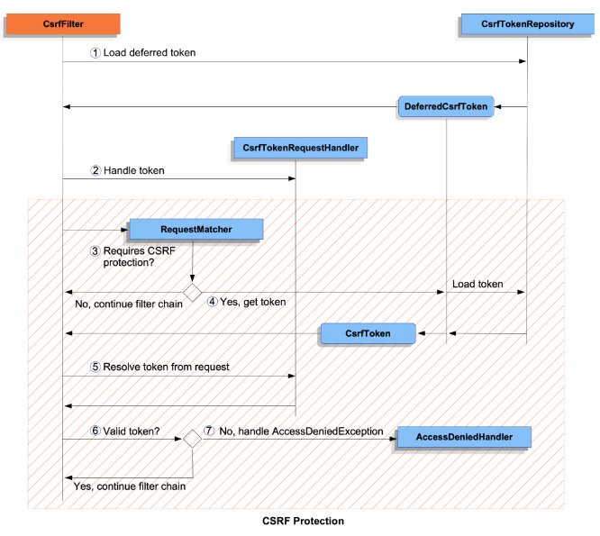

## 3.9 Spring Security

> [[_оглавление_]](../README.md/#39-spring-security)

[**Spring Security**](/conspect/definitions.md/#s) - это фреймворк, предоставляющий механизмы построения систем
аутентификации и авторизации, а также другие возможности обеспечения безопасности для корпоративных приложений,
созданных с помощью _Spring Framework_.

Для работы _Spring Security_ требуется среда выполнения Java 17 или выше.

_Spring Security_ обеспечивает комплексную поддержку аутентификации, авторизации и защиты от распространённых
уязвимостей. Он также обеспечивает интеграцию с другими библиотеками для упрощения использования.

> [[_Пример_]](/conspect/example_13.md/#пример-1) настройки _Spring Security_ с _Basic_-аутентификацией и использованием
> _JPA_-репозитория для хранения логинов и паролей пользователей.

### 3.9.1 Идентификация, аутентификация и авторизация

> [[_оглавление_]](../README.md/#39-spring-security)

Процесс предоставления доступа к приложению состоит из трёх этапов:

- идентификация пользователя;
- аутентификация пользователя;
- авторизация пользователя.

[**Идентификация**](/conspect/definitions.md/#и) - это процесс поиска пользователя в системе по его уникальному
идентификатору (например: логину, номеру телефона, электронной почте).  
[**Аутентификация**](/conspect/definitions.md/#а) - это процедура проверки подлинности пользователя (например, путём
сравнения введённых логина и пароля с сохранёнными в приложении).  
[**Авторизация**](/conspect/definitions.md/#а) - это проверка и определение полномочий на выполнение определённых
действий в соответствии с ранее выполненной аутентификацией.

#### 3.9.1.1 Идентификация

> [[_оглавление_]](../README.md/#39-spring-security)

Со стороны пользователя идентификация и аутентификация являются одним процессом, так как данные для выполнения обоих
действий - логин и пароль, пользователь отправляет одновременно, однако на стороне сервиса это два последовательных
действия.  
После того как пользователь идентифицирован и аутентифицирован, наступает этап авторизации - проверки наличия прав у
пользователя к запрашиваемому ресурсу.

#### 3.9.1.2 Аутентификация

> [[_оглавление_]](../README.md/#39-spring-security)

Глобально существует два подхода к реализации авторизации:

- _ABAC (Attribute Based Access Control)_ - на основе аттрибутов пользователя;
- _ACL (Access Control List)_ - на основе списка правил доступа.

Основными компонентами _Spring Security_ являются фильтры, и аутентификация не является исключением - отправной точкой
процесса идентификации и аутентификации является соответствующий фильтр аутентификации (например, базовая аутентификация
инициируется фильтром _BasicAuthenticationFilter_).

Первым делом фильтр должен определить, что пользователь пытается аутентифицироваться. Сделать это он может по наличию
данных, специфичных для конкретного способа аутентификации, например, какого-то заголовка или параметров запроса. Из
полученных данных фильтр должен сформировать запрос аутентификации - создать экземпляр класса, реализующего
интерфейс `Authentication`.  
Созданный запрос аутентификации для дальнейшей обработки фильтр должен передать менеджеру
аутентификации `AuthenticationManager`.  
В случае успешной аутентификации _AuthenticationManager_ вернёт результат аутентификации, который тоже является
экземпляром класса, реализующего интерфейс `Authentication`, но запрос и результат аутентификации - разные объекты:

- `getPrincipal()` - для запроса возвращает идентификатор пользователя (логин в случае с аутентификацией по логину и
  паролю), для результата - как идентификатор, так и объект с подробными данными успешно аутентифицированного
  пользователя (например, `UserDetails`);
- `isAuthenticated()` - для запроса возвращает `false`, для результата - `true` (в случае успеха) или `false` (в случае
  неудачи).

> Интерфейс _Authentication_ расширяет стандартный для _JDK_ интерфейс _Principal_, добавляя методы, необходимые для
> работы _Spring Security_:
>
> ```java
> public interface Authentication extends Principal, Serializable {
> 
>     /**
>      * Метод для получения прав пользователя,
>      * не может возвращать null,
>      * может вернуть пустой список, если пользователь
>      * не аутентифицирован
>      */
>     Collection<? extends GrantedAuthority> getAuthorities();
> 
>     /**
>      * Секретная информация для подтверждения подлинности
>      * пользователя, например, пароль.
>      */
>     Object getCredentials();
> 
>     /**
>      * Дополнительная информация о запросе (ip, серийный номер
>      * сертификата и т.д.), может быть null, если не используется
>      */
>     Object getDetails();
> 
>     /**
>      * Идентификатор пользователя в запросе аутентификации или
>      * объект с данными об аутентифицированном пользователе
>      */
>     Object getPrincipal();
> 
>     /**
>      * Является ли пользователь аутентифицированным
>      */
>     boolean isAuthenticated();
> 
>     /**
>      * Изменение состояние аутентификации, может принимать только false
>      */
>     void setAuthenticated(boolean isAuthenticated)
>         throws IllegalArgumentException;
> 
> }
> ```
>
> Методы `getPrincipal()`, `getCredentials()` и `getDetails()` возвращают объект типа `Object`, это делает их
> универсальными, но в то же время подразумевает усложнение работы с ними, так как в процессе нужно будет проверять типы
> фактических значений этих объектов и приводить их значения к нужным типам.

Менеджер аутентификации _AuthenticationManager_ может вернуть только успешный результат аутентификации, а если по
какой-то причине аутентифицировать пользователя не получилось он выбрасывает соответствующее исключение.

Полученный результат аутентификации фильтр должен сохранить в контексте безопасности `SecurityContext`, а после этого
продолжить исполнение цепочки фильтров безопасности, вызвав метод `FilterChain.filter(request, response)`. Если в
процессе аутентификации произошла ошибка, то фильтр должен очистить контекст безопасности. Кроме этого в большинстве
случаев фильтр должен снова запросить у пользователя данные для идентификации или аутентификации при помощи точки входа
аутентификации (_AuthenticationEntryPoint_), после чего нужно приостановить обработку запроса. Обработка запроса
приостанавливается, если отсутствует вызов метода `FilterChain.filter(request, response)`. Если запрос не содержит
данных для инициации процесса идентификации и аутентификации пользователя, то фильтр не должен ничего делать, а только
продолжить исполнение цепочки фильтров, вызвав метод `FilterChain.filter(request, response)`.

> <details><summary><b>[Примечание]</b></summary>
>
> Потребность разрабатывать собственные фильтры аутентификации может появиться только в том случае, если требуется иметь
> какой-то собственный, специфичный для проекта способ аутентификации.  
> Например, если нужно идентифицировать и аутентифицировать пользователя по логину, паролю и одноразовому паролю. Но и в
> этом случае, скорее всего, не придётся разрабатывать собственный фильтр, так как в большинстве случае вы можете
> использовать `AuthenticationFilter`.
>
> Пример фильтра аутентификации:
>
> ```java
> class AuthFilter extends OncePerRequestFilter {
> 
>     SecurityContextHolderStrategy secCtxHldStr;
> 
>     SecurityContextRepository secCtxRep;
> 
>     AuthenticationManager authMan;
> 
>     AuthenticationEntryPoint authEntPt;
> 
>     boolean ignoreFailure;
> 
>     public void doFilterInternal(HttpServletRequest req,
>                                  HttpServletResponse resp,
>                                  FilterChain chain)
>             throws ServletException, IOException {
>         // Создать запрос аутентификации
>         var authReq = this.buildAuthReq(req);
>         // Если запрос содержит данные аутентификации, то попытаться обработать их
>         if (authReq != null) {
>             try {
>                 // Попытаться аутентифицировать
>                 var authRes = this.authMan.authenticate(authReq);
>                 // Создать новый контекст безопасности
>                 var secCtx = this.secCtxHldStr.createEmptyContext();
>                 // Сохранить результат аутентификации в контексте безопасности
>                 secCtx.setAuthentication(authRes);
>                 // Сохранить контекст
>                 this.secCtxHldStr.setContext(secCtx);
>                 this.secCtxRep.saveContext(secCtx, req, resp);
>             } catch (AuthenticationException e) {
>                 // В случае ошибки очистить контекст безопасности
>                 this.secCtxHldStr.clearContext();
>                 if (!this.ignoreFailure) {
>                     // Если ошибки аутентификации не игнорируются,
>                     // то запросить у пользователя данные для аутентификации
>                     // при помощи точки входа
>                     this.authEntPt.commence(req, resp, e);
>                     // И прервать обработку запроса
>                     return;
>                 }
>             }
>         }
>         // И продолжить обработку запроса
>         chain.doFilter(req, resp);
>     }
> }
> ```
> </details>

Схема процесса аутентификации внутри _Spring Security_:


#### 3.9.1.3 Авторизация

> [[_оглавление_]](../README.md/#39-spring-security)

Схема процесса авторизации без использования формы:


Схема процесса авторизации с использованием формы:


Авторизация в _Spring Security_ подразделяется на:

- авторизацию для HTTP-запросов;
- авторизацию для методов.

##### 3.9.1.3.1 Авторизация HTTP-запросов

> [[_оглавление_]](../README.md/#39-spring-security)

Авторизация в _Spring Security_ настраивается путём настройки фильтра авторизации _AuthorizationFilter_, основным
компонентом которого является менеджер авторизации _AuthorizationManager_, управляющий авторизацией пользователей.

Интерфейс _AuthorizationManager_ содержит два метода:

- `verify()` - проверяет наличие прав доступа пользователя и в случае их отсутствия выбрасывает исключение
  _AccessDeniedException_;
- `check()` - проверяет, что пользователь имеет доступ, и возвращает объект класса `AuthorizationDecision`, обладающего
  булевым свойством `granted`, указывающим на наличие или отсутствие доступа у пользователя.

_AuthorizationFilter_ при помощи метода `check()` менеджера авторизации _AuthorizationManager_ проверяет, может ли
данный пользователь получить доступ к данному ресурсу.  
В случае, если доступ не предоставлен, _AuthorizationFilter_ выбрасывает исключение _AccessDeniedException_, которое в
дальнейшем перехватывается _ExceptionTranslationFilter_ и преобразуется им в понятное представление (по умолчанию в
_HTTP_-страницу `403 FORBIDDEN`).  
В случае, если доступ предоставлен, то _AuthorizationFilter_ просто продолжает выполнение цепочки фильтров и удаляет
атрибут отфильтрованности для данного запроса.

Настройка авторизации производится одновременно с настройкой цепочки безопасности с помощью _DSL_
метода `authorizeHttpRequests()`.  
Правила доступа к _web_-страницам и _REST_-ресурсам внутри метода `authorizeHttpRequests()` указываются с помощью
методов, `dispatcherTypeMatchers()`, `requestMatchers()` и `anyRequest()`.  
В методе `requestMatchers()` могут указываться и пути запросов, и _HTTP_-методы запросов, к которым применяется правило.

> По умолчанию в _Spring Security_ используется _AntPathRequestMatcher_. Однако для определения правил авторизации могут
> использоваться другие реализации интерфейса _RequestMatcher_ из пакета
> `org.springframework.security.web.util.matcher`.

Возможные правила доступа:

- `permitAll()` - разрешить доступ всем пользователям к указанным ресурсам;
- `denyAll()` - запретить доступ всем пользователям к указанным ресурсам;
- `anonymous()` - разрешить доступ только анонимным пользователям к указанным ресурсам (применяется, как правило, для
  страниц регистрации или восстановления пароля);
- `authenticated()` - разрешить доступ только аутентифицированным пользователям к указанным ресурсам;
- `rememberMe()` - разрешить доступ пользователям с долгоживущей сессией к указанным ресурсам;
- `fullyAuthenticated()` - разрешить доступ пользователям, прошедшим полную аутентификацию, а не из восстановленной
  сессии, к указанным ресурсам;
- `hasAuthority()` - разрешить доступ только пользователям, имеющим заданные права, к указанным ресурсам;
- `hasAnyAuthority()` - разрешить доступ пользователям, имеющим любое из заданных прав, к указанным ресурсам;
- `hasRole()` - разрешить доступ только пользователям, имеющим заданную роль, к указанным ресурсам;
- `hasAnyRole()` - разрешить доступ пользователям, имеющим любую из заданных ролей, к указанным ресурсам;
- `access()` - предоставляет функциональный подход к определению правил доступа (принимает в качестве аргументов
  менеджер авторизации _AuthorizationManager_, для которого необходимо реализовать в лямбда-выражении метод `check()`) и
  объект (_endpoint_), к которому пользователь пытается получить доступ.

Порядок назначения правил авторизации имеет значение, поскольку менеджер авторизации _AuthorizationManager_ применяет
правила в порядке их следования.

Метод `dispatcherTypeMatchers()` используется для разрешения доступа для запросов, являющимися результатами
перенаправления из иных сервлетов (изначально они все запрещены).

Пример использования:

```java

@Bean
public SecurityFilterChain securityFilterChain(HttpSecurity http) throws Exception {
    // репозиторий CSRF-токена
    CsrfTokenRepository csrfTokenRepository = new HttpSessionCsrfTokenRepository();
    // настройка очистки файлов Cookies и заголовков при выходе
    HeaderWriterLogoutHandler clearSiteData = new HeaderWriterLogoutHandler(new ClearSiteDataHeaderWriter(
            ClearSiteDataHeaderWriter.Directive.CACHE,
            ClearSiteDataHeaderWriter.Directive.COOKIES,
            ClearSiteDataHeaderWriter.Directive.STORAGE
    ));
    // стандартные настройки цепочки безопасности
    return http
            // настройка авторизации
            .authorizeHttpRequests(
                    requests -> requests
                            // разрешить доступ при перенаправлении
                            .dispatcherTypeMatchers(DispatcherType.ERROR, DispatcherType.FORWARD).permitAll()
                            // запретить доступ всем пользователям к указанным ресурсам
                            .requestMatchers("/counter/**").denyAll()
                            .requestMatchers(HttpMethod.TRACE).denyAll()
                            .requestMatchers(HttpMethod.DELETE, "/logout").denyAll()
                            // разрешить доступ только анонимным пользователям к указанным ресурсам
                            .requestMatchers(
                                    "/",
                                    "/login",
                                    "/register"
                            ).anonymous()
                            // разрешить доступ только аутентифицированным пользователям к указанным ресурсам
                            .requestMatchers(
                                    "/logout",
                                    "/users",
                                    "/set-role",
                                    "/set-password",
                                    "/delete",
                                    "/books/**",
                                    "/expenses/**",
                                    "/manage/**",
                                    "/random",
                                    "/readers/**",
                                    "/user/**"
                            ).authenticated()
                            // разрешить доступ всем пользователям к указанным ресурсам
                            .requestMatchers(
                                    "/error",
                                    "/whether/**",
                                    "/swagger-resources/**",
                                    "/swagger-ui.html",
                                    "/v3/api-docs",
                                    "/webjars/**"
                            ).permitAll()
                            // разрешить доступ пользователям с долгоживущей сессией к указанным ресурсам
                            .requestMatchers(
                                    "/whether/**",
                                    "/swagger-resources/**",
                                    "/swagger-ui.html",
                                    "/v3/api-docs",
                                    "/webjars/**"
                            ).rememberMe()
                            // разрешить доступ пользователям, прошедшим полную аутентификацию,
                            // а не из восстановленной сессии, к указанным ресурсам
                            .requestMatchers(
                                    "/logout",
                                    "/users",
                                    "/set-role",
                                    "/set-password",
                                    "/delete",
                                    "/books/**",
                                    "/expenses/**",
                                    "/manage/**",
                                    "/random",
                                    "/readers/**",
                                    "/user/**"
                            ).fullyAuthenticated()
                            // разрешить доступ только пользователям, имеющим заданные права, к указанным ресурсам
                            .requestMatchers(
                                    "/manage/**"
                            ).hasAuthority(Role.ROLE_USER.getAuthority())
                            // разрешить доступ пользователям, имеющим любое из заданных прав, к указанным ресурсам
                            .requestMatchers(
                                    "/set-role",
                                    "/set-password",
                                    "/delete"
                            ).hasAnyAuthority(Role.ROLE_OWNER.getAuthority(),
                                    Role.ROLE_ADMIN.getAuthority())
                            // разрешить доступ только пользователям, имеющим заданную роль, к указанным ресурсам
                            .requestMatchers(
                                    "/random"
                            ).hasRole("ROLE_ADMIN")
                            // разрешить доступ пользователям, имеющим любую из заданных ролей, к указанным ресурсам
                            .requestMatchers(
                                    "/users"
                            ).hasAnyRole("ROLE_OWNER", "ROLE_ADMIN")
                            .requestMatchers(
                                    "/expenses/**"
                            ).access((authentication, object) -> {
                                return new AuthorizationDecision(Role.ROLE_USER.name().equals(authentication.get().getName()));
                            })
                            // запретить все другие запросы
                            .anyRequest().denyAll()
            )
            // собрать цепочку фильтров
            .build();
}
```

##### 3.9.1.3.2 Авторизация методов

> [[_оглавление_]](../README.md/#39-spring-security)

_Spring Security_ позволяет настраивать авторизацию не только относительно эндпоинтов, но и относительно методов, для
чего используются соответствующие аннотации.

Для реализации защиты методов необходимо включить поддержку авторизации методов безопасности, для чего необходимо
добавить аннотацию `@EnableMethodSecurity` над стартером приложения.

После включения защиты методов приложения становятся доступными для использования следующие аннотации:

- `@PreAuthorize` - выполняет проверку перед выполнением метода;
- `@PostAuthorize` - выполняет проверку после выполнения метода;
- `@PreFilter` - выполняет фильтрацию аргументов перед выполнением метода;
- `@PostFilter` - выполняет фильтрацию аргументов после выполнения метода;
- `@Secured` - выполняет проверку ролей пользователей перед выполнением метода (по умолчанию выключена, должна
  включаться значением атрибута `securedEnabled = true` аннотации `@EnableMethodSecurity`)

При указании ролей пользователей важно учитывать регистр символов, поскольку при проверке значения роли данный регистр
тоже учитывается.  
При использовании _SpEL_-методов `hasRole()` и `hasAnyRole()`  необходимо убирать префикс `ROLE_` для указываемых ролей.

Примеры использования:

```java

@Override
@Secured({"ROLE_ADMIN", "ROLE_OWNER"})
public LoginDTO delete(UserDetails userDetails, long id) throws IllegalArgumentException {
    // логика метода
}

@Override
@PreAuthorize("hasAnyRole('ADMIN', 'OWNER')")
public LoginDTO delete(UserDetails userDetails, long id) throws IllegalArgumentException {
    // логика метода
}
```

### 3.9.2 Интеграция Spring Security в Servlet API

> [[_оглавление_]](../README.md/#39-spring-security)

Интеграция _Spring Security_ в приложение на основе _Servlet API_ осуществляется на основе системы фильтров.

Основными компонентами _Spring Security_ являются фильтры - экземпляры классов, реализующих интерфейс _Filter_. В
приложении на основе _Servlet API_, прежде чем запрос будет обработан сервлетом, он должен пройти через цепочку
фильтров, каждый из которых может модифицировать запрос и ответ, а так же при необходимости приостанавливать обработку
запроса.

_Spring Security_ использует фильтры, зарегистрированные в контексте приложения _Spring_, и которые недоступны
сервлет-контейнеру. Чтобы сервлет-контейнер мог использовать фильтры _Spring Security_, в приложении необходимо
зарегистрировать компонент класса _DelegatingFilterProxy_, который является связующим звеном между сервлет-контейнером и
контекстом приложения _Spring_. Если используется _Spring Boot_, то этого делать не надо - разработчики _Spring Boot_
уже заранее сконфигурировали интеграцию _Spring Security_.

_DelegatingFilterProxy_ делегирует обработку запроса фильтру, зарегистрированному в контексте приложения, и в случае со
_Spring Security_ это будет _FilterChainProxy_ - фильтр, использующий для обработки запроса цепочки фильтров
безопасности _SecurityFilterChain_. При обработке запроса _FilterChainProxy_ применит все фильтры цепочки фильтров к
запросу. Если в контексте приложения сконфигурировано несколько цепочек фильтров безопасности, то _FilterChainProxy_
выберет наиболее подходящую в зависимости от параметров запроса.

Если запрос в процессе фильтрации успешно проходит все фильтры, то он достигает своей цели - сервлета, который сможет
его обработать, в случае со _Spring Framework_ - это будет _DispatcherServlet_.

Для настройки цепочек фильтров _Spring Security_ в приложении один из конфигурационных классов нужно отметить
аннотацией `@EnableWebSecurity` (если используется _Spring Boot_, то делать вам это опять же не требуется).

> У аннотации `@EnableWebSecurity` есть атрибут `debug`, позволяющий включить режим дебага для модуля _Spring Security_.
>
> Уровень логирования по умолчанию `INFO`. При включении данного режима в терминал будет выведена информация,
> соответствующая заданному уровню логирования: цепочка фильтров, через которую проходят запросы и очерёдность их
> вызовов, однако, этой информации не достаточно для выявления проблем, возникающих в процессе обработки запросов.
>
> Для детального анализа всех процессов, происходящих во время обработки запросов, необходимо сконфигурировать уровень
> логирования для пакета `org.springframework.security` до уровня `TRACE`. В этом случае в терминал будет также выведен
> результат обработки запроса каждым из фильтров, что позволяет явно выявить конкретный фильтр, являющийся источником
> проблемы.
>
> В режиме дебага отображаются только штатные фильтры _Spring Security_. Ход прохождения запроса через созданные фильтры
> не отображается.

Для настройки цепочки фильтров безопасности необходимо зарегистрировать в контексте приложения компонент типа
_SecurityFilterChain_, создать его можно из экземпляра _HttpSecurity_, который зарегистрирован в контексте приложения
после включения поддержки _Spring Security_.

По умолчанию в _Spring Boot_ цепочка фильтров безопасности сконфигурирована с поддержкой _Basic_-аутентификации и
аутентификации при помощи формы.

```java

@Configuration
// Включает поддержку Spring Security
@EnableWebSecurity
public class SecurityConfig {
    @Bean
    public SecurityFilterChain securityFilterChain(HttpSecurity http) throws Exception {
        // стандартные настройки цепочки безопасности
        return http
                // разрешить доступ только для аутентифицированных пользователей
                .authorizeHttpRequests(
                        requests -> requests.anyRequest().authenticated()
                )
                // включить поддержку формы входа
                .formLogin(Customizer.withDefaults())
                // включить поддержку Basic-аутентификации
                .httpBasic(Customizer.withDefaults())
                // собрать цепочку фильтров
                .build();
    }
}
```

Если требуется сконфигурировать несколько цепочек фильтров безопасности, то их нужно регистрировать в контексте
приложения с разными приоритетами.

> В случае подключения автоматически настроенной _Basic_-аутентификации для выполнения запросов необходимо ввести:
> - логин: _user_
> - пароль - скопировать из терминала (будет выведен при запуске приложения)

> Для использования _Swagger UI_ с базовой аутентификацией сначала необходимо её пройти на
> странице [http://localhost:8080/login](http://localhost:8080/login), а только потом (после сохранения настроек
> аутентификации браузером) можно использовать _Swagger_.  
> Для выхода из аккаунта (отмены авторизации) необходимо осуществить переход на
> страницу [http://localhost:8080/logout](http://localhost:8080/logout) и подтвердить выход.

Пример использования:

```java

@Configuration
@EnableWebSecurity
class SecurityBeans {

    @Bean
    @Order(0)
    SecurityFilterChain securityFilterChain1(HttpSecurity http) throws Exception {
        return http
                // будет обрабатывать только запросы, начинающиеся с /api
                .securityMatcher("/api/**")
                // настройки цепочки безопасности
                .build();
    }

    @Bean
    @Order(1)
    SecurityFilterChain securityFilterChain2(HttpSecurity http) throws Exception {
        return http
                // будет обрабатывать только запросы, начинающиеся с /public
                .securityMatcher("/public/**")
                // настройки цепочки безопасности
                .build();
    }
}
```

### 3.9.3 Получение информации о пользователе

> [[_оглавление_]](../README.md/#39-spring-security)

Зачастую при реализации какой-то функциональности в приложении требуется доступ к информации о текущем
аутентифицированном пользователе. _Spring Security_ предоставляет несколько способов получения информации о
пользователе:

- из _HTTP_-запроса:

    * для приложений на основе _Servlet API_:

    ```java
    
    @RestController
    class GreetingsRestController {
        @GetMapping(path = "/hello")
        public String getGreetings(HttpServletRequest request) {
            // Получаем результат аутентификации
            Authentication authentication = (Authentication) request.getUserPrincipal();
            // Получаем информацию о пользователе
            UserDetails userDetails = (UserDetails) authentication.getPrincipal();
            // Используем
            return "Hello %s!".formatted(userDetails.getUsername());
        }
    }
    ```

    * для приложений на основе _WebFlux_ (функциональных обработчиков запросов):

    ```java
    class GetGreetingsHandlerFunction implements HandlerFunction<ServerResponse> {
    
        public ServerResponse handle(ServerRequest request) {
            // Получаем результат аутентификации
            var userDetails = request.getPrincipal()
                                     // Приводим к Authentication
                                     .map(Authentication.class::cast)
                                     // Получаем информацию о пользователе
                                     .map(Authentication::getPrincipal)
                                     // Приводим к UserDetails
                                     .map(UserDetails.class::cast)
                                     .orElseThrow();
            return ServerResponse.ok()
                                 .body("Hello %s!".formatted(userDetails.getUsername()));
        }
    }
    ```

- из контекста безопасности:

    * из стратегии:

    ```java
    
    @RestController
    class GreetingsRestController {
    
        SecurityContextHolderStrategy strategy = SecurityContextHolder.getContextHolderStrategy();
    
        @GetMapping(path = "/hello")
        public String getGreetings() {
            // Получаем информацию о пользователе
            var userDetails = (UserDetails) this.strategy.getContext()
                                                         .getAuthentication().getPrincipal();
            // Используем
            return "Hello %s!".formatted(userDetails.getUsername());
        }
    }
    ```

    * из SecurityContextHolder:

    ```java
    
    @RestController
    class GreetingsRestController {
    
        @GetMapping(path = "/hello")
        public String getGreetings() {
            // Получаем информацию о пользователе
            var userDetails = (UserDetails) SecurityContextHolder
                    .getContext().getAuthentication().getPrincipal();
            // Используем
            return "Hello %s!".formatted(userDetails.getUsername());
        }
    }
    ```

- из методов аннотированных контроллеров:

    * из объекта _Principal_:

    ```java
    
    @RestController
    class GreetingsRestController {
    
        @GetMapping(path = "/hello")
        public String getGreetings(Principal principal) {
            // Получение результата аутентификации
            var authentication = (Authentication) principal;
            // Получаем информацию о пользователе
            var userDetails = (UserDetails) authentication.getPrincipal();
            // Используем
            return "Hello %s!".formatted(userDetails.getUsername());
        }
    }
    ```

    * из объекта _Authentication_:

    ```java
    
    @RestController
    class GreetingsRestController {
    
        @GetMapping(path = "/hello")
        public String getGreetings(Authentication authentication) {
            // Получаем информацию о пользователе
            var userDetails = (UserDetails) authentication.getPrincipal();
            // Используем
            return "Hello %s!".formatted(userDetails.getUsername());
        }
    }
    ```

    * с помощью аннотации `@AuthenticationPrincipal`:

    ```java
    
    @RestController
    class GreetingsRestController {
    
        @GetMapping(path = "/hello")
        public String getGreetings(@AuthenticationPrincipal UserDetails userDetails) {
            // Используем
            return "Hello %s!".formatted(userDetails.getUsername());
        }
    }
    ```

### 3.9.4 Точки входа аутентификации

> [[_оглавление_]](../README.md/#39-spring-security)

Для того чтобы _Spring Security_ инициировал процесс аутентификации пользователя используются специальные компоненты -
точки входа, которые реализуют интерфейс _AuthenticationEntryPoint_.  
Точка входа может инициировать процесс аутентификации в зависимости от выбранного способа аутентификации.

```java

public interface AuthenticationEntryPoint {

    void commence(HttpServletRequest request,
                  HttpServletResponse response,
                  AuthenticationException authException)
            throws IOException, ServletException;
}
```

Сигнатура метода `commence()` указывает на то, что точки входа используются для обработки исключений
_AuthenticationException_. Например, фильтры аутентификации используют их для повторного перенаправления пользователя на
начало процесса аутентификации в случае, если предыдущая попытка аутентификации завершилась неудачей.

Благодаря доступу к объекту _HTTP_-ответа точка входа может полностью управлять ответом, который будет отправлен
пользователю: задавать нужный код состояния, заголовки и содержимое ответа.

По умолчанию, если не задать тип аутентификации (_DSL_), используется `Http403ForbiddenEntryPoint`, которая в случае
попытки получения не аутентифицированным пользователем доступа к защищённому ресурсу вернёт пользователю _HTTP_-ответ со
статусом `403 Forbidden` и пустым телом.

Точки входа регистрируются при помощи _DSL_ `exceptionHandling()` настроек цепочки фильтров безопасности.  
При помощи метода `defaultAuthenticationEntryPointFor()` можно задать точку входа, специфичную для запросов,
удовлетворяющих неким требованиям.

```java

@Configuration
public class SecurityConfiguration {

    @Bean
    public SecurityFilterChain securityFilterChain(HttpSecurity http) throws Exception {
        return http
                .exceptionHandling(c ->
                        // основная точка входа
                        c.authenticationEntryPoint(
                                        new LoginUrlAuthenticationEntryPoint("/login"))
                                // точка входа для REST API
                                .defaultAuthenticationEntryPointFor(
                                        new BasicAuthenticationEntryPoint(),
                                        new AntPathRequestMatcher("/api/**")))
                .build();
    }
}
```

> Для указанного примера можно потребовать от клиента _Basic_-аутентификацию для запросов, путь которых начинается
> с `/api`. Если ни одна специфичная точка входа не может быть использована, то будет использована основная точка входа,
> которая может быть задана при помощи метода `authenticationEntryPoint()`.

Точки входа необязательно указывать явно, если используется _DSL_ для фильтров аутентификации, так как они это делают
самостоятельно.

```java

@Configuration
public class SecurityConfiguration {

    @Bean
    public SecurityFilterChain securityFilterChain(HttpSecurity http) throws Exception {
        return http
                .httpBasic(Customizer.withDefaults())
                .build();
    }
}
```

> В приведённом примере для настройки _Basic_-аутентификации автоматически зарегистрируется в качестве основной точки
> входа `BasicAuthenticationEntryPoint`.

Для некоторых фильтров аутентификации можно указывать собственные точки входа, отличные от глобальных.

```java

@Configuration
public class SecurityConfiguration {

    @Bean
    public SecurityFilterChain securityFilterChain(HttpSecurity http) throws Exception {
        return http
                // Точка входа на случай ошибки Basic-аутентификации
                .httpBasic(c -> c.authenticationEntryPoint(
                        new Http403ForbiddenEntryPoint()))
                .exceptionHandling(c ->
                        // основная точка входа
                        c.authenticationEntryPoint(
                                new BasicAuthenticationEntryPoint()))
                .build();
    }
}
```

Точки входа используются фильтром _ExceptionTranslationFilter_, который перехватывает два основных типа исключений
_Spring Security_: _AuthenticationException_ и _AccessDeniedException_.

Если не аутентифицированный пользователь попытается получить доступ к защищённому ресурсу, то _AuthorizationFilter_
выбросит исключение безопасности, в процессе обработки которого _ExceptionTranslationFilter_ попытается его обработать
при помощи наиболее подходящей точки входа. При этом _ExceptionTranslationFilter_ сохранит данные запроса в кэше для
автоматического перенаправления пользователя на целевую страницу после успешной аутентификации.

Перенаправлять на соответствующую страницу `/login`, можно следующим образом:

```java

@Configuration
public class SecurityConfiguration {

    @Bean
    public SecurityFilterChain securityFilterChain(HttpSecurity http) throws Exception {
        return http
                .authorizeHttpRequests(c -> c
                        // разрешение всем пользователям доступа к точке входа
                        .requestMatchers("/login").permitAll()
                        .anyRequest().authenticated())
                .exceptionHandling(c ->
                        // основная точка входа
                        c.authenticationEntryPoint(
                                (req, res, ex) -> res.sendRedirect("/login")))
                .build();
    }
}
```

> Для приведённого выше примера также можно использовать `LoginUrlAuthenticationEntryPoint`:
> ```java
> 
> @Configuration
> public class SecurityConfiguration {
> 
>     @Bean
>     public SecurityFilterChain securityFilterChain(HttpSecurity http) throws Exception {
>         return http
>             .authorizeHttpRequests(c -> c
>                 .requestMatchers("/login").permitAll()
>                 .anyRequest().permitAll())
>             .exceptionHandling(c ->
>                 // основная точка входа
>                 c.authenticationEntryPoint(
>                         new LoginUrlAuthenticationEntryPoint("/login")))
>             .build();
>     }
> }
> ```

При использовании _DSL_ `formLogin()` для настройки формы входа не придётся настраивать точку входа вручную, но под
капотом будет происходить что-то похожее.

### 3.9.5 Подключение Spring Security

> [[_оглавление_]](../README.md/#39-spring-security)

Подключение _Spring Security_ к проекту осуществляется посредством _Spring Initializr_ при его инициализации или
добавлением зависимости в файл:

- _pom.xml_:

```xml

<dependency>
    <groupId>org.springframework.boot</groupId>
    <artifactId>spring-boot-starter-security</artifactId>
</dependency>
```

```xml

<dependency>
    <groupId>org.springframework.security</groupId>
    <artifactId>spring-security-test</artifactId>
    <scope>test</scope>
</dependency>
```

- _build.gradle_:

```groovy
implementation 'org.springframework.boot:spring-boot-starter-security'
testImplementation 'org.springframework.security:spring-security-test'
```

### 3.9.6 Получение данных пользователя из базы данных

> [[_оглавление_]](../README.md/#39-spring-security)

Как правило, данные о пользователях хранятся в базах данных.

Для получения данных о пользователях из различных источников необходим _bean_-компонент, реализующий интерфейс
_UserDetailsService_ и непосредственно сам источник данных.

Порядок получения и сохранения данных о пользователе в БД:

- подключить модуль [Spring Security](/conspect/03_09.md/#395-подключение-spring-security) к проекту;
- подключить модуль [Spring Data JPA](/conspect/03_06.md/#361-spring-data-jpa) и провайдер для СУБД;
- подключить библиотеку [Liquibase](/conspect/07.md/#838-liquibase);
- описать структуру данных о пользователе, которая будет храниться в базе данных, для чего добавить в базу данных
  таблицу (или таблицы) для хранения данных о пользователе, используя скрипт _Liquibase_:

```sql
-- changeset tokovenko:12
CREATE TABLE login
(
    id       BIGSERIAL,
    login    VARCHAR(30) NOT NULL UNIQUE,
    password TEXT        NOT NULL,
    role     SMALLINT    NOT NULL,
    PRIMARY KEY (id)
);
```

> <details><summary><b>[Примечание]</b></summary>
>
> При приведении к [третьей нормальной форме](/conspect/07.md/#835-нормализация-таблиц-баз-данных) возможно разбиение
> таблицы для хранения данных о пользователе на 2 или 3 таблицы:
>
> ```sql
> -- changeset tokovenko:12
> CREATE TABLE user_role
> (
>     id   SERIAL,
>     role VARCHAR(12) NOT NULL,
>     PRIMARY KEY (id)
> );
> 
> -- changeset tokovenko:13
> CREATE TABLE user_login
> (
>     id      BIGSERIAL,
>     login   VARCHAR(30) NOT NULL UNIQUE,
>     role_id INTEGER     NOT NULL REFERENCES user_role (id),
>     PRIMARY KEY (id)
> );
> 
> -- changeset tokovenko:14
> CREATE TABLE user_password
> (
>     id       BIGSERIAL,
>     password TEXT   NOT NULL,
>     user_id  BIGINT NOT NULL UNIQUE REFERENCES user_login (id),
>     PRIMARY KEY (id)
> );
> ```
>
> В этом случае данные о всех пользователях можно получить в результате следующего _SQL_-запроса:
>
> ```sql
> SELECT l.login, p.password, r.role
> FROM user_login AS l
>          LEFT JOIN user_password p ON l.id = p.user_id
>          LEFT JOIN user_role r ON r.id = l.role_id;
> ```
>
> А для получения данных конкретного пользователя необходимо выполнить следующий _SQL_-запрос:
>
> ```sql
> SELECT l.login, p.password, r.role
> FROM user_login AS l
>          LEFT JOIN user_password p ON l.id = p.user_id
>          LEFT JOIN user_role r ON r.id = l.role_id
> WHERE l.login = :username;
> ```
>
> Использование классического _JPA_-репозитория для приведённого примера является невозможным по причине того, что
> _SQL_-запросы должны адресоваться не к одной, а сразу к нескольким таблицам БД.  
> По этой причине в проект дополнительно необходимо подключить модуль _Spring Data JDBC_, позволяющий осуществлять любые
> _SQL_-запросы к подключённой БД, для чего добавить зависимость в файл:
>
> - _pom.xml_:
>
> ```xml
> <!-- https://mvnrepository.com/artifact/org.springframework.boot/spring-boot-starter-jdbc -->
> <dependency>
>     <groupId>org.springframework.boot</groupId>
>     <artifactId>spring-boot-starter-jdbc</artifactId>
>     <version>3.3.5</version>
> </dependency>
> ```
>
> - _build.gradle_:
>
> ```groovy
> // https://mvnrepository.com/artifact/org.springframework.boot/spring-boot-starter-jdbc
> implementation 'org.springframework.boot:spring-boot-starter-jdbc:3.3.5'
> ```
>
> > [[Ссылка]](https://mvnrepository.com/artifact/org.springframework.boot/spring-boot-starter-jdbc) на актуальную
> > версию стартера для модуля _Spring Data JDBC_.
>
> Сервис для получения сущности пользователя из БД в этом случае будет иметь следующий вид:
>
> ```java
> 
> @Service
> public interface JdbcUserDetailsService extends UserDetailsService {
> }
> ```
>
> ```java
> /**
>  * Сервис, предназначенный для обращения к БД и получения из неё сущности пользователя {@link UserDetails}
>  */
> @Service
> public class JdbcUserDetailsServiceImpl extends MappingSqlQuery<UserDetails> implements JdbcUserDetailsService {
>     /**
>      * Конструктор по умолчанию, в который передаётся источник данных (БД) и в котором<br>
>      * присутствует <i>SQL</i>-запрос для получения сущности пользователя {@link UserDetails} из БД
>      * @param ds база данных
>      */
>     public JdbcUserDetailsServiceImpl(DataSource ds) {
>         // конструктор родительского класса
>         super(ds, """
>                 SELECT l.login AS login, p.password AS password, r.role AS role
>                 FROM user_login AS l
>                     LEFT JOIN user_password p ON l.id = p.user_id
>                     LEFT JOIN user_role r ON r.id = l.role_id
>                 WHERE l.login = :username;
>                 """);
>         // объявление нового параметра username
>         this.declareParameter(new SqlParameter("username", Types.VARCHAR));
>         // фиксация конструктора путём определения его как неизменяемого
>         this.compile();
>     }
> 
>     /**
>      * Метод, предназначенный для преобразования объекта,<br>
>      * получаемого из БД, в объект класса {@link UserDetails}
>      * @param rs данные о пользователе, полученные в результате <i>SQL</i>-запроса конструктора
>      * @param rowNum номер строки в ответе, полученном от БД в результате <i>SQL</i>-запроса конструктора
>      * @return информация о пользователе (объект класса {@link UserDetails})
>      * @throws SQLException если при выполнении <i>SQL</i>-запроса возникла ошибка
>      */
>     @Override
>     protected UserDetails mapRow(ResultSet rs, int rowNum) throws SQLException {
>         return User.builder()
>                    .username(rs.getString("login"))
>                    .password(rs.getString("password"))
>                    .authorities((String[]) rs.getArray("role").getArray())
>                    .build();
>     }
> 
>     /**
>      * Метод для загрузки информации о пользователе по его логину
>      * @param username логин пользователя
>      * @return информация о пользователе (объект класса {@link UserDetails})
>      * @throws UsernameNotFoundException если пользователь с таким логином не найден
>      */
>     @Override
>     public UserDetails loadUserByUsername(String username) throws UsernameNotFoundException {
>         return Optional.ofNullable(this.findObjectByNamedParam(Map.of("username", username)))
>                        .orElseThrow(() -> new UsernameNotFoundException("Username %s not found".formatted(username)));
>     }
> }
> ```
>
> А его регистрация в качестве _bean_-компонента:
>
> ```java
> 
> @Configuration
> @EnableWebSecurity
> public class SecurityConfig {
>     @Bean
>     public SecurityFilterChain securityFilterChain(HttpSecurity http) throws Exception {
>         // стандартные настройки цепочки безопасности
>         return http
>                 // разрешить доступ только для аутентифицированных пользователей
>                 .authorizeHttpRequests(
>                         requests -> requests.anyRequest().authenticated()
>                                       )
>                 // включить поддержку формы входа
>                 .formLogin(Customizer.withDefaults())
>                 // включить поддержку Basic-аутентификации
>                 .httpBasic(Customizer.withDefaults())
>                 // собрать цепочку фильтров
>                 .build();
>     }
> 
>     @Bean
>     public UserDetailsService userDetailsService(DataSource dataSource) {
>         return new JdbcUserDetailsServiceImpl(dataSource);
>     }
> }
> ```
> </details>

- создать перечисление для ролей пользователя, реализующее интерфейс _GrantedAuthority_:

```java
public enum Role implements GrantedAuthority {
    USER, ADMIN, OWNER;

    @Override
    public String getAuthority() {
        return name();
    }
}
```

- создать сущность пользователя, сохраняемую в БД:

```java

@Schema(title = "Логин", description = "Сущность логина пользователя")
@Entity
@Table(name = "login")
@NoArgsConstructor
@Data
public class Login {
    @Schema(title = "ID", description = "ID пользователя", defaultValue = "1", required = true, minimum = "1", maximum = "9223372036854775807")
    @Id
    @GeneratedValue(strategy = GenerationType.IDENTITY)
    @Column(name = "id", nullable = false, updatable = false, unique = true)
    private long id;
    @Schema(title = "Логин", description = "Логин пользователя", defaultValue = "user@mail.ru", required = true, minLength = 3, maxLength = 30)
    @Column(name = "login", nullable = false, unique = true, length = 30)
    private String login;
    @Schema(title = "Пароль", description = "Пароль пользователя", defaultValue = "{noop}123", required = true, minLength = 3)
    @Column(name = "password", nullable = false, columnDefinition = "TEXT")
    private String password;
    @Schema(title = "Роль", description = "Роль пользователя в системе", defaultValue = "GUEST", required = true, minLength = 3, maxLength = 30)
    @Column(name = "role", nullable = false)
    private Role role;
}
```

- создать _JPA_-репозиторий для работы с сущностями пользователей в БД:

```java

@Repository
public interface LoginRepository extends JpaRepository<Login, Long> {
}
```

- создать сервис для работы с сущностями пользователей из БД, расширяющий интерфейс _UserDetailsService_:

```java
/**
 * Сервис для работы с сущностями пользователей {@link UserDetails}, сохранёнными в БД,<br>
 * с использованием {@link JpaRepository} и {@link UserDetailsService}
 */
@Service
public interface JpaUserDetailsService extends UserDetailsService {
}
```

- создать реализацию созданного сервиса для работы с сущностями пользователей из БД:

```java
/**
 * Сервис-реализация интерфейса {@link JpaUserDetailsService} для работы с<br>
 * сущностями пользователей {@link UserDetails}, сохранёнными в БД,<br>
 * с использованием {@link JpaRepository} и {@link UserDetailsService}
 *
 * @see JpaRepository
 * @see JpaUserDetailsService
 * @see UserDetails
 * @see UserDetailsService
 */
@Service
@Transactional(isolation = Isolation.READ_COMMITTED)
@Log
public class JpaUserDetailsServiceImpl implements JpaUserDetailsService {
    private final LoginRepository loginRepository;

    public JpaUserDetailsServiceImpl(LoginRepository loginRepository) {
        this.loginRepository = loginRepository;
    }

    /**
     * Метод для загрузки информации о пользователе по его логину
     *
     * @param username логин пользователя
     * @return информация о пользователе (объект класса {@link UserDetails})
     * @throws UsernameNotFoundException если пользователь с таким логином не найден
     */
    @Override
    public UserDetails loadUserByUsername(String username) throws UsernameNotFoundException {
        return loginRepository.findByLoginEqualsIgnoreCase(username)
                .map(login -> {
                    return new User(
                            login.getLogin(),
                            login.getPassword(),
                            Collections.singleton(login.getRole())
                    );
                })
                .orElseThrow(() -> new UsernameNotFoundException(username));
    }
}
```

- добавить конфигурацию модуля _Spring Security_:

```java

@Configuration
// Включает поддержку Spring Security
@EnableWebSecurity
public class SecurityConfig {
    @Bean
    public SecurityFilterChain securityFilterChain(HttpSecurity http) throws Exception {
        // стандартные настройки цепочки безопасности
        return http
                // отключение CSRF
                .csrf(AbstractHttpConfigurer::disable)
                // разрешить доступ только для аутентифицированных пользователей
                .authorizeHttpRequests(
                        requests -> requests.anyRequest().authenticated()
                )
                // включить поддержку формы входа
                .formLogin(Customizer.withDefaults())
                // включить поддержку Basic-аутентификации
                .httpBasic(Customizer.withDefaults())
                // включить вывод в терминал текста ошибки,
                // возникшей при выполнении обработки запроса
                .exceptionHandling(exceptionHandling -> exceptionHandling
                        // вывод ошибок доступа
                        .accessDeniedHandler(
                                (request, response, accessDeniedException) -> {
                                    response.sendError(HttpStatus.FORBIDDEN.value());
                                    accessDeniedException.printStackTrace();
                                    return;
                                }
                        )
                        // вывод ошибок аутентификации
                        .authenticationEntryPoint(
                                (request, response, authenticationException) -> {
                                    response.sendError(403);
                                    authenticationException.printStackTrace();
                                    return;
                                }
                        ))
                // собрать цепочку фильтров
                .build();
    }
}
```

Созданный таким образом сервис, реализующий интерфейс _UserDetailsService_ и использующий модуль _Spring Data JPA_ для
работы с БД, будет помещён в контекст приложения и использоваться для получения данных о зарегистрированных
пользователях системы из БД при их авторизации.

### 3.9.7 Фильтры безопасности

> [[_оглавление_]](../README.md/#39-spring-security)

Фильтры - это составные части главного компонента _Spring Security_, а именно цепочки фильтров безопасности
_SecurityFilterChain_, которая обеспечивает безопасность приложения.

Все фильтры для приложений, основанных на использовании _Servlet API_, реализуют интерфейс _Filter_ из _Servlet API_:

```java
public interface Filter {
    default void init(FilterConfig filterConfig) throws ServletException {
    }

    void doFilter(ServletRequest var1, ServletResponse var2, FilterChain var3) throws IOException, ServletException;

    default void destroy() {
    }
}
```

Главным методом в интерфейсе _Filter_ является метод `doFilter()`, который принимает в качестве аргументов запрос, ответ
и цепочку фильтров для того, чтобы продолжить выполнение последней.

Фильтры предназначены для:

- выполнения каких-либо действий над содержанием запроса или ответа;
- приостановки обработки запроса, формирования содержания ответа пользователю и прерывания выполнения цепочки фильтров в
  случаях, если содержание запроса не удовлетворяет каким-либо условиям.

Зачастую при написании собственных фильтров нет необходимости реализовывать непосредственно интерфейс _Filter_, так как
_Spring Framework_ содержит достаточное количество готовых реализаций фильтров, от которых, в свою очередь, можно
унаследовать создаваемый фильтр.

Пример фильтра, добавляющего в заголовок ответа значение атрибута `Access-Control-Allow-Credentials: true` и
наследуемого от абстрактного класса _OncePerRequestFilter_, гарантирующего, что для каждого запроса данный фильтр
применится только один раз.

```java

@Component
public class BasicAuthCorsFilter extends OncePerRequestFilter {
    @Override
    protected void doFilterInternal(HttpServletRequest request,
                                    HttpServletResponse response,
                                    FilterChain filterChain)
            throws ServletException, IOException {
        response.addHeader("Access-Control-Allow-Credentials", "true");
        filterChain.doFilter(request, response);
    }
}
```

После создания фильтра его необходимо добавить в цепочку фильтров _SecurityFilterChain_.

Добавление нового фильтра в цепочку фильтров производится в конфигурации _Spring Security_ с помощью следующих _DSL_
методов:

- `addFilter()` - добавляет в цепочку фильтров _SecurityFilterChain_ какой-либо фильтр, который уже имеет
  зарегистрированный порядковый номер в _Spring Security_:
    * **01/15** - _DisableEncodeUrlFilter_;
    * **02/15** - _WebAsyncManagerIntegrationFilter_;
    * **03/15** - _SecurityContextHolderFilter_;
    * **04/15** - _HeaderWriterFilter_;
    * **05/15** - _CsrfFilter_;
    * **06/15** - _LogoutFilter_;
    * **07/15** - _UsernamePasswordAuthenticationFilter_;
    * **08/15** - _DefaultLoginPageGeneratingFilter_;
    * **09/15** - _DefaultLogoutPageGeneratingFilter_;
    * **10/15** - _BasicAuthenticationFilter_;
    * **11/15** - _RequestCacheAwareFilter_;
    * **12/15** - _SecurityContextHolderAwareRequestFilter_;
    * **13/15** - _AnonymousAuthenticationFilter_;
    * **14/15** - _ExceptionTranslationFilter_;
    * **15/15** - _AuthorizationFilter_;
- `addFilterBefore()` - добавляет в цепочку фильтров _SecurityFilterChain_ какой-либо фильтр перед каким-либо фильтром,
  который уже имеет зарегистрированный порядковый номер в _Spring Security_;
- `addFilterAfter()` - добавляет в цепочку фильтров _SecurityFilterChain_ какой-либо фильтр после какого-либо фильтра,
  который уже имеет зарегистрированный порядковый номер в _Spring Security_;
- `addFilterAt()` - аналогичен методу `addFilterBefore()`.

```java

@Configuration
// Включает поддержку Spring Security
@EnableWebSecurity
public class SecurityConfig {

    @Bean
    public SecurityFilterChain securityFilterChain(HttpSecurity http) throws Exception {
        // стандартные настройки цепочки безопасности
        return http
                // отключение CSRF
                .csrf(AbstractHttpConfigurer::disable)
                // разрешить доступ только для аутентифицированных пользователей
                .authorizeHttpRequests(
                        requests -> requests
                                .requestMatchers("/error").permitAll()
                                .anyRequest().authenticated()
                )
                // включить поддержку формы входа
                .formLogin(Customizer.withDefaults())
                // включить поддержку Basic-аутентификации
                .httpBasic(Customizer.withDefaults())
                // включить вывод в терминал текста ошибки,
                // возникшей при выполнении обработки запроса
                .exceptionHandling(exceptionHandling -> exceptionHandling
                        // вывод ошибок доступа
                        .accessDeniedHandler(
                                (request, response, accessDeniedException) -> {
                                    accessDeniedException.printStackTrace();
                                    response.sendError(HttpStatus.FORBIDDEN.value());
                                    return;
                                }
                        )
                        // вывод ошибок аутентификации
                        .authenticationEntryPoint(
                                (request, response, authenticationException) -> {
                                    authenticationException.printStackTrace();
                                    response.sendError(403);
                                    return;
                                }
                        ))
                // Включение созданного фильтра BasicAuthCorsFilter в цепочку
                // фильтров перед фильтром UsernamePasswordAuthenticationFilter
                .addFilterBefore(new BasicAuthCorsFilter(), UsernamePasswordAuthenticationFilter.class)
                // собрать цепочку фильтров
                .build();
    }
}
```

> <details><summary><b>[Примечание]</b></summary>
>
> _Spring Security_ позволяет создавать свои способы аутентификации пользователей, отличные от имеющихся:
>
> > <details><summary>путём создания нового фильтра аутентификации;</summary>
> >
> > К примеру, можно создать свой способ аутентификации, также использующий логин и пароль, как и
> > _Basic_-аутентификация, но кодирующий логин и пароль не в стандартной для неё кодировке _Base64_, а в
> > _Hex_-кодировке _Base16_.
> >
> > Для создания такого способа аутентификации можно создать фильтр, который также нужно унаследовать от
> > _OncePerRequestFilter_ и в котором для реализации аутентификации необходимо реализовать доступ к:
> >
> > - стратегии хранения информации в контексте безопасности _SecurityContextHolderStrategy_;
> > - репозиторию контекста безопасности _SecurityContextRepository_;
> > - менеджеру аутентификации _AuthenticationManager_;
> > - точке входа _AuthenticationEntryPoint_.
> >
> > В конструктор фильтра необходимо передавать менеджер аутентификации _AuthenticationManager_ и точку входа
> > _AuthenticationEntryPoint_.
> >
> > ```java
> > public class HexAuthenticationFilter extends OncePerRequestFilter {
> >     // Доступ к стратегии хранения информации в контексте безопасности
> >     private SecurityContextHolderStrategy securityContextHolderStrategy =
> >             SecurityContextHolder.getContextHolderStrategy();
> >     // Доступ к репозиторию контекста безопасности
> >     private SecurityContextRepository securityContextRepository =
> >             new RequestAttributeSecurityContextRepository();
> >     // Доступ к менеджеру аутентификации
> >     private final AuthenticationManager authenticationManager;
> >     // Доступ к точке входа
> >     private final AuthenticationEntryPoint authenticationEntryPoint;
> > 
> >     public HexAuthenticationFilter(AuthenticationManager authenticationManager,
> >                                    AuthenticationEntryPoint authenticationEntryPoint) {
> >         this.authenticationManager = authenticationManager;
> >         this.authenticationEntryPoint = authenticationEntryPoint;
> >     }
> > 
> >     @Override
> >     protected void doFilterInternal(HttpServletRequest request,
> >                                     HttpServletResponse response,
> >                                     FilterChain filterChain)
> >             throws ServletException, IOException {
> >         // Получение заголовка AUTHORIZATION
> >         String authorization = request.getHeader(HttpHeaders.AUTHORIZATION);
> >         // Проверка на наличие заголовка и его содержания, что он
> >         // содержит именно Hex-кодировку (Base16-кодировку) логина и пароля
> >         if (authorization != null && authorization.startsWith("Hex ")) {
> >             // Получение закодированного токена с помощью регулярного выражения
> >             String encodedToken = authorization.replaceAll("^Hex ", "");
> >             // Декодирование токена при помощи Hex-кодера Spring Security
> >             String decodedToken = new String(Hex.decode(encodedToken), StandardCharsets.UTF_8);
> >             // Получение логина и пароля после декодирования
> >             String[] split = decodedToken.split(":");
> >             // Создание не аутентифицированного токена
> >             // UsernamePasswordAuthenticationToken
> >             UsernamePasswordAuthenticationToken unauthenticated =
> >                     UsernamePasswordAuthenticationToken.unauthenticated(split[0], split[1]);
> >             try {
> >                 // Обращение к менеджеру аутентификации AuthenticationManager
> >                 // для аутентификации полученного запроса
> >                 Authentication authenticate = this.authenticationManager.authenticate(unauthenticated);
> >                 // Создание пустого контекста безопасности
> >                 SecurityContext emptyContext = this.securityContextHolderStrategy.createEmptyContext();
> >                 // Размещение результата аутентификации в созданном контексте безопасности
> >                 emptyContext.setAuthentication(authenticate);
> >                 // Сохранение нового контекста в стратегии и репозитории контекста безопасности
> >                 this.securityContextHolderStrategy.setContext(emptyContext);
> >                 this.securityContextRepository.saveContext(emptyContext, request, response);
> >             } catch (AuthenticationException e) {
> >                 // При возникновении ошибок аутентификации:
> >                 // - очистка контекста
> >                 this.securityContextHolderStrategy.clearContext();
> >                 // - перенаправление пользователя на повторную аутентификацию
> >                 this.authenticationEntryPoint.commence(request, response, e);
> >                 // - прерывание выполнения цепочки фильтров
> >                 return;
> >             }
> >         }
> >         // Продолжить выполнение цепочки фильтров
> >         filterChain.doFilter(request, response);
> >     }
> > }
> > ```
> >
> > Созданный фильтр реализует логику аутентификации и работу с контекстом безопасности.
> >
> > Но зарегистрировать его непосредственно через настройки цепочки безопасности _SecurityFilterChain_ в
> > конфигурационном файле невозможно по причине того, что некоторые объекты в контексте безопасности на момент его
> > создания ещё не являются доступными (к примеру, тот же менеджер аутентификации _AuthenticationManager_). Поэтому для
> > регистрации созданного фильтра применяется конфигуратор, в котором надо переопределить методы инициализации `init()`
> > и конфигурации `configure()`.
> >
> > В методе `configure()` уже можно получить актуальное значение объекта менеджера аутентификации
> > _AuthenticationManager_, а также он позволяет внедрить созданный фильтр в цепочку фильтров _SecurityFilterChain_.
> >
> > Дополнительно в конфигураторе необходимо задать значение параметров и поведение по умолчанию для точки входа
> > _AuthenticationEntryPoint_, а также создать сеттер, позволяющий переопределить эти параметры и поведение. Сама точка
> > входа должна быть зарегистрирована как способ аутентификации по умолчанию посредством метода `init()`.
> >
> > ```java
> > /**
> >  * Конфигуратор, позволяющий настраивать компоненты Spring Security
> >  */
> > public class HexConfigurer extends AbstractHttpConfigurer<HexConfigurer, HttpSecurity> {
> >     // Точка входа со значением параметров и поведения по умолчанию
> >     private AuthenticationEntryPoint authenticationEntryPoint =
> >             ((request, response, authException) -> {
> >                 response.addHeader(HttpHeaders.WWW_AUTHENTICATE, "Hex");
> >                 response.sendError(HttpStatus.UNAUTHORIZED.value());
> >             });
> > 
> >     /**
> >      * Метод, предназначенный для инициализации {@link SecurityBuilder} {@code builder}
> >      *
> >      * @param builder строитель для построения объектов Spring Security
> >      * @throws Exception при возникновении ошибок при построении объекта
> >      */
> >     @Override
> >     public void init(HttpSecurity builder) throws Exception {
> >         // Назначение точки входа AuthenticationEntryPoint
> >         // как способа аутентификации по умолчанию
> >         builder.exceptionHandling(configure -> configure.authenticationEntryPoint(authenticationEntryPoint));
> >     }
> > 
> >     /**
> >      * Метод, предназначенный для настройки {@link SecurityBuilder} {@code builder}
> >      *
> >      * @param builder строитель для построения объектов Spring Security
> >      * @throws Exception при возникновении ошибок при построении объекта
> >      */
> >     @Override
> >     public void configure(HttpSecurity builder) throws Exception {
> >         // Получение менеджера аутентификации
> >         AuthenticationManager manager = builder.getSharedObject(AuthenticationManager.class);
> >         // Добавление созданного фильтра в цепочку фильтров FilterChain
> >         builder.addFilterBefore(new HexAuthenticationFilter(manager, this.authenticationEntryPoint),
> >                                 UsernamePasswordAuthenticationFilter.class);
> >     }
> > 
> >     /**
> >      * Сеттер для изменения параметров точки входа
> >      *
> >      * @param authenticationEntryPoint точка входа
> >      */
> >     public HexConfigurer setAuthenticationEntryPoint(AuthenticationEntryPoint authenticationEntryPoint) {
> >         this.authenticationEntryPoint = authenticationEntryPoint;
> >         return this;
> >     }
> > }
> > ```
> >
> > После создания конфигуратора его необходимо поместить в настройки цепочки безопасности _SecurityFilterChain_ с
> > помощью _DSL_ метода `apply()` (при этом _DSL_ методы `httpBasic()`, `addFilter()`, `addFilterAfter()`,
> > `addFilterBefore()` и `addFilterAt()` в настройках _SecurityFilterChain_ должны отсутствовать, поскольку базовая
> > аутентификация не применяется, а порядок аутентификации определён в логике созданного фильтра).
> >
> > ```java
> > import lorgar.avrelian.javaconspectrus.securityFilters.HexConfigurer;
> > 
> > @Configuration
> > // Включает поддержку Spring Security
> > @EnableWebSecurity
> > public class SecurityConfig {
> > 
> >     @Bean
> >     public SecurityFilterChain securityFilterChain(HttpSecurity http) throws Exception {
> >         // стандартные настройки цепочки безопасности
> >         return http
> >                 // отключение CSRF
> >                 .csrf(AbstractHttpConfigurer::disable)
> >                 // разрешить доступ только для аутентифицированных пользователей
> >                 .authorizeHttpRequests(
> >                         requests -> requests
> >                                 .requestMatchers("/error").permitAll()
> >                                 .anyRequest().authenticated()
> >                                       )
> >                 // включить поддержку формы входа
> >                 .formLogin(Customizer.withDefaults())
> >                 // включить вывод в терминал текста ошибки,
> >                 // возникшей при выполнении обработки запроса
> >                 .exceptionHandling(exceptionHandling -> exceptionHandling
> >                         // вывод ошибок доступа
> >                         .accessDeniedHandler(
> >                                 (request, response, accessDeniedException) -> {
> >                                     accessDeniedException.printStackTrace();
> >                                     response.sendError(HttpStatus.FORBIDDEN.value());
> >                                     return;
> >                                 }
> >                                             )
> >                         // вывод ошибок аутентификации
> >                         .authenticationEntryPoint(
> >                                 (request, response, authenticationException) -> {
> >                                     authenticationException.printStackTrace();
> >                                     response.sendError(403);
> >                                     return;
> >                                 }
> >                                                  ))
> >                 // добавить созданный конфигуратор безопасности HexConfigurer 
> >                 // в настройки безопасности Spring Security
> >                 .apply(new HexConfigurer())
> >                 // собрать цепочку фильтров
> >                 .build();
> >     }
> > }
> > ```
> >
> > </details>
> >
> > <details><summary>путём использования существующего фильтра аутентификации.</summary>
> >
> > К примеру, можно создать свой способ аутентификации, также использующий логин и пароль, как и
> > _Basic_-аутентификация, но кодирующий логин и пароль не в стандартной для неё кодировке _Base64_, а в
> > _Hex_-кодировке _Base16_.
> >
> > Для создания такого способа аутентификации можно использовать стандартный существующий в _Spring Security_ фильтр
> > _AuthenticationFilter_, уже содержащий всю необходимую для этой цели логику и используемый практически для всех
> > сценариев аутентификации.
> >
> > Для получения данных аутентификации _AuthenticationFilter_ использует компонент, реализующий интерфейс
> > _AuthenticationConverter_, который получает данные из запроса (например, из заголовка `AUTHORIZATION`) и
> > возвращает готовый объект запроса аутентификации _Authentication_.
> >
> > Соответственно, для задания логики аутентификации необходимо создать свой конвертер, реализующий интерфейс
> > _AuthenticationConverter_ и его единственный метод `convert()`.
> >
> > ```java
> > /**
> >  * Реализация интерфейса {@link AuthenticationConverter}, предназначенная для<br>
> >  * настройки фильтра {@link AuthenticationFilter}
> >  */
> > public class HexAuthenticationConverter implements AuthenticationConverter {
> >     @Override
> >     public Authentication convert(HttpServletRequest request) {
> >         // Получение заголовка AUTHORIZATION
> >         String authorization = request.getHeader(HttpHeaders.AUTHORIZATION);
> >         // Проверка на наличие заголовка и его содержания, что он
> >         // содержит именно Hex-кодировку (Base16-кодировку) логина и пароля
> >         if (authorization != null && authorization.startsWith("Hex ")) {
> >             // Получение закодированного токена с помощью регулярного выражения
> >             String encodedToken = authorization.replaceAll("^Hex ", "");
> >             // Декодирование токена при помощи Hex-кодера Spring Security
> >             String decodedToken = new String(Hex.decode(encodedToken), StandardCharsets.UTF_8);
> >             // Получение логина и пароля после декодирования
> >             String[] split = decodedToken.split(":");
> >             // Возврат не аутентифицированного токена
> >             // UsernamePasswordAuthenticationToken
> >             return UsernamePasswordAuthenticationToken.unauthenticated(split[0], split[1]);
> >         }
> >         // По умолчанию возвращается null, означающий, что
> >         // не следует предпринимать попытку аутентификации
> >         return null;
> >     }
> > }
> > ```
> >
> > Созданный конвертер реализует логику аутентификации, а логика работы с контекстом безопасности уже реализована в
> > фильтре _AuthenticationFilter_.
> >
> > Классическое поведение _AuthenticationFilter_ ориентировано на наличие _web_-страниц в приложении, поэтому оно
> > может быть некорректным при применении данного фильтра в _REST_-приложениях. Поэтому необходимо переопределять
> > поведение фильтра в случаях успеха или неудачи аутентификации.
> >
> > Зарегистрировать фильтр _AuthenticationFilter_ непосредственно через настройки цепочки безопасности
> > _SecurityFilterChain_ в конфигурационном файле невозможно по причине того, что некоторые объекты в контексте
> > безопасности на момент его создания ещё не являются доступными (к примеру, тот же менеджер аутентификации
> > _AuthenticationManager_). Поэтому для регистрации созданного фильтра применяется конфигуратор, в котором надо
> > переопределить методы инициализации `init()` и конфигурации `configure()`.
> >
> > В методе `configure()` уже можно получить актуальное значение объекта менеджера аутентификации
> > _AuthenticationManager_, а также он позволяет внедрить _AuthenticationFilter_ в цепочку фильтров
> > _SecurityFilterChain_.
> >
> > Дополнительно в конфигураторе необходимо задать значение параметров и поведение по умолчанию для точки входа
> > _AuthenticationEntryPoint_, а также создать сеттер, позволяющий переопределить эти параметры и поведение. Сама точка
> > входа должна быть зарегистрирована как способ аутентификации по умолчанию посредством метода `init()`.
> >
> > ```java
> > /**
> >  * Конфигуратор, позволяющий настраивать компоненты Spring Security
> >  */
> > public class HexConfigurer extends AbstractHttpConfigurer<HexConfigurer, HttpSecurity> {
> >     // Точка входа со значением параметров и поведения по умолчанию
> >     private AuthenticationEntryPoint authenticationEntryPoint =
> >             ((request, response, authException) -> {
> >                 response.addHeader(HttpHeaders.WWW_AUTHENTICATE, "Hex");
> >                 response.sendError(HttpStatus.UNAUTHORIZED.value());
> >             });
> > 
> >     /**
> >      * Метод, предназначенный для инициализации {@link SecurityBuilder} {@code builder}
> >      *
> >      * @param builder строитель для построения объектов Spring Security
> >      * @throws Exception при возникновении ошибок при построении объекта
> >      */
> >     @Override
> >     public void init(HttpSecurity builder) throws Exception {
> >         // Назначение точки входа AuthenticationEntryPoint
> >         // как способа аутентификации по умолчанию
> >         builder.exceptionHandling(configure -> configure.authenticationEntryPoint(authenticationEntryPoint));
> >     }
> > 
> >     /**
> >      * Метод, предназначенный для настройки {@link SecurityBuilder} {@code builder}
> >      *
> >      * @param builder строитель для построения объектов Spring Security
> >      * @throws Exception при возникновении ошибок при построении объекта
> >      */
> >     @Override
> >     public void configure(HttpSecurity builder) throws Exception {
> >         // Получение менеджера аутентификации
> >         AuthenticationManager manager = builder.getSharedObject(AuthenticationManager.class);
> >         // Создание экземпляра AuthenticationFilter,
> >         // в конструктор которого передаётся созданный конвертер HexAuthenticationConverter
> >         AuthenticationFilter filter = new AuthenticationFilter(manager, new HexAuthenticationConverter());
> >         // Переопределение поведения фильтра в случае успешной аутентификации:
> >         // никакого перенаправления пользователя не требуется
> >         filter.setSuccessHandler((request, response, authentication) -> {
> >         });
> >         // Переопределение поведения фильтра в случае неудачи аутентификации:
> >         // перенаправление пользователя на точку входа по умолчанию
> >         // с использованием экземпляра класса AuthenticationEntryPointFailureHandler
> >         filter.setFailureHandler(new AuthenticationEntryPointFailureHandler(this.authenticationEntryPoint));
> >         // Добавление в цепочку фильтров FilterChain
> >         // созданного экземпляра фильтра AuthenticationFilter
> >         builder.addFilterBefore(filter,
> >                                 UsernamePasswordAuthenticationFilter.class);
> >     }
> > 
> >     /**
> >      * Сеттер для изменения параметров точки входа
> >      *
> >      * @param authenticationEntryPoint точка входа
> >      */
> >     public HexConfigurer setAuthenticationEntryPoint(AuthenticationEntryPoint authenticationEntryPoint) {
> >         this.authenticationEntryPoint = authenticationEntryPoint;
> >         return this;
> >     }
> > }
> > ```
> >
> > После создания конфигуратора его необходимо поместить в настройки цепочки безопасности _SecurityFilterChain_ с
> > помощью _DSL_ метода `apply()` (при этом _DSL_ методы `httpBasic()`, `addFilter()`, `addFilterAfter()`,
> > `addFilterBefore()` и `addFilterAt()` в настройках _SecurityFilterChain_ должны отсутствовать, поскольку базовая
> > аутентификация не применяется, а порядок аутентификации определён в логике настроенного фильтра).
> >
> > ```java
> > import lorgar.avrelian.javaconspectrus.securityFilters.HexConfigurer;
> > 
> > @Configuration
> > // Включает поддержку Spring Security
> > @EnableWebSecurity
> > public class SecurityConfig {
> > 
> >     @Bean
> >     public SecurityFilterChain securityFilterChain(HttpSecurity http) throws Exception {
> >         // стандартные настройки цепочки безопасности
> >         return http
> >                 // отключение CSRF
> >                 .csrf(AbstractHttpConfigurer::disable)
> >                 // разрешить доступ только для аутентифицированных пользователей
> >                 .authorizeHttpRequests(
> >                         requests -> requests
> >                                 .requestMatchers("/error").permitAll()
> >                                 .anyRequest().authenticated()
> >                                       )
> >                 // включить поддержку формы входа
> >                 .formLogin(Customizer.withDefaults())
> >                 // включить вывод в терминал текста ошибки,
> >                 // возникшей при выполнении обработки запроса
> >                 .exceptionHandling(exceptionHandling -> exceptionHandling
> >                         // вывод ошибок доступа
> >                         .accessDeniedHandler(
> >                                 (request, response, accessDeniedException) -> {
> >                                     accessDeniedException.printStackTrace();
> >                                     response.sendError(HttpStatus.FORBIDDEN.value());
> >                                     return;
> >                                 }
> >                                             )
> >                         // вывод ошибок аутентификации
> >                         .authenticationEntryPoint(
> >                                 (request, response, authenticationException) -> {
> >                                     authenticationException.printStackTrace();
> >                                     response.sendError(403);
> >                                     return;
> >                                 }
> >                                                  ))
> >                 // добавить созданный конфигуратор безопасности HexConfigurer 
> >                 // в настройки безопасности Spring Security
> >                 .apply(new HexConfigurer())
> >                 // собрать цепочку фильтров
> >                 .build();
> >     }
> > }
> > ```
> >
> > </details>
>
> </details>

### 3.9.8 CSRF

> [[_оглавление_]](../README.md/#39-spring-security)

[**CSRF (Cross Site Request Forgery)**](/conspect/definitions.md/#c) - это подделка межсайтовых запросов; вид атак на
сайт, при которой злоумышленник с помощью мошеннического сайта или скрипта заставляет браузер пользователя выполнять на
доверенном сайте действия от его имени: отправлять сообщения, менять пароли, переводить деньги со счёта на счёт и
прочие.

Для сохранения данных между запросами и сессиями на стороне браузера в протоколе _HTTP_ предусмотрены куки. Куки часто
используются для хранения сессионных данных пользователей. Установленные сайтом куки передаются в заголовках любых
запросов к сайту. Таким образом, если на странице одного сайта размещено, допустим, изображение со второго сайта, то при
открытии этой страницы браузер отправит запрос на получение изображения со второго сайта, в заголовках которого среди
прочих будут и заголовки `Cookie` для второго сайта. Да, первый сайт и его клиентский код не получат доступ к этим куки,
но этого и не требуется для проведения атаки.  
Злоумышленник может воспользоваться таким поведением для проведения _CSRF_-атак на уязвимый сайт, используя свой сайт
для отправки запросов от имени аутентифицированного на атакуемом сайте пользователя. Для этого злоумышленник может
разместить на своём сайте код, выполняющий нежелательные запросы к атакуемому сайту - все они будут содержать куки
пользователя, зашедшего на сайт злоумышленника.

Признаки уязвимости к _CSRF_-атакам:

- наличие сессионных данных в файлах куки (если на сайте не используются файлы куки для поддержания _HTTP_-сессии, то
  _CSRF_-атаки становятся неосуществимы, и защита от них не требуется);
- использование неподходящих _HTTP_-методов (все _HTTP_-запросы, изменяющие данные ресурса, должны вызываться
  методами `POST`, `PUT`, `PATCH` и `DELETE`);
- неправильные настройки _CORS_ (настройки _CORS_, не ограничивающие список отправляющих запросы сайтов, методы,
  заголовки и аутентификационные данные делают осуществимыми _CSRF_-атаки при помощи клиентского кода _JavaScript_,
  размещённого на сайте злоумышленника и исполняемого браузером, а также такие настройки позволяют злоумышленнику
  написать код, позволяющий проверить наличие пользовательской _HTTP_-сессии на атакуемом сайте и скорректировать
  поведение вредоносного сайта и даже атакуемого пользователя);
- отсутствие _CSRF_-защиты на атакуемом ресурсе.

Варианты проведения _CSRF_-атак:

- отправка межсайтового запроса при помощи формы;

```html

<form method="post" action="https://example.com/change-password">
    <input type="hidden" name="new-password" value="evil-ways">
    <button type="submit">Выиграть 1 000 000!</button>
</form>
```

- имитация встраивания в _HTML_-страницу;

```html

<link rel="stylesheet" href="https://example.com/change-password?new-password=evil-ways">
```

- отправка асинхронного межсайтового запроса.

```javascript

fetch("https://example.com/change-password", {
    method: "POST",
    credentials: "include",
    body: ...
})
```

Способы защиты от _CSRF_-атак:

- при помощи _CSRF_-токенов, отправляемых вместе с запросами;

> Для защиты от _CSRF_-атак при выполнении любого действия в веб-приложении должны использоваться _CSRF_-токены.
> Серверная часть приложения должна сгенерировать токен, который будет ассоциироваться с _HTTP_-сессией пользователя, и
> передать его клиентской части. Клиентская часть при выполнении действия должна передавать этот токен в запросе: в
> строке, теле или заголовке запроса (но не в куки, тогда весь смысл _CSRF_-токена теряется). Серверная часть при
> выполнении действия должна провалидировать полученный _CSRF_-токен.  
> _CSRF_-токен позволяет решить проблему _CSRF_-атак благодаря тому, что он, в отличие от куки, не передаётся в запросе
> автоматически, клиентский код должен явно его вкладывать в запрос, что невозможно сделать на сайте злоумышленника.  
> Обычно _CSRF_-токен создаётся для _HTTP_-сессии и срок его действия соответствует сроку жизни _HTTP_-сессии, однако
> для повышения уровня защищённости можно периодически создавать новый _CSRF_-токен или и вовсе создавать новый
> CSRF-токен
> для каждого запроса.  
> Кроме этого во избежание уязвимостей _BREACH_ и _CRIME_ желательно реализовать маскировку или шифрование _CSRF_-токена
> при передаче его от клиента к серверу таким образом, чтобы зашифрованный _CSRF_-токен был уникален.

- использованием правильных _HTTP_-методов (`POST`, `PUT`, `PATCH` и `DELETE`);

> По умолчанию настройки защиты от _CSRF_-атак в _Spring Security_ учитывают то, что методы `GET`, `HEAD`, `OPTIONS`
> и `TRACE` являются безопасными, и запросы, использующие данные методы, не защищаются от _CSRF_-атак, следовательно,
> использовать их для совершения действий небезопасно.

- строгими настройками _CORS_.

> Для повышения уровня защиты веб-приложения от _CSRF_-атак с использованием клиентского кода важно использовать строгие
> настройки _CORS_, допускающие межсайтовые запросы только от доверенных сайтов.

Основные компоненты _Spring Security_, реализующие защиту от _CSRF_-атак:

- _CsrfFilter_;
- _CsrfTokenRequestHandler_;
- _CsrfTokenRepository_;
- _CsrfToken_.

Фильтр _CsrfFilter_ - это точка входа для защиты от _CSRF_-атак. Данный фильтр определяет, нужно ли применять защиту от
_CSRF_-атак к поступившему запросу, и если да, то при помощи `CsrfTokenRepository` он получает связанный с текущей
_HTTP_-сессией _CSRF_-токен (ожидаемый) и валидирует полученный в запросе _CSRF_-токен при
помощи `CsrfTokenRequestHandler`.  
Если в `CsrfTokenRepository` отсутствует ожидаемый _CSRF_-токен, то он будет создан и сохранён для дальнейших
запросов.  
Если к запросу не должна применяться защита от _CSRF_-атак, то этот фильтр просто передаст поток исполнения следующему
фильтру в цепочке фильтров безопасности.



Репозиторий _CSRF_-токенов `CsrfTokenRepository` нужен для хранения токенов на серверной стороне приложения. _Spring
Security_ предоставляет две основные реализации: `HttpSessionCsrfTokenRepository` - для хранения в _HTTP_-сессии
и `CookieCsrfTokenRepository` - для хранения _CSRF_-токена в куки-файлах браузера. По умолчанию
используется `HttpSessionCsrfTokenRepository`, в то время как `CookieCsrfTokenRepository` может использоваться в случае
отказа от использования _HTTP_-сессий.  
`CookieCsrfTokenRepository` и `HttpSessionCsrfTokenRepository` по умолчанию используют разные заголовки для передачи
_CSRF_-токенов: `CookieCsrfTokenRepository` использует заголовок `X-XSRF-TOKEN`,
а `HttpSessionCsrfTokenRepository` - `X-CSRF-TOKEN`.

Обработчик запроса `CsrfTokenRequestHandler` должен сравнить полученный из репозитория _CSRF_-токен с токеном,
полученным из запроса. Используемый по умолчанию в _Spring Security_ `XorCsrfTokenRequestAttributeHandler` ожидает, что
в запросе токен должен быть замаскирован случайным набором байтов при помощи исключающей дизъюнкции (_XOR_). Так же
доступен `CsrfTokenRequestAttributeHandler`, работающий с незамаскированными _CSRF_-токенами.

_CSRF_-токен в _Spring Security_ описывается интерфейсом _CsrfToken_, который декларирует три метода:

- `getToken()` возвращает сам токен;
- `getHeaderName()` возвращает название _HTTP_-заголовка, в котором `CsrfTokenRequestHandler` ожидает получить
  переданный от клиента _CSRF_-токен;
- `getParameterName()` возвращает название параметра запроса, в котором `CsrfTokenRequestHandler` ожидает получить
  переданный от клиента _CSRF_-токен.

> _DeferredCsrfToken_ реализует отложенную загрузку токена.

Настройка _CSRF_-защиты в цепочке фильтров безопасности производится с помощью _DSL_ метода `csrf()`:

- отключение:

```java

@Bean
public SecurityFilterChain securityFilterChain(HttpSecurity http) throws Exception {
    // стандартные настройки цепочки безопасности
    return http
            // отключение CSRF
            .csrf(AbstractHttpConfigurer::disable)
            .authorizeHttpRequests(
                    requests -> requests
                            .requestMatchers("/error").permitAll()
                            .anyRequest().authenticated()
            )
            .formLogin(Customizer.withDefaults())
            .httpBasic(Customizer.withDefaults())
            .exceptionHandling(exceptionHandling -> exceptionHandling
                    .accessDeniedHandler(
                            (request, response, accessDeniedException) -> {
                                accessDeniedException.printStackTrace();
                                response.sendError(HttpStatus.FORBIDDEN.value());
                                return;
                            }
                    )
                    .authenticationEntryPoint(
                            (request, response, authenticationException) -> {
                                authenticationException.printStackTrace();
                                response.sendError(403);
                                return;
                            }
                    ))
            .addFilterBefore(new BasicAuthCorsFilter(), UsernamePasswordAuthenticationFilter.class)
            .build();
}
```

- применение настроек по умолчанию (подходит для большинства случаев):

```java

@Bean
public SecurityFilterChain securityFilterChain(HttpSecurity http) throws Exception {
    return http
            // настройка CSRF по умолчанию
            .csrf(Customizer.withDefaults())
            .authorizeHttpRequests(
                    requests -> requests
                            .requestMatchers("/error").permitAll()
                            .anyRequest().authenticated()
            )
            .formLogin(Customizer.withDefaults())
            .httpBasic(Customizer.withDefaults())
            .exceptionHandling(exceptionHandling -> exceptionHandling
                    .accessDeniedHandler(
                            (request, response, accessDeniedException) -> {
                                accessDeniedException.printStackTrace();
                                response.sendError(HttpStatus.FORBIDDEN.value());
                                return;
                            }
                    )
                    .authenticationEntryPoint(
                            (request, response, authenticationException) -> {
                                authenticationException.printStackTrace();
                                response.sendError(403);
                                return;
                            }
                    ))
            .addFilterBefore(new BasicAuthCorsFilter(), UsernamePasswordAuthenticationFilter.class)
            .build();
}
```

- настройка _CSRF_-защиты:

```java

@Bean
public SecurityFilterChain securityFilterChain(HttpSecurity http) throws Exception {
    // репозиторий CSRF-токена
    CsrfTokenRepository csrfTokenRepository = new HttpSessionCsrfTokenRepository();
    return http
            // настройка CSRF
            .csrf(csrf -> csrf
                    // обработчик запроса, обрабатываемого в целях защиты от CSRF-атаки:
                    // - по умолчанию используется XorCsrfTokenRequestAttributeHandler,
                    // шифрующий токен для каждого запроса
                    // - также может использоваться CsrfTokenRequestAttributeHandler,
                    // который не использует шифрование
                    .csrfTokenRequestHandler(new XorCsrfTokenRequestAttributeHandler())
                    // репозиторий CSRF-токена:
                    // - по умолчанию используется HttpSessionCsrfTokenRepository,
                    // сохраняющий CSRF-токен в параметрах HTTP-сессии
                    // - также может использоваться CookieCsrfTokenRepository,
                    // сохраняющий CSRF-токен в файлах cookie браузера
                    .csrfTokenRepository(csrfTokenRepository)
                    // компонент, позволяющий выполнять какие-либо
                    // действия после успешной аутентификации:
                    // по умолчанию используется CsrfAuthenticationStrategy,
                    // изменяющая CSRF-токен после успешной аутентификации
                    .sessionAuthenticationStrategy(new CsrfAuthenticationStrategy(csrfTokenRepository))
                    // настройка адресов, по которым НЕ должна
                    // осуществляться защита от CSRF-атак
                    .ignoringRequestMatchers(new AntPathRequestMatcher("/random", "/whether/**"))
                    // настройка адресов, по которым ОБЯЗАТЕЛЬНО должна
                    // осуществляться защита от CSRF-атак
                    .requireCsrfProtectionMatcher(new MediaTypeRequestMatcher(MediaType.APPLICATION_JSON))
            )
            .authorizeHttpRequests(
                    requests -> requests
                            .requestMatchers("/error").permitAll()
                            .anyRequest().authenticated()
            )
            .formLogin(Customizer.withDefaults())
            .httpBasic(Customizer.withDefaults())
            .exceptionHandling(exceptionHandling -> exceptionHandling
                    .accessDeniedHandler(
                            (request, response, accessDeniedException) -> {
                                accessDeniedException.printStackTrace();
                                response.sendError(HttpStatus.FORBIDDEN.value());
                                return;
                            }
                    )
                    .authenticationEntryPoint(
                            (request, response, authenticationException) -> {
                                authenticationException.printStackTrace();
                                response.sendError(403);
                                return;
                            }
                    ))
            .addFilterBefore(new BasicAuthCorsFilter(), UsernamePasswordAuthenticationFilter.class)
            .build();
}
```

### 3.9.9 CORS

> [[_оглавление_]](../README.md/#39-spring-security)

[**CORS (Cross-Origin Resource Sharing)**](/conspect/definitions.md/#c) - это совместное использование ресурсов разных
источников; стандарт, позволяющий предоставлять веб-страницам доступ к объектам сторонних интернет-ресурсов.

При помощи _CORS_ владельцы сайтов могут определять правила использования их сайтов в сценариях _JavaScript_,
выполняющихся на сторонних сайтах.

При выполнении запроса из сценария _JavaScript_ браузер добавляет заголовок `Origin`, содержащий адрес сайта, с которого
отправляется запрос. Для целевого сайта наличие заголовка `Origin` в запросе говорит о том, что запрос был сформирован
_JavaScript_, и к этому запросу нужно применить правила _CORS_. Если целевой сайт разрешает запросы с указанными
параметрами к себе из _JavaScript_, то результатом выполнения запроса будет успешный ответ, в противном случае - ответ с
кодом `403 Forbidden`. Если целевой сайт в принципе не поддерживает _CORS_, то в его ответах будут отсутствовать
заголовки, специфичные для _CORS_. Браузер в этом случае не разрешит _JavaScript_ дальнейшую обработку ответа, даже если
он был успешным.

_CORS_-запросы подразделяются на:

- простые - которые браузер может выполнять без _JavaScript_;
  
- сложные - запросы, использующие _HTTP_-методы, отличные от `GET`, `HEAD` и `POST`, нестандартные заголовки или
  нестандартные значения.  
  

Для выполнения простого запроса браузеру не требуется каких-то дополнительных действий - он просто отправляет его
целевому сайту.  
Перед выполнением сложного запроса браузер должен выполнить предварительный (_preflight_) запрос, задача которого -
получить от сайта параметры _CORS_ до выполнения основного запроса. Если ответ на предварительный запрос был успешным, а
целевой запрос соответствует параметрам, полученным в ответе на предварительный запрос, то браузер попытается выполнить
целевой запрос. В противном случае браузер заблокирует выполнение целевого запроса.

_CORS_-заголовки:

- `Origin` - адрес сайта, с которого выполняется запрос;
- `Access-Control-Request-Method` - запрос браузера в предварительном запросе, может ли он выполнить целевой запрос с
  указанным методом - значением данного заголовка является строка (допустимые значения не ограничиваются _HTTP_
  -методами, могут использоваться и методы из расширений _HTTP_) - ответом на данный заголовок является
  заголовок `Access-Control-Allow-Methods`;
- `Access-Control-Request-Headers` - запрос браузера в предварительном запросе, может ли он выполнить целевой запрос с
  указанными заголовками - значением данного заголовка является список нестандартных заголовков, разделённых запятой -
  ответом на данный заголовок является заголовок `Access-Control-Allow-Headers`;
- `Access-Control-Allow-Origin` - ответ сервера с указанием сайтов, с которых могут осуществляться запросы - значением
  данного заголовка является адрес сайта, указанный в заголовке `Origin`;
- `Access-Control-Allow-Credentials` - разрешение сервера на использование в межсайтовых запросах учётных данных (
  например, сессионных файлов _Cookie_ или заголовка `Authorization`) - значением данного заголовка является `true`
  или `false`;
- `Access-Control-Expose-Headers` - разрешение сервера на использование указанных заголовков - значением данного
  заголовка является список заголовков, доступных скрипту, разделённых запятой;
- `Access-Control-Allow-Methods` - разрешение сервера на использование указанных методов в запросах к нему - значением
  данного заголовка является список методов, разделённых запятой;
- `Access-Control-Allow-Headers` - разрешение сервера на использование указанных нестандартных заголовков - значением
  данного заголовка является список нестандартных заголовков, доступных скрипту, разделённых запятой;
- `Access-Control-Max-Age` - указание сервера на время хранения в секундах для полученные настроек _CORS_ - значением
  данного заголовка является значение времени в секундах.

> Заголовки `Access-Control-Allow-Methods`, `Access-Control-Allow-Headers` и `Access-Control-Expose-Headers` могут иметь
> значение `*`, то есть разрешать использование всех методов и заголовков при условии, что
> заголовок `Access-Control-Allow-Credentials` имеет значение `false`.

Простейшая настройка _CORS_ может производиться путём использования аннотации `@CrossOrigin`, устанавливаемой над
контроллерами, с указанием значения атрибутов `value` или `origins` аннотации для указания конкретных _URL_, из которых
разрешается вызов методов данного контроллера, или без указания значений атрибутов, что позволяет вызывать методы
данного контроллера с любых адресов (не рекомендуется).

Пример использования:

```java

@RestController
@RequestMapping(path = "/counter")
@Tag(name = "7 Счётчик", description = "Контроллер для работы со счётчиком")
@SecurityRequirement(name = "basicAuth")
@CrossOrigin(origins = "http://localhost:8081")
public class CounterController {
    // Методы контроллера
}
```

За поддержку _CORS_ на стороне веб-приложений, основанных на _Servlet API_, в экосистеме _Spring_ отвечает именно
_Spring Web_ фильтр _CorsFilter_ (не путать с одноимённым фильтром из _Catalina_) и все необходимые для его настройки
классы и интерфейсы находятся именно в этом модуле, а не в _Spring Security_. Поэтому для включения поддержки _CORS_ в
веб-приложении на основе _Spring_ не потребуются дополнительные зависимости.

Всё, что нужно для настройки _CORS_ - зарегистрировать в контексте приложения компонент _CorsFilter_.

```java

@Bean
public CorsFilter corsFilter() {
    // Источник конфигураций CORS
    UrlBasedCorsConfigurationSource source = new UrlBasedCorsConfigurationSource();
    // Конфигурация CORS
    CorsConfiguration corsConfiguration = new CorsConfiguration();
    // Разрешаются CORS-запросы:
    // - с сайта http://localhost:8080
    corsConfiguration.addAllowedOrigin("http://localhost:8080");
    // - с нестандартными заголовками Authorization и X-CUSTOM-HEADER
    corsConfiguration.addAllowedHeader(HttpHeaders.AUTHORIZATION);
    corsConfiguration.addAllowedHeader("X-CUSTOM-HEADER");
    // - с передачей учётных данных
    corsConfiguration.setAllowCredentials(true);
    // - с методами GET, POST, PUT, PATCH и DELETE
    corsConfiguration.setAllowedMethods(List.of(
            HttpMethod.GET.name(),
            HttpMethod.POST.name(),
            HttpMethod.PUT.name(),
            HttpMethod.PATCH.name(),
            HttpMethod.DELETE.name()
    ));
    // JavaScript может обращаться к заголовку X-OTHER-CUSTOM-HEADER ответа
    corsConfiguration.setExposedHeaders(List.of("X-OTHER-CUSTOM-HEADER"));
    // Браузер может кешировать настройки CORS на 10 секунд
    corsConfiguration.setMaxAge(Duration.ofSeconds(10));
    // Использование конфигурации CORS для всех запросов
    source.registerCorsConfiguration("/**", corsConfiguration);
    // Возврат настроенного фильтра
    return new CorsFilter(source);
}
```

Основные компоненты, используемые для настройки _CORS_: _CorsConfigurationSource_ и _CorsConfiguration_.

Интерфейс _CorsConfigurationSource_ объявляет метод `getCorsConfiguration()`, который возвращает настройки _CORS_,
наиболее подходящие для полученного запроса.  
Основная реализация данного интерфейса - это класс `UrlBasedCorsConfigurationSource`, который может хранить множество
настроек _CORS_ и определяет наиболее подходящие по _URL_ запроса.  
Для регистрации настроек _CORS_ в классе `UrlBasedCorsConfigurationSource` есть метод `registerCorsConfiguration()`,
который в качестве аргумента принимает шаблон _URL_ и связанные с ним настройки.

Класс _CorsConfiguration_ описывает настройки _CORS_ и содержит следующие свойства:

- `allowedOrigins` - список разрешённых адресов, с которых могут выполняться _CORS_-запросы;
- `allowedMethods` - список разрешённых методов;
- `allowedHeaders` - список разрешённых заголовков;
- `exposedHeaders` - список заголовков, к которым может иметь доступ _JavaScript_;
- `allowCredentials` - разрешено ли передавать учётные данные в запросах;
- `allowPrivateNetwork` - разрешены ли запросы из-за пределов частной сети;
- `maxAge` - максимальное время в секундах, которое браузер должен хранить настройки _CORS_.

В _Spring Security_ для _CORS_ есть соответствующий конфигуратор (_DSL_ метод `cors()`), позволяющий сконфигурировать
_CORS_ привычным для _Spring Security_ способом.

```java

@Bean
public SecurityFilterChain securityFilterChain(HttpSecurity http) throws Exception {
    CsrfTokenRepository csrfTokenRepository = new HttpSessionCsrfTokenRepository();
    return http
            .csrf(csrf -> csrf
                    .csrfTokenRequestHandler(new XorCsrfTokenRequestAttributeHandler())
                    .csrfTokenRepository(csrfTokenRepository)
                    .sessionAuthenticationStrategy(new CsrfAuthenticationStrategy(csrfTokenRepository))
                    .ignoringRequestMatchers(new AntPathRequestMatcher("/random", "/whether/**"))
                    .requireCsrfProtectionMatcher(new MediaTypeRequestMatcher(MediaType.APPLICATION_JSON))
            )
            .cors(configurer -> {
                // Источник конфигураций CORS
                UrlBasedCorsConfigurationSource source = new UrlBasedCorsConfigurationSource();
                // Конфигурация CORS
                CorsConfiguration corsConfiguration = new CorsConfiguration();
                // Разрешаются CORS-запросы:
                // - с сайта http://localhost:8080
                corsConfiguration.addAllowedOrigin("http://localhost:8080");
                // - с нестандартными заголовками Authorization и X-CUSTOM-HEADER
                corsConfiguration.addAllowedHeader(HttpHeaders.AUTHORIZATION);
                corsConfiguration.addAllowedHeader("X-CUSTOM-HEADER");
                // - с передачей учётных данных
                corsConfiguration.setAllowCredentials(true);
                // - с методами GET, POST, PUT, PATCH и DELETE
                corsConfiguration.setAllowedMethods(List.of(
                        HttpMethod.GET.name(),
                        HttpMethod.POST.name(),
                        HttpMethod.PUT.name(),
                        HttpMethod.PATCH.name(),
                        HttpMethod.DELETE.name()
                ));
                // JavaScript может обращаться к заголовку X-OTHER-CUSTOM-HEADER ответа
                corsConfiguration.setExposedHeaders(List.of("X-OTHER-CUSTOM-HEADER"));
                // Браузер может кешировать настройки CORS на 10 секунд
                corsConfiguration.setMaxAge(Duration.ofSeconds(10));
                // Использование конфигурации CORS для всех запросов
                source.registerCorsConfiguration("/**", corsConfiguration);
                // Возврат настроенного фильтра
                configurer.configurationSource(source);
            })
            .authorizeHttpRequests(
                    requests -> requests
                            .requestMatchers("/error").permitAll()
                            .anyRequest().authenticated()
            )
            .formLogin(Customizer.withDefaults())
            .httpBasic(Customizer.withDefaults())
            .exceptionHandling(exceptionHandling -> exceptionHandling
                    .accessDeniedHandler(
                            (request, response, accessDeniedException) -> {
                                accessDeniedException.printStackTrace();
                                response.sendError(HttpStatus.FORBIDDEN.value());
                                return;
                            }
                    )
                    .authenticationEntryPoint(
                            (request, response, authenticationException) -> {
                                authenticationException.printStackTrace();
                                response.sendError(403);
                                return;
                            }
                    ))
            .addFilterBefore(new BasicAuthCorsFilter(), UsernamePasswordAuthenticationFilter.class)
            .build();
}
```

Если в контексте приложения зарегистрирован компоненты _CorsFilter_ или _CorsConfigurationSource_, то _Spring Security_
будет использовать их.

### 3.9.10 Кодировщики паролей

> [[_оглавление_]](../README.md/#39-spring-security)

Хранение паролей в приложениях с использованием _Spring Security_, как правило, производится в кодированном виде.  
Современные кодировщики паролей кодируют и декодируют пароли пользователей с методами хэширования, обладающими
следующими основными параметрами: фактор работы (количество итераций кодирования) и соль (последовательности случайно
сгенерированных байтов, которая хэшируется вместе с паролем).

Все кодировщики паролей реализуют интерфейс _PasswordEncoder_.

Этот интерфейс определяет метод преобразования простого пароля в закодированную форму `encode()` и метод сравнения
простого пароля с закодированным паролем `matches()`.  
У каждого кодировщика есть конструктор по умолчанию, который создает экземпляр с фактором работы по умолчанию.

Основные кодировщики паролей, поддерживаемые _Spring Security_:

- _BCryptPasswordEncoder_ (используется по умолчанию);

Пример:

```java
private static void exampleBCryptPasswordEncoder() {
    String password = "password";
    int strength = 10;
    PasswordEncoder passwordEncoder = new BCryptPasswordEncoder(strength, new SecureRandom());
    System.out.println(passwordEncoder.encode(password));
}
```

Результат:

```text
$2a$10$yInBPprrXpT26sN6iCZHROiWb9l2Lpdn51WR8UHMvrbFIdi.eFRUG
```

- _Pbkdf2PasswordEncoder_;

Пример:

```java
private static void examplePbkdf2PasswordEncoder() {
    String password = "password";
    String pepper = "pepper"; // secret key used by password encoding
    int iterations = 100;  // number of hash iteration
    int hashWidth = 256;      // hash width in bits
    PasswordEncoder passwordEncoder =
            new Pbkdf2PasswordEncoder(pepper,
                    iterations,
                    hashWidth,
                    Pbkdf2PasswordEncoder.SecretKeyFactoryAlgorithm.PBKDF2WithHmacSHA1);
    System.out.println(passwordEncoder.encode(password));
}
```

Результат:

```text
03d8e20e4662464c34036d82c00da9f2ea173f9ce7f6c0fd363b2576d63353ce6bd48706b26e17c723af238a4ab846aaede19c8438f8fee5437107dc
8fe209e29d40fb95392cd64fd6f352c759f896f8a3bc1aeffc6bef5ebd075565ec533fad3f6fcfdf0d14c53f484897b15420b79dbdaeb2dc24532e5c
```

- _SCryptPasswordEncoder_;

> [[Ссылка]](https://mvnrepository.com/artifact/org.bouncycastle/bcprov-jdk18on) на _Maven_-репозиторий
> _Bouncy Castle Provider_, необходимого для данного кодировщика.

Пример:

```java
private static void exampleSCryptPasswordEncoder() {
    String password = "password";
    int cpuCost = 8;         // factor to increase CPU costs
    int memoryCost = 8;      // increases memory usage
    int parallelization = 1; // currently not supported by Spring Security
    int keyLength = 32;      // key length in bytes
    int saltLength = 64;     // salt length in bytes
    PasswordEncoder passwordEncoder = new SCryptPasswordEncoder(
            cpuCost,
            memoryCost,
            parallelization,
            keyLength,
            saltLength);
    System.out.println(passwordEncoder.encode(password));
}
```

Результат:

```text
$30801$hRwbcmA7QNgswy1UKY6cq2qCW7c+8QB02FXW9WvO0Qq46x2klHSDt7pKBxIBYNm3/gC7kzRP+uuOJt3/FDOdjA==$VwG0Y+PEhwc6bKuu1i3Azz0C
jdq2VqT+6hlrO2FKfVM=
```

- _Argon2PasswordEncoder_.

Пример:

```java
private static void exampleArgon2PasswordEncoder() {
    String password = "password";
    int saltLength = 16; // salt length in bytes
    int hashLength = 32; // hash length in bytes
    int parallelism = 1; // currently not supported by Spring Security
    int memory = 4096;   // memory costs
    int iterations = 3;
    PasswordEncoder passwordEncoder = new Argon2PasswordEncoder(
            saltLength,
            hashLength,
            parallelism,
            memory,
            iterations);
    System.out.println(passwordEncoder.encode(password));
}
```

Результат:

```text
$argon2id$v=19$m=4096,t=3,p=1$s+Y2L2Flpm/smyCzFEkFPQ$CDz89sA30wJ7NEhhM90W/PhcPO5a7m5M9Xz/lKwNtz0
```

Для настройки кодировщика паролей в приложении, использующем _Spring Security_, необходимо в конфигурационном файле
безопасности определить три _bean_-компонента: кодировщика паролей _PasswordEncoder_, провайдер аутентификации
_AuthenticationProvider_ и менеджер аутентификации _AuthenticationManager_.

```java

@Configuration
@EnableWebSecurity
public class SecurityConfig {
    private final UserDetailsService userDetailsService;

    public SecurityConfig(@Qualifier(value = "jpaUserDetailsServiceImpl") UserDetailsService userDetailsService) {
        this.userDetailsService = userDetailsService;
    }
    // Настройка цепочки фильтров

    @Bean
    // Кодировщик паролей в приложении
    public PasswordEncoder passwordEncoder() {
        // задание реализации DelegatingPasswordEncoder с помощью класса PasswordEncoderFactories
        return PasswordEncoderFactories.createDelegatingPasswordEncoder();
    }

    @Bean
    // Провайдер аутентификации, осуществляющий логику аутентификации пользователя
    public AuthenticationProvider authenticationProvider() {
        // провайдер для работы с базами данных
        DaoAuthenticationProvider authProvider = new DaoAuthenticationProvider();
        // определение реализации интерфейса UserDetailsService,
        // которая загружает данные о пользователях из БД
        authProvider.setUserDetailsService(userDetailsService);
        // задание кодировщика паролей
        authProvider.setPasswordEncoder(passwordEncoder());
        // возврат значения
        return authProvider;
    }

    @Bean
    // Менеджер аутентификации
    public AuthenticationManager authenticationManager(AuthenticationConfiguration authenticationConfiguration)
            throws Exception {
        // возвращение менеджера аутентификации с текущими настройками безопасности
        return authenticationConfiguration.getAuthenticationManager();
    }
}
```