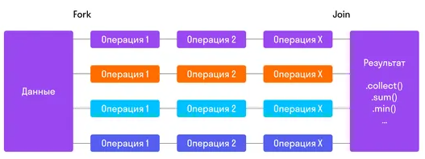
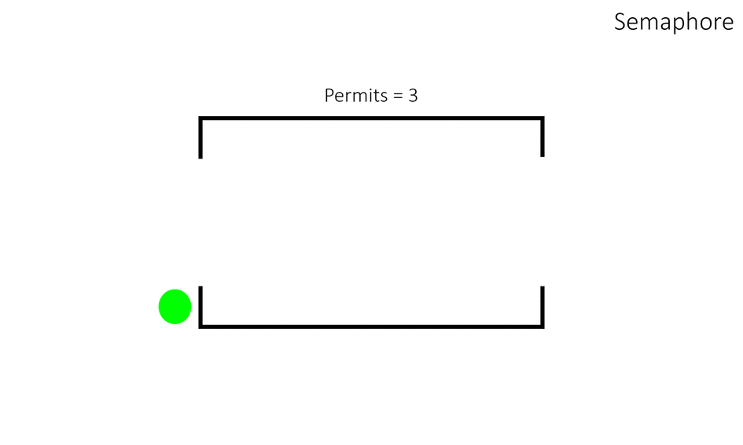
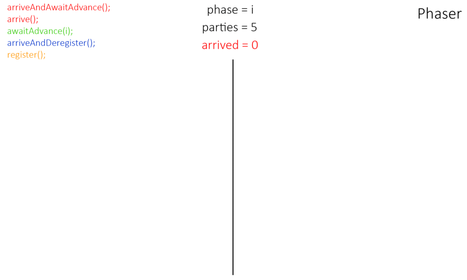
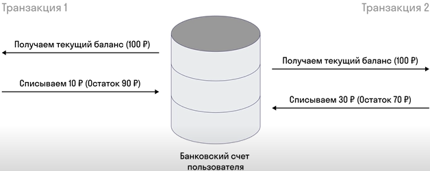
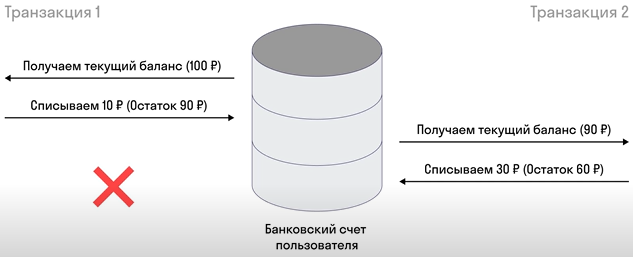
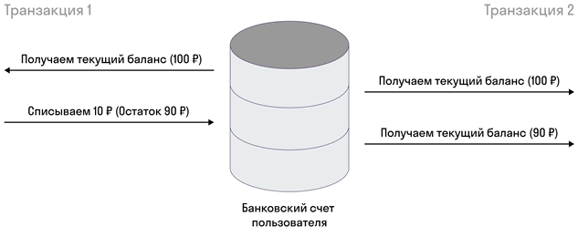
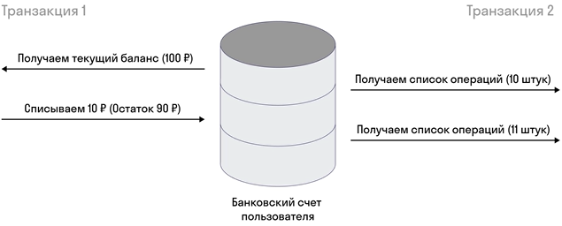

# 2 Java Core

> [[_оглавление_]](../README.md/#2-java-core)

## 2.1 Память в Java

> [[_оглавление_]](../README.md/#21-память-в-java)

Все данные <u>_вне зависимости от используемого языка программирования_</u> хранятся в виде структур данных.  
[**Структура данных**](/conspect/definitions.md/#с) - это программная единица, позволяющая хранить и обрабатывать
множество однотипных и/или логически связанных данных в вычислительной технике.  
Структур данных существует огромное множество. Самыми популярными из них являются:

- связный список;
- ассоциативный массив;
- стек;
- очередь.

> Более подробное рассмотрение [структур данных](/conspect/2.md/#272-структура-данных) смотреть в
> разделе [[2.7 Алгоритмы]](/conspect/2.md/#27-алгоритмы).

[**Связный список**](/conspect/definitions.md/#с) - это базовая динамическая структура данных в информатике, состоящая
из узлов, каждый из которых содержит как собственно данные, так и одну или две ссылки («связки») на следующий и/или
предыдущий узел списка.  
В Java структура данных связный список реализован в классе `Linkedlist`.

[**Ассоциативный массив**](/conspect/definitions.md/#а) - это абстрактный тип данных (интерфейс к хранилищу данных),
позволяющий хранить пары вида «(ключ, значение)» и поддерживающий операции добавления пары, а также поиска и удаления
пары по ключу.  
В Java структура данных ассоциативный массив реализован в классе `Map`.

[**Стек (Stack)**](/conspect/definitions.md/#с) - это структура данных, представляющая из себя упорядоченный набор
элементов, в которой добавление новых элементов и удаление существующих производится с одного конца, называемого *
*вершиной стека**.  
В стеке реализован принцип _LIFO_.  
[**LIFO (last-in, first-out)**](/conspect/definitions.md/#l) - это принцип, при котором первым удаляется элемент,
который был помещен туда последним («последним вошел — первым вышел»).


В Java структура данных ассоциативный массив реализован в классе `java.util.Stack`.

[**Очередь (Queue)**](/conspect/definitions.md/#q) - это структура данных, представляющая из себя упорядоченный набор
элементов, в которой добавление новых элементов производится в конец, называемый **хвостом очереди**, а удаление
существующих производится с другого конца, называемого **головой очереди**.  
В очереди реализован принцип _FIFO_.  
[**FIFO (first-in, first-out)**](/conspect/definitions.md/#f) - это принцип, при котором первым удаляется элемент,
который был помещен туда первым («первым вошел — первым вышел»).


В Java структура данных очередь представлена не классом, а интерфейсом - `Queue`.  
Но вместе с тем, очередь в Java - это интерфейс, у которого есть очень много реализаций. Самым распространённым из
используемых субинтерфейсов, реализующих интерфейс `Queue`, является интерфейс `Deque` (двусторонняя очередь).  
Двусторонняя очередь `Deque` расширяет функционал обычной очереди, позволяя добавлять элементы на оба края (в начало и
конец очереди) и забирать элементы с обоих краев очереди.


Структуры данных в Java, как и в других объектно-ориентированных языках, хранят примитивы и объекты.  
[Примитивы](/conspect/1.md/#112-типизация-переменных) содержат в себе одно значение и не более, за счёт этого они имеют
заранее известный фиксированный размер, интервал допустимых значений и работать с ними быстро и легко.  
[Объекты](/conspect/1.md/#191-объекты) могут хранить в себе как какие-то данные (в виде полей), так и методы по работе с
ними. Java не может заранее знать размер объекта, ведь объекты созданных типов могут создаваться и во время исполнения
программы. Потому была придумана система ссылок.

> Ссылка на объект всегда весит 64 бита (для 64-битных систем, которых сейчас абсолютное большинство).

Каждая ссылка ведёт на область в памяти, где лежит объект.

То есть, переменные примитивных типов хранят в себе само значение, а переменные ссылочных типов хранят в себе ссылку на
область памяти, в которой хранится значение объекта.

> Всё в Java передается по значению.  
> В том числе значения переменных в методы. При попадании в метод сущность копирует то, что хранится в ней, свое
> значение. А для объектов значение переменной - это ссылка на объект.

Все объекты имеют значение по умолчанию `null`, которое представляет собой пустоту.  
Примитивы не могут иметь значение `null`, только объекты.  
`null` не является реализацией объекта, потому любая попытка запросить у пустой переменной (`null`) какие-то данные или
вызвать ее методы приведет к выбросу ошибки (_NullPointerException_ или _NPE_).

### 2.1.1 Стек (Stack)

> [[_оглавление_]](../README.md/#21-память-в-java)

[**Стек (Stack)**](/conspect/definitions.md/#s) - это массив, который состоит из ячеек, имеет определенный размер (
количество ячеек) и предоставляет быстрый доступ к своим элементам, так как структурирован и обращение к актуальной
ячейке происходит за константное время.
Этот массив хранит сущности, которые называются _Frame_. Каждый раз, когда вызывается новый метод, в стеке создается
новый фрейм. Как только метод заканчивает выполнение, фрейм удаляется из стека.  
Следовательно, первым фреймом в стеке создается фрейм метода `main`, а затем, когда метод `main` вызывает какой-то
метод, в стеке создается фрейм этого метода и существует до тех пор, пока Java не закончит выполнять код внутри этого
метода.

Примитивы, так как они хранит в себе значение, помещаются во фрейм полностью.  
В случае с объектами во фрейм помещаются только ссылки на объекты, а сами объекты хранятся в куче (_Heap_).

В тот момент, когда память стека заканчивается (количество элементов вышло за границы допустимых для Java-приложения),
приложение будет завершено ошибкой _StackOverflowError_.

> Так как Java позволяет нам писать многопоточные приложения, которые могут вызывать методы параллельно друг другу,
> каждый поток имеет свой собственный стек.  
> Так main-поток имеет в качестве первого фрейма метод `main()`.  
> Другие потоки в качестве первого фрейма имеют тот метод, который был первый выполнен. Обычно это метод `run()`.

### 2.1.2 Куча (Heap)

> [[_оглавление_]](../README.md/#21-память-в-java)

[**Куча (Heap)**](/conspect/definitions.md/#h) - это место в памяти, где хранятся объекты.  
Когда создаётся объект через ключевое слово `new`, в куче выделяется место для хранения этого самого объекта.

Куча, в отличие от стека, сама очищать себя не может, потому этим занимается специальная сопрограмма, которая называется
«сборщик мусора» (_garbage collector_), а сам процесс, как ни странно, называется «сборка мусора» (_garbage
collection_).  
Этот процесс анализирует объекты на актуальность и, если приходит к выводу, что объект больше не нужен, удаляет его.  
При переполнении кучи приложение выбрасывает ошибку _OutOfMemoryError_ и завершает работу.

Куча делится на несколько частей. Они созданы для оптимизации сборки мусора:

- два поколения:
    - старое (_Old Generation_);
    - новое (_New Generation_);
- метапространство (_Metaspace_).


Все объекты создаются в новом поколении, и в тот момент, когда эти объекты «переживают» несколько сборок мусора, они
переводятся в старое поколение.  
Метапространство (ранее до 8-й версии Java называлось _Permanent Generation_) хранит в себе метаинформацию о классах, на
основе которых создаются объекты в куче, и статические данные приложения.

### 2.1.3 Сборка мусора (Garbage Collection)

> [[_оглавление_]](../README.md/#21-память-в-java)

[**Сборщик мусора (Garbage Collection)**](/conspect/definitions.md/#g) - это инструмент, который находит все объекты в
коде, недоступные для программиста, и удаляет их.  
В программировании часто используются два подхода для реализации сборки мусора:

- подсчёт ссылок;
- трассировка.

Подсчет ссылок подразумевает, что на каждом объекте есть условный счетчик ссылок. Когда на объект создается новая
ссылка, счетчик увеличивается. Когда ссылка отрабатывает свою задачу и перестает быть актуальной, счетчик уменьшается.
При достижении нуля объект помечается мусором и удаляется.

Трассировка встречается чаще, и ее идея построена на том, что в определенный момент мы начинаем идти по коду и искать,
какие объекты еще являются достижимыми в коде дальше. То есть в какой-то момент времени в дальнейшем приложение
обратится к нашему объекту. Эти объекты остаются «жить».

Сборка мусора представляет собой процесс, когда Java анализирует кучу на предмет «мертвых» объектов и удаляет их.  
Именно трассировка и используется в Java. Хотя этот подход и является более сложным и ресурсоёмким, он обеспечивает
большую надежность.  
Процесс трассировки делится на два этапа:

- Mark (маркировка) - сборщик мусора отмечает недостижимые объекты в качестве мусора;
- Sweep (уборка) - объекты, отмеченные мусором на прошлой стадии, удаляются, освобождая место в куче.

В Java существует несколько реализаций сборщиков мусора.  
Какой из них запускать, выбирает разработчик с помощью специального флага при запуске приложения.

#### 2.1.3.1 Serial GC

> [[_оглавление_]](../README.md/#21-память-в-java)

Данный сборщик мусора является классической и самой простой реализацией. _Serial GC_ использует один поток и отлично
подходит для работы в приложениях на клиентской стороне (пользовательские ПК), где нет жестких требований к минимизации
остановок приложения и ресурсы ограничены.

#### 2.1.3.2 Parallel GC

> [[_оглавление_]](../README.md/#21-память-в-java)

Отличается от _Serial GC_ использованием нескольких потоков, но также останавливает приложение в ходе сборки мусора.  
Является выбором по умолчанию во многих JVM.

#### 2.1.3.3 CMS (Concurrent Mark Sweep) GC

> [[_оглавление_]](../README.md/#21-память-в-java)

Данная реализация делит ресурсы с приложением, замедляя его работу, но позволяет минимизировать остановки приложения во
время сборки мусора.  
В 9-й версии Java был помечен устаревшим и в 14-й полностью удален.

#### 2.1.3.4 G1 (Garbage First) GC

> [[_оглавление_]](../README.md/#21-память-в-java)

Данная реализация пришла на смену _CMS_. Отличия в том, что данный сборщик мусора делит кучу на равные части и маркирует
их на предмет общей «жизнеспособности». На фазе сборки мусора в первую очередь очищаются наиболее заполненные области,
освобождая максимальный объем памяти.

### 2.1.4 Жизненный цикл приложения

> [[_оглавление_]](../README.md/#21-память-в-java)

Первым делом происходит сборка проекта.  
В этот момент **IDEA** подтягивает все указанные вами зависимости, затем производит процесс компиляции вашего кода.  
На этом моменте компилятор Java производит анализ кода, оптимизирует его и транслирует из того кода на английском языке,
что вы пишете в файлах Java, в байт-код, который уже достаточно тяжело читать человеку, и сохраняет его в файлы формата
_class_.  
Если компилятор находит ошибку в коде (например, вы где-то пропустили), компиляция останавливается, и вы видите много
красного текста в вашей консоли.
Обычно там указывается текст ошибки и строка файла, где эта ошибка была найдена.
**IDEA** подсвечивает эту строку синим, делая ее ссылкой, по нажатию на которую можно перейти в то место, где была
ошибка.
В тот момент, когда все необходимые файлы формата _class_ сформированы, а формируются они в таком соотношении: 1
Java-файл преобразуется в 1 class-файл — **JVM** получает возможность запустить ваш код.

[**JVM (Java Virtual Machine)**](/conspect/definitions.md/#j) в упрощенном представлении является программой, которая
читает этот самый байт-код и транслирует его в машинные инструкции, которые уже понимает процессор.  
Именно за счет **JVM** у приложений на Java появилась одна из киллер фич, а именно: мультиплатформенность. Компилятор
может быть один, его задача — сформировать на основе Java-кода байт-код и записать его в class-файлы.  
Ответственность за запуск приложения ложится на JVM, которые уникальны для каждого типа систем (_Windows_, _Linux_,
_Android_, _iOS_, умный дом), ведь их архитектура отличается.  
Если вы хотите, чтобы ваш код выполнялся на абсолютно новой системе, вам необходимо написать реализацию **JVM** под эту
новую систему (будь это умная лампочка, кофеварка или холодильник), и Java-приложения будут запускаться на этой системе.

Если суммировать, то **JVM** отвечает за запуск вашего приложения. Она управляет памятью, управляет (просит операционную
систему) созданием потоков для многопоточных приложений, осуществляет сборку мусора и так далее.

Так как передавать сотни и сотни class-файлов было бы накладным и неудобным, их принято объединять в архивы в формате
_jar_, где в конфигурации прописан класс с методом `main`, который запускает приложение.  
Этот архив тоже запускается с помощью **JVM**.

## 2.2 Объектно-ориентированное программирование (ООП)

> [[_оглавление_]](../README.md/#22-объектно-ориентированное-программирование-ооп)

[**Объектно-ориентированный подход (ООП)**](/conspect/definitions.md/#о) - это построение приложений в виде множества
различных объектов (каждый из них является реализацией какого-либо класса), которые взаимодействуют друг с другом.
Причем любой объект может реализовывать не просто какой-то конкретный класс, а целую иерархию унаследованных друг от
друга классов, каждый из которых внес частичку себя в общее целое.  
У объектов могут быть свойства.  
[**Свойства объектов**](/conspect/definitions.md/#с) - это переменные, привязанные к объекту.

Принципы ООП:

- инкапсуляция;
- наследование;
- полиморфизм;
- абстракция.

### 2.2.1 Инкапсуляция

> [[_оглавление_]](../README.md/#22-объектно-ориентированное-программирование-ооп)

Инкапсуляция является одним из принципов ООП.  
[**Инкапсуляция**](/conspect/definitions.md/#и) — это принцип ООП, согласно которого мы не даем прямой доступ к
свойствам объекта, а получаем их значения через методы.

Для реализации принципа инкапсуляции существуют [модификаторы доступа](/conspect/1.md/#181-модификаторы-доступа).


Пользователь не должен иметь доступ к методам, которые ему не положено вызывать, или к полям, которые ему запрещено
читать или даже изменять. Пользователь должен работать только с тем, что ему нужно.

### 2.2.2 Наследование

> [[_оглавление_]](../README.md/#22-объектно-ориентированное-программирование-ооп)

[**Наследование**](/conspect/definitions.md/#н) - это принцип ООП, согласно которого можно создавать новый класс на
основе существующего. При этом класс-наследник заимствует все свойства и функциональность родительского класса.


Для реализации принципа наследования в Java используется ключевое слово `extends`.

> [**extends**](/conspect/definitions.md/#e) – это ключевое слово, которое применяется для обозначения того, что данный
> класс является наследником другого класса и расширяет свойства и функциональность класса-родителя.

Следует знать, что `private`-члены класса (поля и методы) не наследуются. Это значит, что ими будет управлять родитель,
но доступа к ним из наследника не будет.  
Если влезть в реализацию этого механизма, то Java неявно подкладывает объект класса-родителя в ваш объект и присваивает
его переменной `super` (по аналогии с `this`, которая ссылается на ваш текущий объект).  
А по переменной `super`, соответственно, можно вызвать конструктор родителя.

[**super**](/conspect/definitions.md/#s) - это переменная, которая всегда ссылается на конкретный объект родительского
класса.  
Ключевое слово `super` используется для того, чтобы явно показать, к какому конкретно конструктору родительского класса
мы обращаемся.  
При использовании ключевого слова `super` вызывается конструктор по умолчанию родительского класса.

Внутри конструктора `this` и `super` должны стоять выше всех других выражений, в самом начале, иначе компилятор выдаст
сообщение об ошибке. Из чего следует, что в одном конструкторе для поля _с одним и тем же именем_ не может быть
одновременно и `this`, и `super`.

Пример использования:

```java
public class Person {
    private String name;
    private String surname;
    private int age;

    public Person(String name, String surname, int age) {
        this.name = name;
        this.surname = surname;
        this.age = age;
    }

    public String getName() {
        return name;
    }

    public void setName(String name) {
        this.name = name;
    }

    public String getSurname() {
        return surname;
    }

    public void setSurname(String surname) {
        this.surname = surname;
    }

    public int getAge() {
        return age;
    }

    public void setAge(int age) {
        this.age = age;
    }

    @Override
    public boolean equals(Object o) {
        if (this == o) return true;
        if (o == null || getClass() != o.getClass()) return false;
        Person person = (Person) o;
        return age == person.age && Objects.equals(name, person.name) && Objects.equals(surname, person.surname);
    }

    @Override
    public int hashCode() {
        return Objects.hash(name, surname, age);
    }

    @Override
    public String toString() {
        return "Person[" +
                "name='" + name + '\'' +
                ", surname='" + surname + '\'' +
                ", age=" + age +
                ']';
    }
}
```

```java
public class Worker extends Person {
    private static int counter = 1;
    private final int id;
    private String position;

    public Worker(String name, String surname, int age, String position) {
        super(name, surname, age);
        this.position = position;
        this.id = counter++;
    }

    public int getId() {
        return id;
    }

    public String getPosition() {
        return position;
    }

    public void setPosition(String position) {
        this.position = position;
    }

    @Override
    public boolean equals(Object o) {
        if (this == o) return true;
        if (o == null || getClass() != o.getClass()) return false;
        if (!super.equals(o)) return false;
        Worker worker = (Worker) o;
        return id == worker.id && Objects.equals(position, worker.position);
    }

    @Override
    public int hashCode() {
        return Objects.hash(super.hashCode(), id, position);
    }

    @Override
    public String toString() {
        return "Worker[" +
                "id=" + id +
                ", person=" + super.toString() +
                ", position='" + position + '\'' +
                ']';
    }
}
```

```java
private static void inheritanceExample() {
    Person ivan = new Person("Ivan", "Ivanov", 21);
    Worker petr = new Worker("Petr", "Petrov", 22, "programmer");
    Worker fedor = new Worker("Fedor", "Fedorov", 23, "manager");
    Worker sidor = new Worker("Sidor", "Sidorov", 25, "manager");
    System.out.println(ivan);
    System.out.println(petr);
    System.out.println(fedor);
    System.out.println(sidor);
    sidor.setPosition("commercial director");
    System.out.println(sidor);
}
```

Если вдруг наследники должны иметь внутри себя логику по работе с содержимым полей родителя, то эти поля (или методы)
должны быть помечены модификаторами `default` (отсутствует модификатор, если родитель и наследник лежат в одном пакете)
или `protected`.

### 2.2.3 Полиморфизм

> [[_оглавление_]](../README.md/#22-объектно-ориентированное-программирование-ооп)

[**Полиморфизм**](/conspect/definitions.md/#п) - это принцип ООП, согласно которого можно работать со многими классами,
как с одним, при условии, что все эти классы имеют одного базового предка; способность предоставлять один и тот же
интерфейс для различных базовых форм (типов данных).  
Это означает, что классы, имеющие различную функциональность, совместно используют один и тот же интерфейс и могут быть
динамически вызваны передачей параметров по ссылке.  
Процесс, применяемый объектно-ориентированными языками программирования для реализации динамического полиморфизма,
называется [**динамическим связыванием**](/conspect/definitions.md/#д).


При использовании принципа полиморфизма необходимо учитывать следующее:

- любой прямой или косвенный наследник класса может быть использован в качестве экземпляра своего родителя;
- за набор полей и методов отвечает тип (класс) ссылки предка;
- за код, который выполняется при вызове этих методов (то, что после `=`), отвечает уже реализация (класс наследника);
- наследование должно быть только от одного класса.

> **_!!! Множественное наследование в Java запрещено !!!_**

### 2.2.4 Абстракция

> [[_оглавление_]](../README.md/#22-объектно-ориентированное-программирование-ооп)

[**Абстракция**](/conspect/definitions.md/#а) – это принцип ООП, согласно которому при проектировании классов и создании
объектов необходимо выделять только главные свойства сущности, и отбрасывать второстепенные; процесс сокрытия деталей
реализации от пользователя, предоставляя ему только функционал (интерфейс).  
Иными словами, пользователь будет владеть информацией о том, что объект делает, а не как он это делает.  
В Java абстракция достигается с использованием абстрактных классов и интерфейсов.

#### 2.2.4.1 Абстрактные классы

> [[_оглавление_]](../README.md/#22-объектно-ориентированное-программирование-ооп)

[**Абстрактный класс**](/conspect/definitions.md/#а) - это класс, который не может быть использован для создания
объектов.  
Вместо создания объектов абстрактный класс служит как базовый элемент для других классов.

Для создания абстрактного класса в Java используется ключевое слово `abstract`.

> [**abstract**](/conspect/definitions.md/#a) - это ключевое слово, которое применяется для создания абстрактных классов
> и методов.

Абстрактный класс может содержать и абстрактные и конкретные методы. Классы, которые наследуют от абстрактного класса,
должны реализовывать все его абстрактные методы. Если хоть один метод в классе объявлен абстрактным, весь класс должен
так же быть объявлен абстрактным. Тем не менее, в обратную сторону правило не обязано соблюдаться. Если класс объявлен
абстрактным, он может и не содержать абстрактные методы.

[**Абстрактный метод**](/conspect/definitions.md/#а) - это метод, который всего лишь определяет свои сигнатуры и не
обеспечивает реализацию.

Абстрактные классы рекомендуется применять в следующих случаях:

- необходимо поделиться кодом между несколькими тесно связанными классами;
- классы, которые расширяют абстрактный класс, имеют много общих методов или полей, или требуют других модификаторов
  доступа, кроме `public` (например, `protected` и `private`);
- необходимо объявить нестатические или не-final поля, что позволяет определять методы, которые могут получить доступ и
  изменить состояние объекта, которому они принадлежат.

#### 2.2.4.2 Интерфейсы

> [[_оглавление_]](../README.md/#22-объектно-ориентированное-программирование-ооп)

[**Интерфейс**](/conspect/definitions.md/#и) - это конструкция языка Java, в рамках которой принято описывать
абстрактные публичные (`abstract public`) методы и статические константы (`final static`).  
Интерфейсы создаются по аналогии с классами, но с помощью ключевого слова `interface`, а не `class`.

> [**interface**](/conspect/definitions.md/#i) - это ключевое слово, которое применяется для создания интерфейсов.

Свойства интерфейса:

- содержит только абстрактные методы (слово `abstract` писать не нужно);
- у интерфейсов все методы `public`;
- может наследоваться только от интерфейсов;
- в Java есть множественное наследование интерфейсов (родителей у интерфейса может быть много);
- класс может реализовывать несколько интерфейсов (и наследоваться только от одного класса);

> [**implements**](/conspect/definitions.md/#i) - это ключевое слово, которое применяется для обозначения того, что
> данный класс реализует какой-либо интерфейс.

- в интерфейсах нельзя объявлять переменные, кроме статических.

Начиная с Java 8, в интерфейсах можно создавать методы по умолчанию с использованием ключевого слова `default`.

> [**default**](/conspect/definitions.md/#d) - это ключевое слово, которое применяется для создания методов по
> умолчанию.

К примеру:

```java
public interface Swimmable {

    public default void swim() {
        System.out.println("Плыви!");
    }

    public void eat();

    public void run();
}
```

Во всех классах, имплементирующих интерфейс _Swimmable_, необходимо будет переопределять методы _eat()_ и _run()_, а для
метода _swim()_ этого делать будет не обязательно (но может быть), так как его реализация во всех классах будет
одинаковой.

Интерфейсы рекомендуется применять в следующих случаях:

- интерфейс будут реализовывать несвязанные классы;
- необходимо определить поведение конкретного типа данных, при этом не важно, кто его реализует;
- необходимо использовать множественное наследование.

##### 2.2.4.2.1 Анонимные классы

> [[_оглавление_]](../README.md/#22-объектно-ориентированное-программирование-ооп)

[**Анонимный класс**](/conspect/definitions.md/#а) - это специальный класс, который реализует методы интерфейса или
абстрактного класса в том месте, где создаётся.

Анонимный класс создаётся не в отдельном файле, а посредством ключевого слова `new` внутри другого класса или его
метода. После этого указывается название интерфейса, а в следующих далее фигурных скобках (`{ }`) реализуются методы,
определённые в интерфейсе, который этот класс реализует.

Например:

```java
public class PrintableTest {
    public static void main(String[] args) {
        Printable printable = new Printable() {
            @Override
            public void print() {
                Book book = new Book("War and Peace", "Leo Tolstoy");
                Magazine magazine = new Magazine("National Geographic", 250);
                System.out.println("Printing a book:");
                book.print();
                System.out.println("Printing a magazine:");
                magazine.print();
            }
        };
        printable.print();
    }
}
```

Анонимные классы, как правило, реализуют в месте создания какой-либо функциональный интерфейс.

##### 2.2.4.2.2 Функциональные интерфейсы

> [[_оглавление_]](../README.md/#22-объектно-ориентированное-программирование-ооп)

[**Функциональный интерфейс**](/conspect/definitions.md/#ф) - это интерфейс, который содержит только один абстрактный
метод (при этом число статических и дефолтных методов не ограничено).

Самые часто используемые функциональные интерфейсы:

- _Runnable_ - используется в многопоточном программировании и в тех местах, где нужно просто запустить код без
  аргументов и возврата значения;

```java
public interface Runnable {
    void run();
}
```

- _Predicate<T>_ - проверяет соблюдение какого-то условия: если оно соблюдается, то возвращается значение `true`;

```java
public interface Predicate<T> {
    boolean test(T t);
}
```

- _Function<T, R>_ - представляет функцию перехода от объекта типа `T` к объекту типа `R` в реализации метода `apply()`;

```java
public interface Function<T, R> {
    R apply(T t);
}
```

- _UnaryOperator<T>_ - частный случай функции, поэтому в методе `apply()` этот интерфейс принимает в качестве параметра
  объект типа `T`, выполняет над ним операции и возвращает результат операций в виде объекта типа `T`;

```java
public interface UnaryOperator<T> {
    T apply(T t);
}
```

- _BinaryOperator<T>_ - частный случай функции, поэтому в методе `apply()` этот интерфейс принимает в качестве параметра
  два объекта типа `T`, выполняет над ними бинарную операцию и возвращает ее результат в виде объекта типа `T`;

```java
public interface BinaryOperator<T> {
    T apply(T t1, T t2);
}
```

- _Consumer<T>_ - выполняет действие над объектом типа `T` и при этом ничего не возвращает;

```java
public interface Consumer<T> {
    void accept(T t);
}
```

- _Supplier<T>_ - не принимает никаких аргументов, но должен возвращать объект типа `T`.

```java
public interface Supplier<T> {
    T get();
}
```

#### 2.2.4.3 Различия между абстрактным классом и интерфейсом:

> [[_оглавление_]](../README.md/#22-объектно-ориентированное-программирование-ооп)

- интерфейс описывает только поведение (методы) объекта, а вот состояний (полей) у него нет (кроме
  `public static final`), в то время как у абстрактного класса они могут быть;
- абстрактный класс наследуется (`extends`), а интерфейс — реализуется (`implements`): можно наследовать только один
  класс, а реализовать интерфейсов — сколько угодно (интерфейс может наследовать (`extends`) другой
  интерфейс/интерфейсы);
- абстрактные классы используются, когда есть отношение _"is-a"_, то есть класс-наследник расширяет базовый абстрактный
  класс, а интерфейсы могут быть реализованы разными классами, вовсе не связанными друг с другом;
- методы и члены абстрактного класса могут быть обозначены любым модификатором доступа, в свою очередь все методы
  интерфейса обязаны быть открытыми (`public`);
- когда происходит наследование абстрактного класса, класс-наследник должен определить абстрактные методы, в то время
  как интерфейс может наследовать другой интерфейс и при этом не обязательно определять его методы;
- класс-наследник может расширять только один абстрактный класс, а интерфейс может расширять или класс может
  реализовывать множество других интерфейсов;
- класс-наследник может определять абстрактные методы с тем же или менее ограниченным модификатором доступа, при этом
  класс, реализующий интерфейс, должен определять методы с тем же уровнем видимости;
- интерфейс не содержит конструкторы, в том время, как они есть в абстрактном классе;
- переменные, объявленные в интерфейсе по умолчанию являются `final`, абстрактный класс может содержать переменные,
  которые не являются `final`;
- все участники интерфейса по умолчанию являются `public`, а участники абстрактного класса могут позволить себе
  быть `public`, `protected` и др.

## 2.3 MVC

> [[_оглавление_]](../README.md/#23-mvc)

[**MVC (Model-View-Controller)**](/conspect/definitions.md/#m) - это Модель-Представление-Контроллер; архитектурный
шаблон проектирования, который предполагает разделение данных приложения, пользовательского интерфейса и управляющей
логики на три отдельных компонента: Модель, Представление и Контроллер – таким образом, что модификация каждого
компонента может осуществляться независимо.


Этот шаблон делит web-приложение на три логические части:

- _Controller_ - сущность, которая получает запрос и обрабатывает его (контроллер обращается к определенным классам и
  запрашивает у них данные);
- _Model_ - модель данных, которую эти самые классы контроллеру предоставляют (обычно хранится в базе данных);
- _View_ — то, что видит пользователь (контроллер конвертирует данные из Model и возвращает их в виде web-страницы
  или `JSON`/`XML`).

## 2.4 Системы сборки

> [[_оглавление_]](../README.md/#24-системы-сборки)

[**Система сборки**](/conspect/definitions.md/#с) - это программное обеспечение, обеспечивающее автоматизацию сборки
проекта. Основное отличие от _IDE_ в том, что конфигурационный файл для системы сборки описывается в текстовом виде. Как
следствие, проект может быть начат быстрее, за счет того, что все типовые задачи заключаются в копировании уже готовых
сниппетов (фрагментов исходного текста или кода программы).

### 2.4.1 Maven

> [[_оглавление_]](../README.md/#24-системы-сборки)

[**Apache Maven**](/conspect/definitions.md/#m) - это фреймворк для автоматизации сборки проектов на основе описания их
структуры в файлах _POM_ (Project Object Model) в формате _XML_.


Конфигурирование _Maven_ производится в файле _pom.xml_.

Структура типового конфигурационного файла _pom.xml_ выглядит следующим образом:

```xml
<!-- 1 -->
<!-- Служебный фрагмент кода, в котором описывается кодировка XML документа и заголовок проекта, -->
<!-- а так же указывается версия используемой объектной модели для файла -->
<?xml version="1.0" encoding="UTF-8"?>
<project xmlns="http://maven.apache.org/POM/4.0.0" xmlns:xsi="http://www.w3.org/2001/XMLSchema-instance"
         xsi:schemaLocation="http://maven.apache.org/POM/4.0.0 https://maven.apache.org/xsd/maven-4.0.0.xsd">
    <modelVersion>4.0.0</modelVersion>
    <!-- 2 -->
    <!-- Фрагмент кода, который отвечает за подключение родительского pom.xml, где указаны версии всех -->
    <!-- библиотек, которые соответствуют текущей версии Spring Boot -->
    <parent>
        <groupId>org.springframework.boot</groupId>
        <artifactId>spring-boot-starter-parent</artifactId>
        <version>3.2.1</version>
        <relativePath/>
    </parent>
    <!-- 3 -->
    <!-- Фрагмент кода, который хранит в себе информацию о проекте: -->
    <!-- groupId - группа проекта (проекты одного автора имеют один и тот же groupId, например - com.companyname) -->
    <!-- artifactId - уникальное имя проекта внутри группы groupId -->
    <!-- version - текущая версия проекта -->
    <!-- name - человекочитаемое имя проекта (может отличаться от artifactId и может содержать пробелы) -->
    <!-- description - описание проекта для человека который будет читать данный pom.xml -->
    <groupId>pro.sky</groupId>
    <artifactId>counter-service</artifactId>
    <version>0.0.1-SNAPSHOT</version>
    <name>Counter Service</name>
    <description>Counter service that counts amount of requests to page</description>
    <!-- 4 -->
    <!-- Фрагмент кода, который хранит в себе значения таких переменных, как версии библиотек, версии Java. -->
    <!-- Блок </properties> является необязательным -->
    <properties>
        <java.version>17</java.version>
    </properties>
    <!-- 5 -->
    <!-- Блок кода, содержащий необходимые зависимости -->
    <dependencies>
        <dependency>
            <groupId>org.springframework.boot</groupId>
            <artifactId>spring-boot-starter-web</artifactId>
        </dependency>

        <dependency>
            <groupId>org.springframework.boot</groupId>
            <artifactId>spring-boot-starter-test</artifactId>
            <scope>test</scope> <!-- Скоуп для данной библиотеки -->
        </dependency>
    </dependencies>

    <!-- 6 -->
    <!-- Блок кода, содержащий плагины -->
    <!-- В данном случае указан плагин, который собирает финальный JAR архив с приложением -->
    <build>
        <plugins>
            <plugin>
                <groupId>org.springframework.boot</groupId>
                <artifactId>spring-boot-maven-plugin</artifactId>
            </plugin>
        </plugins>
    </build>

</project>
```

Особенности _Maven_:

- наличие чёткой структуры каталогов (которую автоматически создаёт _IDE_ при создании проекта):
    - в _src/main/java_ содержатся java-классы;
    - в _src/main/resources_ - ресурсы, которые использует приложение (HTML-страницы, картинки, таблицы стилей и тд);
    - в _src/test_ содержатся тесты;

> Также у каждого проекта может быть только один файл JAR-файл

- автоматическое управление зависимостями (скачивание, распаковка, подключение и контроль версий);
- стандартизированное название билдов (каждый имеет атрибуты _groupId_, _artifactId_ и _version_);
- наличие фаз жизненного цикла проекта:
    - _clean_ - удаляются все скомпилированные файлы из каталога _target_ (место, в котором сохраняются готовые
      артефакты);
    - _validate_ - идёт проверка, вся ли информация доступна для сборки проекта;
    - _compile_ - компилируются файлы с исходным кодом;
    - _test_ - запускаются тесты;
    - _package_ - упаковываются скомпилированные файлы (в jar-, war- и т.д. архив);
    - _verify_ - выполняются проверки для подтверждения готовности упакованного файла;
    - _install_ - пакет помещается в локальный репозиторий. (после чего он может использоваться другими проектами как
      внешняя библиотека);
    - _site_ - создается документация проекта;
    - _deploy_ - собранный архив копируется в удаленный репозиторий.

> Все фазы выполняются последовательно: нельзя запустить последующую без запуска предыдущей.

Запуск фаз возможен посредством _IDE_ или через терминал:

```text
mvn clean
```

> Фазу _clean_ желательно вызывать перед каждой новой сборкой проекта.

У каждой фазы есть цели (goal). Стандартные цели заложены по умолчанию, дополнительные добавляются Maven-плагинами.  
[Список официальных плагинов](https://maven.apache.org/plugins/) можно посмотреть на официальном сайте _Maven_.  
Чтобы добавить Maven-плагин в проект, его описание, аналогично зависимостям, нужно поместить в _pom.xml_ в
теги `<build>` и `<plugins>`.

### 2.4.2 Gradle

> [[_оглавление_]](../README.md/#24-системы-сборки)

[**Gradle**](/conspect/definitions.md/#g) - это система для автоматизации сборки приложений и сбора статистики об
использовании программных библиотек, применяющая языки **Android**, **Java**, **Kotlin**, **Groovy**, **Scala**,
**Javascript** и **C/C++**, а также решения из фреймворков _Apache Ant_ и _Apache Maven_.  
_Gradle_ основан на графе задач (_task_), которые предоставляются различными плагинами и могут зависеть друг от друга.
Задачи выполняют какую-то работу. _Maven_ же использует модель определённых фаз (_phase_), к которым присоединяются
определённые "цели" (_goals_). В этих _goals_ и выполняется какая-то работа.


Конфигурирование _Gradle_ производится в файле _build.gradle_.

Типы плагинов:

- _бинарные плагины_ - это скомпилированные плагины, обычно написанные на Java или Kotlin DSL и упакованные в файлы
  JAR (применяются к проекту с помощью блока `plugins {}`);
- _предварительно скомпилированные скриптовые плагины_ - это скрипты Groovy DSL или Kotlin DSL, скомпилированные и
  распространяемые как файлы классов Java, упакованные в библиотеку (применяются к проекту с помощью
  блока `plugins {}`);
- _скриптованные плагины_ - это скрипты Groovy DSL или Kotlin DSL, которые применяются непосредственно к скрипту сборки
  Gradle с использованием синтаксиса `apply from:` (применяются в строке внутри скрипта сборки для добавления
  функциональности или настройки процесса сборки).

Чтобы использовать логику сборки, инкапсулированную в плагин, _Gradle_ необходимо выполнить два шага: разрешить плагин,
а затем применить его к цели (обычно к _Project_).


Первое отличие _Gradle_ от _Maven_ заключается в наличии _Gradle Wrapper_ (или просто _Wrapper_), специального скрипта
(а также несколько дополнительных файлов), который вызывает объявленную версию _Gradle_, при необходимости загружая ее
заранее. Конфигурирование _Wrapper_ производится в файле _gradle/wrapper/gradle-wrapper.properties_.  
Стартер _Gradle_ при условии наличия нескольких модулей в проекте можно отредактировать в файле _settings.gradle_.

Структура типового конфигурационного файла _build.gradle_ выглядит следующим образом:

```groovy
// Блок, содержащий используемые плагины
plugins {
    // Основные плагины, для которого достаточно указать только id
    id 'java'
    // Бинарные плагины, для которых обязательно необходимо указывать версию
    id 'org.springframework.boot' version '3.4.0-SNAPSHOT'
    id 'io.spring.dependency-management' version '1.1.6'
}

// Блок, содержащий текущие группу и версию
group = 'com.example'
version = '0.0.1-SNAPSHOT'

// Блок конфигурации плагина java
java {
    toolchain {
        languageVersion = JavaLanguageVersion.of(17)
    }
}

// Блок конфигураций данного проекта
configurations {
    compileOnly {
        extendsFrom annotationProcessor
    }
}

// Блок репозиториев, содержащих необходимые зависимости
repositories {
    // Репозиторий по умолчанию Maven
    mavenCentral()
    maven { url 'https://repo.spring.io/milestone' }
    maven { url 'https://repo.spring.io/snapshot' }
}

// Блок зависимостей
// implementation - зависимости, необходимые на этапе компиляции проекта и во время его выполнения
// compileOnly - зависимости, необходимые только на этапе компиляции проекта
// compileClasspath - содержит путь к зависимостям, необходимым для компиляции проекта
// annotationProcessor - зависимости, которые являются процессорами аннотаций (используются во время компиляции для обработки аннотаций)
// runtimeOnly - зависимости, которые необходимы только на этапе выполнения
// runtimeClasspath - содержит путь к зависимостям, необходимым для выполнения проекта
// testImplementation - зависимости, необходимые на этапе компиляции тестового кода и во время его выполнения
// testCompileOnly - зависимости, необходимые только на этапе компиляции тестового кода
// testRuntimeOnly - зависимости, которые необходимы только на этапе выполнения тестового кода
// testCompileClasspath - содержит путь к зависимостям, необходимым для компиляции тестового кода
// testRuntimeClasspath - содержит путь к зависимостям, необходимым для выполнения тестового кода
dependencies {
    implementation 'org.springframework.boot:spring-boot-starter-data-jpa'
    implementation 'org.springframework.boot:spring-boot-starter-security'
    implementation 'org.springframework.boot:spring-boot-starter-web'
    implementation 'org.liquibase:liquibase-core'
    compileOnly 'org.projectlombok:lombok'
    developmentOnly 'org.springframework.boot:spring-boot-devtools'
    developmentOnly 'org.springframework.boot:spring-boot-docker-compose'
    annotationProcessor 'org.projectlombok:lombok'
    testImplementation 'org.springframework.boot:spring-boot-starter-test'
    testImplementation 'org.springframework.security:spring-security-test'
    testRuntimeOnly 'org.junit.platform:junit-platform-launcher'
}

// Задача (task) по запуску всех тестов
tasks.named('test') {
    useJUnitPlatform()
}

```

Полный перечень возможных [настроек проекта](https://docs.gradle.org/current/dsl/org.gradle.api.Project.html),
указываемых в _build.gradle_ можно найти на официальном сайте _Gradle_.

Настройка свойств _Gradle_ производится в файле _gradle.properties_ (зарезервированное
имя). [Перечень возможных настроек](https://docs.gradle.org/current/userguide/build_environment.html) можно найти на
официальном сайте _Gradle_.

_Gradle_ обладает теми же особенностями, коими обладает _Maven_, однако имеет ряд других особенностей:

- DSL (Domain Specific Language) конфига _Groovy_ (_Kotlin_), который менее громоздкий чем XML-конфиг _Maven_;
- менее громоздкая система плагинов;
- большая гибкость и расширяемость (возможность писать настройки для отдельных модулей приложения).

### 2.4.3 Библиотеки

> [[_оглавление_]](../README.md/#24-системы-сборки)

[**Библиотека**](/conspect/definitions.md/#б) - это архив скомпилированных классов, которые добавляются в проект и
позволяют взаимодействовать с ними стандартным способом через создание объектов и вызовов их методов.

Этот архив классов при сборке приложения укладывается «рядом» с написанными классами, образуя уже запускаемый JAR-архив,
который JVM имеет возможность выполнить.  
Обычно за добавление библиотек отвечают системы сборки (_Maven_/_Gradle_).

Библиотеки хранятся на удалённых репозиториях. Самым популярным является [_Maven
Central_](https://central.sonatype.com/?smo=true), который указан репозиторием по умолчанию для всех систем сборки.  
В pom.xml этот репозиторий указан неявно, если отсутствует блок `<repositories>`. В _build.gradle_ же этот блок
присутствует всегда и в него по умолчанию _IDEA_ добавляет тот самый `mavenCentral()`.  
Существуют и другие репозитории: _JCenter_, _Bintray_, официальные библиотеки _Android_ Google и др.

> Часто используемые библиотеки:
> - _commons-lang3_ - содержит класс _StringUtils_, помогающий работать со строками;
> - _Jackson_ - помогает парсить объекты в JSON.

> [[Ссылка]](https://mvnrepository.com/) на поиск библиотек _Maven_.

## 2.5 Исключения

> [[_оглавление_]](../README.md/#25-исключения)

[**Исключения (Exceptions)**](/conspect/definitions.md/#и) - это механизм, который позволяет программе обрабатывать
нетипичную ситуацию и при этом не прекращать работу.

### 2.5.1 Иерархия исключений

> [[_оглавление_]](../README.md/#25-исключения)


Исключения имеют общего предка - класс _Throwable_. Его потомками являются подклассы _Exception_ и _Error_.  
_Исключения (Exceptions)_ являются результатом проблем в программе, которые в принципе решаемы и предсказуемы.  
_Ошибки (Errors)_ представляют собой более серьёзные проблемы, которые, согласно спецификации Java, не следует пытаться
обрабатывать в собственной программе, поскольку они связаны с проблемами уровня JVM.

Все исключения подразделяются на _проверяемые_ и _непроверяемые_.  
К непроверяемым исключениям относятся все ошибки (класс _Error_ и его потомки) и все исключения времени выполнения
(класс _RuntimeException_ и его потомки), к проверяемым - все остальные.

В коде можно создавать и выбрасывать свои исключения.

Синтаксис выброса исключений выглядит следующим образом:

```java
throw new RuntimeException();
```

> [**throw**](/conspect/definitions.md/#t) – это ключевое слово, которое применяется для выбрасывания исключений в коде.

При возникновении исключения в Java-коде модуль _Spring Web_ возвращает пользователю соответствующий HTTP-статус.

> [**Ссылка**](https://en.wikipedia.org/wiki/List_of_HTTP_status_codes) на список возможных HTTP-статусов.

Чтобы сообщить _Spring_, какой именно статус необходимо возвращать пользователю, используют аннотацию `@ResponseStatus`.

### 2.5.2 Обработка исключений

> [[_оглавление_]](../README.md/#25-исключения)

Когда проверяемое исключение не обрабатывается внутри того метода, где это исключение кидается, необходимо использовать
ключевое слово `throws` и указывать тип выбрасываемого проверяемого исключения.

Например:

```java
public static void check(File file) throws FileNotFoundException {
    if (!file.exists()) {
        throw new FileNotFoundException();
    }
    if (file.isDirectory()) {
        throw new IllegalArgumentException(file.getPath() + " is a directory");
    }
}
```

> [**throws**](/conspect/definitions.md/#t) – это ключевое слово, которое используется в объявлении метода для указания,
> что метод может выбрасывать проверяемые исключения.  
> При использовании ключевого слова `throws` проверка выбрасываемого исключения делегируется тому методу, который
> вызывает данный.

Обработка исключений в Java построена на конструкции _try-catch-finally_.


> [**try**](/conspect/definitions.md/#t) – это ключевое слово, определяющее блок кода, в котором может произойти
> исключение.

> [**catch**](/conspect/definitions.md/#c) – это ключевое слово, определяющее блок кода, в котором происходит обработка
> исключения.

> [**finally**](/conspect/definitions.md/#f) – это ключевое слово, определяющее блок кода, который является
> необязательным, но при его наличии выполняется в любом случае независимо от результатов выполнения блока `try`.  
> Блок `finally` иерархически выше блока `try`. Это означает, что если оба блока будут содержать оператор `return`, то
> выполнится тот, который содержится в блоке `finally`.

Конструкция _try-catch-finally_ выглядит следующим образом:

```java
try([создание_какого-либо_ресурса])
        {
        // код, в котором может возникнуть исключение
        }
        catch([тип_ошибки][имя_переменной])
        {
        // действия по обработке исключения
        }
        finally
        {
        // код, выполняемый в любом случае
        }
```

Блоки `catch` могут объединяться в цепочки, а также отвечать за обработку нескольких типов исключений. В последнем
случае типы обрабатываемых исключений указываются через вертикальную черту (`|`).

Например:

```java
private static void tryCatchFinallyExample() {
    try {
        File file = new File("pictures/16.png");
        System.out.println(Files.size(file.toPath()));
    } catch (NoSuchElementException e) {
        System.out.println("File not found!");
    } catch (IOException | ClassCastException e) {
        System.out.println("Internal error!");
    } finally {
        System.out.println("The end");
    }
}
```

> [[_Примеры использования_]](/conspect/example_1.md/#пример-1)

Блоки `catch` анализируются по очереди. И если указать родительское исключение раньше, чем его наследника, то будет
вызван код из первого совпавшего блока, а не из более узкоспециализированного, но написанного после.

Блок `try` также применяется в многопоточных приложениях для того, чтобы гарантированно закрывать открываемые в процессе
выполнения потоки. Такая конструкция с использованием блока `try` называется _try-with-resources_.

### 2.5.3 Написание своих исключений

> [[_оглавление_]](../README.md/#25-исключения)

Исключение представляет собой обычный класс, не имеющий собственных методов, наследующийся от _Exception_ или от
_RuntimeException_ и вызывающий соответствующий конструктор родителя.

Например:

```java
import java.io.IOException;

@ResponseStatus(HttpStatus.BAD_REQUEST)
public class FileIsDirectoryException extends IOException {
    public FileIsDirectoryException() {
        super();
    }

    public FileIsDirectoryException(String message) {
        super(message);
    }

    public FileIsDirectoryException(String message, Throwable t) {
        super(message, t);
    }

    public FileIsDirectoryException(Throwable t) {
        super(t);
    }
}
```

После создания свои исключения могут использоваться точно также как и библиотечные исключения Java с использованием
ключевого слова `throw`.

## 2.6 Java Collections Framework

> [[_оглавление_]](../README.md/#26-java-collections-framework)

[**Коллекция (Collection)**](/conspect/definitions.md/#к) - это объект, который хранит в себе набор других однотипных
объектов, а также позволяет получить к ним доступ с помощью своих методов.


Все коллекции наследуются от интерфейса _Iterable_, позволяющего проходить по всем значениям коллекций, которые
используют этот интерфейс (итерироваться).  
Интерфейс _Iterable_ наследует интерфейс _Collection_, который в свою очередь наследуют уже более узкие структуры:
списки (_List_), множества (_Set_) и очереди (_Queue_).

Особняком стоит интерфейс _Map_. [**Map**](/conspect/definitions.md/#m) - это структура хранения данных в формате
«ключ-значение».

Отличия коллекций от массивов:

- коллекции могут хранить свои данные в массиве (_ArrayList_) или связывать объекты друг с другом, создавая определенный
  порядок (_LinkedList_), а могут и наоборот - не иметь порядка внутри и напоминать что-то вроде «кучи» или «мешанины»
  из объектов (_HashSet_);
- коллекции сами следят за количеством заполненных ячеек или связанных объектов и сами расширяются;
- коллекции имеют свои методы, которые можно использовать, переопределять и наследовать.

Так как коллекции являются полноценными объектами, в них переопределен метод `toString()`.  
Итерироваться по коллекциям можно с помощью [циклов](/conspect/1.md/#13-циклы).

За тип данных, которые находятся в коллекции, отвечает механизм дженериков.

### 2.6.1 Класс Collections

> [[_оглавление_]](../README.md/#26-java-collections-framework)

Класс _Collections_ представляет собой аналог класса _Arrays_ в отношении массивов. В нём собраны различные статические
методы, позволяющие выполнять шаблонные операции над коллекциями.

#### 2.6.1.1 fill()

> [[_оглавление_]](../README.md/#26-java-collections-framework)

Метод `fill()` класса `Collections` заполняет коллекцию одинаковыми значениями.  
Синтаксис метода выглядит следующим образом:

```java 
Collections.fill([имя_коллекции], [значение]);
```

Первым параметром передаётся имя коллекции, а вторым – значение, которым её надо заполнить.  
Данный метод заполнит коллекцию значениями по размеру коллекции.

#### 2.6.1.2 max()

> [[_оглавление_]](../README.md/#26-java-collections-framework)

Метод `max()` класса `Collections` применяется для нахождения максимального значения в коллекции.  
Синтаксис метода выглядит следующим образом:

```java 
Collections.max([имя_коллекции]);
```

Данный метод возвращает из коллекции максимальное значение из тех, которые она содержит, того типа, которым коллекция
проинициализирована.

#### 2.6.1.3 min()

> [[_оглавление_]](../README.md/#26-java-collections-framework)

Метод `min()` класса `Collections` применяется для нахождения минимального значения в коллекции.  
Синтаксис метода выглядит следующим образом:

```java 
Collections.min([имя_коллекции]);
```

Данный метод возвращает из коллекции минимальное значение из тех, которые она содержит, того типа, которым коллекция
проинициализирована.

#### 2.6.1.4 copy()

> [[_оглавление_]](../README.md/#26-java-collections-framework)

Метод `copy()` класса `Collections` применяется для копирования значений из одной коллекции в другую.  
Синтаксис метода выглядит следующим образом:

```java 
Collections.copy([имя_коллекции-источника], [имя_коллекции-назначения]);
```

Данный метод копирует содержимое одной коллекции в другую.

#### 2.6.1.5 binarySearch()

> [[_оглавление_]](../README.md/#26-java-collections-framework)

Метод `binarySearch()` класса `Collections` применяется для [бинарного поиска](/conspect/2.md/#2735-бинарный-поиск)
элемента по значению.  
Синтаксис метода выглядит следующим образом:

```java 
Collections.binarySearch([имя_коллекции], [искомое_значение]);
```

Данный метод возвращает индекс искомого элемента.

### 2.6.2 Дженерики (Параметрический полиморфизм)

> [[_оглавление_]](../README.md/#26-java-collections-framework)

[**Дженерики (Обобщения)**](/conspect/definitions.md/#д) - это функциональность Java, позволяющая создавать
универсальный код, который может быть использован для разных типов данных, и уточнять этот тип тогда, когда нужно.  
Дженерики используются для создания обобщенных классов, интерфейсов и методов, которые могут работать с различными
типами данных.  
Параметризованные типы проясняют, с каким типом данных будет работать класс или метод.

Чтобы объявить дженерик, нужно создать параметризованный класс, для чего обобщённый тип необходимо поместить в
diamond-скобки (`< >`).

[**Параметризованный класс**](/conspect/definitions.md/#п) - это класс, который может быть создан с помощью параметра
типа. Вместо конкретного типа данных параметризованный класс использует обобщенный тип, который определяется во время
создания экземпляра класса.

> В качестве параметра в дженериках нельзя указывать примитивы. Это ограничение обусловлено тем, что разработчиками
> языка Java в дженериках не были реализованы автоупаковка и автораспаковка (боксинг и анбоксинг).

Параметризованные классы используются для упрощения кода в ситуациях, когда методы класса могут применяться для работы с
переменными различных типов.

Пример использования - создание класса-хранилища для значений разных типов:

- модель:

```java
package javaCore.models;

import java.util.Objects;

public class VariableContainer<T extends Object> {
    private T value;

    public VariableContainer(T value) {
        this.value = value;
    }

    public T getValue() {
        return value;
    }

    public void setValue(T value) {
        this.value = value;
    }

    @Override
    public boolean equals(Object o) {
        if (this == o) return true;
        if (o == null || getClass() != o.getClass()) return false;
        VariableContainer<?> that = (VariableContainer<?>) o;
        return Objects.equals(value, that.value);
    }

    @Override
    public int hashCode() {
        return Objects.hashCode(value);
    }

    @Override
    public String toString() {
        return "VariableContainer{" +
                "value=" + value +
                '}';
    }
}
```

- применение:

```java
private static void genericExample() {
    List<VariableContainer> values = new ArrayList<>();
    VariableContainer<Byte> var1 = new VariableContainer((byte) 1);
    VariableContainer<Short> var2 = new VariableContainer((short) 1_000);
    VariableContainer<Integer> var3 = new VariableContainer(1_000_000);
    VariableContainer<Long> var4 = new VariableContainer(1_000_000_000_000L);
    VariableContainer<Float> var5 = new VariableContainer(2_000_000.0f);
    VariableContainer<Double> var6 = new VariableContainer(2_000_000_000_000.0);
    VariableContainer<Character> var7 = new VariableContainer('A');
    VariableContainer<Boolean> var8 = new VariableContainer(true);
    VariableContainer<String> var9 = new VariableContainer("String");
    values.add(var1);
    values.add(var2);
    values.add(var3);
    values.add(var4);
    values.add(var5);
    values.add(var6);
    values.add(var7);
    values.add(var8);
    values.add(var9);
    for (int i = 0; i < values.size(); i++) {
        switch (values.get(i).getValue().getClass().getSimpleName()) {
            case ("Byte"):
                System.out.println("Byte value is " + values.get(i).getValue());
                break;
            case ("Short"):
                System.out.println("Short value is " + values.get(i).getValue());
                break;
            case ("Integer"):
                System.out.println("Integer value is " + values.get(i).getValue());
                break;
            case ("Long"):
                System.out.println("Long value is " + values.get(i).getValue());
                break;
            case ("Float"):
                System.out.println("Float value is " + values.get(i).getValue());
                break;
            case ("Double"):
                System.out.println("Double value is " + values.get(i).getValue());
                break;
            case ("Character"):
                System.out.println("Character value is " + values.get(i).getValue());
                break;
            case ("Boolean"):
                System.out.println("Boolean value is " + values.get(i).getValue());
                break;
            case ("String"):
                System.out.println("String value is " + values.get(i).getValue());
                break;
            default:
                System.out.println("Unknown value type " + values.get(i).getValue().getClass());
        }
    }
}
```

В Java можно создавать **ограниченные типы (bounded type)**, которые нужны, чтобы предотвратить ошибки времени
выполнения, связанные с использованием неправильных типов. Ограниченные типы позволяют указать, какие типы могут быть
использованы в качестве параметров для обобщенных классов или методов, а какие - нет.  
Параметр типа можно ограничить классом-предком. В этом случае нужно использовать ключевое слово `extends`.

Например:

```java
class NullBox<Т extends Number>
// В данном случае класс Printer сможет использовать только классы,
// наследующиеся от PrintedMaterial или сам класс PrintedMaterial.
```

Можно также комбинировать типы ограничений. В этом случае ограничители нужно перечислять через
разделитель-амперсанд (`&`).

> В ограничителях нужно указать тип класса, а после него - интерфейсы.

Например:

```java
class Printer<T extends Number & Serializable> {
// Можно использовать в качестве параметра типа класс PrintedMaterial
// или его наследников, а также объекты, реализующие интерфейс Printable.
}
```

### 2.6.3 Список (List)

> [[_оглавление_]](../README.md/#26-java-collections-framework)

[**Список (List)**](/conspect/definitions.md/#l) - это последовательность элементов в определенном порядке.  
Его реализует интерфейс `List` пакета `java.util`.

Особенности списков:

- могут иметь повторяющиеся элементы;
- могут содержать элементы `null`;
- в списке могут быть элементы разных дочерних типов или элементы, реализующие один интерфейс;
- всегда сохраняют порядок вставки и предоставляют доступ к элементам по индексу;
- к элементам списка можно получить доступ, используя индексы, начиная с `0`.

Интерфейс `List` реализуют классы `ArrayList`, `LinkedList`, `Vector` и `Stack` (который наследуется от `Vector`).

#### 2.6.3.1 ArrayList

> [[_оглавление_]](../README.md/#26-java-collections-framework)

[**ArrayList**](/conspect/definitions.md/#a) - это список, аналогичный массиву.

При создании объекта `ArrayList` создается массив. По умолчанию размер такого списка равен 10 и он заполнен
элементами `0`, `0.0`, `false` или `null`.  
Каждый раз, когда свободные ячейки заканчиваются, коллекция создает новый массив длиной чуть больше предыдущего.

На длину нового массива действует два фактора:

- количество минимально необходимых ячеек;
- фактор роста (обычно увеличение должно происходить не меньше чем в полтора раза).

Элементы из старого массива копируются в новый массив в том же порядке.

##### 2.6.3.1.1 add()

> [[_оглавление_]](../README.md/#26-java-collections-framework)

Метод `add()` класса `ArrayList` применяется для добавления значений в список.  
Синтаксис метода выглядит следующим образом:

`list.add([значение]);`
`list.add([индекс_ячейки], [значение]);`

Данный метод по умолчанию добавляет значение в конец списка, а при указании индекса - в ячейку с указанным индексом (при
этом все другие значения в списке сдвигаются на единицу).

Например:

```java
private static void listExample() {
    List<Integer> arrayList = new ArrayList<>(List.of(1, 2, 3, 4, 5, 6, 7, 8, 9, 10));
    arrayList.add(11);
    System.out.println(arrayList);
    arrayList.add(5, 0);
    System.out.println(arrayList);
}
```

##### 2.6.3.1.2 get()

> [[_оглавление_]](../README.md/#26-java-collections-framework)

Метод `get()` класса `ArrayList` применяется для получения значения с указанным индексом из списка.  
Синтаксис метода выглядит следующим образом:

`[тип_значения] variable = list.get([индекс_значения]);`

Данный метод возвращает значение, содержащееся в списке по указанному индексу, само значение из списка при этом не
удаляется.  
В случае, если значение по указанному индексу в списке не найдено, будет выброшена ошибка _IndexOutOfBoundsException_.

##### 2.6.3.1.3 set()

> [[_оглавление_]](../README.md/#26-java-collections-framework)

Метод `set()` класса `ArrayList` применяется для изменения значения по указанному индексу в списке.  
Синтаксис метода выглядит следующим образом:

`list.set([индекс_значения], [новое_значение]);`

Данный метод перезаписывает значение в ячейке по указанному индексу.  
В случае, если значение по указанному индексу в списке не найдено, будет выброшена ошибка _IndexOutOfBoundsException_.

##### 2.6.3.1.4 size()

> [[_оглавление_]](../README.md/#26-java-collections-framework)

Метод `size()` класса `ArrayList` применяется для получения значения длины списка.  
Синтаксис метода выглядит следующим образом:

```java
int size = list.size();
```

Данный метод возвращает значение длины списка типа `int`.

##### 2.6.3.1.5 contains()

> [[_оглавление_]](../README.md/#26-java-collections-framework)

Метод `contains()` класса `ArrayList` применяется для определения наличия указанного значения.  
Синтаксис метода выглядит следующим образом:

```java
boolean b = list.contains([значение]);
```

Данный метод возвращает `true`, если значение найдено, и `false` - если нет.

##### 2.6.3.1.6 remove()

> [[_оглавление_]](../README.md/#26-java-collections-framework)

Метод `remove()` класса `ArrayList` применяется для удаления из списка значения с указанным индексом (по умолчанию) или
равного указанному.  
Синтаксис метода выглядит следующим образом:

```java
list.remove([индекс_элемента]);
```

Данный метод удаляет из списка значение с указанным индексом или равное указанному (при этом все другие значения в
списке сдвигаются на единицу).  
В случае, если значение по указанному индексу в списке не найдено, будет выброшена ошибка _IndexOutOfBoundsException_.

##### 2.6.3.1.7 clear()

> [[_оглавление_]](../README.md/#26-java-collections-framework)

Метод `clear()` класса `ArrayList` применяется для удаления из списка всех значений.  
Синтаксис метода выглядит следующим образом:

```java
list.clear();
```

Данный метод удаляет из списка все значения (в результате размер списка становится равным нулю).

##### 2.6.3.1.8 addAll()

> [[_оглавление_]](../README.md/#26-java-collections-framework)

Метод `addAll()` класса `ArrayList` применяется для добавления всех значений из коллекции в текущий список.  
Синтаксис метода выглядит следующим образом:

```java
boolean b = list.addAll([копируемая_коллекция]);
```

Данный метод добавляет в список все значения, содержащиеся и в порядке в копируемой коллекции. При этом в случае
успешного копирования метод возвращает `true`, иначе - `false`.

##### 2.6.3.1.9 indexOf()

> [[_оглавление_]](../README.md/#26-java-collections-framework)

Метод `indexOf()` класса `ArrayList` применяется для поиска индекса первого вхождения элемента в списке.  
Синтаксис метода выглядит следующим образом:

```java
int i = list.indexOf([значение]);
```

Данный метод возвращает индекс первого совпадающего с указанным значения. Если элемента не существует в списке, метод
вернет `-1`.

##### 2.6.3.1.10 isEmpty()

> [[_оглавление_]](../README.md/#26-java-collections-framework)

Метод `isEmpty()` класса `ArrayList` применяется для определения наличия в списке не нулевых элементов.  
Синтаксис метода выглядит следующим образом:

```java
boolean b = list.isEmpty();
```

Данный метод возвращает `true`, если в списке содержится хотя бы один элемент, значение которого не равно `null`,
иначе - `false`.

##### 2.6.3.1.11 sort()

> [[_оглавление_]](../README.md/#26-java-collections-framework)

Метод `sort()` класса `ArrayList` применяется для сортировки элементов списка по заданному правилу, передаваемому в
компараторе.  
Синтаксис метода выглядит следующим образом:

```java
list.sort([компаратор]);
```

Данный метод осуществляет сортировку элементов списка, не изменяя его размера.

Например:

```java
private static void listExample() {
    List<Integer> arrayList = new ArrayList<>(List.of(1, 2, 3, 4, 5, 6, 7, 8, 9, 10));
    arrayList.sort(Comparator.reverseOrder());
    System.out.println(arrayList);
}
```

##### 2.6.3.1.12 toArray()

> [[_оглавление_]](../README.md/#26-java-collections-framework)

Метод `toArray()` класса `ArrayList` применяется для преобразования списка в массив объектов.  
Синтаксис метода выглядит следующим образом:

```java
Object[] o = list.toArray([объявление_массива]);
```

Данный метод возвращает массив объектов того же размера и типа, которыми проинициализирован список.

Например:

```java
private static void listExample() {
    List<Integer> arrayList = new ArrayList<>(List.of(1, 2, 3, 4, 5, 6, 7, 8, 9, 10));
    Integer[] intArray = arrayList.toArray(new Integer[arrayList.size()]);
    System.out.println(Arrays.toString(intArray));
}
```

#### 2.6.3.2 LinkedList

> [[_оглавление_]](../README.md/#26-java-collections-framework)

В основе _LinkedList_ лежит объект `Node`. Он имеет поля, которые соответствуют следующему элементу, предыдущему
элементу и значению.  
Сам объект `LinkedList` знает о существовании только первого и последнего элементов списка.


В момент добавления элемента в `LinkedList` происходит следующее:

- создает объект `Node`;
- в него укладывается нужный элемент;
- объект `Node` встраивается в цепочку из объектов списка, заполняя поля `Node` внутри ссылками на прошлый элемент и
  следующий (двусвязный список).

Удаление элементов `Node` производится путём копирования ссылок двух соседних элементов друг на друга и обнулением этих
ссылок у текущего `Node`, в результате чего текущий элемент оказывается отрезанным от соседей и удаляется сборщиком
мусора при следующем прохождении.

Поиск элемента в `LinkedList` производится последовательным перебором всех элементов.

#### 2.6.3.3 Разница между ArrayList и LinkedList

> [[_оглавление_]](../README.md/#26-java-collections-framework)

|     **_Параметр_**      |      **_ArrayList_**      |       **_LinkedList_**        |
|:-----------------------:|:-------------------------:|:-----------------------------:|
|      _Манипуляции_      |         Медленнее         |            Быстрее            |
|        _Доступ_         |          Быстрее          |           Медленнее           |
|      _Реализация_       |       Только список       |      И список, и очередь      |
| _Внутренняя реализация_ |    Динамический массив    |       Двусвязный список       |
|      _Применение_       | При частом поиске/ чтении | При частых вставках/удалениях |

| **_Операция_**          | **_ArrayList_** | **_LinkedList_** |
|:------------------------|:---------------:|:----------------:|
| _add (в начало)_        |      O(n)       |       O(1)       |
| _add (в середину)_      |      O(n)       |       O(n)       |
| _add (в конец)_         |      O(n)       |       O(1)       |
| ----------------------- |  -------------  |  --------------  |
| _get (начало)_          |      O(1)       |       O(1)       |
| _get (середина)_        |      O(1)       |       O(n)       |
| _get (конец)_           |      O(1)       |       O(1)       |
| ----------------------- |  -------------  |  --------------  |
| _remove (из начала)_    |      O(n)       |       O(1)       |
| _remove (из середины)_  |      O(n)       |       O(n)       |
| _remove (из конца)_     |      O(1)       |       O(1)       |

### 2.6.4 Iterator

> [[_оглавление_]](../README.md/#26-java-collections-framework)

[**Iterator**](/conspect/definitions.md/#i) - это механизм доступа к элементам коллекции без необходимости раскрытия ее
внутренней структуры; универсальный способ перебора элементов независимо от типа коллекции и способа ее реализации.

Итераторы позволяют перебирать элементы коллекции без знания о ее внутренней структуре или реализации. Они обеспечивают
абстракцию над коллекцией и предоставляют удобный способ последовательного доступа к ее элементам и применяются для
операций изменения коллекции в момент прохода по ней.

Пример:

```java
private static void iteratorExample() {
    List<Integer> arrayList = new ArrayList<>(List.of(1, 2, 3, 4, 5, 6, 7, 8, 9, 10));
    Iterator<Integer> iterator = arrayList.iterator();
    while (iterator.hasNext()) {
        if (iterator.next() % 2 == 0) {
            iterator.remove();
        }
    }
    System.out.println(arrayList);
}
```

### 2.6.5 Множество (Set)

> [[_оглавление_]](../README.md/#26-java-collections-framework)

[**Множество (Set)**](/conspect/definitions.md/#s) - это последовательность уникальных однотипных элементов в
определенном порядке.

Интерфейс `Set` является абстрактным и не может быть создан напрямую с помощью оператора `new`. Для создания
экземпляра `Set` нужно создать одну из его реализаций: `HashSet`, `TreeSet` или `LinkedHashSet`.  
Различаются реализации порядком хранения элементов.

[**HashSet**](/conspect/definitions.md/#h) - это класс в Java, который представляет собой реализацию интерфейса `Set` и
использует хеш-таблицу для хранения элементов.  
_HashSet_ отличается высокой скоростью поиска элементов во множестве.  
Элементы `HashSet` хранятся в специально созданной `HashMap`, так как алгоритмы работы с ключами в ней соответствуют
требованиям реализации _HashSet_ и позволяют эффективно добавлять, удалять и искать уникальные элементы.  
Коллекция _HashSet_ не гарантирует фиксированный порядок хранения и выведения элементов и имеет все те же методы,
которые присутствуют в [_ArrayList_](/conspect/2.md/#2631-arraylist), кроме методов `get()` и `set()` (так как элементы
не имеют индексов).

> Если в классе не реализованы методы `equals()` и `hashCode()`, то _HashSet_ не сможет выбрать корректную ячейку для
> элемента и найти его дубликаты, и в результате `Set` будет представлять из себя просто список элементов, не содержащих
> индексы.

_TreeSet_ или _LinkedHashSet_ построены аналогичным образом на базе _TreeMap_ и _LinkedHashMap_, соответственно.  
_TreeSet_ хранит данные в естественном порядке (по мере увеличения значений), а _LinkedHashMap_ - в порядке добавления
элементов.

### 2.6.6 Comparator

> [[_оглавление_]](../README.md/#26-java-collections-framework)

[**Comparator**](/conspect/definitions.md/#c) - это специальный интерфейс в Java, который устанавливает отношение
порядка между объектами.

Многие методы и классы в коллекциях принимают _Comparator_ в качестве дополнительного аргумента, чтобы выстраивать
объекты в нужном порядке.  
_Comparator_ имеет ряд статических методов, наиболее часто используемые из которых: `naturalOrder()` (располагает
элементы в естественном порядке) и `reverseOrder()` (располагает элементы в обратном порядке).

В случае необходимости можно создать свой компаратор, упорядочивающий элементы в том порядке, который требуется.

Например:

- создадим свой компаратор для сортировки значений типа `String`:

```java
public class ReverseStringComparator implements Comparator<String> {

    // Метод compare работает так же, как compareTo в интерфейсе Comparable
    // Различие в том, что он сравнивает 2 объекта из аргументов,
    // а не this и other
    // Контракт у этого метода такой же, как у метода compareTo
    @Override
    public int compare(String s1, String s2) {
        // Чтобы обратить порядок, можно сравнить в обратном порядке
        // То есть, если s1 больше s2, то возвращаем не 1, а -1
        return s2.compareToIgnoreCase(s1);
    }
}
```

- применим созданный компаратор:

```java
private static void comparatorExample() {
    Set<String> tree = new TreeSet<>(new ReverseStringComparator());
    tree.add("b");
    tree.add("a");
    tree.add("c");
    tree.add("d");
    tree.add("B");
    tree.add("A");
    tree.add("C");
    tree.add("D");
    System.out.println(tree);
}
```

В результате в терминале будет выведено `[d, c, b, a]`. Это связано с тем, что _TreeSet_ сравнивает элементы без учета
регистра и не добавляет элементы в верхнем регистре (поскольку они добавляются позже).

> Интерфейс _Comparator_ и реализующие его классы применяются, когда нужно сравнить объекты по какому-то другому
> правилу, отличному от естественного порядка.

> И `Comparable`, и `Comparator` обычно используются в коллекциях Java для реализации функций сортировки. `Comparable`
> необходимо реализовать в классе, который требует сортировки, тогда как `Comparator` может быть реализован в другом
> классе или также может быть реализован с помощью лямбда-функции.

### 2.6.7 Очередь (Queue)

> [[_оглавление_]](../README.md/#26-java-collections-framework)

[**Очередь (Queue)**](/conspect/definitions.md/#q) - это структура данных, представляющая из себя упорядоченный набор
элементов, в которой добавление новых элементов производится в конец, называемый **хвостом очереди**, а удаление
существующих производится с другого конца, называемого **головой очереди**.  
Очереди в Java работают по двум принципам: _FIFO_ и _LIFO_.

[**LIFO (last-in, first-out)**](/conspect/definitions.md/#l) - это принцип, при котором первым удаляется элемент,
который был помещен туда последним («последним вошел — первым вышел»).


В очереди реализован принцип _FIFO_.  
[**FIFO (first-in, first-out)**](/conspect/definitions.md/#f) - это принцип, при котором первым удаляется элемент,
который был помещен туда первым («первым вошел — первым вышел»).


В Java структура данных очередь представлена не классом, а интерфейсом - `Queue`.  
Но вместе с тем, очередь в Java - это интерфейс, у которого есть очень много реализаций. Самым распространённым из
используемых субинтерфейсов, реализующих интерфейс `Queue`, является интерфейс `Deque` (двусторонняя очередь).  
Двусторонняя очередь `Deque` расширяет функционал обычной очереди, позволяя добавлять элементы на оба края (в начало и
конец очереди) и забирать элементы с обоих краев очереди.


У _Queue_ есть три класса реализации: _LinkedList_, _ArrayDeque_ (наследуемые от _Deque_) и _PriorityQueue_ (наследуемая
напрямую).

> Очередь (_Queue_) как и множество (_Set_) не имеет методов `get()` и `set()`.

Класс _ArrayDeque_ поддерживает двустороннюю структуру данных очереди, что дает возможность вставлять и удалять элементы
с обеих сторон. Также он - динамический массив, который может автоматически увеличивать свой размер.

Класс _PriorityQueue_ - это очередь с приоритетом, которая по умолчанию размещает элементы согласно естественному
порядку сортировки. Для сортировки здесь используется _Comparable_ и _Comparator_.

Например:

```java
private static void dequeExample() {
    PriorityQueue<String> priorityQueue = new PriorityQueue<>(Comparator.comparingInt(String::length));
    priorityQueue.add("John");
    priorityQueue.add("Andrew");
    priorityQueue.add("Rob");
    while (!priorityQueue.isEmpty()) {
        System.out.println(priorityQueue.remove());
    }
}
```

После запуска в консоли будет выведено:

```text
Rob
John
Andrew
```

#### 2.6.7.1 add()

> [[_оглавление_]](../README.md/#26-java-collections-framework)

Метод `add()` интерфейса `Queue` применяется для добавления элемента в очередь.  
Синтаксис метода выглядит следующим образом:

```java
queue.add([элемент]);
```

Данный метод осуществляет добавление элемента в конец очереди.

#### 2.6.7.2 remove()

> [[_оглавление_]](../README.md/#26-java-collections-framework)

Метод `remove()` интерфейса `Queue` применяется для удаления элемента из очереди.  
Синтаксис метода выглядит следующим образом:

`
[тип_элемента] variable = queue.remove();
`

Данный метод удаляет элемент из головы очереди и возвращает его значение.  
В случае если очередь пуста, метод выбросит исключение _NoSuchElementException_.

#### 2.6.7.3 poll()

> [[_оглавление_]](../README.md/#26-java-collections-framework)

Метод `poll()` интерфейса `Queue` применяется для удаления элемента из очереди.  
Синтаксис метода выглядит следующим образом:

`
[тип_элемента] variable = queue.poll();
`

Данный метод удаляет элемент из головы очереди и возвращает его значение.  
В случае если очередь пуста, метод вернёт `null`.

#### 2.6.7.4 peek()

> [[_оглавление_]](../README.md/#26-java-collections-framework)

Метод `peek()` интерфейса `Queue` применяется для получения элемента из очереди без его удаления.  
Синтаксис метода выглядит следующим образом:

`
[тип_элемента] variable = queue.peek();
`

Данный метод возвращает значение элемента из головы очереди.  
В случае если очередь пуста, метод вернёт `null`.

#### 2.6.7.5 element()

> [[_оглавление_]](../README.md/#26-java-collections-framework)

Метод `element()` интерфейса `Queue` применяется для получения элемента из очереди без его удаления.  
Синтаксис метода выглядит следующим образом:

`
[тип_элемента] variable = queue.element();
`

Данный метод возвращает значение элемента из головы очереди.  
В случае если очередь пуста, метод выбросит исключение _NoSuchElementException_.

#### 2.6.7.6 Двусторонняя очередь (Deque)

> [[_оглавление_]](../README.md/#26-java-collections-framework)

[**Deque**](/conspect/definitions.md/#d) - это интерфейс, позволяющий [очереди (Queue)](/conspect/definitions.md/#q),
функционировать как двунаправленная очередь.

##### 2.6.7.6.1 addFirst()

> [[_оглавление_]](../README.md/#26-java-collections-framework)

Метод `addFirst()` интерфейса `Deque` применяется для добавления элемента в голову очереди.  
Синтаксис метода выглядит следующим образом:

```java
queue.addFirst([элемент]);
```

Данный метод добавляет значение элемента в голову очереди.  
В случае если в очереди нет места, метод выбросит исключение _IllegalStateException_.

##### 2.6.7.6.2 addLast()

> [[_оглавление_]](../README.md/#26-java-collections-framework)

Метод `addLast()` интерфейса `Deque` применяется для добавления элемента в конец очереди.  
Синтаксис метода выглядит следующим образом:

```java
queue.addLast([элемент]);
```

Данный метод добавляет значение элемента в конец очереди.  
В случае если в очереди нет места, метод выбросит исключение _IllegalStateException_.

##### 2.6.7.6.3 getFirst()

> [[_оглавление_]](../README.md/#26-java-collections-framework)

Метод `getFirst()` интерфейса `Deque` применяется для получения значения элемента из головы очереди без его удаления.  
Синтаксис метода выглядит следующим образом:

`
[тип_элемента] variable = queue.getFirst();
`

Данный метод возвращает значение элемента из головы очереди без его удаления.  
В случае если очередь пуста, метод выбросит исключение _NoSuchElementException_.

##### 2.6.7.6.4 getLast()

> [[_оглавление_]](../README.md/#26-java-collections-framework)

Метод `getLast()` интерфейса `Deque` применяется для получения значения элемента из конца очереди без его удаления.  
Синтаксис метода выглядит следующим образом:

`
[тип_элемента] variable = queue.getLast();
`

Данный метод возвращает значение элемента из конца очереди без его удаления.  
В случае если очередь пуста, метод выбросит исключение _NoSuchElementException_.

##### 2.6.7.6.5 offerFirst()

> [[_оглавление_]](../README.md/#26-java-collections-framework)

Метод `offerFirst()` интерфейса `Deque` применяется для добавления элемента в голову очереди.  
Синтаксис метода выглядит следующим образом:

```java
boolean b = queue.offerFirst([элемент]);
```

Данный метод возвращает `true`, если добавление элемента прошло успешно, иначе - `false`.

##### 2.6.7.6.6 offerLast()

> [[_оглавление_]](../README.md/#26-java-collections-framework)

Метод `offerLast()` интерфейса `Deque` применяется для добавления элемента в конец очереди.  
Синтаксис метода выглядит следующим образом:

```java
boolean b = queue.offerLast([элемент]);
```

Данный метод возвращает `true`, если добавление элемента прошло успешно, иначе - `false`.

##### 2.6.7.6.7 рор()

> [[_оглавление_]](../README.md/#26-java-collections-framework)

Метод `рор()` интерфейса `Deque` применяется для удаления элемента из очереди.  
Синтаксис метода выглядит следующим образом:

`
[тип_элемента] variable = queue.рор();
`

Данный метод удаляет элемент из головы очереди и возвращает его значение.  
В случае если очередь пуста, метод выбросит исключение _NoSuchElementException_.

##### 2.6.7.6.8 push()

> [[_оглавление_]](../README.md/#26-java-collections-framework)

Метод `push()` интерфейса `Deque` применяется для добавления элемента в очередь.  
Синтаксис метода выглядит следующим образом:

```java
queue.push([элемент]);
```

Данный метод добавляет значение элемента в голову очереди.  
В случае если в очереди нет места, метод выбросит исключение _IllegalStateException_.

##### 2.6.7.6.9 removeFirstOccurrence()

> [[_оглавление_]](../README.md/#26-java-collections-framework)

Метод `removeFirstOccurrence()` интерфейса `Deque` применяется для удаления первого вхождения элемента, начиная с головы
очереди.  
Синтаксис метода выглядит следующим образом:

```java
boolean b = queue.removeFirstOccurrence([элемент]);
```

Данный метод возвращает `true`, если удаление элемента прошло успешно, иначе - `false`.

##### 2.6.7.6.10 removeLastOccurrence()

> [[_оглавление_]](../README.md/#26-java-collections-framework)

Метод `removeLastOccurrence()` интерфейса `Deque` применяется для удаления первого вхождения элемента, начиная с конца
очереди.  
Синтаксис метода выглядит следующим образом:

```java
boolean b = queue.removeLastOccurrence([элемент]);
```

Данный метод возвращает `true`, если удаление элемента прошло успешно, иначе - `false`.

> Также интерфейс `Deque` предоставляет методы `peekFirst()`, `peekLast()`, `pollFirst()`, `pollLast()`, `removeFirst()`
> и `removeLast()` аналогичные по своему принципу работы методам из интерфейса `Queue`.

### 2.6.8 Мап (Map)

> [[_оглавление_]](../README.md/#26-java-collections-framework)

[**Map (Мап)**](/conspect/definitions.md/#m) - это структура хранения данных в формате «ключ-значение».  
Мапы являются [ассоциативными массивами](/conspect/definitions.md/#а).

_Map_ не реализует интерфейсы `Iterable` и `Collection`, поэтому у него нет общих для коллекций методов, только свои.  
У интерфейса _Map_ есть ряд реализаций: `TreeMap`, `HashMap`, `LinkedHashMap` и др.

Значения в _Map_ могут повторяться, а ключи - нет.

`HashMap` и `LinkedHashMap` позволяют использовать `null` в качестве одного из ключей, а `SortedMap` (и его
потомок `TreeMap`, соответственно) - нет.

> Итерироваться по мапам с помощью циклов нельзя!

#### 2.6.8.1 HashMap

> [[_оглавление_]](../README.md/#26-java-collections-framework)

[**HashMap**](/conspect/definitions.md/#h) - это Map, в которой пара «ключ-значение» добавляется в хранилище по
уникальному числовому коду объекта — хеш-коду ключа.

Ключами в _HashMap_ должны быть неизменяемые объекты. Если изменить объект, то изменится и _hashCode_, а значит, быстро
найти этот элемент в коллекции по первоначальному хеш-коду станет невозможно. Поэтому обычно в качестве ключей
используются строки или числа.

Данные в _HashMap_ хранятся в корзинах (_buckets_), в каждой из которых находятся от 1 до 8 узлов (_Node_), собранных в
связный список, или (при количестве _Node_ большем 8) самобалансирующееся бинарное дерево, помогающее ускорить поиск
внутри корзины. Каждый узел содержит ключ, значение, хеш-код (высчитываемый сложением хеш-кода ключа и хеш-кода
значения) и ссылку на соседний узел.

```java
static class Node<K, V> implements Map.Entry<K, V> {
    final int hash;
    final K key;
    V value;
    Node<K, V> next;
    // ...
}
```

[**Бинарное дерево**](/conspect/definitions.md/#б) - это дерево, в котором для любого узла выполняется правило: потомки
слева этого узла всегда меньше него, потомки справа - всегда больше.

У _HashMap_ есть метрика `loadFactor`, определяющая процент загрузки пространства корзин, после которого происходит
автоматическое расширение пространства в памяти (по умолчанию равна `0.75f`).  
Расширение происходит путём увеличения количества корзин в 2 раза, пересчёта хешей для всех узлов и их перераспределения
по корзинам с учётом нового их количества.

> В _HashMap_ порядок хранения пар «ключ-значение» не гарантируется: пары хранятся в соответствии с хеш-кодами, а не
> ключами или значениями.

##### 2.6.8.1.1 put()

> [[_оглавление_]](../README.md/#26-java-collections-framework)

Метод `put()` класса `HashMap` применяется для добавления элементов в мапу.  
Синтаксис метода выглядит следующим образом:

```java
map.put([ключ], [значение]);
```

Данный метод добавляет в мапу элемент по указанному ключу с указанным значением.

##### 2.6.8.1.2 get()

> [[_оглавление_]](../README.md/#26-java-collections-framework)

Метод `get()` класса `HashMap` применяется для получения значения из мапы по текущему ключу.  
Синтаксис метода выглядит следующим образом:

`
[тип_значения] variable = map.get([ключ]);
`

Данный метод возвращает из мапы значение, хранящееся по указанному ключу.  
В случае, если указанного ключа в мапе нет, метод возвращает `null` или выбрасывает исключение _NullPointerException_ (
если `null` не удаётся сконвертировать в нужный тип данных).

##### 2.6.8.1.3 containsValue()

> [[_оглавление_]](../README.md/#26-java-collections-framework)

Метод `containsValue()` класса `HashMap` применяется для определения наличия в мапе указанного значения.  
Синтаксис метода выглядит следующим образом:

```java
boolean b = map.containsValue([значение]);
```

Данный метод возвращает `true`, если в мапе имеется элемент с искомым значением, иначе - `false`.

##### 2.6.8.1.4 containsKey()

> [[_оглавление_]](../README.md/#26-java-collections-framework)

Метод `containsKey()` класса `HashMap` применяется для определения наличия в мапе указанного ключа.  
Синтаксис метода выглядит следующим образом:

```java
boolean b = map.containsKey([ключ]);
```

Данный метод возвращает `true`, если в мапе имеется элемент с искомым ключом, иначе - `false`.

##### 2.6.8.1.5 remove()

> [[_оглавление_]](../README.md/#26-java-collections-framework)

Метод `remove()` класса `HashMap` применяется для удаления из мапы элемента с указанным ключом или с указанным
сочетанием "ключ-значение".  
Синтаксис метода выглядит следующим образом:

```java
boolean b = map.remove([ключ], [значение]);
```

```text
[тип_значения] variable = map.remove([ключ]);
```

Данный метод для сочетания "ключ-значение" возвращает из мапы `true`, если удаление прошло успешно, иначе - `false`.

Данный метод для указанного ключа возвращает из мапы значение, с которым ранее связывал удаляемый ключ.  
В случае, если указанного ключа в мапе нет, метод выбрасывает исключение _NullPointerException_.

##### 2.6.8.1.6 isEmpty()

> [[_оглавление_]](../README.md/#26-java-collections-framework)

Метод `isEmpty()` класса `HashMap` применяется для определения наличия в мапе значений.  
Синтаксис метода выглядит следующим образом:

```java
boolean b = map.isEmpty();
```

Данный метод возвращает `true`, если в мапе нет элементов "ключ-значение" (она пустая), иначе - `false`.

##### 2.6.8.1.7 size()

> [[_оглавление_]](../README.md/#26-java-collections-framework)

Метод `size()` класса `HashMap` применяется для определения размера мапы.  
Синтаксис метода выглядит следующим образом:

```java
int variable = map.size();
```

Данный метод возвращает количество элементов в мапе.

##### 2.6.8.1.8 clear()

> [[_оглавление_]](../README.md/#26-java-collections-framework)

Метод `clear()` класса `HashMap` применяется для очистки мапы от всех элементов.  
Синтаксис метода выглядит следующим образом:

```java
map.clear();
```

Данный метод удаляет из мапы все элементы.

##### 2.6.8.1.9 keySet()

> [[_оглавление_]](../README.md/#26-java-collections-framework)

Метод `keySet()` класса `HashMap` применяется для создания из всех ключей мапы множества (_Set_).  
Синтаксис метода выглядит следующим образом:

```text
Set<[тип_ключа]> keySet = map.keySet();
```

Данный метод возвращает множество (_Set_), состоящее из содержащихся в мапе ключей.

##### 2.6.8.1.10 values()

> [[_оглавление_]](../README.md/#26-java-collections-framework)

Метод `values()` класса `HashMap` применяется для создания из всех значений мапы коллекции.  
Синтаксис метода выглядит следующим образом:

```text
Collection<[тип_значения]> keySet = map.values();
```

Данный метод возвращает коллекцию, состоящую из содержащихся в мапе значений.

##### 2.6.8.1.11 entrySet()

> [[_оглавление_]](../README.md/#26-java-collections-framework)

Метод `entrySet()` класса `HashMap` применяется для создания множества (_Set_) из содержащихся в мапе пар
"ключ-значение".  
Синтаксис метода выглядит следующим образом:

```text
Set<Entry<[тип_ключа], [тип_значения]>> entrySet = map.values();
```

Данный метод возвращает множество (_Set_), состоящее из содержащихся в мапе пар "ключ-значение".  
Получаемое таким образом множество позволяет итерироваться по мапе, а также сохраняет взаимосвязь с содержащимися в мапе
элементами, за счёт чего в случае внесения изменений в элементы получаемого множества (_Set_) эти изменения также будут
внесены в мапу, на основании которой это множество создано.

#### 2.6.8.2 LinkedHashMap

> [[_оглавление_]](../README.md/#26-java-collections-framework)

[**LinkedHashMap**](/conspect/definitions.md/#l) - это реализация интерфейса `Map`, содержащая пары "ключ-значение" в
порядке их добавления.

Класс `LinkedHashMap` поддерживает двусвязный список, проходящий через все его записи.  
Если `HashMap` - это, по сути, массив с 16 ячейками, то `LinkedHashMap` еще и связывает все эти ячейки. Чтобы сохранить
порядок элементов, `LinkedHashMap` изменяет класс `Map.Entry`, добавляя указатели на следующую и предыдущую записи.

#### 2.6.8.3 TreeMap

> [[_оглавление_]](../README.md/#26-java-collections-framework)

[**TreeMap**](/conspect/definitions.md/#t) - это реализация интерфейса `Map`, которая сортирует пары "ключ-значение" в
соответствии с естественным порядком ключей или по компаратору, если он предоставляется разработчиком во время создания
реализации.

По умолчанию _TreeMap_ сортирует все свои записи в соответствии с их естественным порядком. Для целых чисел естественный
порядок - это возрастающий (от меньшего к большему), для строк - алфавитный.

_TreeMap_ не использует хеширование, так как вместо массива в нем - структура дерева для хранения и сортировки
элементов.  
В _TreeMap_ можно использовать свои классы в качестве ключей, но для этого нужно реализовать в них
интерфейс `Comparable` или при создании указать компаратор.

#### 2.6.8.4 Сравнительная таблица реализаций интерфейса Map

> [[_оглавление_]](../README.md/#26-java-collections-framework)

| **Особенности**                                                                                               |                                                     ***HashMap***                                                      |                                                    ***LinkedHashMap***                                                    |                                                                                         ***TreeMap***                                                                                         |
|:--------------------------------------------------------------------------------------------------------------|:----------------------------------------------------------------------------------------------------------------------:|:-------------------------------------------------------------------------------------------------------------------------:|:---------------------------------------------------------------------------------------------------------------------------------------------------------------------------------------------:|
| Алгоритмическая сложность получения по ключу, вставки, поиска ключа и удаления по ключу без коллизий hashCode |                                                          O(1)                                                          |                                                           O(1)                                                            |                                                                                           O(log n)                                                                                            |
| Порядок прохода                                                                                               |                                                       Случайный                                                        | Проходится в порядке вставки элементов или в соответствии с _AccessOrder_, указанном при создании объекта `LinkedHashMap` |                                        Сортируется в естественном порядке или в соответствии с компаратором, указанном при создании объекта `TreeMap`                                         |
| Ключи со значением `null`                                                                                     |                                                       Разрешены                                                        |                                                         Разрешены                                                         |                                     Не допускаются, если ключи используют естественный порядок или компаратор не поддерживает сравнение по нулевым ключам                                     |
| Интерфейс                                                                                                     |                                                          Map                                                           |                                                            Map                                                            |                                                                                 Map, SortedMap, NavigableMap                                                                                  |
| Структура данных внутри реализации                                                                            | Список сегментов. Если в сегменте больше 8 записей, то Java переключится на сбалансированное дерево из связного списка |                                                Двусвязный список сегментов                                                |            Red-Black (самобалансирующееся двоичное дерево поиска), реализация двоичного дерева. Эта структура данных обеспечивает O(log n) для операций вставки, удаления и поиска            |
| Применение                                                                                                    |                                            Общего назначения, быстрый поиск                                            |                   Может использоваться для алгоритмов, где важен порядок вставки и доступа к элементам                    |                  Используется там, где требуется изначальная отсортированность ключей, или в случаях, когда нужно найти часть ключей, соответствующих условию больше/меньше                   |
| Требования к ключам                                                                                           |                                  `equals()` и `hashCode()` должны быть переопределены                                  |                                   `equals()` и `hashCode()` должны быть переопределены                                    | Для ключей нужно установить естественный порядок с помощью реализации интерфейса _Comparable_ для ключа, в противном случае нужно передать _Comparator_, который сравнивает ключи между собой |

#### 2.6.8.5 Интерфейс Map.Entry

> [[_оглавление_]](../README.md/#26-java-collections-framework)

Интерфейс _Map.Entry_ в Java позволяет работать с записями _Map_.

> Интерфейс _Map_ не реализует интерфейс _Iterable_, по этой причине итерироваться по элементам `Map` напрямую нельзя.

Метод `entrySet()`, объявленный интерфейсом _Map_, возвращает `Set`, содержащий записи `Map`. Каждый из этих элементов
является объектом `Map.Entry`.  
Каждый из объектов `Map.Entry` сохраняет связь со своей базовой `Map`, поэтому изменения в нём будут также внесены в
аналогичный элемент базовой `Map`.

Пример:

- создадим `Map`, внесём в неё значения, а затем преобразуем при помощи `Map.Entry` так, чтобы она содержала только
  нечётные числа:

```java
private static void mapEntryExample() {
    Map<String, Integer> map = new HashMap<>();
    map.put("key 1", 1);
    map.put("key 2", 2);
    map.put("key 3", 3);
    Set<Map.Entry<String, Integer>> entrySet = map.entrySet();
    System.out.println(entrySet);
    System.out.println(map);
    for (Map.Entry<String, Integer> entry : entrySet) {
        if (entry.getValue() % 2 == 0) {
            entry.setValue(entry.getValue() + 1);
        }
    }
    System.out.println();
    System.out.println(entrySet);
    System.out.println(map);
}
```

- в терминале получим:

```text
[key 3=3, key 2=2, key 1=1]
{key 3=3, key 2=2, key 1=1}

[key 3=3, key 2=3, key 1=1]
{key 3=3, key 2=3, key 1=1}
```

##### 2.6.8.5.1 equals()

> [[_оглавление_]](../README.md/#26-java-collections-framework)

Метод `equals()` интерфейса `Map.Entry` применяется для сравнения содержащихся в мапе пар "ключ-значение".  
Синтаксис метода выглядит следующим образом:

```java
boolean b = entryFirst.equals(entrySecond);
```

Данный метод возвращает `true`, если объект - это `Map.Entry`, чей ключ и значение равны значению вызывающего объекта,
иначе - `false`.

##### 2.6.8.5.2 hashCode()

> [[_оглавление_]](../README.md/#26-java-collections-framework)

Метод `hashCode()` интерфейса `Map.Entry` применяется для получения хеш-кода для текущей записи "ключ-значение".  
Синтаксис метода выглядит следующим образом:

```java
int hashCode = entry.hashCode();
```

Данный метод возвращает хэш-код для этой записи в `Map`.

##### 2.6.8.5.3 getKey()

> [[_оглавление_]](../README.md/#26-java-collections-framework)

Метод `getKey()` интерфейса `Map.Entry` применяется для получения значения ключа для текущей записи "ключ-значение".  
Синтаксис метода выглядит следующим образом:

```text
[тип_ключа] variable = entry.getKey();
```

Данный метод возвращает значения ключа для этой записи в `Map`.

##### 2.6.8.5.4 getValue()

> [[_оглавление_]](../README.md/#26-java-collections-framework)

Метод `getValue()` интерфейса `Map.Entry` применяется для получения значения для текущей записи "ключ-значение".  
Синтаксис метода выглядит следующим образом:

```text
[тип_значения] variable = entry.getValue();
```

Данный метод возвращает значения для этой записи в `Map`.

##### 2.6.8.5.5 setValue()

> [[_оглавление_]](../README.md/#26-java-collections-framework)

Метод `setValue()` интерфейса `Map.Entry` применяется для изменения значения для текущей записи "ключ-значение".  
Синтаксис метода выглядит следующим образом:

```java
entry.setValue([значение]);
```

Данный метод устанавливает новое значение для этой записи в `Map`.

### 2.6.9 Comparable

> [[_оглавление_]](../README.md/#26-java-collections-framework)

Интерфейс _Comparable_ (как и [_Comparator_](/conspect/2.md/#266-comparator)) позволяет установить в объектах отношения
порядка, то есть указать, какой из объектов нужно считать большим, а какой - меньшим, что позволяет сортировать объекты.

Метод `compareTo()` интерфейса _Comparable_ может возвращать три вида целых чисел:

- _отрицательное целое число_ - если объект `this` < `other`;
- _ноль_ - если объект `this` = `other`;
- _положительное целое число_ - если объект `this` > `other`.

Также должны выполняться следующие правила:

- если `x.compareTo(y) == 0`, то `x.equals(y) == true`;
- если `x.compareTo(y) > 0`, то `y.compareTo(x) < 0`.

Метод `compareTo()` может выбрасывать исключения:

- _NullPointerException_ - если объект `other == null`;
- _ClassCastException_ - если объект `other` нельзя привести к требуемому классу.

Пример:

- реализуем интерфейс _Comparable_ у класса _Person_, определив сортировку объектов по полю `name`:

```java
public class Person implements Comparable<Person> {
    private String name;
    private String surname;
    private int age;
    // конструктор, геттеры, сеттеры, equals(), hashCode(), toString()

    @Override
    public int compareTo(Person o) {
        return name.compareTo(o.name);
    }
}
```

- создадим `TreeMap` из объектов _Person_:

```java
private static void treeMapExample() {
    Person ivan = new Person("Ivan", "Ivanov", 25);
    Person petr = new Person("Petr", "Petrov", 25);
    Person sidor = new Person("Sidor", "Sidorov", 31);
    Map<Person, Integer> persons = new TreeMap<>();
    persons.put(sidor, sidor.getAge());
    persons.put(ivan, ivan.getAge());
    persons.put(petr, petr.getAge());
    System.out.println(persons);
}
```

- в терминале получим список персон, отсортированный по имени:

```text
{Person[name='Ivan', surname='Ivanov', age=25]=25, Person[name='Petr', surname='Petrov', age=25]=25, Person[name='Sidor', surname='Sidorov', age=31]=31}
```

> И `Comparable`, и `Comparator` обычно используются в коллекциях Java для реализации функций сортировки. `Comparable`
> необходимо реализовать в классе, который требует сортировки, тогда как `Comparator` может быть реализован в другом
> классе или также может быть реализован с помощью лямбда-функции.

## 2.7 Алгоритмы

> [[_оглавление_]](../README.md/#27-алгоритмы)

### 2.7.1 Алгоритмическая сложность

> [[_оглавление_]](../README.md/#27-алгоритмы)

[**Алгоритмическая сложность**](/conspect/definitions.md/#а) - это оценка ресурсов (времени выполнения), необходимых для
выполнения алгоритма в зависимости от размера входных данных.

Алгоритмическая сложность позволяет предварительно оценить производительность операций над структурой данных.  
Алгоритмическая сложность обозначается символом `О` (Big-O) и выражается в виде функции, которая показывает рост времени
выполнения алгоритма относительно количества элементов в структуре данных.


[**Константная алгоритмическая сложность O(1)**](/conspect/definitions.md/#к) - это алгоритмическая сложность, при
которой время выполнения алгоритма не зависит от количества элементов.  
Например, доступ к элементу массива по индексу.

[**Логарифмическая алгоритмическая сложность O(log n)**](/conspect/definitions.md/#л) - это алгоритмическая сложность,
при которой время выполнения алгоритма прямо пропорционально логарифму количества элементов.  
Например, бинарный поиск в отсортированном массиве.

[**Линейная алгоритмическая сложность O(n)**](/conspect/definitions.md/#л) - это алгоритмическая сложность, при которой
время выполнения алгоритма прямо пропорционально количеству элементов.  
Например, просмотр всех элементов в массиве.

[**Квадратичная алгоритмическая сложность O(n<sup>2</sup>)**](/conspect/definitions.md/#к) - это алгоритмическая
сложность, при которой время выполнения алгоритма прямо пропорционально квадрату количества элементов.  
Например, сортировка пузырьком (bubble sort - сортировка путём сравнения значений двух соседних элементов).

[**Кубическая алгоритмическая сложность O(n<sup>3</sup>)**](/conspect/definitions.md/#к) - это алгоритмическая
сложность, при которой время выполнения алгоритма прямо пропорционально кубу количества элементов.  
Например, алгоритмы, которые имеют три вложенных цикла, такие как некоторые методы многомерной обработки данных.

Алгоритмическая сложность работы с данными напрямую взаимосвязана со структурой данных.

### 2.7.2 Структура данных

> [[_оглавление_]](../README.md/#27-алгоритмы)

[**Структура данных**](/conspect/definitions.md/#с) - это набор данных, связанных определённым образом.  
Структура данных определяет то, как значения объектов хранятся в памяти компьютера.

Виды структур данных:

- [массив (Array)](/conspect/1.md/#14-массивы) - данные массива хранятся в виде непрерывного единого куска памяти
  компьютера;
  
- [динамический массив (ArrayList)](/conspect/2.md/#2631-arraylist) - данные хранятся в виде непрерывного единого куска
  памяти, при этом при увеличении или уменьшении размера массива происходит выделение нового куска памяти, в который
  переносятся все значения из памяти до преобразования;
- [связный список (LinkedList)](/conspect/2.md/#2632-linkedlist) - каждый элемент хранится в своей области памяти
  компьютера и содержит ссылки на области памяти, в которых хранятся предыдущий и следующий элементы;
  
- [стек (Stack)](/conspect/2.md/#211-стек-stack) - данные хранятся в динамическом массиве: добавление и извлечение
  происходят с его хвоста (принцип _LIFO_);  
  
- [очередь (Queue)](/conspect/2.md/#267-очередь-queue) - данные хранятся в динамическом массиве: добавление происходит в
  его голову, а извлечение - с его хвоста (принцип _FIFO_);  
  
- [дерево (TreeMap)](/conspect/2.md/#2683-treemap) - каждый элемент хранится в своей области памяти компьютера и
  содержит ссылки на области памяти, в которых хранятся ссылки на родительский узел, добавленный ранее и больший либо
  меньший по значению, и два дочерних узла, добавленные позже, один из которых больше по значению, а второй - меньше по
  значению (при этом первый добавленный элемент становится корневым и называется _root_);  
  
- граф (Graph) - каждый элемент хранится в своей области памяти компьютера и содержит ссылки на области памяти на
  смежные узлы согласно матрицы смежности.  
  

### 2.7.3 Примеры базовых алгоритмов

> [[_оглавление_]](../README.md/#27-алгоритмы)

Существует ряд типизированных алгоритмов для осуществления сортировки и поиска элементов в массивах и коллекциях.

Самые популярные базовые алгоритмы сортировки в порядке уменьшения времени выполнения:

- [пузырьковая сортировка](/conspect/2.md/#2731-пузырьковая-сортировка);
- [сортировка выбором](/conspect/2.md/#2732-сортировка-выбором);
- [сортировка вставкой](/conspect/2.md/#2733-сортировка-вставкой).

Самые популярные алгоритмы поиска по значению элемента:

- [линейный поиск](/conspect/2.md/#2734-линейный-поиск);
- [бинарный поиск](/conspect/2.md/#2735-бинарный-поиск).

#### 2.7.3.1 Пузырьковая сортировка

> [[_оглавление_]](../README.md/#27-алгоритмы)

[**Пузырьковая сортировка**](/conspect/definitions.md/#п) - это сортировка квадратической алгоритмической сложности с
использованием двух циклов: основного и вложенного, - где количество итераций в последнем из них с каждой новой
итерацией уменьшается на 1 (от числа, равного количеству итераций основного цикла, до 1).

При пузырьковой сортировке на каждом шаге вложенный цикл сравнивает текущий элемент со следующим и, если текущий больше
следующего, элементы меняются местами.

Пример:

```java
public static void sortBubble(int[] arr) {
    for (int i = 0; i < arr.length - 1; i++) {
        for (int j = 0; j < arr.length - 1 - i; j++) {
            if (arr[j] > arr[j + 1]) {
                swapElements(arr, j, j + 1);
            }
        }
    }
}

private static void swapElements(int[] arr, int indexA, int indexB) {
    int tmp = arr[indexA];
    arr[indexA] = arr[indexB];
    arr[indexB] = tmp;
}
```

Отличительная особенность пузырьковой сортировки в том, что при её использовании основной цикл будет пройден полностью в
любом случае, даже если сортировку можно будет заканчивать уже после первой итерации.

#### 2.7.3.2 Сортировка выбором

> [[_оглавление_]](../README.md/#27-алгоритмы)

[**Сортировка выбором**](/conspect/definitions.md/#с) - это сортировка квадратической алгоритмической сложности с
использованием двух циклов: основного и вложенного, - в которой на каждой итерации вложенного цикла находится
минимальный элемент и перемещается в самую левую ячейку текущей итерации, а элемент из самой левой ячейки перемещается
туда, где был минимальный элемент до перемещения.

Пример:

```java
public static void sortSelection(int[] arr) {
    for (int i = 0; i < arr.length - 1; i++) {
        int minElementIndex = i;
        for (int j = i + 1; j < arr.length; j++) {
            if (arr[j] < arr[minElementIndex]) {
                minElementIndex = j;
            }
        }
        swapElements(arr, i, minElementIndex);
    }
}

private static void swapElements(int[] arr, int indexA, int indexB) {
    int tmp = arr[indexA];
    arr[indexA] = arr[indexB];
    arr[indexB] = tmp;
}
```

При сортировке выбором основной цикл также, как и при пузырьковой сортировке, будет пройден полностью, даже если
сортировка будет выполнена уже после первой итерации, однако показывает большую скорость выполнения.

#### 2.7.3.3 Сортировка вставкой

> [[_оглавление_]](../README.md/#27-алгоритмы)

[**Сортировка вставкой**](/conspect/definitions.md/#с) - это сортировка квадратической алгоритмической сложности с
использованием двух циклов: основного и вложенного, - в которой на каждом шаге цикла вычисляется определенная позиция, а
все элементы слева сдвигаются на один вправо до тех пор, пока не будет найдена корректная позиция для найденного
элемента, а затем этот элемент устанавливается в найденную позицию.

Пример:

```java
public static void sortInsertion(int[] arr) {
    for (int i = 1; i < arr.length; i++) {
        int temp = arr[i];
        int j = i;
        while (j > 0 && arr[j - 1] >= temp) {
            arr[j] = arr[j - 1];
            j--;
        }
        arr[j] = temp;
    }
}
```

#### 2.7.3.4 Линейный поиск

> [[_оглавление_]](../README.md/#27-алгоритмы)

[**Линейный поиск**](/conspect/definitions.md/#л) - это поиск по значению линейной алгоритмической сложности,
реализующийся простым проходом через все элементы массива, который сравнивает каждый элемент с необходимым.

Пример:

```java
public static boolean contains(int[] arr, int element) {
    for (int i : arr) {
        if (i == element) {
            return true;
        }
    }
    return false;
}
```

#### 2.7.3.5 Бинарный поиск

> [[_оглавление_]](../README.md/#27-алгоритмы)

[**Бинарный поиск**](/conspect/definitions.md/#б) - это поиск по значению логарифмической алгоритмической сложности в
отсортированных данных, реализующийся «отсечением» половины всех данных, которые точно не соответствуют разыскиваемому
значению.

Пример:

```java
public static boolean contains(int[] arr, int element) {
    int min = 0;
    int max = arr.length - 1;
    while (min <= max) {
        int mid = (min + max) / 2;
        if (element == arr[mid]) {
            return true;
        }
        if (element < arr[mid]) {
            max = mid - 1;
        } else {
            min = mid + 1;
        }
    }
    return false;
}
```

На использование бинарного поиска накладывает ограничение необходимость сортировать данные перед его использованием.

В коллекциях бинарный поиск может быть запущен при помощи
статического [метода `binarySearch()`](/conspect/2.md/#2615-binarysearch) класса `Collections`.

### 2.7.4 Рекурсия

> [[_оглавление_]](../README.md/#27-алгоритмы)

[**Рекурсия**](/conspect/definitions.md/#р) - это задание алгоритма вычисления функции с использованием вызова ее самой.

Плюсы рекурсии:

- код получается короче и читабельнее;
- рекурсивный код проще отлаживать.

Минусы рекурсии:

- затраты памяти (в стеке формируется множество фреймов, содержащих в себе ссылку на рекурсивный метод);
- затраты времени (на создание фреймов стека уходит определённое время);
- есть вероятность переполнить стек и вызвать ошибку _StackOverflowError_;
- не самое лёгкое восприятие алгоритма.

Пример:

- исходный метод:

```java
public static void printNumsWithCycle() {
    for (int i = 0; i <= 10; i++) {
        System.out.println(i);
    }
}
```

- рекурсивный аналог:

```java
public static void printNumsWithRecursion() {
    printNumsWithRecursion(0);
}

public static void printNumsWithRecursion(int currentNum) {
    System.out.println(currentNum);
    if (currentNum < 10) {
        printNumsWithRecursion(currentNum++);
    }
}
```

Чтобы избежать переполнения стека при использовании рекурсивных методов, необходимо:

- обязательно указать условие прерывания рекурсии;
- учитывать объём данных, для которых применяется рекурсивная обработка.

На базе применения рекурсивных методов построен ряд алгоритмов:

- [алгоритм Фибоначчи](/conspect/2.md/#2741-алгоритм-фибоначчи);
- [быстрая сортировка](/conspect/2.md/#2742-быстрая-сортировка);
- [сортировка слиянием](/conspect/2.md/#2743-сортировка-слиянием).

### 2.7.4.1 Алгоритм Фибоначчи

> [[_оглавление_]](../README.md/#27-алгоритмы)

[**Числа Фибоначчи**](/conspect/definitions.md/#ч) - это последовательность натуральных чисел, которая начинается с
чисел ноль и один, а каждое последующее число равно сумме двух предыдущих.  
[**Алгоритм Фибоначчи**](/conspect/definitions.md/#ф) - это базовый алгоритм для получения
последовательности [чисел Фибоначчи](/conspect/definitions.md/#ч).

Алгоритм получения последовательности чисел Фибоначчи может быть решён несколькими способами:

- с использованием цикла:

```java
public static void printFibonacci(int count) {
    int a = 0;
    int b = 1;
    for (int i = 0; i < count; i++) {
        System.out.print(a + " " + b + " ");
        a += b;
        b += a;
    }
    System.out.println();
}
```

- с использованием рекурсии:

```java
public static void printFibonacci(int count) {
    int firstNumber = 0;
    int secondNumber = 1;
    int currentStep = 0;
    printFibonacci(firstNumber, secondNumber, currentStep, count);
    System.out.println();
}

public static void printFibonacci(int num1, int num2, int currentStep, int count) {
    if (currentStep < count) {
        System.out.print(num1 + " ");
        printFibonacci(num2, num1 + num2, currentStep + 1, count);
    }
}
```

В обоих приведённых примерах будет выведено то количество чисел Фибоначчи, которое будет указано при запуске
метода `printFibonacci()`. Однако, с использованием рекурсии метод стал более универсальным, поскольку позволяет
получить последовательность чисел, начинающуюся не с первого элемента, без какой-либо особой модернизации метода.
Алгоритм, приведённый в первом примере, для выполнения этой же функции требует значительных доработок.

### 2.7.4.2 Быстрая сортировка

> [[_оглавление_]](../README.md/#27-алгоритмы)

[**Быстрая сортировка**](/conspect/definitions.md/#б) - это рекурсивная сортировка, имеющая линейно-логарифмическую или
квадратичную алгоритмическую сложность и основанная на нахождении некоторого элемента (первого или последнего) и
использовании его в качестве разделителя.

Логика данной сортировки подразумевает нахождение некоторого элемента (например, последнего) и использование его в
качестве некого разделителя. Далее происходит поиск пары элементов: первого элемента, что меньше разделителя, и первого
элемента, что больше разделителя. Затем элементы меняются местами. И так до тех пор, пока все элементы не будут
пройдены.

После череды взаимных свапов в левой части массива оказываются те элементы, что меньше разделителя, а в правой — те, что
больше. Затем разделитель устанавливается между двумя этими частями, и на каждой из половин рекурсивно запускается этот
же алгоритм.

Пример:

```java
public static void quickSort(int[] arr, int begin, int end) {
    if (begin < end) {
        int partitionIndex = partition(arr, begin, end);
        quickSort(arr, begin, partitionIndex - 1);
        quickSort(arr, partitionIndex + 1, end);
    }
}

private static int partition(int[] arr, int begin, int end) {
    int pivot = arr[end];
    int i = (begin - 1);
    for (int j = begin; j < end; j++) {
        if (arr[j] <= pivot) {
            i++;
            swapElements(arr, i, j);
        }
    }
    swapElements(arr, i + 1, end);
    return i + 1;
}

private static void swapElements(int[] arr, int left, int right) {
    int temp = arr[left];
    arr[left] = arr[right];
    arr[right] = temp;
}
```


### 2.7.4.3 Сортировка слиянием

> [[_оглавление_]](../README.md/#27-алгоритмы)

[**Сортировка слиянием**](/conspect/definitions.md/#с) - это рекурсивная сортировка, имеющая линейно-логарифмическую
алгоритмическую сложность и основанная на разбиении массива пополам до тех пор, пока в его половинах не останется по
одному элементу, и последующем сборе на основе двух половин одного отсортированного массива.

На первой стадии массив разбивается пополам до тех пор, пока в его половинах не останется по одному элементу.

После этого происходит вторая стадия, которая на основе двух половин собирает один общий отсортированный массив. В
качестве параметров на вторую стадию приходит изначальный массив, а также его левая и правая половинки. И на основе
данных из двух половинок изначальный массив заполняется элементами. Это происходит с помощью трех бегунков, которые
независимо друг от друга двигаются по трем массивам.  
Начальные элементы из левого и правого массива сравниваются между собой. Меньший из них укладывается в основной массив,
а по массиву, в котором находился этот меньший элемент, происходит итерация по индексу на единицу, в результате чего
следующий элемент этого массива становится его начальным элементом. Затем цикл сравнения повторяется. Сравнения
происходят до тех пор, пока все элементы из левого или правого массивов не закончатся (первый блок `while`).  
После этого происходит дальнейшая итерация по элементам левого (второй блок `while`) или правого (третий блок `while`)
массивов (элементы которого ещё не внесены в исходный массив) и его элементы последовательно добавляются в исходный
массив (поскольку они уже были отсортированы ранее). То есть при каждом выполнении метода `merge()` выполняются
блоки `while` в комбинациях либо первый и второй, либо первый и третий.

Пример:

```java
public static void mergeSort(int[] arr) {
    if (arr.length < 2) {
        return;
    }
    int mid = arr.length / 2;
    int[] left = new int[mid];
    int[] right = new int[arr.length - mid];
    for (int i = 0; i < left.length; i++) {
        left[i] = arr[i];
    }
    for (int i = 0; i < right.length; i++) {
        right[i] = arr[mid + i];
    }
    mergeSort(left);
    mergeSort(right);
    merge(arr, left, right);
}

public static void merge(int[] arr, int[] left, int[] right) {
    int mainP = 0;
    int leftP = 0;
    int rightP = 0;
    while (leftP < left.length && rightP < right.length) {
        if (left[leftP] <= right[rightP]) {
            arr[mainP++] = left[leftP++];
        } else {
            arr[mainP++] = right[rightP++];
        }
    }
    while (leftP < left.length) {
        arr[mainP++] = left[leftP++];
    }
    while (rightP < right.length) {
        arr[mainP++] = right[rightP++];
    }
}
```


## 2.8 Stream API

> [[_оглавление_]](../README.md/#28-stream-api)

[**Декларативное программирование**](/conspect/definitions.md/#д) - это стиль программирования, в котором описывается
желаемый результат, а не порядок шагов для его достижения.

Декларативное программирование реализуется за счёт следующих инструментов:

- [функциональные интерфейсы](/conspect/2.md/#22422-функциональные-интерфейсы);
- [анонимные классы](/conspect/2.md/#22421-анонимные-классы);
- [лямбда-выражения](/conspect/2.md/#281-лямбда-выражения);
- [ссылки на методы](/conspect/2.md/#282-ссылки-на-методы).

### 2.8.1 Лямбда-выражения

> [[_оглавление_]](../README.md/#28-stream-api)

[**Лямбда-выражение**](/conspect/definitions.md/#л) - это анонимная реализация какого-то метода функционального
интерфейса.

Синтаксис лямбда-выражений:

- без аргумента:

```text
() -> System.out.println("Hello");
```

- с одним аргументом:

```text
s -> System.out.println(s);
```

- с двумя аргументами:

```text
(x,y) -> x + y;
```

- с открытым типом аргументов:

```text
(Integer x, Integer y) -> x + y;
```

- множественный оператор:

```text
(x, y) -> {
System.out.println(x);
System.out.println(y);
return (x + y);
}
```

У лямбда-выражений два блока, которые разделены символом-стрелкой `->`:

1. перед `->` указываются параметры метода;
2. после `->` указывается тело метода:
    * если в теле метода одна строка, то его можно не оборачивать в фигурные скобки (`{ }`);
    * если строк две и больше, то по принятому стандарту описания методов нужно обернуть код в фигурные скобки (`{ }`) и
      вызвать `return` в конце блока (опционально).

> [[_Примеры использования_]](/conspect/example_2.md/#пример-1)

> Лямбда-выражения позволяют выявить тип на основе контекста, в котором они применяются, поэтому тип параметров в
> лямбда-выражениях не указывается.

### 2.8.2 Ссылки на методы

> [[_оглавление_]](../README.md/#28-stream-api)

[**Ссылки на методы (Method References)**](/conspect/definitions.md/#с) - это компактные лямбда-выражения для методов, у
которых уже есть имя.

Типы _Method References_:

- ссылка на нестатический метод любого объекта конкретного типа;

```java
ContainingType::methodName
```

- ссылка на нестатический метод конкретного объекта;

```java
containingObject::instanceMethodName
```

- ссылка на статический метод;

```java
ContainingClass::staticMethodName
```

- ссылка на конструктор.

```java
ClassName::new
```

### 2.8.3 Stream

> [[_оглавление_]](../README.md/#28-stream-api)

[**Stream API**](/conspect/definitions.md/#s) - это универсальный инструмент для работы с данными, который позволяет
быстро и просто сортировать, перегруппировывать и фильтровать данные.

_Stream_ является инструментом по работе с коллекциями.

> Источник данных при применении _Stream_ не изменяется.

_Stream_ позволяет сделать преобразования без циклов и условных операторов.

Преимущества _Stream_:

- слабая связанность классов;
- потоки не изменяют исходные коллекции.

Пример:

```java
private static void streamExample() {
    // Создадим список и заполним его буквами не по алфавиту
    List<String> list = new ArrayList<>();
    list.add("B");
    list.add("D");
    list.add("C");
    list.add("A");
    list.add("E");
    List<String> list2 = new ArrayList<>(list);
    // Отсортируем список с помощью метода пузырьковой сортировки.
    // Она использует два вложенных цикла и одно сравнение.
    for (int i = 0; i < list.size(); i++) {
        for (int j = i + 1; j < list.size(); j++) {
            if (list.get(i).compareTo(list.get(j)) > 0) {
                String temp = list.get(i);
                list.set(i, list.get(j));
                list.set(j, temp);
            }
        }
    }
    System.out.println("Мы отсортировали это для тебя: " + list);
    // Создадим стрим для элементов
    ArrayList<String> sortedElements = list2.stream()
                                            .sorted()
                                            // Далее выведем данные в новую коллекцию с помощью коллектора
                                            .collect(Collectors.toCollection(ArrayList::new));
    System.out.println("Мы отсортировали это для тебя: " + sortedElements + " Исходный список: " + list2);
}
```

В применении _Stream_ выделяют 3 этапа:

- создание;
- промежуточные (конвеерные) операции;
- терминальные (конечные) операции.

#### 2.8.3.1 Создание Stream

> [[_оглавление_]](../README.md/#28-stream-api)

_Stream_ создается там, где он должен брать данные.  
Способы создания _Stream_:

- прикрепление к той коллекции, массиву или методу, с чьими данными он работает:

    * списка:

  ```text
  list.stream()
  ```

    * мапы:

  ```text
  map.entrySet().stream()
  ```

    * массива:

  ```text
  Arrays.stream(array)
  ```

    * набора данных:

  ```text
  Stream.of("1", "2", "3")
  ```

- явное задание значения:

```text
Stream.of(v1,… vN)
```

- специальные стримы для примитивов:

```text
IntStream.of(1, … N);
DoubleStream.of(1.1, … N);
```

- из файла, где каждая новая строка становится элементом:

```text
Files.lines(file_path)
```

- с помощью стримбилдера:

```text
Stream.builder().add(...)....build()
```

- задание последовательности чисел от и до:

```text
IntStream rangeS = IntStream.range(9, 91);       // не включительно
IntStream rangeS = IntStream.rangeClosed(9, 91); // включительно
```

- создание параллельного стрима:

```text
collection.parallelStream()
```

- создание бесконечного стрима:

    * с помощью `Stream.iterate`, задавая начальное значение и способ получения следующего значения:

  ```text
  Stream<Integer> iterStream = Stream.iterate(1, m -> m + 1)
  ```

    * с помощью `Stream.generate`, задавая условие соответствия получаемых постоянных и случайных значений:

  ```text
  Stream<String> generateStream = Stream.generate(() -> "f5")
  ```

#### 2.8.3.2 Промежуточные (конвеерные) операции Stream

> [[_оглавление_]](../README.md/#28-stream-api)

Промежуточных методов в стриме может быть сколько угодно.  
[**Промежуточные операции Stream**](/conspect/definitions.md/#п) - это операции, которые модифицируют стрим перед
вызовом терминального оператора.

##### 2.8.3.2.1 distinct()

> [[_оглавление_]](../README.md/#28-stream-api)

`.distinct()` проверяет стрим на уникальность элементов (убирает повторы элементов).

Пример:

```java
private static void streamMethodsExample() {
    List<Integer> list = new ArrayList<>(List.of(1, 2, 3, 4, 5, 6, 7, 8, 9, 8, 7, 6, 5, 4, 3, 2, 1));
    System.out.println(list);
    List<Integer> sortedList = list.stream()
                                   .distinct()
                                   .toList();
    System.out.println(sortedList);
}
```

Результат:

```text
[1, 2, 3, 4, 5, 6, 7, 8, 9, 8, 7, 6, 5, 4, 3, 2, 1]
[1, 2, 3, 4, 5, 6, 7, 8, 9]
```

##### 2.8.3.2.2 filter()

> [[_оглавление_]](../README.md/#28-stream-api)

`.filter(Predicate<? super T> predicate)` фильтрует стрим, пропуская только те элементы, что проходят по условию.

`.filter()` работает с 1 аргументом и замещает функциональный интерфейс _Function_:

```java
public interface Predicate<T> {
    boolean test(T t);
}
```

Пример:

```java
private static void streamMethodsExample() {
    List<Integer> list = new ArrayList<>(List.of(1, 2, 3, 4, 5, 6, 7, 8, 9, 8, 7, 6, 5, 4, 3, 2, 1));
    System.out.println(list);
    List<Integer> sortedList = list.stream()
                                   .filter(e -> e % 2 == 0)
                                   .toList();
    System.out.println(sortedList);
}
```

Результат:

```text
[1, 2, 3, 4, 5, 6, 7, 8, 9, 8, 7, 6, 5, 4, 3, 2, 1]
[2, 4, 6, 8, 8, 6, 4, 2]
```

##### 2.8.3.2.3 limit()

> [[_оглавление_]](../README.md/#28-stream-api)

`.limit(long maxSize)` ограничивает стрим по количеству элементов.

Пример:

```java
private static void streamMethodsExample() {
    List<Integer> list = new ArrayList<>(List.of(1, 2, 3, 4, 5, 6, 7, 8, 9, 8, 7, 6, 5, 4, 3, 2, 1));
    System.out.println(list);
    List<Integer> sortedList = list.stream()
                                   .limit(9)
                                   .toList();
    System.out.println(sortedList);
}
```

Результат:

```text
[1, 2, 3, 4, 5, 6, 7, 8, 9, 8, 7, 6, 5, 4, 3, 2, 1]
[1, 2, 3, 4, 5, 6, 7, 8, 9]
```

##### 2.8.3.2.4 map()

> [[_оглавление_]](../README.md/#28-stream-api)

`.map(Function<? super T,? extends R> mapper)` даёт возможность создать функцию, с помощью которой надо изменить каждый
элемент и пропускать его дальше.

`.map()` работает с 1 аргументом и замещает функциональный интерфейс _Function_:

```java
public interface Function<T, R> {
    R apply(T t);
}
```

Пример:

```java
private static void streamMethodsExample() {
    List<Integer> list = new ArrayList<>(List.of(1, 2, 3, 4, 5, 6, 7, 8, 9, 8, 7, 6, 5, 4, 3, 2, 1));
    System.out.println(list);
    List<Integer> sortedList = list.stream()
                                   .map((x) -> x * x)
                                   .toList();
    System.out.println(sortedList);
}
```

Результат:

```text
[1, 2, 3, 4, 5, 6, 7, 8, 9, 8, 7, 6, 5, 4, 3, 2, 1]
[1, 4, 9, 16, 25, 36, 49, 64, 81, 64, 49, 36, 25, 16, 9, 4, 1]
```

##### 2.8.3.2.5 flatMap()

> [[_оглавление_]](../README.md/#28-stream-api)

`.flatMap(Function<? super T, ? extends Stream<? extends R>> mapper)` даёт возможность создать функцию, с помощью
которой можно собрать данные из нескольких потоков в один.

`.flatMap()` работает с 1 аргументом и замещает функциональный интерфейс _Function_:

```java
public interface Function<T, R> {
    R apply(T t);
}
```

Пример:

```java
private static void streamMethodsExample() {
    List<List<Integer>> listOfLists = List.of(
            List.of(1, 2, 3, 4, 5, 6, 7, 8, 9),
            List.of(8, 7, 6, 5, 4, 3, 2, 1)
                                             );
    System.out.println(listOfLists);
    List<Integer> sortedList = listOfLists.stream()
                                          .flatMap(List::stream)
                                          .toList();
    System.out.println(sortedList);
}
```

Результат:

```text
[[1, 2, 3, 4, 5, 6, 7, 8, 9], [8, 7, 6, 5, 4, 3, 2, 1]]
[1, 2, 3, 4, 5, 6, 7, 8, 9, 8, 7, 6, 5, 4, 3, 2, 1]
```

##### 2.8.3.2.6 skip()

> [[_оглавление_]](../README.md/#28-stream-api)

`.skip(long n)` пропускаем n элементов.

Пример:

```java
private static void streamMethodsExample() {
    List<Integer> list = new ArrayList<>(List.of(1, 2, 3, 4, 5, 6, 7, 8, 9, 8, 7, 6, 5, 4, 3, 2, 1));
    System.out.println(list);
    List<Integer> sortedList = list.stream()
                                   .skip(8)
                                   .toList();
    System.out.println(sortedList);
}
```

Результат:

```text
[1, 2, 3, 4, 5, 6, 7, 8, 9, 8, 7, 6, 5, 4, 3, 2, 1]
[9, 8, 7, 6, 5, 4, 3, 2, 1]
```

##### 2.8.3.2.7 sorted()

> [[_оглавление_]](../README.md/#28-stream-api)

`.sorted()` и `.sorted(Comparator<? super T> comparator)` возвращает отсортированный поток.

Пример:

```java
private static void streamMethodsExample() {
    List<Integer> list = new ArrayList<>(List.of(1, 2, 3, 4, 5, 6, 7, 8, 9, 8, 7, 6, 5, 4, 3, 2, 1));
    System.out.println(list);
    List<Integer> sortedList = list.stream()
                                   .sorted(Comparator.reverseOrder())
                                   .toList();
    System.out.println(sortedList);
}
```

Результат:

```text
[1, 2, 3, 4, 5, 6, 7, 8, 9, 8, 7, 6, 5, 4, 3, 2, 1]
[9, 8, 8, 7, 7, 6, 6, 5, 5, 4, 4, 3, 3, 2, 2, 1, 1]
```

#### 2.8.3.3 Терминальные (конечные) операции Stream

> [[_оглавление_]](../README.md/#28-stream-api)

Терминальная операция в стриме может быть только одна.  
[**Терминальные (конечные) операции Stream**](/conspect/definitions.md/#т) - это операции, которые завершают _Stream_ и
выдают конечный результат вычислений.

##### 2.8.3.3.1 allMatch()

> [[_оглавление_]](../README.md/#28-stream-api)

`.allMatch(Predicate<? super T> predicate)` возвращает `true` если все элементы удовлетворяют условию, иначе - `false`.

Пример:

```java
private static void streamMethodsExample() {
    List<Integer> list = new ArrayList<>(List.of(1, 2, 3, 4, 5, 6, 7, 8, 9, 8, 7, 6, 5, 4, 3, 2, 1));
    System.out.println(list);
    boolean b = list.stream()
                    .allMatch((x) -> x < 8);
    System.out.println(b);
}
```

Результат:

```text
[1, 2, 3, 4, 5, 6, 7, 8, 9, 8, 7, 6, 5, 4, 3, 2, 1]
false
```

##### 2.8.3.3.2 anyMatch()

> [[_оглавление_]](../README.md/#28-stream-api)

`.anyMatch(Predicate<? super T> predicate)` возвращает `true` если хоть один элемент удовлетворяет условию,
иначе - `false`.

Пример:

```java
private static void streamMethodsExample() {
    List<Integer> list = new ArrayList<>(List.of(1, 2, 3, 4, 5, 6, 7, 8, 9, 8, 7, 6, 5, 4, 3, 2, 1));
    System.out.println(list);
    boolean b = list.stream()
                    .anyMatch((x) -> x < 8);
    System.out.println(b);
}
```

Результат:

```text
[1, 2, 3, 4, 5, 6, 7, 8, 9, 8, 7, 6, 5, 4, 3, 2, 1]
true
```

##### 2.8.3.3.3 collect()

> [[_оглавление_]](../README.md/#28-stream-api)

`.collect(Collector<? super T,A,R> collector)` собирает все элементы в список, множество или другую коллекцию,
сгруппировывает элементы по какому-нибудь критерию, объединяет всё в строку и т.д.

Пример:

```java
private static void streamMethodsExample() {
    List<Integer> list = new ArrayList<>(List.of(1, 2, 3, 4, 5, 6, 7, 8, 9, 8, 7, 6, 5, 4, 3, 2, 1));
    System.out.println(list);
    List<Integer> sortedlist = list.stream()
                                   .distinct()
                                   .collect(Collectors.toList());
    System.out.println(sortedlist);
}
```

Результат:

```text
[1, 2, 3, 4, 5, 6, 7, 8, 9, 8, 7, 6, 5, 4, 3, 2, 1]
[1, 2, 3, 4, 5, 6, 7, 8, 9]
```

##### 2.8.3.3.4 count()

> [[_оглавление_]](../README.md/#28-stream-api)

`.count()` возвращает количество элементов стрима.

Пример:

```java
private static void streamMethodsExample() {
    List<Integer> list = new ArrayList<>(List.of(1, 2, 3, 4, 5, 6, 7, 8, 9, 8, 7, 6, 5, 4, 3, 2, 1));
    System.out.println(list);
    long count = list.stream()
                     .distinct()
                     .count();
    System.out.println(count);
}
```

Результат:

```text
[1, 2, 3, 4, 5, 6, 7, 8, 9, 8, 7, 6, 5, 4, 3, 2, 1]
9
```

##### 2.8.3.3.5 findFirst()

> [[_оглавление_]](../README.md/#28-stream-api)

`.findFirst()` возвращает первый элемент из потока.

Пример:

```java
private static void streamMethodsExample() {
    List<Integer> list = new ArrayList<>(List.of(1, 2, 3, 4, 5, 6, 7, 8, 9, 8, 7, 6, 5, 4, 3, 2, 1));
    System.out.println(list);
    Integer count = list.stream()
                        .distinct()
                        .findFirst()
                        .get();
    System.out.println(count);
}
```

Результат:

```text
[1, 2, 3, 4, 5, 6, 7, 8, 9, 8, 7, 6, 5, 4, 3, 2, 1]
1
```

##### 2.8.3.3.6 findAny()

> [[_оглавление_]](../README.md/#28-stream-api)

`.findAny()` возвращает первый попавшийся элемент из потока.

Пример:

```java
private static void streamMethodsExample() {
    List<Integer> list = new ArrayList<>(List.of(1, 2, 3, 4, 5, 6, 7, 8, 9, 8, 7, 6, 5, 4, 3, 2, 1));
    System.out.println(list);
    Integer count = list.stream()
                        .distinct()
                        .findAny()
                        .get();
    System.out.println(count);
}
```

Результат:

```text
[1, 2, 3, 4, 5, 6, 7, 8, 9, 8, 7, 6, 5, 4, 3, 2, 1]
1
```

##### 2.8.3.3.7 forEach()

> [[_оглавление_]](../README.md/#28-stream-api)

`.forEach(Consumer<? super T> action)` возвращает первый попавшийся элемент из потока.

`.forEach()` работает с 1 аргументом и замещает функциональный интерфейс _Consumer_:

```java
public interface Consumer<T> {
    void accept(T t);
}
```

Пример:

```java
private static void streamMethodsExample() {
    List<Integer> list = new ArrayList<>(List.of(1, 2, 3, 4, 5, 6, 7, 8, 9, 8, 7, 6, 5, 4, 3, 2, 1));
    System.out.println(list);
    list.stream()
        .filter((e) -> e < 2)
        .forEach(System.out::println);
}
```

Результат:

```text
[1, 2, 3, 4, 5, 6, 7, 8, 9, 8, 7, 6, 5, 4, 3, 2, 1]
1
1
```

##### 2.8.3.3.8 max()

> [[_оглавление_]](../README.md/#28-stream-api)

`.max(Comparator<? super T> comparator)` возвращает максимальный элемент из потока.

Пример:

```java
private static void streamMethodsExample() {
    List<Integer> list = new ArrayList<>(List.of(1, 2, 3, 4, 5, 6, 7, 8, 9, 8, 7, 6, 5, 4, 3, 2, 1));
    System.out.println(list);
    Integer i = list.stream().max(Comparator.naturalOrder()).get();
    System.out.println(i);
}
```

Результат:

```text
[1, 2, 3, 4, 5, 6, 7, 8, 9, 8, 7, 6, 5, 4, 3, 2, 1]
9
```

##### 2.8.3.3.9 min()

> [[_оглавление_]](../README.md/#28-stream-api)

`.min(Comparator<? super T> comparator)` возвращает минимальный элемент из потока.

Пример:

```java
private static void streamMethodsExample() {
    List<Integer> list = new ArrayList<>(List.of(1, 2, 3, 4, 5, 6, 7, 8, 9, 8, 7, 6, 5, 4, 3, 2, 1));
    System.out.println(list);
    Integer i = list.stream().min(Comparator.naturalOrder()).get();
    System.out.println(i);
}
```

Результат:

```text
[1, 2, 3, 4, 5, 6, 7, 8, 9, 8, 7, 6, 5, 4, 3, 2, 1]
1
```

##### 2.8.3.3.10 noneMatch()

> [[_оглавление_]](../README.md/#28-stream-api)

`.noneMatch(Predicate<? super T> predicate)` возвращает `true` если ни один элемент не удовлетворяет условию,
иначе - `false`.

Пример:

```java
private static void streamMethodsExample() {
    List<Integer> list = new ArrayList<>(List.of(1, 2, 3, 4, 5, 6, 7, 8, 9, 8, 7, 6, 5, 4, 3, 2, 1));
    System.out.println(list);
    boolean b = list.stream().noneMatch((x) -> x > 12);
    System.out.println(b);
}
```

Результат:

```text
[1, 2, 3, 4, 5, 6, 7, 8, 9, 8, 7, 6, 5, 4, 3, 2, 1]
true
```

##### 2.8.3.3.11 toArray()

> [[_оглавление_]](../README.md/#28-stream-api)

`.toArray()` возвращает массив из элементов потока.

Пример:

```java
private static void streamMethodsExample() {
    List<Integer> list = new ArrayList<>(List.of(1, 2, 3, 4, 5, 6, 7, 8, 9, 8, 7, 6, 5, 4, 3, 2, 1));
    System.out.println(list);
    Integer[] array = list.stream().toArray(Integer[]::new);
    System.out.println(Arrays.toString(array));
}
```

Результат:

```text
[1, 2, 3, 4, 5, 6, 7, 8, 9, 8, 7, 6, 5, 4, 3, 2, 1]
[1, 2, 3, 4, 5, 6, 7, 8, 9, 8, 7, 6, 5, 4, 3, 2, 1]
```

### 2.8.4 Collectors

> [[_оглавление_]](../README.md/#28-stream-api)

Класс _Collectors_ предназначен для сбора данных, с которыми выполнялись операции в стриме, и их упаковки в коллекцию
какого-либо типа, мапу или строку.

Параметры статических методов класса _Collectors_ передаются в терминальный метод _Stream_ `.collect()`.

Например:

```java
private static void streamMethodsExample() {
    List<Integer> list = new ArrayList<>(List.of(1, 2, 3, 4, 5, 6, 7, 8, 9, 8, 7, 6, 5, 4, 3, 2, 1));
    System.out.println(list);
    Map<String, Integer> map = list.stream()
                                   .distinct()
                                   .collect(Collectors.toMap(String::valueOf, x -> x));
    System.out.println(map);
}
```

Основные методы класса _Collectors_:

- _toList()_ - преобразует поток в список;
- _toSet()_ - преобразует поток во множество;
- _toMap()_ - преобразует поток в ассоциативный массив;
- _joining()_ - склеивает элементы потока в строку;

```java
private static void streamMethodsExample() {
    List<Integer> list = new ArrayList<>(List.of(1, 2, 3, 4, 5, 6, 7, 8, 9, 8, 7, 6, 5, 4, 3, 2, 1));
    System.out.println(list);
    String str = list.stream()
                     .distinct()
                     .map(String::valueOf)
                     .collect(Collectors.joining(""));
    System.out.println(str);
}
```

- _mapping()_ - конвертирует элементы потока;

```java
private static void streamMethodsExample() {
    List<Integer> list = new ArrayList<>(List.of(1, 2, 3, 4, 5, 6, 7, 8, 9, 8, 7, 6, 5, 4, 3, 2, 1));
    System.out.println(list);
    List<String> stringList = list.stream()
                                  .distinct()
                                  .collect(Collectors.mapping(String::valueOf, Collectors.toList()));
    System.out.println(stringList);
}
```

- _groupingBy()_ - группирует элементы потока.

### 2.8.5 Optional

> [[_оглавление_]](../README.md/#28-stream-api)

[**Optional**](/conspect/definitions.md/#o) - это специальный класс-контейнер, который может содержать или определенное
ненулевое значение, или `null` вместо него.

#### 2.8.5.1 Создание Optional

> [[_оглавление_]](../README.md/#28-stream-api)

Существует несколько способов создания _Optional_:

- метод `empty()` - создаёт пустой объект _Optional_:

```java
Optional<String> empty = Optional.empty();
```

- метод `of()` - создаёт объект _Optional_ на основе другого объекта (который должен быть не `null`, иначе будет
  выброшено исключение `NullPointerException`):

```java
String name = "Wine";
Optional<String> opt = Optional.of(name);
```

- метод `ofNullable()` - создаёт объект _Optional_ на основе другого объекта, который может быть `null`:

```java
String name = "One more wine";
Optional<String> opt = Optional.ofNullable(name);
```

#### 2.8.5.2 isPresent() и isEmpty()

> [[_оглавление_]](../README.md/#28-stream-api)

Методы `isPresent()` и `isEmpty()` применяются для проверки наличия объекта внутри _Optional_.

Пример:

```java
private static void optionalExample() {
    Optional<String> opt = Optional.of("Rioja wine region");
    System.out.println(opt.isPresent());
    System.out.println(opt.isEmpty());
    System.out.println();
    Optional<String> opt2 = Optional.ofNullable(null);
    System.out.println(opt2.isPresent());
    System.out.println(opt2.isEmpty());
}
```

Результат:

```text
true
false

false
true
```

Метод `isPresent()` вернёт `true`, если _Optional_ не пустой, иначе - `false`.  
Метод `isEmpty()` вернёт `false`, если _Optional_ не пустой, иначе - `true`.

#### 2.8.5.3 ifPresent()

> [[_оглавление_]](../README.md/#28-stream-api)

Метод `ifPresent()` позволяет выполнить действия над объектом внутри _Optional_.

Пример:

```java
private static void optionalExample() {
    Optional<String> opt = Optional.of("Rioja wine region");
    Optional<String> opt2 = Optional.ofNullable(null);
    opt.ifPresent(name -> System.out.println(name.length()));
    opt2.ifPresent(name -> System.out.println(name.length()));
}
```

Результат:

```text
17
```

Метод `ifPresent()` проведёт проверку на `null`, и если объект _Optional_ не пустой, то проведёт над ним операции,
иначе - операции выполнены не будут.

#### 2.8.5.4 orElse()

> [[_оглавление_]](../README.md/#28-stream-api)

Метод `orElse()` используется для задания значения по умолчанию для значения, которое находится внутри _Optional_.

Пример:

```java
private static void optionalExample() {
    Optional<String> opt2 = Optional.ofNullable(null);
    String name = opt2.orElse("Boris the Blade");
    System.out.println(name);
}
```

Результат:

```text
Boris the Blade
```

Метод `orElse()` проведёт проверку на `null`, и если объект _Optional_ пустой, то вернёт значение по умолчанию.

#### 2.8.5.5 orElseGet()

> [[_оглавление_]](../README.md/#28-stream-api)

Метод `orElseGet()` вместо значения по умолчанию, которое передается в качестве аргумента, метод принимает
функциональный интерфейс _Supplier_, который вызывает определенное действие.  
Метод `orElseGet()` работает с 1 аргументом интерфейса _Supplier_:

```java
public interface Supplier<T> {

    T get();
}
```

Пример:

```java
private static void optionalExample() {
    String nullName = null;
    String name = Optional.ofNullable(nullName).orElseGet(() -> "Boris");
    System.out.println(name);
}
```

Результат:

```text
Boris
```

Метод `orElseGet()` проведёт проверку на `null`, и если объект _Optional_ пустой, то выполнит операции и вернёт значение
по умолчанию.

> Отличие метода `orElseGet()` от метода `orElse()` в том, что в случае, если объект не `null`, метод `orElse()` всё
> равно создаст объект, который не будет использоваться, а метод `orElseGet()` - нет.

#### 2.8.5.6 orElseThrow()

> [[_оглавление_]](../README.md/#28-stream-api)

Метод `orElseThrow()` вместо предоставления дефолтного метода выбрасывает исключение.

Пример:

```java
private static void optionalExample() {
    String nullName = null;
    String name = Optional.ofNullable(nullName).orElseThrow(IllegalArgumentException::new);
    System.out.println(name);
}
```

Метод `orElseThrow()` поддерживает пустой конструктор: по умолчанию выбрасывается _NoSuchElementException_.

#### 2.8.5.7 get()

> [[_оглавление_]](../README.md/#28-stream-api)

Метод `get()` позволяет получить значение из _Optional_.

Пример:

```java
private static void optionalExample() {
    Optional<String> opt = Optional.of("Boris");
    String name = opt.get();
    System.out.println(name);
}
```

Результат:

```text
Boris
```

Метод `get()` возвращает значение только если оно не `null`, в противном случае выбрасывается
исключение `NoSuchElementException`.

#### 2.8.5.8 filter()

> [[_оглавление_]](../README.md/#28-stream-api)

Метод `filter()` принимает условие в качестве аргумента и возвращает объект типа _Optional_.

Пример:

```java
private static void optionalExample() {
    Optional<String> opt = Optional.of("Boris");
    String name = opt
            .filter((e) -> e != "Andrew")
            .get();
    System.out.println(name);
    name = opt
            .filter((e) -> e != "Boris")
            .get();
    System.out.println(name);
}
```

Результат:

```text
Boris
Exception in thread "main" java.util.NoSuchElementException: No value present
```

Метод `filter()` возвращает тот же _Optional_, если он подходит по условиям, или пустой _Optional_ - если нет.

#### 2.8.5.9 map()

> [[_оглавление_]](../README.md/#28-stream-api)

Метод `map()` применяется для изменения значения внутри _Optional_ или его типа.

Пример:

```java
private static void optionalExample() {
    List<String> companyNames = Arrays.asList(
            "paypal", "oracle", "", "microsoft", "", "apple");
    Optional<List<String>> listOptional = Optional.of(companyNames);
    int size = listOptional
            .map(List::size)
            .orElse(0);
    System.out.println(size);
}
```

Результат:

```text
6
```

Метод `map()` возвращает результат вычислений, завернутый внутрь _Optional_.  
Можно комбинировать методы `map()` и `filter()` в цепочки, чтобы сделать какую-то более сложную операцию.

#### 2.8.5.10 flatMap()

> [[_оглавление_]](../README.md/#28-stream-api)

Метод `flatMap()` очень похож на метод `map()`.  
Разница заключается в том, что метод `map()` заворачивает результат в _Optional_, а метод `flatMap()` производит
распаковку результата. По этой причине `flatMap()` работает с объектом только если он не `null`.

### 2.8.6 Параллельные стримы

> [[_оглавление_]](../README.md/#28-stream-api)

Распараллеливание потоков позволяет задействовать несколько ядер процессора (если целевая машина многоядерная) и тем
самым может повысить производительность и ускорить вычисления. В то же время говорить, что применение параллельных
потоков на многоядерных машинах однозначно повысит производительность - не совсем корректно. В каждом конкретном случае
надо проверять и тестировать.

В _Stream API_ присутствует возможность распараллеливания. Для этого используется метод `parallel()`. Этот метод
использует концепцию _ForkJoinPool_.

[**ForkJoinPool**](/conspect/definitions.md/#f) - это часть пакета `java.util.concurrent`, предназначенная для
реализации параллельного выполнения задач, основанных на разделении и объединении (_fork-join_).  
Он представляет собой специализированный пул потоков, который может эффективно обрабатывать задачи, которые разбиваются
на более мелкие подзадачи.



Для распараллеливания выполнения задачи исходные данные разбиваются на равные части по потокам. Эта операция называется
_Fork_.  
Перед агрегирующей (терминальной) функцией все потоки ждут завершения всех остальных. После того как все расчеты
совершены параллельно, данные снова объединяются. Эта операция называется _Join_.  
Слово _Pool_ означает, что есть ограниченное количество потоков (пул потоков) и ограничено оно количеством ядер
процессора.

Преимущество распараллеливания обработки задач - ускорение самого процесса обработки.

Недостатки использования _ForkJoinPool_ заключаются в том, что процессы разделения (_fork_) и объединения (_join_)
требуют затрат ресурсов и времени, из-за чего:

- распараллеливание процесса обработки может привести к большему времени выполнения, чем последовательная обработка;
- в ЭВМ существует один пул потоков на выполнение всех процессов, в связи с чем процесс распараллеливания выполнения
  задач в одном модуле приложения может помешать выполнению других процессов приложения.

## 2.9 Thread

> [[_оглавление_]](../README.md/#29-thread)

Каждый новый поток в Java является экземпляром класса _Thread_, главного класса, относящегося к многопоточности.  
Класс _Thread_ располагается в пакете `java.lang.Thread`.

Потоки могут пребывать в нескольких состояниях:

- **New** - при создании экземпляра класса _Thread_ - в этот момент он ещё не работает;
- **Running** - при запуске потока и его выполнении процессором (в)о время выполнения состояние потока также может
  измениться на _Runnable_, _Dead_ или _Blocked_);
- **Suspended** - при приостановке запущенного потока (выполнение можно возобновить - поток начнёт работать с того
  места, где его остановили);
- **Blocked** - при ожидании потоком высвобождения ресурсов или завершения операции ввода-вывода (в этом состоянии поток
  не потребляет процессорное время);
- **Terminated** - при завершении потоком своего выполнения когда код потока полностью выполнен или во время выполнения
  потока выброшено исключение) - его работу нельзя возобновить;
- **Dead** - после того, как поток завершил свое выполнение.

Создать поток можно двумя способами:

- переопределением метода `run()` (поскольку класс _Thread_ реализует интерфейс _Runnable_):

```java
private static void example() {
    Thread thread_1 = new Thread() {
        @Override
        public void run() {
            doOperation(1);
            doOperation(2);
            doOperation(3);
        }
    };
    thread_1.start();
}
```

- с помощью лямбда-выражения:

```java
private static void example() {
    new Thread(() -> {
        doOperation(1);
        doOperation(2);
        doOperation(3);
    }).start();
}
```

Запуск потока осуществляется с помощью метода `start()`.

### 2.9.1 Методы класса Thread

> [[_оглавление_]](../README.md/#29-thread)

#### 2.9.1.1 start()

> [[_оглавление_]](../README.md/#29-thread)

Метод `start()` класса `Thread` позволяет запустить выполнение потока в отдельном от основного потоке выполнения (
запускает новый процесс).

Синтаксис метода выглядит следующим образом:

```text
[поток].start();
```

#### 2.9.1.2 run()

> [[_оглавление_]](../README.md/#29-thread)

Метод `run()` класса `Thread` позволяет запустить выполнение потока в рамках основного потока выполнения (новый процесс
запущен не будет).

Синтаксис метода выглядит следующим образом:

```text
[поток].run();
```

#### 2.9.1.3 sleep()

> [[_оглавление_]](../README.md/#29-thread)

Метод `sleep()` класса `Thread` позволяет приостановить выполнение запущенного потока на указанное количество
миллисекунд.

Синтаксис метода выглядит следующим образом:

```text
[поток].sleep([миллисекунды]);
```

Данный метод приостанавливает работу текущего потока на указанное время. По его прошествии поток продолжит свою работу с
того места, в котором была произведена приостановка, но произойдёт это не сразу, а только после того, как планировщик
потоков поставит данный поток на выполнение.

#### 2.9.1.4 join()

> [[_оглавление_]](../README.md/#29-thread)

Метод `join()` класса `Thread` позволяет приостановить выполнение других потоков до момента завершения выполнения
текущего потока.

Синтаксис метода выглядит следующим образом:

```text
[поток].join();
```

Примеры использования:

- основной и второй потоки начнут выполнение только после того, как будет завершён (или бросит исключение) первый поток:

```java
private static void example() {
    doOperation(0);
    //
    Thread thread_1 = new Thread() {
        @Override
        public void run() {
            doOperation(1);
            doOperation(2);
            doOperation(3);
        }
    };
    thread_1.start();
    //
    Thread thread_2 = new Thread(() -> {
        doOperation(4);
        doOperation(5);
        doOperation(6);
    });
    try {
        thread_1.join();
    } catch (InterruptedException e) {
        e.printStackTrace();
    }
    thread_2.start();
    //
    doOperation(7);
    doOperation(8);
    doOperation(9);
}
```

- основной поток продолжит выполнение только после того, как первый и второй потоки завершат своё выполнение:

```java
private static void exampleJoin() {
    doOperation(0);
    //
    Thread thread_1 = new Thread() {
        @Override
        public void run() {
            doOperation(1);
            doOperation(2);
            doOperation(3);
        }
    };
    thread_1.start();
    //
    Thread thread_2 = new Thread(() -> {
        doOperation(4);
        doOperation(5);
        doOperation(6);
    });
    thread_2.start();
    try {
        thread_1.join();
        thread_2.join();
    } catch (InterruptedException e) {
        e.printStackTrace();
    }
    //
    doOperation(7);
    doOperation(8);
    doOperation(9);
}
```

#### 2.9.1.5 interrupt()

> [[_оглавление_]](../README.md/#29-thread)

Метод `interrupt()` класса `Thread` позволяет прервать выполнение запущенного потока.

Синтаксис метода выглядит следующим образом:

```text
[поток].interrupt();
```

Данный метод выбрасывает в запущенном потоке исключение _InterruptedException_, а также переводит флаг потока
_interrupted_ в `true`.

#### 2.9.1.6 currentThread()

> [[_оглавление_]](../README.md/#29-thread)

Метод `currentThread()` класса `Thread` возвращает название потока, в котором он вызван.

Синтаксис метода выглядит следующим образом:

```text
Thread.currentThread();
```

#### 2.9.1.7 isInterrupted()

> [[_оглавление_]](../README.md/#29-thread)

Метод `isInterrupted()` класса `Thread` возвращает булево значение возможности прерывания потока.

Синтаксис метода выглядит следующим образом:

```text
boolean b = [поток].isInterrupted();
```

Данный метод возвращает `true`, если поток не прерван, иначе - `false`.

### 2.9.2 Потоки-демоны

> [[_оглавление_]](../README.md/#29-thread)

[**Поток-демон (Daemon Thread)**](/conspect/definitions.md/#п) - это поток для фоновых действий по обслуживанию основных
потоков.

_Daemon Thread_ может быть полезен для таких действий, как инвалидация кэша, периодическая актуализация значений из
внешних источников, освобождение неиспользуемых пользовательских ресурсов.

Потоки-демоны никогда не завершаются и выполняют свою работу на заднем плане.

В Java самым простым примером таких потоков является бесконечный цикл.

Пример использования:

```java
private static Thread startDaemon(int i) {
    Thread daemon = new Thread(() -> {
        while (true) {
            System.out.println("Daemon " + i + " running");
            try {
                Thread.sleep(1000);
            } catch (InterruptedException e) {
                System.out.println("Daemon " + i + " interrupted");
                break;
            }
        }
    });
    daemon.start();
    return daemon;
}
```

```java
private static void example5() {
    doOperation(0);
    //
    Thread daemon = startDaemon(1);
    Thread thread_1 = new Thread() {
        @Override
        public void run() {
            if (!Thread.currentThread().isInterrupted()) {
                doOperation(1);
            }
            if (!Thread.currentThread().isInterrupted()) {
                doOperation(2);
            }
            if (!Thread.currentThread().isInterrupted()) {
                doOperation(3);
            }
        }
    };
    thread_1.start();
    //
    Thread thread_2 = new Thread(() -> {
        if (Thread.currentThread().isInterrupted()) {
            throw new RuntimeException();
        }
        doOperation(4);
        if (Thread.currentThread().isInterrupted()) {
            throw new RuntimeException();
        }
        doOperation(5);
        if (Thread.currentThread().isInterrupted()) {
            throw new RuntimeException();
        }
        doOperation(6);
    });
    thread_2.start();
    //
    thread_1.interrupt();
    //
    doOperation(7);
    doOperation(8);
    thread_2.interrupt();
    doOperation(9);
    daemon.interrupt();
}
```

### 2.9.3 Синхронизация потоков

> [[_оглавление_]](../README.md/#29-thread)

Синхронизация потоков необходима для предотвращения одновременного доступа потоков к выполнению каких-либо операций.

В Java синхронизация потоков осуществляется с помощью ключевого слова `synchronized`.

> [**synchronized**](/conspect/definitions.md/#s) – это ключевое слово, которое применяется для ограничения
> одновременного доступа к методу или блоку кода различных потоков приложения.

Ключевое слово `synchronized` может использоваться для:

- метода - в этом случае любой поток, пытающийся вызвать синхронизированный метод, будет вынужден ждать, пока этот метод
  не выполнится в другом потоке, вызвавшем этот метод ранее:

```java
private static synchronized void doSynchronizedCounterOperation(int i) {
    System.out.println("Operation " + i + " counter " + counter);
    String s = "";
    for (int j = 0; j < 100_000; j++) {
        s += j + " ";
    }
    counter++;
}
```

- блоку кода в методе - в этом случае любой поток, пытающийся выполнить синхронизированный блок кода, будет вынужден
  ждать, пока этот блок кода не выполнится в другом потоке, вызвавшем этот блок ранее; при этом, синхронизация
  выполнения блока кода должна производиться за счёт использования какого-либо объекта, которым могут быть:
    * класс, содержащий метод с синхронизированным блоком:
  ```java
  private static void doSynchronizedBlockCounterOperation(int i) {
          synchronized (Main.class) {
              System.out.println("Operation " + i + " counter " + counter);
              counter++;
          }
          String s = "";
          for (int j = 0; j < 100_000; j++) {
              s += j + " ";
          }
      }
  ```

    * специально созданный объект класса, содержащего метод с синхронизированным блоком:
  ```java
  static final Object lock = new Object();  
  private static void doSynchronizedBlockCounterOperation(int i) {
            synchronized (lock) {
                System.out.println("Operation " + i + " counter " + counter);
                counter++;
            }
            String s = "";
            for (int j = 0; j < 100_000; j++) {
                s += j + " ";
            }
        }
    ```

#### 2.9.3.1 Deadlock

> [[_оглавление_]](../README.md/#29-thread)

При использовании синхронизации с использованием объектов, количество этих самых объектов синхронизации не ограничено.  
При этом необходимо быть осторожным в применении синхронизированных блоков, поскольку можно вызвать _Deadlock_.

[**Deadlock**](/conspect/definitions.md/#d) - это ошибка, возникающая в случае когда потоки имеют циклическую
зависимость от пары синхронизированных объектов.

Пример организации _Deadlock_:

```java
static final Object lock_1 = new Object();
static final Object lock_2 = new Object();

deadLockExample();

private static void doSynchronizedDeadLockOperation(int i) {
    synchronized (lock_1) {
        try {
            Thread.currentThread().sleep(2000);
        } catch (InterruptedException e) {
            throw new RuntimeException(e);
        }
        synchronized (lock_2) {
            System.out.println("Operation " + i + " counter " + counter);
            counter++;
        }
    }
    synchronized (lock_2) {
        try {
            Thread.currentThread().sleep(2000);
        } catch (InterruptedException e) {
            throw new RuntimeException(e);
        }
        String s = "";
        synchronized (lock_1) {
            for (int j = 0; j < 100_000; j++) {
                s += j + " ";
            }
        }
    }
}

private static void deadLockExample() {
    doSynchronizedDeadLockOperation(0);
    //
    Thread thread_1 = new Thread() {
        @Override
        public void run() {
            if (!Thread.currentThread().isInterrupted()) {
                doSynchronizedDeadLockOperation(1);
            }
            if (!Thread.currentThread().isInterrupted()) {
                doSynchronizedDeadLockOperation(2);
            }
            if (!Thread.currentThread().isInterrupted()) {
                doSynchronizedDeadLockOperation(3);
            }
        }
    };
    thread_1.start();
    //
    Thread thread_2 = new Thread(() -> {
        if (Thread.currentThread().isInterrupted()) {
            throw new RuntimeException();
        }
        doSynchronizedDeadLockOperation(4);
        if (Thread.currentThread().isInterrupted()) {
            throw new RuntimeException();
        }
        doSynchronizedDeadLockOperation(5);
        if (Thread.currentThread().isInterrupted()) {
            throw new RuntimeException();
        }
        doSynchronizedDeadLockOperation(6);
    });
    thread_2.start();
    //
    //
    doSynchronizedDeadLockOperation(7);
    doSynchronizedDeadLockOperation(8);
    doSynchronizedDeadLockOperation(9);
}
```

#### 2.9.3.2 Синхронизаторы

> [[_оглавление_]](../README.md/#29-thread)

В `java.util.concurrent` много различных классов, которые по функционалу можно поделить на группы: _Concurrent
Collections_, _Executors_, _Atomics_ и т.д. Одной из этих групп будет _Synchronizers_ (синхронизаторы).

[**Синхронизаторы**](/conspect/definitions.md/#с) - это вспомогательные утилиты для синхронизации потоков, которые дают
возможность разработчику регулировать и/или ограничивать работу потоков и предоставляют более высокий уровень
абстракции, чем основные примитивы языка (мониторы).


##### 2.9.3.2.1 Semaphore

> [[_оглавление_]](../README.md/#29-thread)

Синхронизатор _Semaphore_ реализует шаблон синхронизации "Семафор". Чаще всего, семафоры необходимы, когда нужно
ограничить доступ к некоторому общему ресурсу.  
В конструктор этого класса (`Semaphore(int permits)` или `Semaphore(int permits, boolean fair)`) обязательно передается
количество потоков, которому семафор будет разрешать одновременно использовать заданный ресурс.



Доступ управляется с помощью счётчика: изначально значение счётчика равно `int permits`, когда поток заходит в заданный
блок кода, то значение счётчика уменьшается на единицу, когда поток его покидает, то увеличивается. Если значение
счётчика равно нулю, то текущий поток блокируется, пока кто-нибудь не выйдет из блока.

Пример использования:

```java
// устанавливаем ограничение на количество одновременно выполняемых потоков
// устанавливаем флаг "справедливый" на true
// метод aсquire() будет раздавать разрешения в порядке очереди
static final Semaphore semaphore = new Semaphore(2, true);

semaphoreExample();

private static void doSemaphoreOperation(int i) {
    //acquire() запрашивает доступ к следующему за вызовом этого метода блоку кода,
    //если доступ не разрешен, поток вызвавший этот метод блокируется до тех пор,
    //пока семафор не разрешит доступ
    try {
        semaphore.acquire();
    } catch (InterruptedException e) {
        e.printStackTrace();
    }
    System.out.println("Operation " + i);
    String s = "";
    for (int j = 0; j < 100_000; j++) {
        s += j + " ";
    }
    //release(), напротив, освобождает ресурс
    semaphore.release();
}

private static void semaphoreExample() {
    doSemaphoreOperation(0);
    //
    Thread thread_1 = new Thread() {
        @Override
        public void run() {
            doSemaphoreOperation(1);
            doSemaphoreOperation(2);
            doSemaphoreOperation(3);
        }
    };
    thread_1.start();
    //
    new Thread(() -> {
        doSemaphoreOperation(4);
        doSemaphoreOperation(5);
        doSemaphoreOperation(6);
    }).start();
    //
    doSemaphoreOperation(7);
    doSemaphoreOperation(8);
    doSemaphoreOperation(9);
}
```

##### 2.9.3.2.2 CountDownLatch

> [[_оглавление_]](../README.md/#29-thread)

_CountDownLatch_ (замок с обратным отсчетом) предоставляет возможность любому количеству потоков в блоке кода ожидать до
тех пор, пока не завершится определенное количество операций, выполняющихся в других потоках, перед тем как они будут
«отпущены», чтобы продолжить свою деятельность. В конструктор _CountDownLatch_ (`CountDownLatch(int count)`) обязательно
передается количество операций, которое должно быть выполнено, чтобы замок «отпустил» заблокированные потоки.


Блокировка потоков снимается с помощью счётчика: любой действующий поток, при выполнении определенной операции уменьшает
значение счётчика. Когда счётчик достигает `0`, все ожидающие потоки разблокируются и продолжают выполняться (примером
_CountDownLatch_ из жизни может служить сбор экскурсионной группы: пока не наберется определенное количество человек,
экскурсия не начнется).

Пример использования:

```java
//Создаём CountDownLatch на 2 условия
static final CountDownLatch countDownLatch = new CountDownLatch(2);

exampleCountDownLatch();

private static void doCountDownLatchOperation(int i) {
    countDownLatch.countDown(); // команда уменьшает счётчик на 1
    System.out.println("Operation " + i);
    String s = "";
    for (int j = 0; j < 100_000; j++) {
        s += j + " ";
    }
    countDownLatch.countDown(); // команда уменьшает счётчик на 1
    // счётчик становится равным нулю, и все ожидающие потоки одновременно разблокируются
    //
    // метод await() блокирует поток, вызвавший его, до тех пор, пока
    // счётчик CountDownLatch не станет равен 0
    try {
        countDownLatch.await();
    } catch (InterruptedException e) {
        e.printStackTrace();
    }
}

private static void exampleCountDownLatch() {
    doCountDownLatchOperation(0);
    Thread thread_1 = new Thread() {
        @Override
        public void run() {
            doCountDownLatchOperation(1);
            doCountDownLatchOperation(2);
            doCountDownLatchOperation(3);
        }
    };
    thread_1.start();
    //
    new Thread(() -> {
        doCountDownLatchOperation(4);
        doCountDownLatchOperation(5);
        doCountDownLatchOperation(6);
    }).start();
    //
    doCountDownLatchOperation(7);
    doCountDownLatchOperation(8);
    doCountDownLatchOperation(9);
}
```

_CountDownLatch_ может быть использован в самых разных схемах синхронизации: к примеру, чтобы пока один поток выполняет
работу, заставить другие потоки ждать или, наоборот, чтобы заставить поток ждать других, чтобы выполнить работу.

##### 2.9.3.2.3 CyclicBarrier

> [[_оглавление_]](../README.md/#29-thread)

_CyclicBarrier_ реализует шаблон синхронизации "Барьер". Циклический барьер является точкой синхронизации, в которой
указанное количество параллельных потоков встречается и блокируется. Как только все потоки прибыли, выполняется
опционное действие (или не выполняется, если барьер был инициализирован без него), и, после того, как оно выполнено,
барьер ломается и ожидающие потоки «освобождаются». В конструктор барьера (`CyclicBarrier(int parties)`
и `CyclicBarrier(int parties, Runnable barrierAction)`) обязательно передается количество сторон, которые должны
«встретиться», и, опционально, действие, которое должно произойти, когда стороны встретились, но перед тем когда они
будут «отпущены».


Барьер похож на _CountDownLatch_, но главное различие между ними в том, что нельзя заново использовать «замок» после
того, как его счётчик достигнет нуля, а барьер можно использовать снова, даже после того, как он сломается.
_CyclicBarrier_ является альтернативой метода `join()`, который «собирает» потоки только после того, как они
выполнились.

Пример использования:

```java
static final CountDownLatch countDownLatch = new CountDownLatch(2);
// Инициализируем барьер на 2 потока и (опционально) задачей, которая будет выполняться, 
// когда у барьера соберётся 2 потока, после чего они будут освобождены
static final CyclicBarrier cyclicBarrier = new CyclicBarrier(2, new Runnable() {
    public void run() {
        try {
            Thread.sleep(500);
        } catch (InterruptedException e) {
        }
    }
});

exampleCyclicBarrier();

private static void doCyclicBarrierOperation(int i) {
    // Для указания потоку о том что он достиг барьера, нужно вызвать метод await()
    // После этого данный поток блокируется, и ждет пока остальные потоки достигнут барьера
    try {
        cyclicBarrier.await();
    } catch (InterruptedException | BrokenBarrierException e) {
        e.printStackTrace();
    }
    System.out.println("Operation " + i);
    String s = "";
    for (int j = 0; j < 100_000; j++) {
        s += j + " ";
    }
}

private static void exampleCyclicBarrier() {
    Thread thread_1 = new Thread() {
        @Override
        public void run() {
            doCyclicBarrierOperation(1);
            doCyclicBarrierOperation(2);
            doCyclicBarrierOperation(3);
        }
    };
    thread_1.start();
    //
    new Thread(() -> {
        doCyclicBarrierOperation(4);
        doCyclicBarrierOperation(5);
        doCyclicBarrierOperation(6);
    }).start();
    //
    doCyclicBarrierOperation(0);
    doCyclicBarrierOperation(7);
    doCyclicBarrierOperation(8);
    doCyclicBarrierOperation(9);
}
```

_CyclicBarrier_ используется в программах, имеющих фиксированное количество потоков, которые должны ждать друг друга,
пока не достигнет общая точка, прежде чем продолжить выполнение.

##### 2.9.3.2.4 Exchanger

> [[_оглавление_]](../README.md/#29-thread)

_Exchanger_ (обменник) может понадобиться, для того, чтобы обменяться данными между двумя потоками в определенной точки
работы обоих потоков. Обменник - обобщенный класс, он параметризируется типом объекта для передачи.


Обменник является точкой синхронизации пары потоков: поток, вызывающий у обменника метод `exchange()` блокируется и ждет
другой поток. Когда другой поток вызовет тот же метод, произойдет обмен объектами: каждый из них получит аргумент
другого из метода `exchange()`. Стоит отметить, что обменник поддерживает передачу `null` значений. Это даёт возможность
использовать его для передачи объекта в одну сторону, или, просто как точку синхронизации двух потоков.

Пример использования:

```java
// Создаём обменник, который будет обмениваться типом Integer
private static final Exchanger<Integer> exchanger = new Exchanger<>();

exchangerExample();

private static void doExchangerOperation(int i) {
    Integer result = Integer.valueOf(i);
    String s = "";
    for (int j = 0; j < 100_000; j++) {
        s += j + " ";
    }
    // При вызове exchange() поток блокируется и ждёт пока другой поток
    // вызовет exchange(), после этого произойдет обмен объектами
    try {
        result = exchanger.exchange(result);
    } catch (InterruptedException e) {
        e.printStackTrace();
    }
    System.out.println("Operation " + i + " Got value from operation " + result);
}

private static void exchangerExample() {
    Thread thread_1 = new Thread() {
        @Override
        public void run() {
            doExchangerOperation(1);
            doExchangerOperation(2);
            doExchangerOperation(3);
        }
    };
    thread_1.start();
    //
    new Thread(() -> {
        doExchangerOperation(4);
        doExchangerOperation(5);
        doExchangerOperation(6);
    }).start();
    //
    doExchangerOperation(0);
    doExchangerOperation(7);
    doExchangerOperation(8);
    doExchangerOperation(9);
}
```

_Exchanger_ производит попарную синхронизацию потоков: каждый из потоков останавливает своё выполнение на
методе `exchange()` до тех пор, пока этот же метод не будет вызван в любом другом потоке.

##### 2.9.3.2.5 Phaser

> [[_оглавление_]](../README.md/#29-thread)

_Phaser_ (фазер), как и _CyclicBarrier_, является реализацией шаблона синхронизации "Барьер", но (в отличии от
_CyclicBarrier_) предоставляет больше гибкости. Этот класс позволяет синхронизировать потоки, представляющие отдельную
фазу или стадию выполнения общего действия. Как и _CyclicBarrier_, _Phaser_ является точкой синхронизации, в которой
встречаются потоки-участники. Когда все стороны прибыли, _Phaser_ переходит к следующей фазе и снова ожидает ее
завершения.

Если сравнить _Phaser_ и _CyclicBarrier_, то можно выделить следующие важные особенности _Phaser_:

- каждая фаза (цикл синхронизации) имеет номер;
- количество сторон-участников жёстко не задано и может меняться: поток может регистрироваться в качестве участника и
  отменять своё участие;
- участник не обязан ожидать, пока все остальные участники соберутся на барьере: чтобы продолжить свою работу достаточно
  сообщить о своём прибытии;
- случайные свидетели могут следить за активностью в барьере;
- поток может и не быть стороной-участником барьера, чтобы ожидать его преодоления;
- у фазера нет опционального действия.

Объект _Phaser_ создается с помощью одного из конструкторов `Phaser()` или `Phaser(int parties)`.  
Параметр `parties` указывает на количество сторон-участников, которые будут выполнять фазы действия. Первый конструктор
создает объект _Phaser_ без каких-либо сторон, при этом барьер в этом случае тоже «закрыт». Второй конструктор
регистрирует передаваемое в конструктор количество сторон. Барьер открывается когда все стороны прибыли, или если
снимается последний участник.



Основные методы класса _Phaser_:

- `int register()` - регистрирует нового участника, который выполняет фазы - возвращает номер текущей фазы;
- `int getPhase()` - возвращает номер текущей фазы;
- `int arriveAndAwaitAdvance()` - указывает, что поток завершил выполнение фазы: поток приостанавливается до момента,
  пока все остальные стороны не закончат выполнять данную фазу (точный аналог `CyclicBarrier.await()`) - возвращает
  номер текущей фазы;
- `int arrive()` - сообщает, что сторона завершила фазу, и возвращает номер фазы (при вызове данного метода поток не
  приостанавливается, а продолжает выполняться);
- `int arriveAndDeregister()` - сообщает о завершении всех фаз стороной и снимает ее с регистрации. Возвращает номер
  текущей фазы;
- `int awaitAdvance(int phase)` - если `phase` равно номеру текущей фазы, приостанавливает вызвавший его поток до её
  окончания, в противном случае - сразу возвращает аргумент.

Пример использования:

```java
// Создаём фазер. При создании экземпляра Phaser из основного потока
// передаём в качестве аргумента 1 - это эквивалентно вызову метода
// register() из текущего потока
private static final Phaser phaser = new Phaser(1);

phaserExample();

private static void doPhaserOperation(int i) {
    System.out.println("Operation " + i);
    // Сообщаем, что поток выполнил ещё одну фазу
    phaser.arrive();
    String s = "";
    // Приостанавливаем выполнение потока, пока все
    // потоки-участники не выполнят данную фазу
    phaser.arriveAndAwaitAdvance();
    for (int j = 0; j < 100_000; j++) {
        s += j + " ";
    }
    // Приостанавливаем выполнение потока, пока все
    // потоки-участники не выполнят данную фазу
    phaser.arriveAndAwaitAdvance();
}

private static void phaserExample() {
    doPhaserOperation(0);
    Thread thread_1 = new Thread() {
        @Override
        public void run() {
            // Регистрируем этот поток с помощью метода register()
            phaser.register();
            // Приостанавливаем выполнение потока, пока все
            // потоки-участники не выполнят данную фазу
            phaser.arriveAndAwaitAdvance();
            doPhaserOperation(1);
            doPhaserOperation(2);
            doPhaserOperation(3);
            // Снимаем поток с регистрации методом arriveAndDeregister()
            phaser.arriveAndDeregister();
        }
    };
    thread_1.start();
    //
    new Thread(() -> {
        // Регистрируем этот поток с помощью метода register()
        phaser.register();
        // Приостанавливаем выполнение потока, пока все
        // потоки-участники не выполнят данную фазу
        phaser.arriveAndAwaitAdvance();
        doPhaserOperation(4);
        doPhaserOperation(5);
        doPhaserOperation(6);
        // Снимаем поток с регистрации методом arriveAndDeregister()
        phaser.arriveAndDeregister();
    }).start();
    //
    // Приостанавливаем выполнение потока, пока все
    // потоки-участники не выполнят данную фазу
    phaser.arriveAndAwaitAdvance();
    doPhaserOperation(7);
    doPhaserOperation(8);
    doPhaserOperation(9);
    // Снимаем поток с регистрации методом arriveAndDeregister()
    phaser.arriveAndDeregister();
}
```

_Phaser_ позволяет строить логику, в которой потоки должны ожидать достижения барьера, прежде чем перейти к следующему
шагу выполнения. При этом синхронизация потоков напрямую взаимосвязана с их количеством.

## 2.10 Транзакции

> [[_оглавление_]](../README.md/#210-транзакции)

[**Транзакция**](/conspect/definitions.md/#т) - это минимальная логическая операция, которая имеет смысл и может быть
совершена только полностью; группа последовательных операций с базой данных, которая может быть выполнена либо целиком и
успешно, либо не выполнена вообще и тогда не должна произвести никакого эффекта.

### 2.10.1 ACID

> [[_оглавление_]](../README.md/#210-транзакции)

Каждая транзакция в Java должна удовлетворять четырём основным свойствам транзакций. Если транзакция не удовлетворяет
всем четырём свойствам, то она транзакцией не является.

Свойства транзакций (_ACID_):

| **Наименование свойства** | **Русская транскрипция** | **Значение**                                                                                     |
|:--------------------------|:-------------------------|:-------------------------------------------------------------------------------------------------|
| **A**_tomicity_           | _Атомарность_            | либо все операции выполняются успешно, либо - ни одной                                           |
| **C**_onsistency_         | _Согласованность_        | после завершения транзакции все данные должны оставаться в согласованном виде                    |
| **I**_solation_           | _Изолированность_        | никакие параллельно выполняющиеся транзакции не должны оказывать влияния на результат друг друга |
| **D**_urability_          | _Прочность_              | все изменения успешно выполненной транзакции не могут быть отменены в результате сбоя            |

### 2.10.2 Уровни изоляции транзакций

> [[_оглавление_]](../README.md/#210-транзакции)

При выполнении транзакций возникают четыре основных группы проблем:

| **Наименование проблемы** | **Русская транскрипция** | **Значение**                                                                                                     |          **Пример**           |
|:--------------------------|:-------------------------|:-----------------------------------------------------------------------------------------------------------------|:-----------------------------:|
| _Lost update_             | Потерянное обновление    | Две параллельные транзакции меняют одни и те же данные. Итоговый результат обновления предсказать невозможно.    |  |
| _Dirty read_              | Грязное чтение           | В результатах запроса появляются промежуточные результаты параллельной транзакции, которая ещё не завершилась.   |  |
| _Non-repeatable read_     | Неповторяющееся чтение   | Запрос с одними и теми же условиями даёт неодинаковые результаты в рамках транзакции.                            |  |            
| _Phantom read_            | Фантомное чтение         | В результатах повторяющегося запроса появляются и исчезают строки, которые модифицирует параллельная транзакция. |  |            

Для решения проблем, возникающих при выполнении транзакций, было введено понятие _уровней изоляции транзакций_:

| **Уровень изоляции** | **Русская транскрипция**        |                        **Решает проблемы**                         | **Принцип работы**                                                                                                                                                                                                                                                                                                                                                                                                                        |
|:--------------------:|:--------------------------------|:------------------------------------------------------------------:|:------------------------------------------------------------------------------------------------------------------------------------------------------------------------------------------------------------------------------------------------------------------------------------------------------------------------------------------------------------------------------------------------------------------------------------------|
|  _Read uncommitted_  | Чтение незафиксированных данных |                           _Lost update_                            | Каждая транзакция видит незафиксированные изменения другой транзакции (феномен грязного чтения). Запись результатов выполнения транзакций происходит последовательно.                                                                                                                                                                                                                                                                     |
|   _Read committed_   | Чтение фиксированных данных     |                    _Lost update_, _Dirty read_                     | Исполняющиеся транзакции видят только зафиксированные изменения из других транзакций. Входные данные для последующей транзакции считываются только после того, как успешно завершится предыдущая транзакция и будет записан результат её выполнения.                                                                                                                                                                                      |
|  _Repeatable read_   | Повторяющееся чтение            |         _Lost update_, _Dirty read_, _Non-repeatable read_         | Исполняющиеся транзакции не видят изменённые и удаленные записи другой транзакцией, но видят вставленные записи из другой транзакции. Все транзакции выполняются параллельно и получают на вход одни и те же входные данные, однако при записи результата выполнения транзакции идёт проверка на наличие изменений во входных данных в результате выполнения предыдущих транзакций, и если они были транзакции полностью перезапускаются. |            
|    _Serializable_    | Упорядочивание                  | _Lost update_, _Dirty read_, _Non-repeatable read_, _Phantom read_ | Транзакции ведут себя как будто ничего более не существует, никакого влияния друг на друга нет. Все транзакции полностью выполняются строго последовательно в одном потоке.                                                                                                                                                                                                                                                               |

Чем выше уровень изоляции, тем медленнее работает приложение из-за роста накладных расходов на выполнение транзакций.
Поэтому необходимо выбирать оптимальный уровень в зависимости от возможности возникновения проблем при выполнении
транзакций в приложении.

### 2.10.3 Управление транзакциями в Spring

> [[_оглавление_]](../README.md/#210-транзакции)

Управление транзакциями в приложениях _Spring_ производится с помощью аннотации `@Transacional` из
пакета `org.springframework.transaction.annotation`.

> Уровень изоляции транзакций задаётся посредством атрибута `isolation` аннотации `@Transactional`.

В _Spring_-приложениях при работе с базами данных не имеет значения, используется ли аннотация `@Transactional` от
_Spring_, обычный _Hibernate_, _jOOQ_ или любая другая библиотека баз данных - все они открывают и закрывают транзакции
базы данных.

При использовании аннотации `@Transacional` _Spring_ производит каждый раз следующие операции:

```java
import java.sql.Connection;

public void setConnection(Connection connection) {
    Connection connection = dataSource.getConnection(); // Spring создаёт подключение к БД при первом подключении к ней
    try (connection) {
        connection.setAutoCommit(false); // Ручная инициализация транзакции
        // выполнить несколько SQL-запросов...
        connection.commit(); // Фиксация транзакции

    } catch (SQLException e) {
        connection.rollback(); // Откат транзакции, если получена ошибка
    }
}
```

_Spring_ не может переписать класс Java, чтобы вставить код подключения к базе данных. Вместо этого _IoC_-контейнер
_Spring_ инстанцирует (создаёт экземпляр класса) Java-класс вместе с транзакционным прокси этого класса с помощью
метода `proxy-through-subclassing()` библиотеки _Cglib_.

У конкретного прокси есть одна задача - открытие и закрытие соединений/транзакций с базой данных, а затем делегирование
настоящему _bean_-компоненту (Java классу).  
Другие бины, никогда не знают, что они обмениваются данными с прокси, а не с настоящим _bean_-компонентом.

Каждый _bean_-компонент проксируется на лету, и прокси управляет транзакциями. Но не сам прокси управляет всем этим
транзакционным состоянием (открыть, зафиксировать, закрыть), прокси делегирует эту работу менеджеру транзакций.  
_Spring_ предлагает интерфейс _PlatformTransactionManager_ (_TransactionManager_), который по умолчанию поставляется с
парой удобных реализаций. Одна из них - менеджер транзакций источника данных.

Если _Spring_ обнаруживает аннотацию `@Transactional` над _bean_-компонентом, он создаёт динамический прокси этого
бина.  
Прокси имеет доступ к менеджеру транзакций и будет просить его открывать и закрывать транзакции/соединения.  
Сам менеджер транзакций будет просто управлять соединением [_JDBC_](/conspect/8.md/#821-jdbc).

Для ручной настройки транзакций при отправке запросов в БД в приложении _Spring_, помимо непосредственного использования
аннотации `@Transactional`, необходимо создать конфигурацию транзакций.

```java

@Configuration
@EnableTransactionManagement
public static class MyAppConfig {

    @Bean
    // Spring создаёт здесь динамический CGLib-прокси класса UserService, 
    // который может открывать и закрывать транзакции базы данных
    public UserService userService() {
        return new UserService();
    }

    @Bean
    // Здесь создаётся источник данных, специфичный для базы данных или для пула соединений 
    // (в данном примере используется MySQL).
    public DataSource dataSource() {
        return new MysqlDataSource();
    }

    @Bean
    // Здесь создаётся свой менеджер транзакций, которому нужен источник данных, 
    // чтобы иметь возможность управлять транзакциями.
    public PlatformTransactionManager txManager() {
        return new DataSourceTransactionManager(dataSource());
    }

}
```

Для автоматической конфигурации транзакций вместо использования `DataSourcePlatformTransactionManager` в конфигурации
_Spring_ нужно использовать `HibernateTransactionManager` (при использовании обычного _Hibernate_)
или `JpaTransactionManager` (при использовании _Hibernate_ через _JPA_).