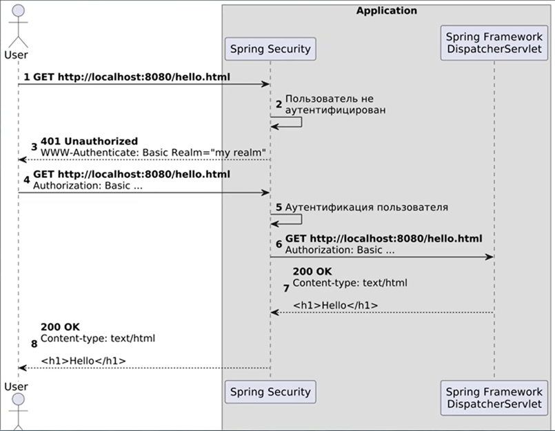

# 3 Spring Framework

> [[_оглавление_]](../README.md/#3-spring-framework)

[**Фреймворк**](/conspect/definitions.md/#ф) - это программная платформа, определяющая структуру программной системы;
программное обеспечение, облегчающее разработку и объединение разных компонентов большого программного проекта.  
Фреймворк является сопрограммой, которая работает одновременно с Java-приложением и предоставляет пустые «звенья»,
которые необходимо написать, встраивая их в общую схему работы фреймворка. В определенный момент фреймворк вызовет эти
звенья сам.

Фреймворк по своей структуре похож на библиотеку: он состоит из пакетов, каждый из которых состоит из классов, имеющих
определённые методы. От библиотеки его отличает то, что момент создания и порядок использования объектов и методов
библиотеки задаются программистом при написании кода, а в случае использования фреймворка - момент создания и порядок
использования объектов и методов определяет сам фреймворк. Как правило, классы и методы, написанные программистом,
должны имплементировать какие-либо интерфейсы фреймворка или наследовать какие-либо классы из него, таким образом
получая часть уже написанной (и заложенной во фреймворк) функциональности.

> При написании приложения с использованием библиотек всю логику работы приложения определяет программист. При написании
> приложения с использованием фреймворка программист настраивает логику, заложенную во фреймворк и определённую в нём, и
> пишет отдельные модули для этой самой логики.

Основная идея, которая лежит в базовом модуле _Spring Context_, заключается в реализации архитектурных шаблонов **IoC
(Inversion of Control)** и **DI (Dependency injection)**.

_IoC_ — инверсия контроля. Этот принцип подразумевает, что мы передаем некой сущности ответственность за создание
объектов и контроль над ними, то есть хранение.  
В случае _Spring_ мы размечаем классы с помощью определенных флагов, а уже сам _Spring_ создает (по этим флагам) объекты
и кладет их в свой контекст, который представляет собой коллекцию объектов.

_DI_ — инъекция зависимостей. Данный принцип подразумевает, что мы не хотим в нашем классе заниматься созданием
инфраструктурных объектов.  
Мы хотим просто получить его «из воздуха» и работать с ними, а логику по созданию и подаче их в наш класс доверим
_Spring_, который и проведет подачу зависимостей из своего контекста в конструктор нашего класса.

_Spring_ состоит из множества узконаправленных модулей.


> [**Ссылка**](https://start.spring.io/) на _Spring Initializr_ для создания проекта через браузер.

_Spring Framework_ предоставляет комплексную модель программирования и конфигурации для современных корпоративных
приложений на основе Java — на любой платформе развертывания. Ключевым элементом _Spring_ является инфраструктурная
поддержка на уровне приложения: _Spring_ фокусируется на «проводке» корпоративных приложений, чтобы команды могли
сосредоточиться на бизнес-логике уровня приложения без ненужных привязок к конкретным средам развертывания.

> [**Ссылка**](https://spring.io/projects/spring-framework#overview) на официальную справочную документацию по _Spring
Framework_.

Основные функции, заложенные в _Spring Framework_:

- основные технологии: внедрение зависимостей, события, ресурсы, i18n, проверка, привязка данных, преобразование типов,
  SpEL, AOP;
- тестирование: mock-объекты, фреймворк TestContext, Spring MVC Test, WebTestClient;
- доступ к данным: транзакции, поддержка DAO, JDBC, ORM, Marshalling XML;
- вэб-фреймворки Spring MVC и Spring WebFlux;
- интеграция: удалённое взаимодействие, JMS, JCA, JMX, email, задачи, планирование, кэширование и наблюдаемость;
- языки: Kotlin, Groovy, динамические языки.

## 3.1 Основные технологии

> [[_оглавление_]](../README.md/#31-основные-технологии)

### 3.1.1 Inversion of Control

> [[_оглавление_]](../README.md/#31-основные-технологии)

Главной технологией _Spring Framework_ является контейнер _Inversion of Control (IoC)_.  
[**Inversion of Control (Инверсия управления)**](/conspect/definitions.md/#i) - это абстрактный принцип, согласно
которого каждый компонент системы должен быть как можно более изолированным от других, не полагаясь в своей работе на
детали конкретной реализации других компонентов.  
Одной из реализаций этого принципа является _Dependency injection (DI)_.  
[**Dependency injection (Внедрение зависимостей)**](/conspect/definitions.md/#d) - это специализированная форма
[_IoC_](/conspect/definitions.md/#i), в которой объекты определяют свои зависимости только через аргументы конструктора,
аргументы фабричного метода или свойства, которые устанавливаются для экземпляра объекта после его создания или возврата
из фабричного метода.  
[**Зависимость**](/conspect/definitions.md/#з) - это другой объект, с которым работает данный объект или который
используется при его работе.  
[**Контейнер IoC**](/conspect/definitions.md/#к) - это программа, которая внедряет зависимости при создании
компонента.  
Процесс по сути является обратным (отсюда и название — _Inversion of Control_) самому компоненту, контролирующему
создание экземпляра или определяющему зависимости экземпляра с помощью прямого построения классов или механизма, такого
как шаблон _Service Locator_ (скрывает зависимости данного класса).

Основой контейнера _IoC Spring Framework_ являются:

- пакет `org.springframework.beans` (Spring Beans);
- пакет `org.springframework.context` (Spring Context).

#### 3.1.1.1 Интерфейс BeanFactory

> [[_оглавление_]](../README.md/#31-основные-технологии)

Интерфейс _BeanFactory_ - это корневой интерфейс для доступа к контейнеру bean-компонентов _Spring_.

Этот интерфейс реализуется объектами, которые содержат ряд определений bean-компонентов, каждое из которых однозначно
идентифицируется строковым именем типа `String`. В зависимости от определения bean-компонента фабрика вернет либо
независимый экземпляр содержащегося объекта (шаблон _Prototype_), либо один общий экземпляр (альтернатива шаблону
_Singleton_, в котором экземпляр является singleton в области действия фабрики). Какой тип экземпляра будет возвращен,
зависит от конфигурации фабрики bean-компонентов.  
_BeanFactory_ является центральным реестром компонентов приложения и централизует настройку его компонентов.

_BeanFactory_ загружает определения bean-компонентов, хранящиеся в источнике конфигурации и использует
пакет `org.springframework.beans` для настройки bean-компонентов. Реализация может просто возвращать объекты Java,
которые она создает по мере необходимости непосредственно в Java-коде. Рекомендуется, чтобы реализации поддерживали
ссылки между компонентами (_Dependency Injection_).

Реализации интерфейса _BeanFactory_ переопределяют реализации бинов родительской фабрики, имеющих такое же имя. В
случае, если в текущем экземпляре реализации бин с нужным именем не найден, то будет осуществлён поиск в родительской
реализации, и если будет найден, то применён он.

Реализации _BeanFactory_ должны поддерживать стандартные интерфейсы жизненного цикла бинов, насколько это возможно.

Полный перечень методов инициализации бина в их стандартном порядке:

- BeanNameAware `setBeanName()`;
- BeanClassLoaderAware `setBeanClassLoader()`;
- BeanFactoryAware `setBeanFactory()`;
- EnvironmentAware `setEnvironment()`;
- EmbeddedValueResolverAware `setEmbeddedValueResolver()`;
- ResourceLoaderAware `setResourceLoader()` (применимо только при запуске в контексте приложения);
- ApplicationEventPublisherAware `setApplicationEventPublisher()` (применимо только при запуске в контексте приложения);
- MessageSourceAware `setMessageSource()` (применимо только при запуске в контексте приложения);
- ApplicationContextAware `setApplicationContext()` (применимо только при запуске в контексте приложения);
- ServletContextAware `setServletContext()` (применимо только при запуске в контексте приложения);
- `postProcessBeforeInitialization` методы BeanPostProcessors;
- InitializingBean `afterPropertiesSet()`;
- пользовательское определение метода инициализации;
- `postProcessAfterInitialization` методы BeanPostProcessors.

При завершении работы _BeanFactory_ применяются следующие методы жизненного цикла бина:

- `postProcessBeforeDestruction` методы DestructionAwareBeanPostProcessors;
- DisposableBean `destroy()`;
- пользовательское определение метода уничтожения.

#### 3.1.1.2 Интерфейс ApplicationContext

> [[_оглавление_]](../README.md/#31-основные-технологии)

Интерфейс _ApplicationContext_ представляет контейнер _Spring IoC_ и отвечает за создание экземпляров, настройку и
сборку компонентов.  
Контейнер получает инструкции по компонентам для создания экземпляров, настройки и сборки, считывая метаданные
конфигурации. Метаданные конфигурации могут быть представлены в виде аннотированных классов компонентов, классов
конфигурации с фабричными методами или внешних XML-файлов или скриптов _Groovy_.

Несколько реализаций интерфейса _ApplicationContext_ являются частью ядра _Spring_. В автономных приложениях обычно
создают экземпляр _AnnotationConfigApplicationContext_ или _ClassPathXmlApplicationContext_.


> [**POJO (Plain Old Java Object)**](/conspect/definitions.md/#p) - это старый добрый Java-объект, простой Java-объект,
> не унаследованный от какого-то специфического объекта и не реализующий никаких служебных интерфейсов сверх тех,
> которые нужны для бизнес-модели.

Классы приложения объединяются с метаданными конфигурации, так что после создания _ApplicationContext_ и инициализации
имеется полностью настроенная и исполняемая система или приложение.

Контейнер _Spring IoC_ потребляет форму метаданных конфигурации. Эти метаданные конфигурации представляют то, как
разработчик приложения, сообщаете контейнеру _Spring_ о необходимости создания экземпляров, настройки и сборки
компонентов в приложении.  
Сам контейнер _Spring IoC_ полностью независим от формата, в котором эти метаданные конфигурации фактически записаны.  
В Java для конфигурации приложения, как правило, используют аннотации `@Configuration`, `@Bean`, `@Import`
и `@DependsOn`.

Конфигурация _Spring_ состоит из одного или нескольких определений bean-компонентов, которыми должен управлять контейнер
_Spring IoC_. В Java обычно использует @Bean-аннотированные методы внутри @Configuration-класса, каждый из которых
соответствует одному заданию bean-компонента.

Например:

```java

@Configuration
class PaymentsServiceConfiguration {

    @Bean
    public PaymentProvider paymentProvider() {
        return new PayPalPaymentProvider();
    }

    @Bean
    public PaymentService paymentService(PaymentProvider paymentProvider) {
        return new PaymentService(paymentProvider);
    }

}
```

Эти определения bean-компонентов соответствуют фактическим объектам, которые входят в состав приложения.  
Обычно задаются следующие объекты:

- объекты уровня сервиса;
- объекты уровня сохранения (репозитории или объекты доступа к данным (DAO));
- объекты представления (web-контроллеры);
- объекты инфраструктуры (JPA EntityManagerFactory, очереди JMS и т.д.).

Как правило, никто не настраивает мелкие объекты домена в контейнере, поскольку обычно ответственность за создание и
загрузку объектов домена лежит на репозиториях и бизнес-логике.

##### 3.1.1.2.1 Загрузка конфигурации из XML-файла

> [[_оглавление_]](../README.md/#31-основные-технологии)

Конфигурация метаданных бинов в файле XML производится внутри блоков `<bean/>`, который в свою очередь сам находится
внутри элемента верхнего уровня `<beans/>`.

Структура конфигурационного _XML_-файла выглядит следующим образом:

```xml
<?xml version="1.0" encoding="UTF-8"?>
<beans xmlns="http://www.springframework.org/schema/beans"
       xmlns:xsi="http://www.w3.org/2001/XMLSchema-instance"
       xsi:schemaLocation="http://www.springframework.org/schema/beans
		https://www.springframework.org/schema/beans/spring-beans.xsd">

    <bean id="[Идентификатор данного бина типа String]" class="[Тип бина / Полное имя класса]">
        <!-- зависимости и конфигурация для этого бина доступны здесь -->
    </bean>

    <bean id="..." class="...">
        <!-- зависимости и конфигурация для этого бина доступны здесь -->
    </bean>

    <!-- дополнительные определения бинов приводятся здесь -->

</beans>
```

Значение атрибута `id` может использоваться для создания ссылки на взаимодействующие объекты (для создания
зависимости).  
Для создания экземпляра контейнера _IoC Spring_ необходимо указать путь или пути к конфигурационным файлам XML
в `ClassPathXmlApplicationContext` конструкторе, который позволит контейнеру загружать метаданные конфигурации из
различных внешних ресурсов.

Например:

```java
ApplicationContext context = new ClassPathXmlApplicationContext("services.xml", "daos.xml");
```

Пример конфигурационного _XML_-файла сервисного уровня (_services.xml_):

```xml
<?xml version="1.0" encoding="UTF-8"?>
<beans xmlns="http://www.springframework.org/schema/beans"
       xmlns:xsi="http://www.w3.org/2001/XMLSchema-instance"
       xsi:schemaLocation="http://www.springframework.org/schema/beans
		https://www.springframework.org/schema/beans/spring-beans.xsd">

    <!-- services -->

    <bean id="petStore" class="org.springframework.samples.jpetstore.services.PetStoreServiceImpl">
        <property name="accountDao" ref="accountDao"/>
        <property name="itemDao" ref="itemDao"/>
        <!-- additional collaborators and configuration for this bean go here -->
    </bean>

    <!-- more bean definitions for services go here -->

</beans>
```

Пример конфигурационного _XML_-файла _DAO_-объекта (_daos.xml_):

```xml
<?xml version="1.0" encoding="UTF-8"?>
<beans xmlns="http://www.springframework.org/schema/beans"
       xmlns:xsi="http://www.w3.org/2001/XMLSchema-instance"
       xsi:schemaLocation="http://www.springframework.org/schema/beans
		https://www.springframework.org/schema/beans/spring-beans.xsd">

    <bean id="accountDao"
          class="org.springframework.samples.jpetstore.dao.jpa.JpaAccountDao">
        <!-- additional collaborators and configuration for this bean go here -->
    </bean>

    <bean id="itemDao" class="org.springframework.samples.jpetstore.dao.jpa.JpaItemDao">
        <!-- additional collaborators and configuration for this bean go here -->
    </bean>

    <!-- more bean definitions for data access objects go here -->

</beans>
```

В данном примере сервисный уровень состоит из класса _PetStoreServiceImpl_ и двух объектов доступа к данным типов
_JpaAccountDao_ и _JpaItemDao_ (на основе стандарта JPA Object-Relational Mapping). Элемент `property name` ссылается на
имя свойства JavaBean, а элемент `ref` ссылается на имя другого определения bean-компонента. Эта связь между
элементами `id` и `ref` выражает зависимость между взаимодействующими объектами.

Часто каждый отдельный XML-файл конфигурации представляет собой логический уровень или модуль в архитектуре приложения.
Поэтому есть возможность при задании конфигурации бинов объединять несколько конфигурационных XML-файлов при помощи
блоков `<import/>`.

Пример объединения нескольких конфигураций _XML_ в одном файле:

```xml

<beans>
    <import resource="services.xml"/>
    <import resource="resources/messageSource.xml"/>
    <import resource="/resources/themeSource.xml"/>

    <bean id="bean1" class="..."/>
    <bean id="bean2" class="..."/>
</beans>
```

##### 3.1.1.2.2 Загрузка конфигурации из Groovy-файла

> [[_оглавление_]](../README.md/#31-основные-технологии)

Конфигурация приложения также может загружаться из файлов с расширением `.groovy`.

Например:

```groovy
beans {
    dataSource(BasicDataSource) {
        driverClassName = "org.hsqldb.jdbcDriver"
        url = "jdbc:hsqldb:mem:grailsDB"
        username = "sa"
        password = ""
        settings = [mynew: "setting"]
    }
    sessionFactory(SessionFactory) {
        dataSource = dataSource
    }
    myService(MyService) {
        nestedBean = { AnotherBean bean ->
            dataSource = dataSource
        }
    }
}
```

```java
ApplicationContext context = new GenericGroovyApplicationContext("services.groovy", "daos.groovy");
```

Конфигурирование приложения с помощью Groovy-файлов аналогично конфигурированию с использованием XML. Оно также
позволяет импортировать XML-файлы задания бинов через директиву `importBeans`.

Например:

```java
public void config() {
    GenericApplicationContext context = new GenericApplicationContext();
    new XmlBeanDefinitionReader(context).loadBeanDefinitions("services.xml");
    context.refresh();
    new GroovyBeanDefinitionReader(context).loadBeanDefinitions("daos.groovy");
    context.refresh();
}
```

##### 3.1.1.2.3 Использование конфигураций

> [[_оглавление_]](../README.md/#31-основные-технологии)

_ApplicationContext_ - это интерфейс для продвинутой фабрики, способной поддерживать реестр различных бинов и их
зависимостей. Используя метод `getBean(String name, Class<T> requiredType)`, можно получать экземпляры бинов.  
_ApplicationContext_ позволяет читать заданные бины и получать к ним доступ.

Например:

```java
// создаём и конфигурируем бины
ApplicationContext context = new ClassPathXmlApplicationContext("services.xml", "daos.xml");

// получаем сконфигурированный экземпляр
PetStoreService service = context.getBean("petStore", PetStoreService.class);

// используем сконфигурированный экземпляр
List<String> userList = service.getUsernameList();
```

Интерфейс _ApplicationContext_ имеет несколько других методов для извлечения bean-компонентов, но их использование и
соответствующая зависимость от Spring API нежелательны.  
В идеале рекомендуется использовать аннотацию `@Autowired`:

```java
import org.springframework.beans.factory.annotation.Autowired;
// создаём и конфигурируем бины
ApplicationContext context = new ClassPathXmlApplicationContext("services.xml", "daos.xml");

// получаем сконфигурированный экземпляр
@Autowired
PetStoreService service;

// используем сконфигурированный экземпляр
List<String> userList = service.getUsernameList();
```

### 3.1.2 Spring Bean

> [[_оглавление_]](../README.md/#31-основные-технологии)

[**Бин (bean)**](/conspect/definitions.md/#b) - это объект, который создается, собирается и управляется контейнером
_Spring IoC_.  
Любое приложение _Spring_ - это набор бинов, связанных вместе через _Spring IoC_-контейнер.  
Bean-компоненты и зависимости между ними отражаются в метаданных конфигурации, используемых контейнером _Spring IoC_.

Контейнер _Spring IoC_ управляет одним или несколькими бинами, которые создаются с использованием метаданных
конфигурации.  
Внутри самого контейнера _Spring IoC_ эти определения бинов представлены как _BeanDefinition_ объекты, которые
содержат (помимо прочей информации) следующие метаданные:

- имя класса, квалифицированное по пакету (package-qualified): класс актуальной реализации задаваемого бина;
- элементы конфигурации поведения бина, которые определяют, как бин должен вести себя в контейнере (область видимости (
  scope), функции обратных вызовов (callback-и) жизненного цикла и т.д.);
- ссылки на другие бины, которые нужны бину для выполнения его работы ([зависимости](/conspect/definitions.md/#з));
- другие параметры конфигурации, которые следует задать во вновь созданном объекте (например, ограничение размера пула
  подключений для использования в бине, управляющем пулом подключений).

Эти метаданные преобразуются в сет свойств, которые составляют каждый задаваемый бин.

Состав бина:

- класс;
- имя;
- scope;
- аргументы конструктора;
- свойства;
- режим autowiring;
- режим lazy initialization;
- метод инициализации;
- метод уничтожения.

#### 3.1.2.1 Переопределение бинов

> [[_оглавление_]](../README.md/#31-основные-технологии)

Переопределение бинов происходит тогда, когда создаётся новый бин с ID существующего бина.

Чтобы полностью отключить возможность переопределения бинов, нужно перед запуском _ApplicationContext_ изменить значение
поля `allowBeanDefinitionOverriding` в конфиг-файле на `false`. При такой настройке при попытке переопределить бин
выдаётся исключение.  
По умолчанию контейнер _Spring IoC_ регистрирует каждое переопределение бина на уровне _INFO_. Чтобы отключить
логирование переопределений бинов, нужно перед запуском _ApplicationContext_ изменить значение
поля `allowBeanDefinitionOverriding` в конфиг-файле на `true`.

> В Java при использовании аннотации `@Bean` сканируемый метод по умолчанию всегда переопределяет класс бина с тем же
> самым именем при условии, что возвращаемый тип данных метода соответствует классу бина. Это означает, что контейнер
_Spring IoC_ вызовет метод, помеченный аннотацией `@Bean`, в качестве конструктора бин-класса.

#### 3.1.2.2 Нейминг бинов

> [[_оглавление_]](../README.md/#31-основные-технологии)

Каждый бин имеет один или несколько идентификаторов. Эти идентификаторы должны быть уникальными в контейнере _Spring
IoC_, в котором размещен бин. Обычно бин имеет только один идентификатор. Однако, если требуется больше одного,
дополнительные идентификаторы можно считать псевдонимами.

В метаданных конфигурации на основе XML используется `id` атрибут, атрибут `name` или оба для указания идентификаторов
bean-компонентов. Атрибут `id` позволяет указать только один ID. Если необходимо ввести псевдонимы для bean-компонента,
нужно указать их в атрибуте `name`, разделив запятой (`,`), точкой с запятой (`;`) или пробелом (` `). Хотя атрибут `id`
определен как `xsd:string` тип, уникальность ID бина обеспечивается контейнером _Spring IoC_, а не парсером XML.

В случае загрузки конфигурации бина из XML-файла можно добавить псевдоним бину из другого источника прямо в этом же
XML-файле, используя блок `<alias/>`:

```xml

<alias name="fromName" alias="toName"/>
```

### 3.1.3 Dependency Injection

> [[_оглавление_]](../README.md/#31-основные-технологии)

[**Dependency injection (Внедрение зависимостей)**](/conspect/definitions.md/#d) - это специализированная форма
[_IoC_](/conspect/definitions.md/#i) (процесс), в которой(-ом) объекты определяют свои зависимости только через
аргументы конструктора, аргументы фабричного метода или свойства, которые устанавливаются для экземпляра объекта после
его создания или возврата из фабричного метода.

Создание бина с помощью фабричного метода:

```java
public class ExampleBean {

    private AnotherBean beanOne;

    private YetAnotherBean beanTwo;

    private int i;

    private ExampleBean(AnotherBean anotherBean, YetAnotherBean yetAnotherBean, int i) {
        this.beanOne = anotherBean;
        this.beanTwo = yetAnotherBean;
        this.i = i;
    }

    public static ExampleBean createInstance(AnotherBean anotherBean, YetAnotherBean yetAnotherBean, int i) {
        ExampleBean eb = new ExampleBean(anotherBean, yetAnotherBean, i);
        // некоторые другие действия...
        return eb;
    }
}
```

Затем контейнер внедряет эти зависимости при создании бина.

При использовании _Spring Framework_ бины предоставляются со своими зависимостями. Объект не ищет свои зависимости и не
знает местоположение или класс зависимостей.

_DI_ существует в двух варинтах:

- внедрение зависимостей на основе конструктора (_DI_ на основе конструктора выполняется контейнером, вызывающим
  конструктор с рядом аргументов, каждый из которых представляет зависимость);

```java
public class SimpleMovieLister {

    // класс SimpleMovieLister имеет зависимость от класса MovieFinder
    private final MovieFinder movieFinder;

    // конструктор, позволяющий контейнеру Spring ввести зависимость от MovieFinder
    public SimpleMovieLister(MovieFinder movieFinder) {
        this.movieFinder = movieFinder;
    }
    // бизнес-логика, которая фактически использует внедренный MovieFinder, опущена...
}
```

```xml

<beans>
    <bean id="beanOne" class="examples.ThingOne">
        <constructor-arg type="int" index="0" name="years" value="7500000" ref="beanTwo"/>
        <constructor-arg type="java.lang.String" index="1" name="ultimateAnswer" value="42" ref="beanThree"/>
    </bean>

    <bean id="beanTwo" class="x.y.ThingTwo"/>

    <bean id="beanThree" class="x.y.ThingThree"/>
</beans>
```

- внедрение зависимостей на основе сеттеров.

```java
public class SimpleMovieLister {

    // класс SimpleMovieLister имеет зависимость от класса MovieFinder
    private MovieFinder movieFinder;

    // setter, позволяющий контейнеру Spring ввести зависимость от MovieFinder
    public void setMovieFinder(MovieFinder movieFinder) {
        this.movieFinder = movieFinder;
    }
    // бизнес-логика, которая фактически использует внедренный MovieFinder, опущена...
}
```

_ApplicationContext_ поддерживает одновременное внедрение зависимостей (_DI_) и при помощи конструкторов, и при помощи
сеттеров.  
Настройка зависимостей бинов производится в форме _BeanDefinition_, который используется совместно с _PropertyEditor_.  
Однако большинство пользователей _Spring_ работают не с этими классами напрямую, а с `</bean>` определениями XML,
аннотированными компонентами (то есть классами, аннотированными с помощью `@Component`, `@Controller` и т. д.)
или `@Bean` методами в классах на основе Java `@Configuration`. Затем эти источники преобразуются внутренне в экземпляры
_BeanDefinition_ и используются для загрузки всего экземпляра контейнера _Spring IoC_.

Контейнер _Spring IoC_ создаёт зависимости bean-компонентов следующим образом:

- создаётся _ApplicationContext_ и инициализируется с помощью метаданных конфигурации, описывающих все бины (метаданные
  конфигурации могут быть указаны с помощью XML, кода Java или аннотаций);
- для каждого бина его зависимости выражаются в форме свойств, аргументов конструктора или аргументов метода
  static-factory (эти зависимости присваиваются бину в момент его создания);
- каждое свойство или аргумент конструктора являются фактическим определением устанавливаемого значения или ссылкой на
  другой бин в контейнере;
- каждое свойство или аргумент конструктора, представляющие собой значение, преобразуется из указанного формата в
  фактический тип этого свойства или аргумента конструктора.

По умолчанию _Spring_ может преобразовывать значение, предоставленное в строковом формате, во все встроенные типы, такие
как `int`, `long`, `String`, `boolean`, и т.д.

Контейнер _Spring IoC_ проверяет конфигурацию каждого бина при создании контейнера. Однако сами свойства бина не
устанавливаются до тех пор, пока бин не будет фактически создан. Бины, которые имеют область видимости singleton и
значения по умолчанию которых заданы заранее, создаются при создании контейнера. Область видимости определяется в поле
scope бина (если она не задана, то бин создаётся только при обращении к нему). Создание бинов приводит к созданию
графа (набора взаимосвязанных элементов) бинов.

> Несоответствие зависимостей между бинами может быть выявлено после инициализации контекста в момент создания
> экземпляра затронутого бина.

> При создании бинов исключительно с использованием конструкторов существует вероятность создать циклическую зависимость
> между ними (класс A требует экземпляр класса B через инъекцию конструктора, а класс B требует экземпляр класса A через
> инъекцию конструктора). Контейнер _Spring IoC_ при обнаружении циклической зависимости во время выполнения и
> выкидывает исключение `BeanCurrentlyInCreationException`.

Одним из возможных решений циклической зависимости является редактирование исходного кода некоторых классов для
настройки сеттерами, а не конструкторами.

Примеры разрешения циклических зависимостей бинов:

- с использованием аннотации `@Lazy`;

```java

@Component
public class CircularDependencyA {

    private CircularDependencyB circularDependencyB;

    @Autowired
    public CircularDependencyA(@Lazy CircularDependencyB circularDependencyB) {
        this.circularDependencyB = circularDependencyB;
    }
}

@Component
public class CircularDependencyB {

    private CircularDependencyA circularDependencyA;

    @Autowired
    public CircularDependencyB(CircularDependencyA circularDependencyA) {
        this.circularDependencyA = circularDependencyA;
    }
}
```

- с использованием сеттеров;

```java

@Component
public class CircularDependencyA {

    private CircularDependencyB circularDependencyB;

    @Autowired
    public void setCircB(CircularDependencyB circularDependencyB) {
        this.circularDependencyB = circularDependencyB;
    }

    public CircularDependencyB getCircularDependencyB() {
        return circularDependencyB;
    }
}

@Component
public class CircularDependencyB {

    private CircularDependencyA circularDependencyA;

    @Autowired
    public void setCircularDependencyA(CircularDependencyA circularDependencyA) {
        this.circularDependencyA = circularDependencyA;
    }
}
```

- с использованием аннотации `@PostConstruct`.

```java

@Component
public class CircularDependencyA {

    @Autowired
    private CircularDependencyB circularDependencyB;

    @PostConstruct
    public void init() {
        circularDependencyB.setCircularDependencyA(this);
    }

    public CircularDependencyB getCircularDependencyB() {
        return circularDependencyB;
    }
}

@Component
public class CircularDependencyB {

    private CircularDependencyA circularDependencyA;

    public void setCircularDependencyA(CircularDependencyA circularDependencyA) {
        this.circularDependencyA = circularDependencyA;
    }
}
```

Если циклических зависимостей не существует, когда один или несколько взаимодействующих бинов внедряются в зависимый
бин, каждый взаимодействующий бин полностью настраивается до внедрения в зависимый бин.

## 3.2 Spring Boot

> [[_оглавление_]](../README.md/#32-spring-boot)

_Spring Boot_ предназначен для упрощения создания автономных приложений на базе _Spring_.

Модуль _Spring Boot_ выполняет следующие функции:

- создание автономных приложений _Spring_;
- прямое встраивание _Tomcat_, _Jetty_ или _Undertow_ (освобождая от необходимости развертывать файлы _WAR_);
- предоставление необходимых зависимостей стартеру для упрощения конфигурации сборки;
- автоматическая настройка _Spring_ и сторонних библиотек, когда это возможно;
- предоставление настроенных и готовых к использованию функций (метрики, проверки работоспособности и внешняя
  конфигурация);
- обеспечение независимости от генерации кода и требований к XML-конфигурации.

_Spring Boot_ просматривает classpath и bean-компоненты, которые были настроены, делает обоснованные предположения о
том, чего в них не хватает, и добавляет эти элементы.

[**Apache Tomcat**](/conspect/definitions.md/#t) - это открытое программное обеспечение, реализующее спецификации _Java
Servlet_, _JSP_ и _Java WebSocket_, предоставляя таким образом платформу для запуска веб-приложений, написанных на языке
Java. Разработанный и поддерживаемый _Apache Software Foundation_, _Tomcat_ служит контейнером сервлетов, который
позволяет веб-приложениям использовать Java для создания динамичных веб-страниц.  
[**Сервлет (Servlet)**](/conspect/definitions.md/#с) - это класс, который умеет получать запросы от клиента и возвращать
ему ответы.  
[**Java Servlet API**](/conspect/definitions.md/#j) - это стандартизированный _API_, предназначенный для реализации на
сервере и работе с клиентом по схеме запрос-ответ.  
[**API (application programming interface)**](/conspect/definitions.md/#a) - это программный интерфейс приложения; набор
способов и правил, по которым различные программы общаются между собой и обмениваются данными.  
[**JSP (Java Server Pages)**](/conspect/definitions.md/#j) - это технология, позволяющая web-разработчикам создавать
содержимое, которое имеет как статические, так и динамические компоненты.  
Страница _JSP_ содержит текст двух типов: статические исходные данные, которые могут быть оформлены в одном из текстовых
форматов _HTML_, _SVG_, _WML_, или _XML_, и _JSP_-элементы, которые конструируют динамическое содержимое. Кроме этого
могут использоваться библиотеки _JSP_-тегов, а также _Expression Language (EL)_ для внедрения Java-кода в статичное
содержимое _JSP_-страниц.  
[**WebSocket (RFC 6455)**](/conspect/definitions.md/#w) - это независимый протокол, основанный на протоколе _TCP_ и
предназначенный для обмена сообщениями между браузером и web-сервером в режиме реального времени. Таким образом,
изначально синхронный протокол _HTTP_, построенный на модели «запрос — ответ», становится полностью асинхронным и
симметричным. При использовании _WebSocket_ нет клиента и сервера с фиксированными ролями, а есть два равноправных
участника обмена данными. Каждый участник функционирует самостоятельно: отправил сообщение и продолжил выполнять свои
функции. Участник, получивший сообщение, может вообще не отвечать: протокол дает полную свободу в обмене данными.  
[**Jetty**](/conspect/definitions.md/#j) - это веб-сервер и контейнер сервлетов, который позволяет запускать
web-приложения на Java. Он был разработан _Morteza Hosseini_ и известен своей легковесностью и высокой
производительностью.  
[**Undertow**](/conspect/definitions.md/#u) - это гибкий, быстрый web-сервер, написанный на Java, который основан на
_API_ нового ввода-вывода _J2SE_. _Undertow_ разработан на основе композиционной архитектуры, которая позволяет
создавать полнофункциональный web-сервер путем объединения небольших отдельных компонентов, называемых обработчиками.
Эти обработчики объединяются в цепочку, образуя либо полностью функциональный контейнер сервлета _Java EE 3.1_, либо
более простой обработчик процесса _HTTP_, встроенный в код.  
[**WAR (Web Application Resource)**](/conspect/definitions.md/#w) - это формат файла, описывающий, как полное
web-приложение упаковывается в соответствии со спецификацией Java-сервлетов в файл в формате _JAR_ или _ZIP_.

_Spring Boot_ не генерирует код и не вносит изменения в файлы. При запуске приложения _Spring Boot_ динамически
подключает бины и настройки и применяет их к контексту приложения.

Запуск приложений _Spring Boot_ с помощью:

- Gradle:

```text
./gradlew bootRun
```

- Maven:

```text
./mvnw spring-boot:run
```

### 3.2.1 Spring Boot Caching

> [[_оглавление_]](../README.md/#32-spring-boot)

[**Кэш**](/conspect/definitions.md/#к) - это промежуточное хранилище данных (как правило, в оперативной памяти), откуда
можно быстро получить доступ к часто используемой информации.  
Данные в кэше хранятся в виде пар "ключ:значение".

Основная идея кэширования - сократить время доступа к данным, сохраняя их в более быстром хранилище.

При запросе данных система сначала проверяет, есть ли эти данные в кэше. Если данные найдены, это называется «попаданием
в кэш» (_cache hit_). Если данных нет, это называется «промахом кэша» (_cache miss_). В случае промаха, система
обращается к исходному источнику данных, а затем обычно сохраняет эти данные в кэше для будущих запросов.

Кэширование применяется для:

- сохранения результатов больших вычислений;
- уменьшения количества запросов к жёсткому диску;
- уменьшения количества запросов к сторонним сервисам и приложениям;
- уменьшения времени ответа сервера;
- сокращения объёма трафика;
- экономии процессорного времени;
- увеличения скорости работы приложения.

Вся информация, хранящаяся в кэше, является временной, поэтому кэш должен содержать в себе только ту информацию, потеря
которой не повлечёт критичных последствий.

Структура кэширования в _Spring Framework_:


[**Провайдер кэша**](/conspect/definitions.md/#п) - это приложение, библиотека или фреймворк, который содержит в себе
всю логику по кэшированию.

_Spring_ в данном случае выступает некоторой абстракцией: то есть _Spring_ предоставляет _API_, правильные аннотации,
интерфейсы и какие-то абстрактные классы, но саму реализацию этих интерфейсов и классов _Spring_ не несёт.

[**Кэш-менеджер**](/conspect/definitions.md/#к) - это класс, который занимается регуляцией кэша, то есть позволяет
непосредственно работать с хранилищем.

В _Spring Boot_ приложении может быть несколько кэш-провайдеров, каждый из которых может содержать по несколько
кэш-менеджеров, а каждый кэш-менеджер может содержать один или несколько кэшей.

|   **Участник**   | **Функция**                                                                              |
|:----------------:|:-----------------------------------------------------------------------------------------|
|  _CacheManager_  | Управляет различными кэшами.<br/>В проекте может быть использовано несколько менеджеров. |
|     _Cache_      | Интерфейс, описывающий структуру кэша.<br/>Существует несколько стандартных реализаций.  |
|  _KeyGenerator_  | Алгоритм генерации ключей для объектов кэша.                                             |
|   _Serializer_   | Вариант сериализации данных при кэшировании.                                             |
| `@EnableCaching` | Включает кэширование на уровне приложения.                                               |
|   `@Cacheable`   | Включает кэширование определённого метода и конфигурирует его.                           |
|   `@CachePut`    | Добавляет или изменяет данные в кэше.                                                    |
|  `@CacheEvict`   | Удаляет данные из кэша.                                                                  |
|    `@Caching`    | Позволяет конфигурировать кэширование и объединять аннотации, указанные выше в таблице.  |
|  `@CacheConfig`  | Конфигурирует кэширование для всего класса.                                              |

Метаданные для _Spring Expression Language (SpEL)_:

|      **Тип**      |                      **Описание проверки**                      | **Пример**                                               |
|:-----------------:|:---------------------------------------------------------------:|:---------------------------------------------------------|
| _Название метода_ |       Название метода, который в данный момент вызывается       | `#root.methodName`<br/>`#root.method.name`               |
| _Целевой объект_  |           Объект, который предполагается закэшировать           | `#root.target`                                           |
|  _Класс объекта_  |                    Класс кэшируемого объекта                    | `#root.targetClass`                                      |
|    _Аргументы_    |      Позволяют обращаться к аргументам вызываемого метода       | `#root.args[0]`<br/>`#a0`<br/>`#p0`<br/>`#parameterName` |
|      _Кэши_       | Позволяют получить данные об используемых в данном методе кэшах | `#root.caches[0].name`                                   |
|    _Результат_    |       Позволяет обратиться к результату выполнения метода       | `#result`                                                |

Порядок добавления кэширования в _Spring Boot_ приложение:

- добавить зависимость в файл:

    * _pom.xml_:

      ```xml
  
         <dependency>
              <groupId>org.springframework.boot</groupId>
              <artifactId>spring-boot-starter-cache</artifactId>
              <version>3.3.5</version>
         </dependency>
       ```

    * _build.gradle_:

      ```groovy
       implementation 'org.springframework.boot:spring-boot-starter-cache:3.3.5'
      ```

- включить кэширование в _Spring_, добавив:
    * аннотацию `@EnableCaching` в стартер приложения для использования стандартного кэш-менеджера
      _ConcurrentMapCacheManager_:
  ```java
  @EnableCaching
  public class JavaConspectRusApplication {
  
      public static void main(String[] args) {
          SpringApplication.run(JavaConspectRusApplication.class, args);
      }
  }
  ```
    * в конфигурационный файл для использования любого другого из поддерживаемых кэш-менеджеров:
        + _ConcurrentMapCacheManager_:
      ```java
      @Configuration
      @EnableCaching
      public class CachingConfiguration {
          @Bean
          public CacheManager cacheManager() {
              return new ConcurrentMapCacheManager("book");
          }
      }
      ```
        + _CaffeineCacheManager_:
      ```java
      @Configuration
      @EnableCaching
      public class CachingConfiguration {
          @Bean
          public CacheManager cacheManager() {
              return new CaffeineCacheManager("book");
          }
      }
      ```
        + _CompositeCacheManager_:
      ```java
      @Configuration
      @EnableCaching
      public class CachingConfiguration {
          @Bean
          public CacheManager cacheManager() {
              return new CompositeCacheManager(
                  new ConcurrentMapCacheManager("cacheA") {
                      @Override
                      protected Cache createConcurrentMapCache(final String name) {
                          return new ConcurrentMapCache(name,
                              (ConcurrentMap<Object, Object>) CacheBuilder.newBuilder()
                                  .expireAfterAccess(1000L, TimeUnit.SECONDS)
                                  .maximumSize(1000L)
                                  .build(), false);
                              }
                      },
                  new ConcurrentMapCacheManager("cacheB") {
                      @Override
                      protected Cache createConcurrentMapCache(final String name) {
                          return new ConcurrentMapCache(name,
                              (ConcurrentMap<Object, Object>) CacheBuilder.newBuilder()
                                  .expireAfterAccess(1000L, TimeUnit.SECONDS)
                                  .maximumSize(1000L)
                                  .build(), false);
                              }
                      }
                  );
          }
      }
      ```
        + _JCacheCacheManager_;
        + _NoOpCacheManager_;
        + _SimpleCacheManager_;
      ```java
      @Configuration
      @EnableCaching
      public class CachingConfiguration {
          @Bean
          public CacheManager cacheManager() {
              SimpleCacheManager cacheManager = new SimpleCacheManager();
              cacheManager.setCaches(List.of(new ConcurrentMapCache("book")));
              return cacheManager;
          }
      }
      ```
        + _TransactionAwareCacheManagerProxy_;

- (при необходимости) также создать _bean_-компонент _KeyGenerator_ и настроить его:

```java

@Configuration
@EnableCaching
public class CachingConfiguration {
    @Bean
    public CacheManager cacheManager() {
        SimpleCacheManager cacheManager = new SimpleCacheManager();
        cacheManager.setCaches(List.of(new ConcurrentMapCache("book")));
        return cacheManager;
    }

    @Bean
    public KeyGenerator keyGenerator() {
        KeyGenerator keyGenerator = new SimpleKeyGenerator() {
            @Override
            public Object generate(Object target, Method method, Object... params) {
                return target.getClass().getSimpleName() + "_"
                        + method.getName() + "_"
                        + StringUtils.arrayToDelimitedString(params, "_");
            }
        };
        return keyGenerator;
    }
}
```

- настроить кэширование для класса с использованием аннотации `@CacheConfig`;
- добавить функции кэширования в кэшируемом классе с помощью аннотаций `@Cacheable`, `@CachePut`, `@CacheEvict`
  и `@Caching`:

```java

@RestController
@RequestMapping(path = "/books")
@Tag(name = "Контроллер для книг", description = "Контроллер для работы с книгами")
@CacheConfig(cacheNames = "book")
public class BooksController {
    private final BookService bookService;
    private final BookCoverService bookCoverService;

    public BooksController(@Qualifier("bookServiceImplDB") BookService bookService, @Qualifier("bookCoverServiceImpl") BookCoverService bookCoverService) {
        this.bookService = bookService;
        this.bookCoverService = bookCoverService;
    }

    @PostMapping                    // http://localhost:8080/books      C - create
    @Cacheable(value = "book", key = "#result.body.id")
    public ResponseEntity<Book> createBook(@RequestBody Book book) {
        try {
            return ResponseEntity.ok(bookService.createBook(book));
        } catch (RuntimeException e) {
            return ResponseEntity.status(405).build();
        }
    }

    @GetMapping(path = "/{id}")     // http://localhost:8080/books/1    R - read
    @Cacheable(value = "book")
    public ResponseEntity<Book> readBook(@PathVariable @Parameter(description = "ID книги в имеющемся списке книг", required = true, schema = @Schema(implementation = Long.class), example = "1") long id) {
        Book findedBook = bookService.findBook(id);
        if (findedBook != null) {
            return ResponseEntity.ok(findedBook);
        } else {
            return ResponseEntity.notFound().build();
        }
    }

    @PutMapping                     // http://localhost:8080/books      U - update
    @CachePut(value = "book", key = "#book.id", unless = "#result.body.id > 100")
    public ResponseEntity<Book> updateBook(@RequestBody Book book) {
        Book updatedBook = bookService.editBook(book);
        if (updatedBook != null) {
            return ResponseEntity.ok(updatedBook);
        } else {
            return ResponseEntity.status(HttpStatus.BAD_REQUEST).build();
        }
    }

    @DeleteMapping(path = "/{id}")  // http://localhost:8080/books/1    D - delete
    @CacheEvict(value = "book")
    public ResponseEntity<Book> deleteBook(@PathVariable @Parameter(description = "ID книги в имеющемся списке книг", required = true, schema = @Schema(implementation = Long.class), example = "1") long id) {
        Book deletedBook = bookService.deleteBook(id);
        if (deletedBook != null) {
            return ResponseEntity.ok(deletedBook);
        } else {
            return ResponseEntity.status(403).build();
        }
    }
}
```

Кэш-менеджер после его объявления в конфиг-файле в качестве бина может использоваться как любой другой _bean_-компонент
приложения, а именно может быть внедрён в класс, а его методы могут вызываться в методах класса. Как правило, такое
применение кэш-менеджера используется для очистки кэша.

Пример использования:

```java
public class CacheServiceImpl implements CacheService {
    private final CacheManager cacheManager;

    public CacheServiceImpl(CacheManager cacheManager) {
        this.cacheManager = cacheManager;
    }

    @Override
    public void clearCache() {
        cacheManager.getCache("book").clear();
    }
}
```

## 3.3 Spring Initializr

> [[_оглавление_]](../README.md/#33-spring-initializr)

> [**Ссылка**](https://start.spring.io/) на _Spring Initializr_ для создания проекта через браузер.

_Spring Initializr_ позволяет выбрать разные системы сборки и язык проекта, а также позволяет выбрать компоненты
_Spring_ которые будут использоваться в проекте.

_Spring Initializr_ позволяет редактировать следующие настройки проекта:

- _Project_ - это [система сборки](/conspect/2.md/#24-системы-сборки) для проекта;
- _Language_ - это язык проекта;
- _Spring Boot_ - это версия _Spring Boot_ для проекта;
- _Project Metadata_ - это дополнительная информация о проекте:
    * _Group_ - это группа проекта (записывается как web-адрес разработчика в обратном порядке, например
      com.companyname);
    * _ArtifactId_ - это уникальный идентификатор проекта (наименование проекта в классификации разработчика проекта);
    * _Name_ - это человекочитаемое имя проекта (наименование проекта для пользователя);
    * _Description_ - это описание проекта (для пользователя);
    * _Package name_ - это имя корневого пакета в приложении (не может содержать других символов разделения, кроме
      точки (`.`));
    * _Packaging_ - это метод упаковки проекта;
    * _Java_ - это версия Java для проекта;
- _Dependencies_ - это модули _Spring Boot_ которые будет использовать проект.

_Spring Initializr_ генерирует готовый архив с проектом, работу с которым можно начинать после распаковки.

### 3.3.1 Web-приложения Spring

> [[_оглавление_]](../README.md/#33-spring-initializr)

При инициализации проекта с использованием _Spring Initializr_ получается приложение с уже сгенерированным
методом `main()`, единственная задача которого - запуск приложения.

Пример:

```java
package lorgar.avrelian.javaconspectrus;

import org.springframework.boot.SpringApplication;
import org.springframework.boot.autoconfigure.SpringBootApplication;

@SpringBootApplication
public class JavaConspectRusApplication {

    public static void main(String[] args) {
        SpringApplication.run(JavaConspectRusApplication.class, args);
    }
}
```

Класс с методом `main()` в качестве параметра передаётся в класс _SpringApplication_ и его статический метод `run()`.
Оттуда _Spring_ начинает сканировать пакет и аргументы командной строки (запуска), которые приходят в качестве массива
строк `args` в метод `main()`.

> Стартер сканирует на наличие bean-компонентов только те пакеты, которые находятся ниже его по уровню. То есть, стартер
> должен находиться в корневом пакете, а все остальные компоненты приложения в иерархически ниже стоящих пакетах.

#### 3.3.1.1 Контроллер

> [[_оглавление_]](../README.md/#33-spring-initializr)

[**Контроллер**](/conspect/definitions.md/#к) - это специальный класс, который управляется _Spring_ и отвечает за
обработку _HTTP_-запроса, приходящего на сервер.

Как правило, все контроллеры приложения должны находиться в пакете _controllers_ (например,
_src/main/java/lorgar/avrelian/javaconspectrus/controllers_).

Контроллер должен быть отмечен аннотацией `@RestController`, которая сообщает _Spring_, что:

- данный класс обрабатывает входящие _HTTP_-запросы, а также делает сам объект контроллера управляемым _Spring_
  (контейнер _IoC_ может внедрять зависимости в данный класс);
- класс возвращает объект, который нужно отобразить пользователю.

Если метод этого контроллера возвращает строку, то пользователь увидит эту строку в ответе от сервера. Если метод
возвращает объект, то _Spring_ конвертирует его в формат _JSON_.

Методы контроллера помечаются аннотациями,
соответствующими [методам протокола HTTP](/conspect/4.md/#4111-http-запрос): `@DeleteMapping`, `@GetMapping`,
`@PatchMapping`, `@PostMapping` и др.

Пример:

```java

@GetMapping(path = "/{id}")
public ResponseEntity<ExtendedAdDTO> getAd(@Parameter(description = "ID объявления", example = "1") @PathVariable Integer id) {
    ExtendedAdDTO extendedAdDTO = adsService.getAd(id);
    if (extendedAdDTO != null) {
        return ResponseEntity.status(200).body(extendedAdDTO);
    } else {
        return ResponseEntity.status(404).build();
    }
}

@PatchMapping(path = "/{id}")
public ResponseEntity<AdDTO> updateAd(@Parameter(description = "ID объявления", example = "1") @PathVariable Integer id, @RequestBody CreateOrUpdateAdDTO createOrUpdateAdDTO) {
    AdDTO adDTO;
    try {
        adDTO = adsService.updateAd(id, createOrUpdateAdDTO);
    } catch (UsernameNotFoundException e) {
        log.error(e.getMessage());
        return ResponseEntity.status(403).build();
    }
    if (adDTO == null) {
        return ResponseEntity.status(404).build();
    } else {
        return ResponseEntity.ok(adDTO);
    }
}

@PostMapping(consumes = {MediaType.MULTIPART_FORM_DATA_VALUE})
public ResponseEntity<AdDTO> postAd(@RequestPart("properties") @Valid CreateOrUpdateAdDTO ad, @RequestPart("image") MultipartFile image) {
    AdDTO newAd = adsService.addAd(ad, image);
    if (newAd != null) {
        return ResponseEntity.status(201).body(newAd);
    } else {
        return ResponseEntity.status(401).build();
    }
}

@DeleteMapping(path = "/{id}")
public ResponseEntity<?> deleteAd(@Parameter(description = "ID объявления", example = "1") @PathVariable Integer id) {
    boolean delete;
    try {
        delete = adsService.deleteAd(id);
    } catch (UsernameNotFoundException e) {
        log.error(e.getMessage());
        return ResponseEntity.status(403).build();
    }
    if (delete) {
        return ResponseEntity.status(204).build();
    } else {
        return ResponseEntity.status(404).build();
    }
}
```

_Localhost_ - это локальный web-адрес компьютера.  
Порт 8080 - это стандартный порт, который использует _Spring_ для поднятия приложений.

> Для изменения порта по умолчанию необходимо в файле _application.properties_ задать
> настройку `server.port=[номер порта]`.

Относительный путь контроллера (относительно пути хоста) указывается в аннотации `@RequestMapping`. Этот относительный
путь является обязательной составной частью для всех _HTTP_-запросов, обрабатываемых методами данного контроллера.

#### 3.3.1.2 Сервис

> [[_оглавление_]](../README.md/#33-spring-initializr)

Web-приложения _Spring_ строятся на базе архитектурного шаблона [_MVC_](/conspect/2.md/#23-mvc). В соответствии с ним
контроллер должен отвечать только за обмен данными с клиентом, а сама обработка запросов (серверная часть) должна
осуществляться в сервисах.

[**Сервис**](/conspect/definitions.md/#с) - это класс, содержащий логику по обработке запросов.

Сервисы принято располагать в пакете _services_ (например, _src/main/java/lorgar/avrelian/javaconspectrus/services_),
при этом разделяя реализации сервисов и их интерфейсы. Реализации должны находиться в пакете _implementations_
(например, _src/main/java/lorgar/avrelian/javaconspectrus/services/implementations_).

Сервисы для того, чтобы контейнер _IoC Spring_ при загрузке приложения установил зависимости, должны передаваться в
контроллер через сеттеры, конструктор или с помощью аннотации `@Autowired`, а для того, чтобы контейнер _IoC Spring_
создал соответствующий bean-компонент, должны быть отмечены аннотацией `@Service`.

Пример:

```java

@Service
public interface CounterService {
    int getCounter();
}
```

```java

@Service
public class CounterServiceImpl implements CounterService {
    private static int counter = 0;

    public CounterServiceImpl() {
    }

    @Override
    public int getCounter() {
        return ++counter;
    }
}
```

Примеры инжекции бинов:

- с помощью конструктора:

```java

@RestController
@RequestMapping(path = "/controller")
public class SpringWebIntroductionController {
    private final CounterService counterService;

    public SpringWebIntroductionController(CounterService counterService) {
        this.counterService = counterService;
    }

    @GetMapping
    public String getHello() {
        return "Hello world!";
    }

    @GetMapping(path = "/counter")
    public String getCounter() {
        return String.valueOf(counterService.getCounter());
    }

    @GetMapping("/counter/change")
    public ResponseEntity<Integer> changeCounter1(@RequestParam(name = "counter") int counter) {
        return ResponseEntity.status(200).body(counterService.setCounter(counter));
    }

    @GetMapping("/counter/change/{counter}")
    public ResponseEntity<Integer> changeCounter2(@PathVariable int counter) {
        return ResponseEntity.status(200).body(counterService.setCounter(counter));
    }
}
```

- с помощью сеттера (в каждом из методов контроллера необходимо использовать сеттер для инжекции конкретной реализации
  интерфейса сервиса):

```java

@RestController
@RequestMapping(path = "/controller")
public class SpringWebIntroductionController {
    private CounterService counterService;

    public void setCounterService(CounterService counterService) {
        this.counterService = counterService;
    }

    @GetMapping
    public String getHello() {
        return "Hello world!";
    }

    @GetMapping(path = "/counter")
    public String getCounter() {
        setCounterService(new CounterServiceImpl());
        return String.valueOf(counterService.getCounter());
    }

    @GetMapping("/counter/change")
    public ResponseEntity<Integer> changeCounter1(@RequestParam(name = "counter") int counter) {
        setCounterService(new CounterServiceImpl());
        return ResponseEntity.status(200).body(counterService.setCounter(counter));
    }

    @GetMapping("/counter/change/{counter}")
    public ResponseEntity<Integer> changeCounter2(@PathVariable int counter) {
        setCounterService(new CounterServiceImpl());
        return ResponseEntity.status(200).body(counterService.setCounter(counter));
    }
}
```

- с помощью аннотации `@Autowired`:

```java

@RestController
@RequestMapping(path = "/controller")
public class SpringWebIntroductionController {
    @Autowired
    @Qualifier("counterServiceImpl")
    private CounterService counterService;

    @GetMapping
    public String getHello() {
        return "Hello world!";
    }

    @GetMapping(path = "/counter")
    public String getCounter() {
        return String.valueOf(counterService.getCounter());
    }

    @GetMapping("/counter/change")
    public ResponseEntity<Integer> changeCounter1(@RequestParam(name = "counter") int counter) {
        return ResponseEntity.status(200).body(counterService.setCounter(counter));
    }

    @GetMapping("/counter/change/{counter}")
    public ResponseEntity<Integer> changeCounter2(@PathVariable int counter) {
        return ResponseEntity.status(200).body(counterService.setCounter(counter));
    }
}
```

### 3.3.2 Передача параметров метода в запросе

> [[_оглавление_]](../README.md/#33-spring-initializr)

В соответствии с протоколом [_HTTP_](/conspect/4.md/#4111-http-запрос) в запросе также могут передаваться параметры.  
В методах контроллера возможность принимать запросы реализована с помощью аннотаций `@RequestParam` и `@PathVariable`.

Пример:

```java

@GetMapping("/counter/change")
public ResponseEntity<Integer> changeCounter1(@RequestParam(name = "counter") int counter) {
    return ResponseEntity.status(200).body(counterService.setCounter(counter));
}

@GetMapping("/counter/change/{counter}")
public ResponseEntity<Integer> changeCounter2(@PathVariable int counter) {
    return ResponseEntity.status(200).body(counterService.setCounter(counter));
}
```

### 3.3.3 Объявление бинов

> [[_оглавление_]](../README.md/#33-spring-initializr)

Зарегистрировать класс в качестве бина можно с помощью специальных аннотаций над
классом: `@Controller`, `@RestController`, `@Service`, `@Repository` и `@Component` (является родительской аннотацией
для всех предыдущих).

Аннотацией `@Component` помечаются бины, которые нельзя отнести к более специфическим типам (например, компонент,
который выполняет запрос к сторонней системе и возвращает ответ без обработки).

> Как правило, аннотацией `@Component` помечаются клиенты, отправляющие _HTTP_-запросы к сторонним сервисам.

Аннотацией `@Repository` помечаются классы-хранилища некоторых данных (репозитории) приложения.  
Стандартный набор их функций: _CRUD_-операции, которыми управляет репозиторий.  
Обычно репозитории работают с базой данных, но бывают и случаи, когда сущности хранятся в коллекции.

[**CRUD-операции (create, read, update, delete)**](/conspect/definitions.md/#c) - это операции добавления, поиска,
обновления и удаления сущностей.

> С технической точки зрения, аннотации `@Repository` и `@Component` отличается дополнительной логикой по работе с
> исключениями. Поэтому для любых хранилищ данных желательно использовать репозиторий.

### 3.3.4 Конфигурация бинов

> [[_оглавление_]](../README.md/#33-spring-initializr)

Конфигурация бинов приложения _Spring_ осуществляется в отдельном классе, отмеченном аннотацией `@Configuration`.  
В конфигурационном классе каждый метод создаёт некоторый объект и помечается аннотацией `@Bean`.

Конфигурационные файлы должны располагаться в пакете _configurations_ (например,
_src/main/java/lorgar/avrelian/javaconspectrus/configurations_).

Имя метода, помеченного аннотацией `@Bean`, будет использоваться в качестве _ID_ бина — по аналогии с _Map_-ключом бина.

При работе с бинами одинаковых типов разработчик должен указать _Spring_, какой именно из бинов использовать при
внедрении, явно указывая его _ID_ в конструкторе, с помощью аннотаций `@Qualifier` или `@Primary`.

Например:

```java

@Configuration
public class RandomizeConfig {
    @Value("${rand.diapazon}")
    private long seed;

    @Bean
    public Random myRandomInstance() {
        return new Random(seed);
    }

    @Bean
    public Random defaultInstance() {
        return new Random();
    }
}
```

Вариант решения 1:

```java

@RestController
@RequestMapping(path = "/random")
public class RandomizeController {
    private final Random random;

    public RandomizeController(Random myRandomInstance) {
        this.random = myRandomInstance;
    }

    @GetMapping()
    public ResponseEntity getRandomValue() {
        return ResponseEntity.status(200).body(random.nextInt());
    }
}
```

Вариант решения 2:

```java

@RestController
@RequestMapping(path = "/random")
public class RandomizeController {
    private final Random random;

    public RandomizeController(@Qualifier(value = "myRandomInstance") Random random) {
        this.random = random;
    }

    @GetMapping()
    public ResponseEntity getRandomValue() {
        return ResponseEntity.status(200).body(random.nextInt());
    }
}
```

Вариант решения 3:

```java

@Configuration
public class RandomizeConfig {
    @Value("${rand.diapazon}")
    private long seed;

    @Bean
    public Random myRandomInstance() {
        return new Random(seed);
    }

    @Bean
    @Primary
    public Random defaultInstance() {
        return new Random();
    }
}
```

```java

@RestController
@RequestMapping(path = "/random")
public class RandomizeController {
    private final Random random;

    public RandomizeController(Random random) {
        this.random = random;
    }

    @GetMapping()
    public ResponseEntity getRandomValue() {
        return ResponseEntity.status(200).body(random.nextInt());
    }
}
```

### 3.3.5 Bean Scope

> [[_оглавление_]](../README.md/#33-spring-initializr)

[**Скоуп бина (Bean Scope)**](/conspect/definitions.md/#b) - это политика, по которой _Spring_ будет хранить и внедрять
бины.

Виды _Bean Scope_:

- _Singleton_ - (по умолчанию) объект создаётся в единственном экземпляре, а во все остальные бины, зависящие от
  _Singleton Bean_, предоставляется один и тот же объект;
- _Prototype_ - на каждый запрос нового бина создаётся новый _Prototype Bean_;
- _Application_ - (только для модуля _Spring Web_) при каждом _HTTP_-запросе предоставляется один и тот же объект;
- _Request_ - (только для модуля _Spring Web_) при каждом _HTTP_-запросе создаётся новый объект;
- _Session_ - (только для модуля _Spring Web_) новый объект создается на время сессии и закрепляется за конкретным
  браузером$
- _Websocket_ - (только для модуля _Spring Web_) работает как _Session Scope_, но привязан не к браузеру, а к
  устройству.

> Механизм _Session Scope_ работает благодаря специальным заголовкам **_cookie_**, которые сервер отправляет браузеру
> при первом обращении к приложению. По сути, сервер связывает браузер с коллекцией в памяти, которая доступна по
> идентификатору из **_cookie_**. В этой коллекции хранятся все _SessionScoped_-бины.

_Bean Scope_ определяется с помощью аннотации `@Scope`, а для модуля _Spring Web_ также аннотациями `@RequestScope`
и `@SessionScope`.

Области видимости бинов, поддерживаемые _Spring Framework_:

|     **Область видимости**     | **Описание**                                                                                                                                                                                                                                                                                                                                                               |
|:-----------------------------:|:---------------------------------------------------------------------------------------------------------------------------------------------------------------------------------------------------------------------------------------------------------------------------------------------------------------------------------------------------------------------------|
| объект-одиночка (_singleton_) | (по умолчанию) применяет область видимости единственного определения бина к единственному экземпляру объекта для каждого _IoC_-контейнера _Spring_                                                                                                                                                                                                                         |
|    прототип (_prototype_)     | применяет область видимости единственного определения бина для любого количества экземпляров объектов                                                                                                                                                                                                                                                                      |
|      запрос (_request_)       | применяет область видимости определения единственного бина для жизненного цикла единственного _HTTP_-запроса (таким образом, для каждого нового _HTTP_-запроса создается новый экземпляр бина на основе единственного определения бина; действует только в контексте ориентированного на использование в веб-среде (_web-aware_) _ApplicationContext_ фреймворка _Spring_) |
|      сессия (_session_)       | применяет область видимости единственного определения бина для жизненного цикла _HTTP Session_ (действует только в контексте ориентированного на использование в веб-среде (_web-aware_) _ApplicationContext_ фреймворка _Spring_)                                                                                                                                         |
|  приложение (_application_)   | применяет область видимости единственного определения бина для жизненного цикла _ServletContext_ (действует только в контексте ориентированного на использование в веб-среде (_web-aware_) _ApplicationContext_ фреймворка _Spring_)                                                                                                                                       |
|    веб-сокет (_websocket_)    | применяет область видимости единственного определения бина для жизненного цикла _WebSocket_ (действует только в контексте ориентированного на использование в веб-среде (_web-aware_) _ApplicationContext_ фреймворка _Spring_)                                                                                                                                            |

Примеры:

```java

@Configuration
public class RandomizeConfig {
    @Value("${rand.diapazon}")
    private long seed;

    @Bean
    @Scope(value = "prototype")
    public Random myRandomInstance() {
        return new Random(seed);
    }

    @Bean
    @Primary
    @Scope(value = "prototype")
    public Random defaultInstance() {
        return new Random();
    }
}
```

```java
// бин, находящийся в области видимости session HTTP, открытый как прокси
@Bean
@SessionScope
public UserPreferences userPreferences() {
    return new UserPreferences();
}

@Bean
public Service userService() {
    UserService service = new SimpleUserService();
    // ссылка на проксированный бин userPreferences
    service.setUserPreferences(userPreferences());
    return service;
}
```

```java

@Bean
@Scope(value = WebApplicationContext.SCOPE_REQUEST, proxyMode = ScopedProxyMode.TARGET_CLASS)
public HelloMessageGenerator requestScopedBean() {
    return new HelloMessageGenerator();
}
```

```java

@Bean
@Scope(value = WebApplicationContext.SCOPE_SESSION, proxyMode = ScopedProxyMode.TARGET_CLASS)
public HelloMessageGenerator sessionScopedBean() {
    return new HelloMessageGenerator();
}
```

```java

@Bean
@Scope(scopeName = "websocket", proxyMode = ScopedProxyMode.TARGET_CLASS)
public HelloMessageGenerator websocketScopedBean() {
    return new HelloMessageGenerator();
}
```

Если бин со скоупом _prototype_ внедряется в бин со скоупом _singleton_, то в этом случае _Spring_ просто создаст бин со
скоупом _prototype_ один раз и внедрит его в _singleton_. Далее наш _singleton_ будет работать с одним и тем же
объектом.

Атрибут _proxyMode_ необходим, поскольку в момент создания экземпляра контекста веб-приложения нет активного запроса.
_Spring_ создает прокси для внедрения в качестве зависимости и создает экземпляр целевого компонента, когда он требуется
в запросе.

### 3.3.6 Обработка исключений

> [[_оглавление_]](../README.md/#33-spring-initializr)

В _Spring Framework_ можно автоматизировать обработку исключений определённого типа. Для этого нужно написать
класс-обработчик исключений, содержащий методы по обработке исключений, отмеченные аннотацией `@ExceptionHandler`.

Класс-обработчик исключений должен быть отмечен аннотацией `@ControllerAdvice` и, как правило, расположен в пакете
_exceptionHandlers_.

Пример:

```java

@ControllerAdvice
public class MyExceptionHandler {
    @ExceptionHandler(RuntimeException.class)
    public void handleRuntimeException(RuntimeException e) {
        System.out.println("RuntimeException: " + e.getMessage());
    }
}
```

Класс-обработчик исключений, отмеченный аннотацией `@ControllerAdvice` будет обрабатывать все исключения, возникающие в
классах, отмеченных аннотациями `@Controller` и `@RestController`.

## 3.4 Аннотации Spring

> [[_оглавление_]](../README.md/#34-аннотации-spring)

### 3.4.1 Аннотации для стартера:

> [[_оглавление_]](../README.md/#34-аннотации-spring)

|                             **Аннотация**                              | **Назначение**                                                                                                                                                 |                                 **Аргументы**                                  | **Назначение аргументов**                                                                                                                                                                     |                                                                              **Примечание**                                                                               |
|:----------------------------------------------------------------------:|:---------------------------------------------------------------------------------------------------------------------------------------------------------------|:------------------------------------------------------------------------------:|:----------------------------------------------------------------------------------------------------------------------------------------------------------------------------------------------|:-------------------------------------------------------------------------------------------------------------------------------------------------------------------------:|
|   [**Spring Boot Caching**](/conspect/3.md/#321-spring-boot-caching)   | [**Spring Boot Caching**](/conspect/3.md/#321-spring-boot-caching)                                                                                             |       [**Spring Boot Caching**](/conspect/3.md/#321-spring-boot-caching)       | [**Spring Boot Caching**](/conspect/3.md/#321-spring-boot-caching)                                                                                                                            |                                                    [**Spring Boot Caching**](/conspect/3.md/#321-spring-boot-caching)                                                     |
|                            `@EnableCaching`                            | запускает _post processor_, который проверяет каждый _Spring Bean_ на наличие аннотаций кеширования для _public_-методов (включает кэширование для приложения) |                                                                                |                                                                                                                                                                                               | по умолчанию используется _ConcurrentMapCacheManager_, в случае если необходимо использовать другой кэш-менеджер, то аннотировать необходимо соответствующую конфигурацию |
| [**Web-приложения Spring**](/conspect/3.md/#331-web-приложения-spring) | [**Web-приложения Spring**](/conspect/3.md/#331-web-приложения-spring)                                                                                         |     [**Web-приложения Spring**](/conspect/3.md/#331-web-приложения-spring)     | [**Web-приложения Spring**](/conspect/3.md/#331-web-приложения-spring)                                                                                                                        |                                                  [**Web-приложения Spring**](/conspect/3.md/#331-web-приложения-spring)                                                   |
|                          `@EnableScheduling`                           | разрешение выполнять методы по расписанию (обязательная аннотация, если используется хоть одна аннотация `@Scheduled`)                                         |                                                                                |                                                                                                                                                                                               |                                                                                                                                                                           |
|                        `@SpringBootApplication`                        | сканирование компонентов, автоматическая конфигурация приложения и определение дополнительной конфигурации                                                     |                                   `exclude`                                    | позволяет исключить авто конфигурацию для определённых классов (например, `@SpringBootApplication(exclude = { DataSourceAutoConfiguration.class })`)                                          |                                  объединяет в себе три другие аннотации: `@EnableAutoConfiguration`, `@ComponentScan` и `@Configuration`                                  |
|              [**Swagger UI**](/conspect/7.md/#71-swagger)              | [**Swagger UI**](/conspect/7.md/#71-swagger)                                                                                                                   |                  [**Swagger UI**](/conspect/7.md/#71-swagger)                  | [**Swagger UI**](/conspect/7.md/#71-swagger)                                                                                                                                                  |                                                               [**Swagger UI**](/conspect/7.md/#71-swagger)                                                                |
|                               `@Contact`                               | позволяет указать контактную информацию о разработчике                                                                                                         |                `name`<br/><br/>`email`<br/><br/>`url`<br/><br/>                | строка с указанием имени разработчика<br/>строка с указанием _email_ разработчика<br/>строка с указанием ссылки на сайт разработчика                                                          |                                                                         Желательна в _Swagger UI_                                                                         |
|                                `@Info`                                 | позволяет указывать дополнительную информацию о проекте (приложении)                                                                                           | `title`<br/><br/>`description`<br/>`version`<br/><br/>`contact`<br/><br/><br/> | строчное название проекта (приложения)<br/>строчное описание проекта<br/>строка с указанием версии проекта<br/>контакт разработчика, который может быть указан с помощью аннотации `@Contact` |                                                                         Желательна в _Swagger UI_                                                                         |
|                          `@OpenAPIDefinition`                          | необходима для корректной работы _Swagger UI_, может использоваться для описания приложения                                                                    |                                     `info`                                     | позволяет заполнить информацию о проекте с помощью аннотации `@Info`                                                                                                                          |                                                                         Необходима в _Swagger UI_                                                                         |

### 3.4.2 Аннотации для конфигурации:

> [[_оглавление_]](../README.md/#34-аннотации-spring)

|                                 **Аннотация**                                 | **Назначение**                                                                                                                                                 |                                 **Аргументы**                                 | **Назначение аргументов**                                                     |                                             **Примечание**                                             |
|:-----------------------------------------------------------------------------:|:---------------------------------------------------------------------------------------------------------------------------------------------------------------|:-----------------------------------------------------------------------------:|:------------------------------------------------------------------------------|:------------------------------------------------------------------------------------------------------:|
|      [**Spring Boot Caching**](/conspect/3.md/#321-spring-boot-caching)       | [**Spring Boot Caching**](/conspect/3.md/#321-spring-boot-caching)                                                                                             |      [**Spring Boot Caching**](/conspect/3.md/#321-spring-boot-caching)       | [**Spring Boot Caching**](/conspect/3.md/#321-spring-boot-caching)            |                   [**Spring Boot Caching**](/conspect/3.md/#321-spring-boot-caching)                   |
|                               `@EnableCaching`                                | запускает _post processor_, который проверяет каждый _Spring Bean_ на наличие аннотаций кеширования для _public_-методов (включает кэширование для приложения) |                                                                               |                                                                               |                                                                                                        |
|       [**Конфигурация бинов**](/conspect/3.md/#334-конфигурация-бинов)        | [**Конфигурация бинов**](/conspect/3.md/#334-конфигурация-бинов)                                                                                               |       [**Конфигурация бинов**](/conspect/3.md/#334-конфигурация-бинов)        | [**Конфигурация бинов**](/conspect/3.md/#334-конфигурация-бинов)              |                    [**Конфигурация бинов**](/conspect/3.md/#334-конфигурация-бинов)                    |
|                                 `@Component`                                  | основная аннотация, которая регистрирует компоненты _Spring_                                                                                                   |                                                                               |                                                                               | является родительской аннотацией для `@Controller`, `@RestController`, `@Service`, `@Repository` и др. |
|                               `@Configuration`                                | указание _Spring_, что класс является конфигурационным                                                                                                         |                                                                               |                                                                               |                                                                                                        |
| [**_application.properties_**](/conspect/3.md/#35-файл-applicationproperties) | [**_application.properties_**](/conspect/3.md/#35-файл-applicationproperties)                                                                                  | [**_application.properties_**](/conspect/3.md/#35-файл-applicationproperties) | [**_application.properties_**](/conspect/3.md/#35-файл-applicationproperties) |             [**_application.properties_**](/conspect/3.md/#35-файл-applicationproperties)              |
|                           `@ConditionalOnProperty`                            | аннотация типа `@ConditionalOn`; установка ограничений, что если данных нет в properties-фале, то bean-компоненты создавать нельзя                             |                                                                               |                                                                               |                                                                                                        |
|                          `@ConfigurationProperties`                           | позволяет сгруппировать связанные параметры в одном классе                                                                                                     |                                   `prefix`                                    | указывает на префикс полей из properties-файла, соответствующих полям класса  |     имена полей должны совпадать с названиями параметров следующих за префиксом после точки (`.`)      |
|     [**_Spring Boot Profiles_**](/conspect/3.md/#37-spring-boot-profiles)     | [**_Spring Boot Profiles_**](/conspect/3.md/#37-spring-boot-profiles)                                                                                          |     [**_Spring Boot Profiles_**](/conspect/3.md/#37-spring-boot-profiles)     | [**_Spring Boot Profiles_**](/conspect/3.md/#37-spring-boot-profiles)         |                 [**_Spring Boot Profiles_**](/conspect/3.md/#37-spring-boot-profiles)                  |
|                                  `@Profile`                                   | позволяет задать среду загрузки для отмеченного bean-компонента                                                                                                |                                    `value`                                    | строчное наименование профиля                                                 |                                                                                                        |
|           [**Spring Security**](/conspect/3.md/#39-spring-security)           | [**Spring Security**](/conspect/3.md/#39-spring-security)                                                                                                      |           [**Spring Security**](/conspect/3.md/#39-spring-security)           | [**Spring Security**](/conspect/3.md/#39-spring-security)                     |                       [**Spring Security**](/conspect/3.md/#39-spring-security)                        |
|                             `@EnableWebSecurity`                              | включает поддержку модуля _Spring Security_ в приложении                                                                                                       |                                    `debug`                                    | булев флаг включения режима дебага для модуля _Spring Security_               |                                                                                                        |

### 3.4.3 Аннотации для полей конфигурации:

> [[_оглавление_]](../README.md/#34-аннотации-spring)

|                                 **Аннотация**                                 | **Назначение**                                                                                                 |                                 **Аргументы**                                 | **Назначение аргументов**                                                                                                                                                |                                                                        **Примечание**                                                                         |
|:-----------------------------------------------------------------------------:|:---------------------------------------------------------------------------------------------------------------|:-----------------------------------------------------------------------------:|:-------------------------------------------------------------------------------------------------------------------------------------------------------------------------|:-------------------------------------------------------------------------------------------------------------------------------------------------------------:|
|                   [**Сервис**](/conspect/3.md/#3312-сервис)                   | [**Сервис**](/conspect/3.md/#3312-сервис)                                                                      |                   [**Сервис**](/conspect/3.md/#3312-сервис)                   | [**Сервис**](/conspect/3.md/#3312-сервис)                                                                                                                                |                                                           [**Сервис**](/conspect/3.md/#3312-сервис)                                                           |
|                                 `@Autowired`                                  | автоматическое связывание компонентов бина между собой                                                         |                                                                               |                                                                                                                                                                          | _Spring_ не сможет определить, какой из бинов следует внедрить в поле, помеченное аннотацией, поэтому нужно дополнительно использовать аннотацию `@Qualifier` |
|       [**Конфигурация бинов**](/conspect/3.md/#334-конфигурация-бинов)        | [**Конфигурация бинов**](/conspect/3.md/#334-конфигурация-бинов)                                               |       [**Конфигурация бинов**](/conspect/3.md/#334-конфигурация-бинов)        | [**Конфигурация бинов**](/conspect/3.md/#334-конфигурация-бинов)                                                                                                         |                                               [**Конфигурация бинов**](/conspect/3.md/#334-конфигурация-бинов)                                                |
|                                 `@Qualifier`                                  | позволяет указать, какой бин следует использовать при внедрении (например, `@Qualifier("counterServiceImpl")`) |                                    `value`                                    | имя бина является строкой и, как правило, совпадает с именем класса или интерфейса, но начинающегося с маленькой буквы, или совпадает с названием метода, создающего бин |                                                                                                                                                               |
| [**_application.properties_**](/conspect/3.md/#35-файл-applicationproperties) | [**_application.properties_**](/conspect/3.md/#35-файл-applicationproperties)                                  | [**_application.properties_**](/conspect/3.md/#35-файл-applicationproperties) | [**_application.properties_**](/conspect/3.md/#35-файл-applicationproperties)                                                                                            |                                         [**_application.properties_**](/conspect/3.md/#35-файл-applicationproperties)                                         |
|                                   `@Value`                                    | позволяет загружать значения полей из properties-файла (например, `@Value("${app.name}")`)                     |                                    `value`                                    | ссылка на значение является строкой, в которой наименование параметра из properties-файла указывается в фигурных скобках после знака (`$`): `"${[название параметра]}"`  |                                                                                                                                                               |

### 3.4.4 Аннотации для методов конфигурации:

> [[_оглавление_]](../README.md/#34-аннотации-spring)

|                             **Аннотация**                             | **Назначение**                                                                                                                                                                              |                                                                  **Аргументы**                                                                  | **Назначение аргументов**                                                                                                                                                                                                                                                                                                                                                                                                                                                                                                                                                                                                                                           |                                                                        **Примечание**                                                                         |
|:---------------------------------------------------------------------:|:--------------------------------------------------------------------------------------------------------------------------------------------------------------------------------------------|:-----------------------------------------------------------------------------------------------------------------------------------------------:|:--------------------------------------------------------------------------------------------------------------------------------------------------------------------------------------------------------------------------------------------------------------------------------------------------------------------------------------------------------------------------------------------------------------------------------------------------------------------------------------------------------------------------------------------------------------------------------------------------------------------------------------------------------------------|:-------------------------------------------------------------------------------------------------------------------------------------------------------------:|
|               [**Сервис**](/conspect/3.md/#3312-сервис)               | [**Сервис**](/conspect/3.md/#3312-сервис)                                                                                                                                                   |                                                    [**Сервис**](/conspect/3.md/#3312-сервис)                                                    | [**Сервис**](/conspect/3.md/#3312-сервис)                                                                                                                                                                                                                                                                                                                                                                                                                                                                                                                                                                                                                           |                                                           [**Сервис**](/conspect/3.md/#3312-сервис)                                                           |
|                             `@Autowired`                              | автоматическое связывание компонентов бина между собой                                                                                                                                      |                                                                                                                                                 |                                                                                                                                                                                                                                                                                                                                                                                                                                                                                                                                                                                                                                                                     | _Spring_ не сможет определить, какой из бинов следует внедрить в поле, помеченное аннотацией, поэтому нужно дополнительно использовать аннотацию `@Qualifier` |
|   [**Конфигурация бинов**](/conspect/3.md/#334-конфигурация-бинов)    | [**Конфигурация бинов**](/conspect/3.md/#334-конфигурация-бинов)                                                                                                                            |                                        [**Конфигурация бинов**](/conspect/3.md/#334-конфигурация-бинов)                                         | [**Конфигурация бинов**](/conspect/3.md/#334-конфигурация-бинов)                                                                                                                                                                                                                                                                                                                                                                                                                                                                                                                                                                                                    |                                               [**Конфигурация бинов**](/conspect/3.md/#334-конфигурация-бинов)                                                |
|                                `@Bean`                                | определение bean-компонентов                                                                                                                                                                |                                                                                                                                                 |                                                                                                                                                                                                                                                                                                                                                                                                                                                                                                                                                                                                                                                                     |                                           помечаются методы, создающие объекты, отдаваемые под управление _Spring_                                            |
|                             `@Component`                              | основная аннотация, которая регистрирует компоненты _Spring_                                                                                                                                |                                                                                                                                                 |                                                                                                                                                                                                                                                                                                                                                                                                                                                                                                                                                                                                                                                                     |                            является родительской аннотацией для `@Controller`, `@RestController`, `@Service`, `@Repository` и др.                             |
|                             `@Qualifier`                              | позволяет указать, какой бин следует использовать при внедрении (например, `@Qualifier("counterServiceImpl")`)                                                                              |                                                                     `value`                                                                     | имя бина является строкой и, как правило, совпадает с именем класса или интерфейса, но начинающегося с маленькой буквы, или совпадает с названием метода, создающего бин                                                                                                                                                                                                                                                                                                                                                                                                                                                                                            |                                                                                                                                                               |
|           [**Bean Scope**](/conspect/3.md/#335-bean-scope)            | [**Bean Scope**](/conspect/3.md/#335-bean-scope)                                                                                                                                            |                                                [**Bean Scope**](/conspect/3.md/#335-bean-scope)                                                 | [**Bean Scope**](/conspect/3.md/#335-bean-scope)                                                                                                                                                                                                                                                                                                                                                                                                                                                                                                                                                                                                                    |                                                       [**Bean Scope**](/conspect/3.md/#335-bean-scope)                                                        |
|                              `@Primary`                               | указывает, что определенному бину следует отдать предпочтение, если несколько бинов являются компонентами-кандидатами на автоматический поиск и связывание с зависимостью с одним значением |                                                                                                                                                 |                                                                                                                                                                                                                                                                                                                                                                                                                                                                                                                                                                                                                                                                     |                                                                                                                                                               |
|                            `@RequestScope`                            | специализация аннотации `@Scope` компонента,  жизненный цикл которого привязан к текущему веб-запросу                                                                                       |                                                                                                                                                 |                                                                                                                                                                                                                                                                                                                                                                                                                                                                                                                                                                                                                                                                     |                                                                                                                                                               |
|                               `@Scope`                                | определяет _Bean Scope_ (если не указан, то будет использовано значение по умолчанию - _singleton_)                                                                                         | `value`<br/><br/><br/><br/><br/><br/><br/><br/>`proxyMode`<br/><br/><br/><br/><br/><br/><br/><br/><br/><br/><br/><br/><br/><br/><br/><br/><br/> | строчное название скоупа бина, может быть: `"singleton"` (по умолчанию), `"prototype"`, `"request"` (web-aware), `"session"` (web-aware), `"application"` (web-aware) или `"websocket"` (web-aware)<br/>перечисляет различные параметры прокси-сервера с ограниченной областью видимости, может быть: `ScopedProxyMode.DEFAULT` (по умолчанию), `ScopedProxyMode.TARGET_CLASS` (создать прокси на основе классов (использует CGLIB)), `ScopedProxyMode.INTERFACES` (создать динамический прокси JDK, реализующий все интерфейсы, предоставляемые классом целевого объекта) или `ScopedProxyMode.NO` (не создавайте прокси-сервер с ограниченной областью видимости) |                                                                                                                                                               |
|                            `@SessionScope`                            | специализация аннотации `@Scope` компонента,  жизненный цикл которого привязан к текущему веб-сеансу                                                                                        |                                                                                                                                                 |                                                                                                                                                                                                                                                                                                                                                                                                                                                                                                                                                                                                                                                                     |                                                                                                                                                               |
|                             `@Scheduled`                              | позволяет выполнять некоторые методы по расписанию                                                                                                                                          |                                                                  `fixedDelay`                                                                   | интервал выполнения в милисекундах, также принимает _cron_-выражения                                                                                                                                                                                                                                                                                                                                                                                                                                                                                                                                                                                                |                                                                                                                                                               |
| [**_Spring Boot Profiles_**](/conspect/3.md/#37-spring-boot-profiles) | [**_Spring Boot Profiles_**](/conspect/3.md/#37-spring-boot-profiles)                                                                                                                       |                                      [**_Spring Boot Profiles_**](/conspect/3.md/#37-spring-boot-profiles)                                      | [**_Spring Boot Profiles_**](/conspect/3.md/#37-spring-boot-profiles)                                                                                                                                                                                                                                                                                                                                                                                                                                                                                                                                                                                               |                                             [**_Spring Boot Profiles_**](/conspect/3.md/#37-spring-boot-profiles)                                             |
|                              `@Profile`                               | позволяет задать среду загрузки для отмеченного bean-компонента                                                                                                                             |                                                                     `value`                                                                     | строчное наименование профиля                                                                                                                                                                                                                                                                                                                                                                                                                                                                                                                                                                                                                                       |                                                                                                                                                               |

### 3.4.5 Аннотации для контроллера:

> [[_оглавление_]](../README.md/#34-аннотации-spring)

|                                 **Аннотация**                                 | **Назначение**                                                                                                                     |                                                                        **Аргументы**                                                                        | **Назначение аргументов**                                                                                                                                                                                                                                                                        |                                             **Примечание**                                             |
|:-----------------------------------------------------------------------------:|:-----------------------------------------------------------------------------------------------------------------------------------|:-----------------------------------------------------------------------------------------------------------------------------------------------------------:|:-------------------------------------------------------------------------------------------------------------------------------------------------------------------------------------------------------------------------------------------------------------------------------------------------|:------------------------------------------------------------------------------------------------------:|
|      [**Spring Boot Caching**](/conspect/3.md/#321-spring-boot-caching)       | [**Spring Boot Caching**](/conspect/3.md/#321-spring-boot-caching)                                                                 |                                             [**Spring Boot Caching**](/conspect/3.md/#321-spring-boot-caching)                                              | [**Spring Boot Caching**](/conspect/3.md/#321-spring-boot-caching)                                                                                                                                                                                                                               |                   [**Spring Boot Caching**](/conspect/3.md/#321-spring-boot-caching)                   |
|                                `@CacheConfig`                                 | предоставляет набор настроек по умолчанию для любой операции кэширования, определенной в этом классе                               | `cacheManager`<br/><br/><br/><br/><br/><br/><br/><br/>`cacheNames`<br/><br/><br/><br/>`cacheResolver`<br/><br/><br/><br/>`keyGenerator`<br/><br/><br/><br/> | название пользовательского компонента _CacheManager_, которое будет использоваться для создания компонента по умолчанию<br/>имена кэшей, в которых хранятся результаты вызова методов<br/>название используемого компонента _CacheResolver_<br/>название используемого компонента _KeyGenerator_ |                                                                                                        |
|               [**Контроллер**](/conspect/3.md/#3311-контроллер)               | [**Контроллер**](/conspect/3.md/#3311-контроллер)                                                                                  |                                                      [**Контроллер**](/conspect/3.md/#3311-контроллер)                                                      | [**Контроллер**](/conspect/3.md/#3311-контроллер)                                                                                                                                                                                                                                                |                           [**Контроллер**](/conspect/3.md/#3311-контроллер)                            |
|                                 `@Controller`                                 | обозначается контроллер, который возвращает пользователю web-страницу или _HTML_-строку                                            |                                                                                                                                                             |                                                                                                                                                                                                                                                                                                  |                                                                                                        |
|                               `@RequestMapping`                               | обозначается контроллер, имеющий относительный путь, отличный от общего пути хоста                                                 |                                                                           `path`                                                                            | указывает на относительный путь (относительно адреса хоста) для всех _HTTP_-запросов данного контроллера (например, `@RequestMapping(path = "/controller")`                                                                                                                                      |          может указываться без названия атрибута (например, `@RequestMapping("/controller")`)          |
|                               `@RestController`                               | обозначается контроллер, который возвращает пользователю объект в формате _JSON_/_XML_                                             |                                                                                                                                                             |                                                                                                                                                                                                                                                                                                  |                                                                                                        |
|       [**Конфигурация бинов**](/conspect/3.md/#334-конфигурация-бинов)        | [**Конфигурация бинов**](/conspect/3.md/#334-конфигурация-бинов)                                                                   |                                              [**Конфигурация бинов**](/conspect/3.md/#334-конфигурация-бинов)                                               | [**Конфигурация бинов**](/conspect/3.md/#334-конфигурация-бинов)                                                                                                                                                                                                                                 |                    [**Конфигурация бинов**](/conspect/3.md/#334-конфигурация-бинов)                    |
|                                 `@Component`                                  | основная аннотация, которая регистрирует компоненты _Spring_                                                                       |                                                                                                                                                             |                                                                                                                                                                                                                                                                                                  | является родительской аннотацией для `@Controller`, `@RestController`, `@Service`, `@Repository` и др. |
| [**_application.properties_**](/conspect/3.md/#35-файл-applicationproperties) | [**_application.properties_**](/conspect/3.md/#35-файл-applicationproperties)                                                      |                                        [**_application.properties_**](/conspect/3.md/#35-файл-applicationproperties)                                        | [**_application.properties_**](/conspect/3.md/#35-файл-applicationproperties)                                                                                                                                                                                                                    |             [**_application.properties_**](/conspect/3.md/#35-файл-applicationproperties)              |
|                           `@ConditionalOnProperty`                            | аннотация типа `@ConditionalOn`; установка ограничений, что если данных нет в properties-фале, то bean-компоненты создавать нельзя |                                                                                                                                                             |                                                                                                                                                                                                                                                                                                  |                                                                                                        |
|                          `@ConfigurationProperties`                           | позволяет сгруппировать связанные параметры в одном классе                                                                         |                                                                          `prefix`                                                                           | указывает на префикс полей из properties-файла, соответствующих полям класса                                                                                                                                                                                                                     |     имена полей должны совпадать с названиями параметров следующих за префиксом после точки (`.`)      |
|                 [**Swagger UI**](/conspect/7.md/#71-swagger)                  | [**Swagger UI**](/conspect/7.md/#71-swagger)                                                                                       |                                                        [**Swagger UI**](/conspect/7.md/#71-swagger)                                                         | [**Swagger UI**](/conspect/7.md/#71-swagger)                                                                                                                                                                                                                                                     |                              [**Swagger UI**](/conspect/7.md/#71-swagger)                              |
|                                   `@Hidden`                                   | позволяет убрать контроллер из списка отображаемых в _Swagger UI_                                                                  |                                                                                                                                                             |                                                                                                                                                                                                                                                                                                  |                                       Желательна в _Swagger UI_                                        |
|                                    `@Tag`                                     | позволяет документировать контроллер в _Swagger UI_                                                                                |                                                      `name`<br/><br/><br/>`description`<br/><br/><br/>                                                      | отображаемое название контроллера<br/>отображаемое описание контроллера                                                                                                                                                                                                                          |                                       Желательна в _Swagger UI_                                        |
|     [**_Spring Boot Profiles_**](/conspect/3.md/#37-spring-boot-profiles)     | [**_Spring Boot Profiles_**](/conspect/3.md/#37-spring-boot-profiles)                                                              |                                            [**_Spring Boot Profiles_**](/conspect/3.md/#37-spring-boot-profiles)                                            | [**_Spring Boot Profiles_**](/conspect/3.md/#37-spring-boot-profiles)                                                                                                                                                                                                                            |                 [**_Spring Boot Profiles_**](/conspect/3.md/#37-spring-boot-profiles)                  |
|                                  `@Profile`                                   | позволяет задать среду загрузки для отмеченного bean-компонента                                                                    |                                                                           `value`                                                                           | строчное наименование профиля                                                                                                                                                                                                                                                                    |                                                                                                        |
|                   [**Lombok**](/conspect/7.md/#772-lombok)                    | [**Lombok**](/conspect/7.md/#772-lombok)                                                                                           |                                                          [**Lombok**](/conspect/7.md/#772-lombok)                                                           | [**Lombok**](/conspect/7.md/#772-lombok)                                                                                                                                                                                                                                                         |                                [**Lombok**](/conspect/7.md/#772-lombok)                                |
|                             `@AllArgsConstructor`                             | позволяет автоматически сгенерировать конструктор со всеми полями класса                                                           |                                                                                                                                                             |                                                                                                                                                                                                                                                                                                  |                                                                                                        |
|                                    `@Log`                                     | внедряет в отмеченный класс экземпляр класа _Logger_ (переменная для вызова логгера имеет название `log`)                          |                                                                                                                                                             |                                                                                                                                                                                                                                                                                                  |                                                                                                        |
|                             `@NoArgsConstructor`                              | позволяет автоматически сгенерировать конструктор без аргументов для класса                                                        |                                                                                                                                                             |                                                                                                                                                                                                                                                                                                  |                                                                                                        |
|                          `@RequiredArgsConstructor`                           | позволяет автоматически сгенерировать конструкторы с необходимыми наборами аргументов для класса                                   |                                                                                                                                                             |                                                                                                                                                                                                                                                                                                  |                                                                                                        |
|                                `@SneakyThrows`                                | заменяет ключевое слово `throws`                                                                                                   |                                                                                                                                                             |                                                                                                                                                                                                                                                                                                  |                                                                                                        |
|                                `@Synchronized`                                | заменяет ключевое слово `synchronized` для метода или блока кода и автоматически генерирует объект синхронизации                   |                                                                           `value`                                                                           | позволяет указать название своего объекта синхронизации                                                                                                                                                                                                                                          |                                                                                                        |
|                                   `@Value`                                    | аннотация, аналогичная `@Data`, но не создающая сеттеры и предназначенная для создания _final_-классов                             |                                                                                                                                                             |                                                                                                                                                                                                                                                                                                  |                                                                                                        |

### 3.4.6 Аннотации для полей контроллера:

> [[_оглавление_]](../README.md/#34-аннотации-spring)

|                                 **Аннотация**                                 | **Назначение**                                                                                                   |                                 **Аргументы**                                 | **Назначение аргументов**                                                                                                                                               |                                **Примечание**                                 |
|:-----------------------------------------------------------------------------:|:-----------------------------------------------------------------------------------------------------------------|:-----------------------------------------------------------------------------:|:------------------------------------------------------------------------------------------------------------------------------------------------------------------------|:-----------------------------------------------------------------------------:|
| [**_application.properties_**](/conspect/3.md/#35-файл-applicationproperties) | [**_application.properties_**](/conspect/3.md/#35-файл-applicationproperties)                                    | [**_application.properties_**](/conspect/3.md/#35-файл-applicationproperties) | [**_application.properties_**](/conspect/3.md/#35-файл-applicationproperties)                                                                                           | [**_application.properties_**](/conspect/3.md/#35-файл-applicationproperties) |
|                                   `@Value`                                    | позволяет загружать значения полей из properties-файла (например, `@Value("${app.name}")`)                       |                                    `value`                                    | ссылка на значение является строкой, в которой наименование параметра из properties-файла указывается в фигурных скобках после знака (`$`): `"${[название параметра]}"` |                                                                               |
|                   [**Lombok**](/conspect/7.md/#772-lombok)                    | [**Lombok**](/conspect/7.md/#772-lombok)                                                                         |                   [**Lombok**](/conspect/7.md/#772-lombok)                    | [**Lombok**](/conspect/7.md/#772-lombok)                                                                                                                                |                   [**Lombok**](/conspect/7.md/#772-lombok)                    |
|                                  `@NonNull`                                   | позволяет автоматически генерировать проверки на нулевые значения для отмеченных полей                           |                                                                               |                                                                                                                                                                         |                                                                               |
|                                `@Synchronized`                                | заменяет ключевое слово `synchronized` для метода или блока кода и автоматически генерирует объект синхронизации |                                    `value`                                    | позволяет указать название своего объекта синхронизации                                                                                                                 |                                                                               |
|                                   `@Value`                                    | аннотация, аналогичная `@Data`, но не создающая сеттеры и предназначенная для создания _final_-классов           |                                                                               |                                                                                                                                                                         |                                                                               |

### 3.4.7 Аннотации для методов контроллера:

> [[_оглавление_]](../README.md/#34-аннотации-spring)

|                                            **Аннотация**                                             | **Назначение**                                                                                                                                                                                                                                                                           |                                                                  **Аргументы**                                                                   | **Назначение аргументов**                                                                                                                                                                                                                                                                                                                                                                                                                                                                               |                                                                       **Примечание**                                                                        |
|:----------------------------------------------------------------------------------------------------:|:-----------------------------------------------------------------------------------------------------------------------------------------------------------------------------------------------------------------------------------------------------------------------------------------|:------------------------------------------------------------------------------------------------------------------------------------------------:|:--------------------------------------------------------------------------------------------------------------------------------------------------------------------------------------------------------------------------------------------------------------------------------------------------------------------------------------------------------------------------------------------------------------------------------------------------------------------------------------------------------|:-----------------------------------------------------------------------------------------------------------------------------------------------------------:|
|                 [**Dependency Injection**](/conspect/3.md/#313-dependency-injection)                 | [**Dependency Injection**](/conspect/3.md/#313-dependency-injection)                                                                                                                                                                                                                     |                                       [**Dependency Injection**](/conspect/3.md/#313-dependency-injection)                                       | [**Dependency Injection**](/conspect/3.md/#313-dependency-injection)                                                                                                                                                                                                                                                                                                                                                                                                                                    |                                            [**Dependency Injection**](/conspect/3.md/#313-dependency-injection)                                             |
|                                           `@PostConstruct`                                           | используется для обозначения метода, который должен быть выполнен сразу после создания объекта и завершения работы конструктора, но до того, как объект будет использован                                                                                                                |                                                                                                                                                  |                                                                                                                                                                                                                                                                                                                                                                                                                                                                                                         |                                                                                                                                                             |
|                  [**Spring Boot Caching**](/conspect/3.md/#321-spring-boot-caching)                  | [**Spring Boot Caching**](/conspect/3.md/#321-spring-boot-caching)                                                                                                                                                                                                                       |                                        [**Spring Boot Caching**](/conspect/3.md/#321-spring-boot-caching)                                        | [**Spring Boot Caching**](/conspect/3.md/#321-spring-boot-caching)                                                                                                                                                                                                                                                                                                                                                                                                                                      |                                             [**Spring Boot Caching**](/conspect/3.md/#321-spring-boot-caching)                                              |
|                                             `@Cacheable`                                             | указывает, что результат вызова метода (или всех методов в классе) может быть кэширован (помещает в кэш результат выполнения метода по ключу, которым является параметр метода)                                                                                                          |                 `cacheManager`<br/><br/><br/><br/><br/>`cacheNames`<br/><br/>`key`<br/><br/><br/>`unless`<br/><br/><br/>`value`                  | название пользовательского компонента _CacheManager_, которое будет использоваться для создания компонента по умолчанию<br/>имена кэшей, в которых хранятся результаты вызова методов<br/>_SpEL_-выражение для динамического вычисления ключа<br/>_SpEL_-выражение, используемое для наложения условия на кэширование методов<br/>псевдоним для `cacheNames`                                                                                                                                            |         когда вызывается рекомендуемый метод, будет применяться поведение кэширования, проверяющее, был ли метод уже вызван для заданных аргументов         |
|                                             `@CachePut`                                              | указывает, что результат вызова метода должен заменить имеющийся результат (заменяет в кэше значение для ключа, вычисляемого на основе _SpEL_-выражения из входного параметра, на результат выполнения метода)                                                                           |                 `cacheManager`<br/><br/><br/><br/><br/>`cacheNames`<br/><br/>`key`<br/><br/><br/>`unless`<br/><br/><br/>`value`                  | название пользовательского компонента _CacheManager_, которое будет использоваться для создания компонента по умолчанию<br/>имена кэшей, в которых хранятся результаты вызова методов<br/>_SpEL_-выражение для динамического вычисления ключа<br/>_SpEL_-выражение, используемое для наложения условия на кэширование методов<br/>псевдоним для `cacheNames`                                                                                                                                            |                                                                                                                                                             |
|                                             `@CachEvict`                                             | указывает, что результат вызова метода должен быть удалён из кэша (удаляет из кэша результат выполнения метода по ключу, которым является параметр метода)                                                                                                                               |                  `cacheManager`<br/><br/><br/><br/><br/>`cacheNames`<br/><br/>`key`<br/><br/><br/>`allEntries`<br/><br/>`value`                  | название пользовательского компонента _CacheManager_, которое будет использоваться для создания компонента по умолчанию<br/>имена кэшей, в которых хранятся результаты вызова методов<br/>_SpEL_-выражение для динамического вычисления ключа<br/>булев флаг на удаление всех записей из кэша<br/>псевдоним для `cacheNames`                                                                                                                                                                            |                                                                                                                                                             |
|                                              `@Caching`                                              | групповая аннотация для нескольких аннотаций кэша (разного или одного типа)                                                                                                                                                                                                              |                                              `cacheable`<br/><br/>`put`<br/><br/>`evict`<br/><br/>                                               | перечисление операций для аннотации `@Cacheable`<br/>перечисление операций для аннотации `@CachePut`<br/>перечисление операций для аннотации `@CachEvict`                                                                                                                                                                                                                                                                                                                                               |                                                                                                                                                             |
|                          [**Контроллер**](/conspect/3.md/#3311-контроллер)                           | [**Контроллер**](/conspect/3.md/#3311-контроллер)                                                                                                                                                                                                                                        |                                                [**Контроллер**](/conspect/3.md/#3311-контроллер)                                                 | [**Контроллер**](/conspect/3.md/#3311-контроллер)                                                                                                                                                                                                                                                                                                                                                                                                                                                       |                                                      [**Контроллер**](/conspect/3.md/#3311-контроллер)                                                      |
|                                           `@DeleteMapping`                                           | обозначается метод, обрабатывающий DELETE-запросы _HTTP_                                                                                                                                                                                                                                 |                                                                      `path`                                                                      | указывает на относительный путь (относительно адреса контроллера) данного _HTTP_-запроса (например, `@DeleteMapping(path = "/delete")`                                                                                                                                                                                                                                                                                                                                                                  |                                       может указываться без названия атрибута (например, `@DeleteMapping("/delete")`)                                       |
|                                            `@GetMapping`                                             | обозначается метод, обрабатывающий GET-запросы _HTTP_                                                                                                                                                                                                                                    |                                                                      `path`                                                                      | указывает на относительный путь (относительно адреса контроллера) данного _HTTP_-запроса (например, `@GetMapping(path = "/get")`                                                                                                                                                                                                                                                                                                                                                                        |                                          может указываться без названия атрибута (например, `@GetMapping("/get")`)                                          |
|                                           `@PatchMapping`                                            | обозначается метод, обрабатывающий PATCH-запросы _HTTP_                                                                                                                                                                                                                                  |                                                                      `path`                                                                      | указывает на относительный путь (относительно адреса контроллера) данного _HTTP_-запроса (например, `@PatchMapping(path = "/patch")`                                                                                                                                                                                                                                                                                                                                                                    |                                        может указываться без названия атрибута (например, `@PatchMapping("/patch")`)                                        |
|                                            `@PostMapping`                                            | обозначается метод, обрабатывающий POST-запросы _HTTP_                                                                                                                                                                                                                                   |                                                                      `path`                                                                      | указывает на относительный путь (относительно адреса контроллера) данного _HTTP_-запроса (например, `@PostMapping(path = "/post")`                                                                                                                                                                                                                                                                                                                                                                      |                                         может указываться без названия атрибута (например, `@PostMapping("/post")`)                                         |
|                                            `@PutMapping`                                             | обозначается метод, обрабатывающий PUT-запросы _HTTP_                                                                                                                                                                                                                                    |                                                                      `path`                                                                      | указывает на относительный путь (относительно адреса контроллера) данного _HTTP_-запроса (например, `@PutMapping(path = "/put")`                                                                                                                                                                                                                                                                                                                                                                        |                                          может указываться без названия атрибута (например, `@PutMapping("/put")`)                                          |
| [**Передача параметров метода в запросе**](/conspect/3.md/#332-передача-параметров-метода-в-запросе) | [**Передача параметров метода в запросе**](/conspect/3.md/#332-передача-параметров-метода-в-запросе)                                                                                                                                                                                     |                       [**Передача параметров метода в запросе**](/conspect/3.md/#332-передача-параметров-метода-в-запросе)                       | [**Передача параметров метода в запросе**](/conspect/3.md/#332-передача-параметров-метода-в-запросе)                                                                                                                                                                                                                                                                                                                                                                                                    |                            [**Передача параметров метода в запросе**](/conspect/3.md/#332-передача-параметров-метода-в-запросе)                             |
|                                           `@PathVariable`                                            | обозначается аргумент метода, получаемый из _HTTP_-запроса                                                                                                                                                                                                                               |                                                                                                                                                  |                                                                                                                                                                                                                                                                                                                                                                                                                                                                                                         | название аргумента запроса должно указываться в пути запроса и заключаться в фигурные скобки (`{ }`) (например, `@GetMapping("/counter/change/{counter}")`) |
|                                            `@RequestBody`                                            | позволяет прочитать тело запроса и десереализировать находящийся в нём объект                                                                                                                                                                                                            |                                                                                                                                                  |                                                                                                                                                                                                                                                                                                                                                                                                                                                                                                         |                                                                                                                                                             |
|                                           `@RequestParam`                                            | обозначается аргумент метода, получаемый из _HTTP_-запроса                                                                                                                                                                                                                               |                                                            `name`<br/><br/>`required`                                                            | указывает название параметра в запросе<br/>обязательность параметра (по умолчанию `true`)                                                                                                                                                                                                                                                                                                                                                                                                               |                                                                                                                                                             |
|                 [**Обработка исключений**](/conspect/3.md/#336-обработка-исключений)                 | [**Обработка исключений**](/conspect/3.md/#336-обработка-исключений)                                                                                                                                                                                                                     |                                       [**Обработка исключений**](/conspect/3.md/#336-обработка-исключений)                                       | [**Обработка исключений**](/conspect/3.md/#336-обработка-исключений)                                                                                                                                                                                                                                                                                                                                                                                                                                    |                                            [**Обработка исключений**](/conspect/3.md/#336-обработка-исключений)                                             |
|                                         `@ExceptionHandler`                                          | отмечается метод, который в качестве параметра принимает класс исключения                                                                                                                                                                                                                |                                                                     `value`                                                                      | класс обрабатываемого исключения                                                                                                                                                                                                                                                                                                                                                                                                                                                                        |                                                                                                                                                             |
|  [**Получение информации о пользователе**](/conspect/3.md/#393-получение-информации-о-пользователе)  | [**Получение информации о пользователе**](/conspect/3.md/#393-получение-информации-о-пользователе)                                                                                                                                                                                       |                        [**Получение информации о пользователе**](/conspect/3.md/#393-получение-информации-о-пользователе)                        | [**Получение информации о пользователе**](/conspect/3.md/#393-получение-информации-о-пользователе)                                                                                                                                                                                                                                                                                                                                                                                                      |                             [**Получение информации о пользователе**](/conspect/3.md/#393-получение-информации-о-пользователе)                              |
|                                      `@AuthenticationPrincipal`                                      | позволяет получить данные о текущем пользователе (объект _UserDetails_) из _HTTP_-запроса                                                                                                                                                                                                |                                                                                                                                                  |                                                                                                                                                                                                                                                                                                                                                                                                                                                                                                         |                                                                                                                                                             |
|                             [**Swagger UI**](/conspect/7.md/#71-swagger)                             | [**Swagger UI**](/conspect/7.md/#71-swagger)                                                                                                                                                                                                                                             |                                                   [**Swagger UI**](/conspect/7.md/#71-swagger)                                                   | [**Swagger UI**](/conspect/7.md/#71-swagger)                                                                                                                                                                                                                                                                                                                                                                                                                                                            |                                                        [**Swagger UI**](/conspect/7.md/#71-swagger)                                                         |
|                                            `@ApiResponse`                                            | позволяет документировать возвращаемые методом ответы в _Swagger UI_                                                                                                                                                                                                                     |                                        `responseCode`<br/>`description`<br/><br/>`content`<br/><br/><br/>                                        | строчное значение кода ответа<br/>краткое строчное описание ответа<br/>возвращаемый с ответом контент, задаваемый с помощью аннотации `@Content`                                                                                                                                                                                                                                                                                                                                                        |                                                                  Желательна в _Swagger UI_                                                                  |
|                                            `@ArraySchema`                                            | позволяет описать содержимое запросов и ответов _Swagger UI_ на основании массива из имеющихся в схеме приложения сущностей объектов                                                                                                                                                     |                                                                     `schema`                                                                     | схема, определяющая тип, используемый для массива и задаваемая с помощью аннотации `@Schema`                                                                                                                                                                                                                                                                                                                                                                                                            |                                                                  Желательна в _Swagger UI_                                                                  |
|                                              `@Content`                                              | позволяет документировать контент возвращаемого методом ответа в _Swagger UI_                                                                                                                                                                                                            |                      `mediaType`<br/><br/><br/><br/><br/>`schema`<br/><br/><br/><br/>`array`<br/><br/><br/><br/><br/><br/>                       | тип возвращаемого контента (указывается в качестве одной из констант класса `MediaType`, например: `mediaType = MediaType.APPLICATION_JSON_VALUE`)<br/>схема, определяющая тип, используемый для контента и задаваемая с помощью аннотации `@Schema`<br/>массив объектов в схеме, используемых для контента и задаваемый с помощью аннотации `@ArraySchema` (используется для отображения массивов и коллекций)                                                                                         |                                                                  Желательна в _Swagger UI_                                                                  |
|                                             `@Operation`                                             | позволяет документировать метод в _Swagger UI_                                                                                                                                                                                                                                           | `summary`<br/><br/>`description`<br/><br/>`tags`<br/><br/><br/>`deprecated`<br/><br/>`hidden`<br/><br/>`responses`<br/><br/><br/><br/><br/><br/> | краткое строчное описание метода<br/>полное строчное описание метода<br/>строчные теги для логической группировки операций (указываются через запятую)<br/>булева отметка о том, что метод является устаревшим<br/>булева отметка о том, что метод нужно скрывать при выводе<br/>список возможных ответов, возвращаемых при выполнении этой операции, задаваемый с помощью аннотаций `@ApiResponse`, указываемых через запятую                                                                          |                                                                  Желательна в _Swagger UI_                                                                  |
|                                             `@Parameter`                                             | позволяет документировать параметры методов в _Swagger UI_ (применяется совместно с аннотациями `@PathVariable` или `@RequestParam`)                                                                                                                                                     |   `name`<br/><br/><br/><br/><br/><br/>`description`<br/>`required`<br/><br/>`schema`<br/><br/><br/><br/>`array`<br/><br/><br/><br/><br/><br/>    | строчное название параметра (в случае, если использованы аннотации `@PathVariable`, `@RequestParam` или `@RequestBody`, значение данного поля не указывается)<br/>строчное описание параметра<br/>булево значение обязательности параметра<br/>схема, определяющая тип, используемый для контента и задаваемая с помощью аннотации `@Schema`<br/>массив объектов в схеме, используемых для контента и задаваемый с помощью аннотации `@ArraySchema` (используется для отображения массивов и коллекций) |                                                                  Желательна в _Swagger UI_                                                                  |
|                                              `@Schema`                                               | позволяет описать содержимое запросов и ответов _Swagger UI_ на основании имеющихся в схеме приложения сущностей объектов;<br/>может использоваться для определения схемы для набора элементов спецификации _Open API_ и/или для определения дополнительных свойств схемы в _Swagger UI_ |                                                                 `implementation`                                                                 | позволяет указывать класс Java в качестве реализации данной схемы                                                                                                                                                                                                                                                                                                                                                                                                                                       |                                                                  Желательна в _Swagger UI_                                                                  |
|                                             `@Scheduled`                                             | позволяет выполнять некоторые методы по расписанию                                                                                                                                                                                                                                       |                                                                   `fixedDelay`                                                                   | интервал выполнения в миллисекундах, также принимает _cron_-выражения                                                                                                                                                                                                                                                                                                                                                                                                                                   |                                                                                                                                                             |
|                               [**Lombok**](/conspect/7.md/#772-lombok)                               | [**Lombok**](/conspect/7.md/#772-lombok)                                                                                                                                                                                                                                                 |                                                     [**Lombok**](/conspect/7.md/#772-lombok)                                                     | [**Lombok**](/conspect/7.md/#772-lombok)                                                                                                                                                                                                                                                                                                                                                                                                                                                                |                                                          [**Lombok**](/conspect/7.md/#772-lombok)                                                           |
|                                              `@Cleanup`                                              | заменяет конструкцию _try-with-resources_, гарантированно закрывая (методом `close()`) отмеченный поток (_Stream_)                                                                                                                                                                       |                                                                                                                                                  |                                                                                                                                                                                                                                                                                                                                                                                                                                                                                                         |                                                                                                                                                             |
|                                           `@SneakyThrows`                                            | заменяет ключевое слово `throws`                                                                                                                                                                                                                                                         |                                                                                                                                                  |                                                                                                                                                                                                                                                                                                                                                                                                                                                                                                         |                                                                                                                                                             |
|                                           `@Synchronized`                                            | заменяет ключевое слово `synchronized` для метода или блока кода и автоматически генерирует объект синхронизации                                                                                                                                                                         |                                                                     `value`                                                                      | позволяет указать название своего объекта синхронизации                                                                                                                                                                                                                                                                                                                                                                                                                                                 |                                                                                                                                                             |

### 3.4.8 Аннотации для сервиса:

> [[_оглавление_]](../README.md/#34-аннотации-spring)

|                                         **Аннотация**                                         | **Назначение**                                                                                                                                                                              |                                                                       **Аргументы**                                                                       | **Назначение аргументов**                                                                                                                                                                                                                                                                                                                                                                                                                                                                                                                                                                                                                                           |                                                                        **Примечание**                                                                         |
|:---------------------------------------------------------------------------------------------:|:--------------------------------------------------------------------------------------------------------------------------------------------------------------------------------------------|:---------------------------------------------------------------------------------------------------------------------------------------------------------:|:--------------------------------------------------------------------------------------------------------------------------------------------------------------------------------------------------------------------------------------------------------------------------------------------------------------------------------------------------------------------------------------------------------------------------------------------------------------------------------------------------------------------------------------------------------------------------------------------------------------------------------------------------------------------|:-------------------------------------------------------------------------------------------------------------------------------------------------------------:|
| [**Управление транзакциями в Spring**](/conspect/2.md/#2103-управление-транзакциями-в-spring) | [**Управление транзакциями в Spring**](/conspect/2.md/#2103-управление-транзакциями-в-spring)                                                                                               |                               [**Управление транзакциями в Spring**](/conspect/2.md/#2103-управление-транзакциями-в-spring)                               | [**Управление транзакциями в Spring**](/conspect/2.md/#2103-управление-транзакциями-в-spring)                                                                                                                                                                                                                                                                                                                                                                                                                                                                                                                                                                       |                                 [**Управление транзакциями в Spring**](/conspect/2.md/#2103-управление-транзакциями-в-spring)                                 |
|                                       `@Transactional`                                        | указывает, что все методы класса (если стоит над классом) или данный метод (если стоит над методом) являются транзакционными                                                                |                                                                        `isolation`                                                                        | указывает уровень изоляции транзакций, задаётся в качестве констант класса `Isolation`                                                                                                                                                                                                                                                                                                                                                                                                                                                                                                                                                                              |                                                                                                                                                               |
|              [**Spring Boot Caching**](/conspect/3.md/#321-spring-boot-caching)               | [**Spring Boot Caching**](/conspect/3.md/#321-spring-boot-caching)                                                                                                                          |                                            [**Spring Boot Caching**](/conspect/3.md/#321-spring-boot-caching)                                             | [**Spring Boot Caching**](/conspect/3.md/#321-spring-boot-caching)                                                                                                                                                                                                                                                                                                                                                                                                                                                                                                                                                                                                  |                                              [**Spring Boot Caching**](/conspect/3.md/#321-spring-boot-caching)                                               |
|                                        `@CacheConfig`                                         | предоставляет набор настроек по умолчанию для любой операции кэширования, определенной в этом классе                                                                                        |                    `cacheManager`<br/><br/><br/><br/><br/>`cacheNames`<br/><br/><br/>`cacheResolver`<br/><br/>`keyGenerator`<br/><br/>                    | название пользовательского компонента _CacheManager_, которое будет использоваться для создания компонента по умолчанию<br/>имена кэшей, в которых хранятся результаты вызова методов<br/>название используемого компонента _CacheResolver_<br/>название используемого компонента _KeyGenerator_                                                                                                                                                                                                                                                                                                                                                                    |                                                                                                                                                               |
|                           [**Сервис**](/conspect/3.md/#3312-сервис)                           | [**Сервис**](/conspect/3.md/#3312-сервис)                                                                                                                                                   |                                                         [**Сервис**](/conspect/3.md/#3312-сервис)                                                         | [**Сервис**](/conspect/3.md/#3312-сервис)                                                                                                                                                                                                                                                                                                                                                                                                                                                                                                                                                                                                                           |                                                           [**Сервис**](/conspect/3.md/#3312-сервис)                                                           |
|                                         `@Autowired`                                          | автоматическое связывание компонентов бина между собой                                                                                                                                      |                                                                                                                                                           |                                                                                                                                                                                                                                                                                                                                                                                                                                                                                                                                                                                                                                                                     | _Spring_ не сможет определить, какой из бинов следует внедрить в поле, помеченное аннотацией, поэтому нужно дополнительно использовать аннотацию `@Qualifier` |
|                                          `@Service`                                           | обозначается класс или интерфейс, содержащий логику обработки запросов                                                                                                                      |                                                                                                                                                           |                                                                                                                                                                                                                                                                                                                                                                                                                                                                                                                                                                                                                                                                     |                                                                                                                                                               |
|               [**Конфигурация бинов**](/conspect/3.md/#334-конфигурация-бинов)                | [**Конфигурация бинов**](/conspect/3.md/#334-конфигурация-бинов)                                                                                                                            |                                             [**Конфигурация бинов**](/conspect/3.md/#334-конфигурация-бинов)                                              | [**Конфигурация бинов**](/conspect/3.md/#334-конфигурация-бинов)                                                                                                                                                                                                                                                                                                                                                                                                                                                                                                                                                                                                    |                                               [**Конфигурация бинов**](/conspect/3.md/#334-конфигурация-бинов)                                                |
|                                         `@Component`                                          | основная аннотация, которая регистрирует компоненты _Spring_                                                                                                                                |                                                                                                                                                           |                                                                                                                                                                                                                                                                                                                                                                                                                                                                                                                                                                                                                                                                     |                            является родительской аннотацией для `@Controller`, `@RestController`, `@Service`, `@Repository` и др.                             |
|                                         `@Qualifier`                                          | позволяет указать, какой бин следует использовать при внедрении (например, `@Qualifier("counterServiceImpl")`)                                                                              |                                                                          `value`                                                                          | имя бина является строкой и, как правило, совпадает с именем класса или интерфейса, но начинающегося с маленькой буквы, или совпадает с названием метода, создающего бин                                                                                                                                                                                                                                                                                                                                                                                                                                                                                            |                                                                                                                                                               |
|                       [**Bean Scope**](/conspect/3.md/#335-bean-scope)                        | [**Bean Scope**](/conspect/3.md/#335-bean-scope)                                                                                                                                            |                                                     [**Bean Scope**](/conspect/3.md/#335-bean-scope)                                                      | [**Bean Scope**](/conspect/3.md/#335-bean-scope)                                                                                                                                                                                                                                                                                                                                                                                                                                                                                                                                                                                                                    |                                                       [**Bean Scope**](/conspect/3.md/#335-bean-scope)                                                        |
|                                          `@Primary`                                           | указывает, что определенному бину следует отдать предпочтение, если несколько бинов являются компонентами-кандидатами на автоматический поиск и связывание с зависимостью с одним значением |                                                                                                                                                           |                                                                                                                                                                                                                                                                                                                                                                                                                                                                                                                                                                                                                                                                     |                                                                                                                                                               |
|                                        `@RequestScope`                                        | специализация аннотации `@Scope` компонента,  жизненный цикл которого привязан к текущему веб-запросу                                                                                       |                                                                                                                                                           |                                                                                                                                                                                                                                                                                                                                                                                                                                                                                                                                                                                                                                                                     |                                                                                                                                                               |
|                                           `@Scope`                                            | определяет _Bean Scope_ (если не указан, то будет использовано значение по умолчанию - _singleton_)                                                                                         | `value`<br/><br/><br/><br/><br/><br/><br/><br/>`proxyMode`<br/><br/><br/><br/><br/><br/><br/><br/><br/><br/><br/><br/><br/><br/><br/><br/><br/><br/><br/> | строчное название скоупа бина, может быть: `"singleton"` (по умолчанию), `"prototype"`, `"request"` (web-aware), `"session"` (web-aware), `"application"` (web-aware) или `"websocket"` (web-aware)<br/>перечисляет различные параметры прокси-сервера с ограниченной областью видимости, может быть: `ScopedProxyMode.DEFAULT` (по умолчанию), `ScopedProxyMode.TARGET_CLASS` (создать прокси на основе классов (использует CGLIB)), `ScopedProxyMode.INTERFACES` (создать динамический прокси JDK, реализующий все интерфейсы, предоставляемые классом целевого объекта) или `ScopedProxyMode.NO` (не создавайте прокси-сервер с ограниченной областью видимости) |                                                                                                                                                               |
|                                        `@SessionScope`                                        | специализация аннотации `@Scope` компонента,  жизненный цикл которого привязан к текущему веб-сеансу                                                                                        |                                                                                                                                                           |                                                                                                                                                                                                                                                                                                                                                                                                                                                                                                                                                                                                                                                                     |                                                                                                                                                               |
|         [**_application.properties_**](/conspect/3.md/#35-файл-applicationproperties)         | [**_application.properties_**](/conspect/3.md/#35-файл-applicationproperties)                                                                                                               |                                       [**_application.properties_**](/conspect/3.md/#35-файл-applicationproperties)                                       | [**_application.properties_**](/conspect/3.md/#35-файл-applicationproperties)                                                                                                                                                                                                                                                                                                                                                                                                                                                                                                                                                                                       |                                         [**_application.properties_**](/conspect/3.md/#35-файл-applicationproperties)                                         |
|                                   `@ConditionalOnProperty`                                    | аннотация типа `@ConditionalOn`; установка ограничений, что если данных нет в properties-фале, то bean-компоненты создавать нельзя                                                          |                                                                                                                                                           |                                                                                                                                                                                                                                                                                                                                                                                                                                                                                                                                                                                                                                                                     |                                                                                                                                                               |
|                                  `@ConfigurationProperties`                                   | позволяет сгруппировать связанные параметры в одном классе                                                                                                                                  |                                                                         `prefix`                                                                          | указывает на префикс полей из properties-файла, соответствующих полям класса                                                                                                                                                                                                                                                                                                                                                                                                                                                                                                                                                                                        |                                 имена полей должны совпадать с названиями параметров следующих за префиксом после точки (`.`)                                 |
|             [**_Spring Boot Profiles_**](/conspect/3.md/#37-spring-boot-profiles)             | [**_Spring Boot Profiles_**](/conspect/3.md/#37-spring-boot-profiles)                                                                                                                       |                                           [**_Spring Boot Profiles_**](/conspect/3.md/#37-spring-boot-profiles)                                           | [**_Spring Boot Profiles_**](/conspect/3.md/#37-spring-boot-profiles)                                                                                                                                                                                                                                                                                                                                                                                                                                                                                                                                                                                               |                                             [**_Spring Boot Profiles_**](/conspect/3.md/#37-spring-boot-profiles)                                             |
|                                          `@Profile`                                           | позволяет задать среду загрузки для отмеченного bean-компонента                                                                                                                             |                                                                          `value`                                                                          | строчное наименование профиля                                                                                                                                                                                                                                                                                                                                                                                                                                                                                                                                                                                                                                       |                                                                                                                                                               |
|                           [**Lombok**](/conspect/7.md/#772-lombok)                            | [**Lombok**](/conspect/7.md/#772-lombok)                                                                                                                                                    |                                                         [**Lombok**](/conspect/7.md/#772-lombok)                                                          | [**Lombok**](/conspect/7.md/#772-lombok)                                                                                                                                                                                                                                                                                                                                                                                                                                                                                                                                                                                                                            |                                                           [**Lombok**](/conspect/7.md/#772-lombok)                                                            |
|                                     `@AllArgsConstructor`                                     | позволяет автоматически сгенерировать конструктор со всеми полями класса                                                                                                                    |                                                                                                                                                           |                                                                                                                                                                                                                                                                                                                                                                                                                                                                                                                                                                                                                                                                     |                                                                                                                                                               |
|                                            `@Log`                                             | внедряет в отмеченный класс экземпляр класа _Logger_ (переменная для вызова логгера имеет название `log`)                                                                                   |                                                                                                                                                           |                                                                                                                                                                                                                                                                                                                                                                                                                                                                                                                                                                                                                                                                     |                                                                                                                                                               |
|                                     `@NoArgsConstructor`                                      | позволяет автоматически сгенерировать конструктор без аргументов для класса                                                                                                                 |                                                                                                                                                           |                                                                                                                                                                                                                                                                                                                                                                                                                                                                                                                                                                                                                                                                     |                                                                                                                                                               |
|                                  `@RequiredArgsConstructor`                                   | позволяет автоматически сгенерировать конструкторы с необходимыми наборами аргументов для класса                                                                                            |                                                                                                                                                           |                                                                                                                                                                                                                                                                                                                                                                                                                                                                                                                                                                                                                                                                     |                                                                                                                                                               |
|                                        `@SneakyThrows`                                        | заменяет ключевое слово `throws`                                                                                                                                                            |                                                                                                                                                           |                                                                                                                                                                                                                                                                                                                                                                                                                                                                                                                                                                                                                                                                     |                                                                                                                                                               |
|                                        `@Synchronized`                                        | заменяет ключевое слово `synchronized` для метода или блока кода и автоматически генерирует объект синхронизации                                                                            |                                                                          `value`                                                                          | позволяет указать название своего объекта синхронизации                                                                                                                                                                                                                                                                                                                                                                                                                                                                                                                                                                                                             |                                                                                                                                                               |
|                                           `@Value`                                            | аннотация, аналогичная `@Data`, но не создающая сеттеры и предназначенная для создания _final_-классов                                                                                      |                                                                                                                                                           |                                                                                                                                                                                                                                                                                                                                                                                                                                                                                                                                                                                                                                                                     |                                                                                                                                                               |

### 3.4.9 Аннотации для полей сервиса:

> [[_оглавление_]](../README.md/#34-аннотации-spring)

|                                 **Аннотация**                                 | **Назначение**                                                                                                   |                                 **Аргументы**                                 | **Назначение аргументов**                                                                                                                                               |                                **Примечание**                                 |
|:-----------------------------------------------------------------------------:|:-----------------------------------------------------------------------------------------------------------------|:-----------------------------------------------------------------------------:|:------------------------------------------------------------------------------------------------------------------------------------------------------------------------|:-----------------------------------------------------------------------------:|
| [**_application.properties_**](/conspect/3.md/#35-файл-applicationproperties) | [**_application.properties_**](/conspect/3.md/#35-файл-applicationproperties)                                    | [**_application.properties_**](/conspect/3.md/#35-файл-applicationproperties) | [**_application.properties_**](/conspect/3.md/#35-файл-applicationproperties)                                                                                           | [**_application.properties_**](/conspect/3.md/#35-файл-applicationproperties) |
|                                   `@Value`                                    | позволяет загружать значения полей из properties-файла (например, `@Value("${app.name}")`)                       |                                    `value`                                    | ссылка на значение является строкой, в которой наименование параметра из properties-файла указывается в фигурных скобках после знака (`$`): `"${[название параметра]}"` |                                                                               |
|                   [**Lombok**](/conspect/7.md/#772-lombok)                    | [**Lombok**](/conspect/7.md/#772-lombok)                                                                         |                   [**Lombok**](/conspect/7.md/#772-lombok)                    | [**Lombok**](/conspect/7.md/#772-lombok)                                                                                                                                |                   [**Lombok**](/conspect/7.md/#772-lombok)                    |
|                                  `@NonNull`                                   | позволяет автоматически генерировать проверки на нулевые значения для отмеченных полей                           |                                                                               |                                                                                                                                                                         |                                                                               |
|                                `@Synchronized`                                | заменяет ключевое слово `synchronized` для метода или блока кода и автоматически генерирует объект синхронизации |                                    `value`                                    | позволяет указать название своего объекта синхронизации                                                                                                                 |                                                                               |
|                                   `@Value`                                    | аннотация, аналогичная `@Data`, но не создающая сеттеры и предназначенная для создания _final_-классов           |                                                                               |                                                                                                                                                                         |                                                                               |

### 3.4.10 Аннотации для методов сервиса:

> [[_оглавление_]](../README.md/#34-аннотации-spring)

|                                         **Аннотация**                                         | **Назначение**                                                                                                                                                                                                 |                                                                 **Аргументы**                                                                 | **Назначение аргументов**                                                                                                                                                                                                                                                                                                                                    |                                                               **Примечание**                                                                |
|:---------------------------------------------------------------------------------------------:|:---------------------------------------------------------------------------------------------------------------------------------------------------------------------------------------------------------------|:---------------------------------------------------------------------------------------------------------------------------------------------:|:-------------------------------------------------------------------------------------------------------------------------------------------------------------------------------------------------------------------------------------------------------------------------------------------------------------------------------------------------------------|:-------------------------------------------------------------------------------------------------------------------------------------------:|
| [**Управление транзакциями в Spring**](/conspect/2.md/#2103-управление-транзакциями-в-spring) | [**Управление транзакциями в Spring**](/conspect/2.md/#2103-управление-транзакциями-в-spring)                                                                                                                  |                         [**Управление транзакциями в Spring**](/conspect/2.md/#2103-управление-транзакциями-в-spring)                         | [**Управление транзакциями в Spring**](/conspect/2.md/#2103-управление-транзакциями-в-spring)                                                                                                                                                                                                                                                                |                        [**Управление транзакциями в Spring**](/conspect/2.md/#2103-управление-транзакциями-в-spring)                        |
|                                       `@Transactional`                                        | указывает, что все методы класса (если стоит над классом) или данный метод (если стоит над методом) являются транзакционными                                                                                   |                                                                  `isolation`                                                                  | указывает уровень изоляции транзакций, задаётся в качестве констант класса `Isolation`                                                                                                                                                                                                                                                                       |                                                                                                                                             |
|             [**Dependency Injection**](/conspect/3.md/#313-dependency-injection)              | [**Dependency Injection**](/conspect/3.md/#313-dependency-injection)                                                                                                                                           |                                     [**Dependency Injection**](/conspect/3.md/#313-dependency-injection)                                      | [**Dependency Injection**](/conspect/3.md/#313-dependency-injection)                                                                                                                                                                                                                                                                                         |                                    [**Dependency Injection**](/conspect/3.md/#313-dependency-injection)                                     |
|                                       `@PostConstruct`                                        | используется для обозначения метода, который должен быть выполнен сразу после создания объекта и завершения работы конструктора, но до того, как объект будет использован                                      |                                                                                                                                               |                                                                                                                                                                                                                                                                                                                                                              |                                                                                                                                             |
|                                         `@Scheduled`                                          | позволяет выполнять некоторые методы по расписанию                                                                                                                                                             |                                                                 `fixedDelay`                                                                  | интервал выполнения в милисекундах, также принимает _cron_-выражения                                                                                                                                                                                                                                                                                         |                                                                                                                                             |
|              [**Spring Boot Caching**](/conspect/3.md/#321-spring-boot-caching)               | [**Spring Boot Caching**](/conspect/3.md/#321-spring-boot-caching)                                                                                                                                             |                                      [**Spring Boot Caching**](/conspect/3.md/#321-spring-boot-caching)                                       | [**Spring Boot Caching**](/conspect/3.md/#321-spring-boot-caching)                                                                                                                                                                                                                                                                                           |                                     [**Spring Boot Caching**](/conspect/3.md/#321-spring-boot-caching)                                      |
|                                         `@Cacheable`                                          | указывает, что результат вызова метода (или всех методов в классе) может быть кэширован (помещает в кэш результат выполнения метода по ключу, которым является параметр метода)                                | `cacheManager`<br/><br/><br/><br/><br/><br/><br/>`cacheNames`<br/><br/><br/>`key`<br/><br/><br/>`unless`<br/><br/><br/><br/>`value`<br/><br/> | название пользовательского компонента _CacheManager_, которое будет использоваться для создания компонента по умолчанию<br/>имена кэшей, в которых хранятся результаты вызова методов<br/>_SpEL_-выражение для динамического вычисления ключа<br/>_SpEL_-выражение, используемое для наложения условия на кэширование методов<br/>псевдоним для `cacheNames` | когда вызывается рекомендуемый метод, будет применяться поведение кэширования, проверяющее, был ли метод уже вызван для заданных аргументов |
|                                          `@CachePut`                                          | указывает, что результат вызова метода должен заменить имеющийся результат (заменяет в кэше значение для ключа, вычисляемого на основе _SpEL_-выражения из входного параметра, на результат выполнения метода) | `cacheManager`<br/><br/><br/><br/><br/><br/><br/>`cacheNames`<br/><br/><br/>`key`<br/><br/><br/>`unless`<br/><br/><br/><br/>`value`<br/><br/> | название пользовательского компонента _CacheManager_, которое будет использоваться для создания компонента по умолчанию<br/>имена кэшей, в которых хранятся результаты вызова методов<br/>_SpEL_-выражение для динамического вычисления ключа<br/>_SpEL_-выражение, используемое для наложения условия на кэширование методов<br/>псевдоним для `cacheNames` |                                                                                                                                             |
|                                         `@CachEvict`                                          | указывает, что результат вызова метода должен быть удалён из кэша (удаляет из кэша результат выполнения метода по ключу, которым является параметр метода)                                                     |    `cacheManager`<br/><br/><br/><br/><br/><br/><br/>`cacheNames`<br/><br/><br/>`key`<br/><br/><br/>`allEntries`<br/><br/>`value`<br/><br/>    | название пользовательского компонента _CacheManager_, которое будет использоваться для создания компонента по умолчанию<br/>имена кэшей, в которых хранятся результаты вызова методов<br/>_SpEL_-выражение для динамического вычисления ключа<br/>булев флаг на удаление всех записей из кэша<br/>псевдоним для `cacheNames`                                 |                                                                                                                                             |
|                                          `@Caching`                                           | групповая аннотация для нескольких аннотаций кэша (разного или одного типа)                                                                                                                                    |                                             `cacheable`<br/><br/>`put`<br/><br/>`evict`<br/><br/>                                             | перечисление операций для аннотации `@Cacheable`<br/>перечисление операций для аннотации `@CachePut`<br/>перечисление операций для аннотации `@CachEvict`                                                                                                                                                                                                    |                                                                                                                                             |
|                           [**Lombok**](/conspect/7.md/#772-lombok)                            | [**Lombok**](/conspect/7.md/#772-lombok)                                                                                                                                                                       |                                                   [**Lombok**](/conspect/7.md/#772-lombok)                                                    | [**Lombok**](/conspect/7.md/#772-lombok)                                                                                                                                                                                                                                                                                                                     |                                                  [**Lombok**](/conspect/7.md/#772-lombok)                                                   |
|                                          `@Cleanup`                                           | заменяет конструкцию _try-with-resources_, гарантированно закрывая (методом `close()`) отмеченный поток (_Stream_)                                                                                             |                                                                                                                                               |                                                                                                                                                                                                                                                                                                                                                              |                                                                                                                                             |
|                                        `@SneakyThrows`                                        | заменяет ключевое слово `throws`                                                                                                                                                                               |                                                                                                                                               |                                                                                                                                                                                                                                                                                                                                                              |                                                                                                                                             |
|                                        `@Synchronized`                                        | заменяет ключевое слово `synchronized` для метода или блока кода и автоматически генерирует объект синхронизации                                                                                               |                                                                    `value`                                                                    | позволяет указать название своего объекта синхронизации                                                                                                                                                                                                                                                                                                      |                                                                                                                                             |

### 3.4.11 Аннотации для репозитория:

> [[_оглавление_]](../README.md/#34-аннотации-spring)

|                                  **Аннотация**                                   | **Назначение**                                                                                                                                                                              |                                                                        **Аргументы**                                                                        | **Назначение аргументов**                                                                                                                                                                                                                                                                        |                                             **Примечание**                                             |
|:--------------------------------------------------------------------------------:|:--------------------------------------------------------------------------------------------------------------------------------------------------------------------------------------------|:-----------------------------------------------------------------------------------------------------------------------------------------------------------:|:-------------------------------------------------------------------------------------------------------------------------------------------------------------------------------------------------------------------------------------------------------------------------------------------------|:------------------------------------------------------------------------------------------------------:|
|        [**Spring Boot Caching**](/conspect/3.md/#321-spring-boot-caching)        | [**Spring Boot Caching**](/conspect/3.md/#321-spring-boot-caching)                                                                                                                          |                                             [**Spring Boot Caching**](/conspect/3.md/#321-spring-boot-caching)                                              | [**Spring Boot Caching**](/conspect/3.md/#321-spring-boot-caching)                                                                                                                                                                                                                               |                   [**Spring Boot Caching**](/conspect/3.md/#321-spring-boot-caching)                   |
|                                  `@CacheConfig`                                  | предоставляет набор настроек по умолчанию для любой операции кэширования, определенной в этом классе                                                                                        | `cacheManager`<br/><br/><br/><br/><br/><br/><br/><br/>`cacheNames`<br/><br/><br/><br/>`cacheResolver`<br/><br/><br/><br/>`keyGenerator`<br/><br/><br/><br/> | название пользовательского компонента _CacheManager_, которое будет использоваться для создания компонента по умолчанию<br/>имена кэшей, в которых хранятся результаты вызова методов<br/>название используемого компонента _CacheResolver_<br/>название используемого компонента _KeyGenerator_ |                                                                                                        |
|         [**Конфигурация бинов**](/conspect/3.md/#334-конфигурация-бинов)         | [**Конфигурация бинов**](/conspect/3.md/#334-конфигурация-бинов)                                                                                                                            |                                              [**Конфигурация бинов**](/conspect/3.md/#334-конфигурация-бинов)                                               | [**Конфигурация бинов**](/conspect/3.md/#334-конфигурация-бинов)                                                                                                                                                                                                                                 |                    [**Конфигурация бинов**](/conspect/3.md/#334-конфигурация-бинов)                    |
|                                   `@Component`                                   | основная аннотация, которая регистрирует компоненты _Spring_                                                                                                                                |                                                                                                                                                             |                                                                                                                                                                                                                                                                                                  | является родительской аннотацией для `@Controller`, `@RestController`, `@Service`, `@Repository` и др. |
|                 [**Bean Scope**](/conspect/3.md/#335-bean-scope)                 | [**Bean Scope**](/conspect/3.md/#335-bean-scope)                                                                                                                                            |                                                      [**Bean Scope**](/conspect/3.md/#335-bean-scope)                                                       | [**Bean Scope**](/conspect/3.md/#335-bean-scope)                                                                                                                                                                                                                                                 |                            [**Bean Scope**](/conspect/3.md/#335-bean-scope)                            |
|                                    `@Primary`                                    | указывает, что определенному бину следует отдать предпочтение, если несколько бинов являются компонентами-кандидатами на автоматический поиск и связывание с зависимостью с одним значением |                                                                                                                                                             |                                                                                                                                                                                                                                                                                                  |                                                                                                        |
|  [**_application.properties_**](/conspect/3.md/#35-файл-applicationproperties)   | [**_application.properties_**](/conspect/3.md/#35-файл-applicationproperties)                                                                                                               |                                        [**_application.properties_**](/conspect/3.md/#35-файл-applicationproperties)                                        | [**_application.properties_**](/conspect/3.md/#35-файл-applicationproperties)                                                                                                                                                                                                                    |             [**_application.properties_**](/conspect/3.md/#35-файл-applicationproperties)              |
|                             `@ConditionalOnProperty`                             | аннотация типа `@ConditionalOn`; установка ограничений, что если данных нет в properties-фале, то bean-компоненты создавать нельзя                                                          |                                                                                                                                                             |                                                                                                                                                                                                                                                                                                  |                                                                                                        |
|                            `@ConfigurationProperties`                            | позволяет сгруппировать связанные параметры в одном классе                                                                                                                                  |                                                                          `prefix`                                                                           | указывает на префикс полей из properties-файла, соответствующих полям класса                                                                                                                                                                                                                     |     имена полей должны совпадать с названиями параметров следующих за префиксом после точки (`.`)      |
| [**Подключение JpaRepository**_](/conspect/3.md/#3613-подключение-jparepository) | [**Подключение JpaRepository**_](/conspect/3.md/#3613-подключение-jparepository)                                                                                                            |                                      [**Подключение JpaRepository**_](/conspect/3.md/#3613-подключение-jparepository)                                       | [**Подключение JpaRepository**_](/conspect/3.md/#3613-подключение-jparepository)                                                                                                                                                                                                                 |            [**Подключение JpaRepository**_](/conspect/3.md/#3613-подключение-jparepository)            |
|                                  `@Repository`                                   | аннотация, регистрирующая компонент _Spring_ как репозиторий                                                                                                                                |                                                                                                                                                             |                                                                                                                                                                                                                                                                                                  |                                                                                                        |
|      [**_Spring Boot Profiles_**](/conspect/3.md/#37-spring-boot-profiles)       | [**_Spring Boot Profiles_**](/conspect/3.md/#37-spring-boot-profiles)                                                                                                                       |                                            [**_Spring Boot Profiles_**](/conspect/3.md/#37-spring-boot-profiles)                                            | [**_Spring Boot Profiles_**](/conspect/3.md/#37-spring-boot-profiles)                                                                                                                                                                                                                            |                 [**_Spring Boot Profiles_**](/conspect/3.md/#37-spring-boot-profiles)                  |
|                                    `@Profile`                                    | позволяет задать среду загрузки для отмеченного bean-компонента                                                                                                                             |                                                                           `value`                                                                           | строчное наименование профиля                                                                                                                                                                                                                                                                    |                                                                                                        |

### 3.4.12 Аннотации для полей репозитория:

> [[_оглавление_]](../README.md/#34-аннотации-spring)

|                                 **Аннотация**                                 | **Назначение**                                                                             |                                 **Аргументы**                                 | **Назначение аргументов**                                                                                                                                               |                                **Примечание**                                 |
|:-----------------------------------------------------------------------------:|:-------------------------------------------------------------------------------------------|:-----------------------------------------------------------------------------:|:------------------------------------------------------------------------------------------------------------------------------------------------------------------------|:-----------------------------------------------------------------------------:|
| [**_application.properties_**](/conspect/3.md/#35-файл-applicationproperties) | [**_application.properties_**](/conspect/3.md/#35-файл-applicationproperties)              | [**_application.properties_**](/conspect/3.md/#35-файл-applicationproperties) | [**_application.properties_**](/conspect/3.md/#35-файл-applicationproperties)                                                                                           | [**_application.properties_**](/conspect/3.md/#35-файл-applicationproperties) |
|                                   `@Value`                                    | позволяет загружать значения полей из properties-файла (например, `@Value("${app.name}")`) |                                    `value`                                    | ссылка на значение является строкой, в которой наименование параметра из properties-файла указывается в фигурных скобках после знака (`$`): `"${[название параметра]}"` |                                                                               |

### 3.4.13 Аннотации для методов репозитория:

> [[_оглавление_]](../README.md/#34-аннотации-spring)

|                           **Аннотация**                            | **Назначение**                                                                                                                                                                                                 |                                                         **Аргументы**                                                          | **Назначение аргументов**                                                                                                                                                                                                                                                                                                                                    |                                                               **Примечание**                                                                |
|:------------------------------------------------------------------:|:---------------------------------------------------------------------------------------------------------------------------------------------------------------------------------------------------------------|:------------------------------------------------------------------------------------------------------------------------------:|:-------------------------------------------------------------------------------------------------------------------------------------------------------------------------------------------------------------------------------------------------------------------------------------------------------------------------------------------------------------|:-------------------------------------------------------------------------------------------------------------------------------------------:|
| [**Spring Boot Caching**](/conspect/3.md/#321-spring-boot-caching) | [**Spring Boot Caching**](/conspect/3.md/#321-spring-boot-caching)                                                                                                                                             |                               [**Spring Boot Caching**](/conspect/3.md/#321-spring-boot-caching)                               | [**Spring Boot Caching**](/conspect/3.md/#321-spring-boot-caching)                                                                                                                                                                                                                                                                                           |                                     [**Spring Boot Caching**](/conspect/3.md/#321-spring-boot-caching)                                      |
|                            `@Cacheable`                            | указывает, что результат вызова метода (или всех методов в классе) может быть кэширован (помещает в кэш результат выполнения метода по ключу, которым является параметр метода)                                | `cacheManager`<br/><br/><br/><br/><br/><br/>`cacheNames`<br/><br/><br/>`key`<br/><br/><br/>`unless`<br/><br/><br/><br/>`value` | название пользовательского компонента _CacheManager_, которое будет использоваться для создания компонента по умолчанию<br/>имена кэшей, в которых хранятся результаты вызова методов<br/>_SpEL_-выражение для динамического вычисления ключа<br/>_SpEL_-выражение, используемое для наложения условия на кэширование методов<br/>псевдоним для `cacheNames` | когда вызывается рекомендуемый метод, будет применяться поведение кэширования, проверяющее, был ли метод уже вызван для заданных аргументов |
|                            `@CachePut`                             | указывает, что результат вызова метода должен заменить имеющийся результат (заменяет в кэше значение для ключа, вычисляемого на основе _SpEL_-выражения из входного параметра, на результат выполнения метода) | `cacheManager`<br/><br/><br/><br/><br/><br/>`cacheNames`<br/><br/><br/>`key`<br/><br/><br/>`unless`<br/><br/><br/><br/>`value` | название пользовательского компонента _CacheManager_, которое будет использоваться для создания компонента по умолчанию<br/>имена кэшей, в которых хранятся результаты вызова методов<br/>_SpEL_-выражение для динамического вычисления ключа<br/>_SpEL_-выражение, используемое для наложения условия на кэширование методов<br/>псевдоним для `cacheNames` |                                                                                                                                             |
|                            `@CachEvict`                            | указывает, что результат вызова метода должен быть удалён из кэша (удаляет из кэша результат выполнения метода по ключу, которым является параметр метода)                                                     |    `cacheManager`<br/><br/><br/><br/><br/><br/>`cacheNames`<br/><br/><br/>`key`<br/><br/><br/>`allEntries`<br/><br/>`value`    | название пользовательского компонента _CacheManager_, которое будет использоваться для создания компонента по умолчанию<br/>имена кэшей, в которых хранятся результаты вызова методов<br/>_SpEL_-выражение для динамического вычисления ключа<br/>булев флаг на удаление всех записей из кэша<br/>псевдоним для `cacheNames`                                 |                                                                                                                                             |
|                             `@Caching`                             | групповая аннотация для нескольких аннотаций кэша (разного или одного типа)                                                                                                                                    |                                     `cacheable`<br/><br/>`put`<br/><br/>`evict`<br/><br/>                                      | перечисление операций для аннотации `@Cacheable`<br/>перечисление операций для аннотации `@CachePut`<br/>перечисление операций для аннотации `@CachEvict`                                                                                                                                                                                                    |                                                                                                                                             |
|     [**Spring Data JPA**](/conspect/3.md/#361-spring-data-jpa)     | [**Spring Data JPA**](/conspect/3.md/#361-spring-data-jpa)                                                                                                                                                     |                                   [**Spring Data JPA**](/conspect/3.md/#361-spring-data-jpa)                                   | [**Spring Data JPA**](/conspect/3.md/#361-spring-data-jpa)                                                                                                                                                                                                                                                                                                   |                                         [**Spring Data JPA**](/conspect/3.md/#361-spring-data-jpa)                                          |
|                              `@Query`                              | позволяет писать _SQL_-запросы к базе данных                                                                                                                                                                   |                                            `value`<br/>`nativeQuery`<br/><br/><br/>                                            | текст _SQL_-запроса<br/>идентификатор прямого запроса (необходимо выставить `true`)                                                                                                                                                                                                                                                                          |                                                                                                                                             |
|                            `@Scheduled`                            | позволяет выполнять некоторые методы по расписанию                                                                                                                                                             |                                                          `fixedDelay`                                                          | интервал выполнения в милисекундах, также принимает _cron_-выражения                                                                                                                                                                                                                                                                                         |                                                                                                                                             |

### 3.4.14 Аннотации для сущностей:

> [[_оглавление_]](../README.md/#34-аннотации-spring)

|                                 **Аннотация**                                 | **Назначение**                                                                                                                                                                                                                                                                           |                                    **Аргументы**                                    | **Назначение аргументов**                                                                                                                                                                                                                        |                                                      **Примечание**                                                       |
|:-----------------------------------------------------------------------------:|:-----------------------------------------------------------------------------------------------------------------------------------------------------------------------------------------------------------------------------------------------------------------------------------------|:-----------------------------------------------------------------------------------:|:-------------------------------------------------------------------------------------------------------------------------------------------------------------------------------------------------------------------------------------------------|:-------------------------------------------------------------------------------------------------------------------------:|
|       [**Конфигурация бинов**](/conspect/3.md/#334-конфигурация-бинов)        | [**Конфигурация бинов**](/conspect/3.md/#334-конфигурация-бинов)                                                                                                                                                                                                                         |          [**Конфигурация бинов**](/conspect/3.md/#334-конфигурация-бинов)           | [**Конфигурация бинов**](/conspect/3.md/#334-конфигурация-бинов)                                                                                                                                                                                 |                             [**Конфигурация бинов**](/conspect/3.md/#334-конфигурация-бинов)                              |
|                                 `@Component`                                  | основная аннотация, которая регистрирует компоненты _Spring_                                                                                                                                                                                                                             |                                                                                     |                                                                                                                                                                                                                                                  |          является родительской аннотацией для `@Controller`, `@RestController`, `@Service`, `@Repository` и др.           |
| [**_application.properties_**](/conspect/3.md/#35-файл-applicationproperties) | [**_application.properties_**](/conspect/3.md/#35-файл-applicationproperties)                                                                                                                                                                                                            |    [**_application.properties_**](/conspect/3.md/#35-файл-applicationproperties)    | [**_application.properties_**](/conspect/3.md/#35-файл-applicationproperties)                                                                                                                                                                    |                       [**_application.properties_**](/conspect/3.md/#35-файл-applicationproperties)                       |
|                           `@ConditionalOnProperty`                            | аннотация типа `@ConditionalOn`; установка ограничений, что если данных нет в properties-фале, то bean-компоненты создавать нельзя                                                                                                                                                       |                                                                                     |                                                                                                                                                                                                                                                  |                                                                                                                           |
|                          `@ConfigurationProperties`                           | позволяет сгруппировать связанные параметры в одном классе                                                                                                                                                                                                                               |                                      `prefix`                                       | указывает на префикс полей из properties-файла, соответствующих полям класса                                                                                                                                                                     |               имена полей должны совпадать с названиями параметров следующих за префиксом после точки (`.`)               |
|          [**Spring Data JPA**](/conspect/3.md/#361-spring-data-jpa)           | [**Spring Data JPA**](/conspect/3.md/#361-spring-data-jpa)                                                                                                                                                                                                                               |             [**Spring Data JPA**](/conspect/3.md/#361-spring-data-jpa)              | [**Spring Data JPA**](/conspect/3.md/#361-spring-data-jpa)                                                                                                                                                                                       |                                [**Spring Data JPA**](/conspect/3.md/#361-spring-data-jpa)                                 |
|                                   `@Entity`                                   | отмечаются классы, которые представляют собой сущности базы данных                                                                                                                                                                                                                       |                                                                                     |                                                                                                                                                                                                                                                  |                                             Необходима для _Spring Data JPA_                                              |
|                                 `@Embeddable`                                 | размещается над классом для указания того, что класс является встраиваемым в другие классы                                                                                                                                                                                               |                                                                                     |                                                                                                                                                                                                                                                  |                                             Желательна для _Spring Data JPA_                                              |
|                              `@MappedSuperclass`                              | позволяет вынести общие поля в родительский класс, но при этом не создавать для него отдельную таблицу                                                                                                                                                                                   |                                                                                     |                                                                                                                                                                                                                                                  |                                             Желательна для _Spring Data JPA_                                              |
|                                   `@Table`                                    | позволяет указать параметры таблицы в базе данных, соответствующей сущности                                                                                                                                                                                                              |                                       `name`                                        | строчное название таблицы                                                                                                                                                                                                                        |                                             Желательна для _Spring Data JPA_                                              |
|                 [**Swagger UI**](/conspect/7.md/#71-swagger)                  | [**Swagger UI**](/conspect/7.md/#71-swagger)                                                                                                                                                                                                                                             |                    [**Swagger UI**](/conspect/7.md/#71-swagger)                     | [**Swagger UI**](/conspect/7.md/#71-swagger)                                                                                                                                                                                                     |                                       [**Swagger UI**](/conspect/7.md/#71-swagger)                                        |
|                                   `@Schema`                                   | позволяет описать содержимое запросов и ответов _Swagger UI_ на основании имеющихся в схеме приложения сущностей объектов;<br/>может использоваться для определения схемы для набора элементов спецификации _Open API_ и/или для определения дополнительных свойств схемы в _Swagger UI_ |                      `title`<br/><br/>`description`<br/><br/>                       | строчное название объекта схемы<br/>строчное описание объекта схемы                                                                                                                                                                              |                                                 Желательна в _Swagger UI_                                                 |
|                   [**Lombok**](/conspect/7.md/#772-lombok)                    | [**Lombok**](/conspect/7.md/#772-lombok)                                                                                                                                                                                                                                                 |                      [**Lombok**](/conspect/7.md/#772-lombok)                       | [**Lombok**](/conspect/7.md/#772-lombok)                                                                                                                                                                                                         |                                         [**Lombok**](/conspect/7.md/#772-lombok)                                          |
|                             `@AllArgsConstructor`                             | позволяет автоматически сгенерировать конструктор со всеми полями класса                                                                                                                                                                                                                 |                                                                                     |                                                                                                                                                                                                                                                  |                                                                                                                           |
|                                  `@Builder`                                   | автоматически генерирует объект-строитель (_builder_) для отмеченного класса                                                                                                                                                                                                             |                                                                                     |                                                                                                                                                                                                                                                  |                                                                                                                           |
|                                    `@Data`                                    | аннотация, объединяющая `@ToString`, `@EqualsAndHashCode`, `@Getter`, `@Setter` и `@RequiredArgsConstructor`                                                                                                                                                                             |                                                                                     |                                                                                                                                                                                                                                                  |                                                                                                                           |
|                             `@EqualsAndHashCode`                              | позволяет автоматически сгенерировать методы `equals()` и `hashCode()`                                                                                                                                                                                                                   | `exclude`<br/><br/><br/><br/>`onlyExplicitlyIncluded`<br/><br/><br/><br/><br/><br/> | позволяет исключить поля с указанным названием из генерируемых методов `equals()` и `hashCode()`<br/>позволяет включать в генерируемые методы `equals()` и `hashCode()` только те поля, которые отмечены аннотацией `@EqualsAndHashCode.Include` | можно отключать отдельные поля при помощи `@EqualsAndHashCode.Exclude` и включать при помощи `@EqualsAndHashCode.Include` |
|                                   `@Getter`                                   | позволяет автоматически сгенерировать геттеры для отмеченного поля или класса                                                                                                                                                                                                            |                                       `value`                                       | позволяет задать модификатор доступа для генерируемого геттера (при помощи константы класса _AccessLevel_)                                                                                                                                       |                                                                                                                           |
|                                    `@Log`                                     | внедряет в отмеченный класс экземпляр класа _Logger_ (переменная для вызова логгера имеет название `log`)                                                                                                                                                                                |                                                                                     |                                                                                                                                                                                                                                                  |                                                                                                                           |
|                             `@NoArgsConstructor`                              | позволяет автоматически сгенерировать конструктор без аргументов для класса                                                                                                                                                                                                              |                                                                                     |                                                                                                                                                                                                                                                  |                                                                                                                           |
|                          `@RequiredArgsConstructor`                           | позволяет автоматически сгенерировать конструкторы с необходимыми наборами аргументов для класса                                                                                                                                                                                         |                                                                                     |                                                                                                                                                                                                                                                  |                                                                                                                           |
|                                   `@Setter`                                   | позволяет автоматически сгенерировать сеттеры для отмеченного поля или класса                                                                                                                                                                                                            |                                       `value`                                       | позволяет задать модификатор доступа для генерируемого сеттера (при помощи константы класса _AccessLevel_)                                                                                                                                       |                                                                                                                           |
|                                `@Synchronized`                                | заменяет ключевое слово `synchronized` для метода или блока кода и автоматически генерирует объект синхронизации                                                                                                                                                                         |                                       `value`                                       | позволяет указать название своего объекта синхронизации                                                                                                                                                                                          |                                                                                                                           |
|                                `@SneakyThrows`                                | заменяет ключевое слово `throws`                                                                                                                                                                                                                                                         |                                                                                     |                                                                                                                                                                                                                                                  |                                                                                                                           |
|                                  `@ToString`                                  | позволяет автоматически сгенерировать метод `toString()`                                                                                                                                                                                                                                 | `exclude`<br/><br/><br/><br/>`onlyExplicitlyIncluded`<br/><br/><br/><br/><br/><br/> | позволяет исключить поля с указанным названием из генерируемого метода `toString()`<br/>позволяет включать в генерируемый метод `toString()` только те поля, которые отмечены аннотацией `@ToString.Include`                                     |          можно отключать отдельные поля при помощи `@ToString.Exclude` и включать при помощи `@ToString.Include`          |
|                                   `@Value`                                    | аннотация, аналогичная `@Data`, но не создающая сеттеры и предназначенная для создания _final_-классов                                                                                                                                                                                   |                                                                                     |                                                                                                                                                                                                                                                  |                                                                                                                           |

### 3.4.15 Аннотации для полей сущностей:

> [[_оглавление_]](../README.md/#34-аннотации-spring)

|                                 **Аннотация**                                 | **Назначение**                                                                                                                                                                                                                                                                           |                                                                                                                                                       **Аргументы**                                                                                                                                                        | **Назначение аргументов**                                                                                                                                                                                                                                                                                                                                                                                                                                                                                                                                                                                                                                                                                                                                                                      |                                           **Примечание**                                            |
|:-----------------------------------------------------------------------------:|:-----------------------------------------------------------------------------------------------------------------------------------------------------------------------------------------------------------------------------------------------------------------------------------------|:--------------------------------------------------------------------------------------------------------------------------------------------------------------------------------------------------------------------------------------------------------------------------------------------------------------------------:|:-----------------------------------------------------------------------------------------------------------------------------------------------------------------------------------------------------------------------------------------------------------------------------------------------------------------------------------------------------------------------------------------------------------------------------------------------------------------------------------------------------------------------------------------------------------------------------------------------------------------------------------------------------------------------------------------------------------------------------------------------------------------------------------------------|:---------------------------------------------------------------------------------------------------:|
| [**_application.properties_**](/conspect/3.md/#35-файл-applicationproperties) | [**_application.properties_**](/conspect/3.md/#35-файл-applicationproperties)                                                                                                                                                                                                            |                                                                                                                       [**_application.properties_**](/conspect/3.md/#35-файл-applicationproperties)                                                                                                                        | [**_application.properties_**](/conspect/3.md/#35-файл-applicationproperties)                                                                                                                                                                                                                                                                                                                                                                                                                                                                                                                                                                                                                                                                                                                  |            [**_application.properties_**](/conspect/3.md/#35-файл-applicationproperties)            |
|                                   `@Value`                                    | позволяет загружать значения полей из properties-файла (например, `@Value("${app.name}")`)                                                                                                                                                                                               |                                                                                                                                                          `value`                                                                                                                                                           | ссылка на значение является строкой, в которой наименование параметра из properties-файла указывается в фигурных скобках после знака (`$`): `"${[название параметра]}"`                                                                                                                                                                                                                                                                                                                                                                                                                                                                                                                                                                                                                        |                                                                                                     |
|          [**Spring Data JPA**](/conspect/3.md/#361-spring-data-jpa)           | [**Spring Data JPA**](/conspect/3.md/#361-spring-data-jpa)                                                                                                                                                                                                                               |                                                                                                                                 [**Spring Data JPA**](/conspect/3.md/#361-spring-data-jpa)                                                                                                                                 | [**Spring Data JPA**](/conspect/3.md/#361-spring-data-jpa)                                                                                                                                                                                                                                                                                                                                                                                                                                                                                                                                                                                                                                                                                                                                     |                     [**Spring Data JPA**](/conspect/3.md/#361-spring-data-jpa)                      |
|                                   `@Column`                                   | используется для указания сопоставленного столбца для постоянного свойства или поля                                                                                                                                                                                                      |                                                                          `name`<br/><br/>`nullable`<br/><br/><br/>`precision`<br/><br/><br/><br/>`length`<br/><br/><br/><br/>`unique`<br/><br/>`updatable`<br/><br/>`columnDefinition`<br/><br/>                                                                           | строчное название колонки в БД<br/>булево значение допустимости значений `null` в столбце<br/>целочисленное значение точности для вещественного (точного числового) столбца<br/>целочисленное значение максимальной длины строчного значения в столбце<br/>булево значение уникальности<br/>булево значение изменяемости<br/>строковое значение типа данных в колонке                                                                                                                                                                                                                                                                                                                                                                                                                          |                                  Желательна для _Spring Data JPA_                                   |
|                                  `@Embedded`                                  | используется для размещения над полем в классе-сущности для указания того, что мы внедряем встраиваемый класс                                                                                                                                                                            |                                                                                                                                                                                                                                                                                                                            |                                                                                                                                                                                                                                                                                                                                                                                                                                                                                                                                                                                                                                                                                                                                                                                                |                                  Желательна для _Spring Data JPA_                                   |
|                               `@GeneratedValue`                               | используется для определения стратегии, используемой для генерации значений первичного ключа для сущностей                                                                                                                                                                               |                                                                                                                                                         `strategy`                                                                                                                                                         | позволяет указать какую именно стратегию нужно использовать путём задания одной из констант класса _GenerationType_:<br/>GenerationType.IDENTITY - база данных автоматически генерирует уникальное значение для первичного ключа при вставке новой записи;<br/>GenerationType.SEQUENCE - потребуется вручную явно определить последовательность в базе данных;<br/>GenerationType.TABLE - использует отдельную таблицу для ведения счетчика для генерации значений первичного ключа;<br/>GenerationType.AUTO - стратегия позволяет поставщику JPA выбрать подходящую стратегию, основанную на возможностях базовой базы данных                                                                                                                                                                 |                                  Желательна для _Spring Data JPA_                                   |
|                                     `@Id`                                     | позволяет указать, что именно это поле сущности является первичным ключом                                                                                                                                                                                                                |                                                                                                                                                                                                                                                                                                                            |                                                                                                                                                                                                                                                                                                                                                                                                                                                                                                                                                                                                                                                                                                                                                                                                |                                  Обязательна для _Spring Data JPA_                                  |
|                                 `@JoinColumn`                                 | указывает поле, в котором будут содержаться внешние ключи; применяется совместно с аннотацией `@ManyToOne` и заменяет собой аннотацию `@Column`                                                                                                                                          |                                                                                                                                                           `name`                                                                                                                                                           | название колонки, в которой хранятся внешние ключи строк родительской таблицы                                                                                                                                                                                                                                                                                                                                                                                                                                                                                                                                                                                                                                                                                                                  |            Обязательна для _Spring Data JPA_;<br/>ставится над полем, содержащим объект             |
|                                 `@JsonIgnore`                                 | позволяет устранить бесконечную рекурсию при конвертации объектов в _JSON_                                                                                                                                                                                                               |                                                                                                                                                                                                                                                                                                                            |                                                                                                                                                                                                                                                                                                                                                                                                                                                                                                                                                                                                                                                                                                                                                                                                |                               Ставится над полем, вызывающем рекурсию                               |
|                                 `@ManyToMany`                                 | определяет связь по данному полю _многие-ко-многим_ и содержится как в родительском классе, так и в зависимом                                                                                                                                                                            |                                                                                                   `mappedBy`<br/><br/><br/><br/><br/><br/><br/><br/><br/><br/><br/><br/><br/>`fetch`<br/><br/><br/><br/><br/><br/><br/>                                                                                                    | (должен быть только в родительском классе) строчное название поля, которому принадлежит отношение (название поля в зависимом классе, по которому строится связность); поле под этим атрибутом не сохраняется как часть исходной сущности в базе данных, но будет доступно по запросу<br/>настройка ленивой загрузки из базы данных; задаётся с помощью статических констант класса _FetchType_: `FetchType.EAGER` и `FetchType.LAZY`                                                                                                                                                                                                                                                                                                                                                           | Обязательна для _Spring Data JPA_;<br/>ставится над полем, содержащим массив или коллекцию объектов |
|                                 `@ManyToOne`                                  | определяет связь по данному полю _многие-к-одному_, применяется совместно с аннотацией `@JoinColumn` и аннотацией `@OneToMany` в родительском классе                                                                                                                                     |                                                                                                                                                          `fetch`                                                                                                                                                           | настройка ленивой загрузки из базы данных; задаётся с помощью статических констант класса _FetchType_: `FetchType.EAGER` и `FetchType.LAZY`                                                                                                                                                                                                                                                                                                                                                                                                                                                                                                                                                                                                                                                    |            Обязательна для _Spring Data JPA_;<br/>ставится над полем, содержащим объект             |
|                                  `@OneToOne`                                  | определяет связь по данному полю _многие-к-одному_, применяется совместно с аннотацией `@JoinColumn` и может содержаться как в родительском классе, так и в зависимом                                                                                                                    |                                                                                                   `mappedBy`<br/><br/><br/><br/><br/><br/><br/><br/><br/><br/><br/><br/><br/>`fetch`<br/><br/><br/><br/><br/><br/><br/>                                                                                                    | (должен быть только в родительском классе) строчное название поля, которому принадлежит отношение (название поля в зависимом классе, по которому строится связность); поле под этим атрибутом не сохраняется как часть исходной сущности в базе данных, но будет доступно по запросу<br/>настройка ленивой загрузки из базы данных; задаётся с помощью статических констант класса _FetchType_: `FetchType.EAGER` и `FetchType.LAZY`                                                                                                                                                                                                                                                                                                                                                           |            Обязательна для _Spring Data JPA_;<br/>ставится над полем, содержащим объект             |
|                                 `@OneToMany`                                  | определяет связь по данному полю _один-ко-многим_, применяется совместно с аннотацией `@ManyToOne` в зависимом классе                                                                                                                                                                    |                                                                                                   `mappedBy`<br/><br/><br/><br/><br/><br/><br/><br/><br/><br/><br/><br/><br/>`fetch`<br/><br/><br/><br/><br/><br/><br/>                                                                                                    | (должен быть только в родительском классе) строчное название поля, которому принадлежит отношение (название поля в зависимом классе, по которому строится связность); поле под этим атрибутом не сохраняется как часть исходной сущности в базе данных, но будет доступно по запросу<br/>настройка ленивой загрузки из базы данных; задаётся с помощью статических констант класса _FetchType_: `FetchType.EAGER` и `FetchType.LAZY`                                                                                                                                                                                                                                                                                                                                                           | Обязательна для _Spring Data JPA_;<br/>ставится над полем, содержащим массив или коллекцию объектов |
|                 [**Swagger UI**](/conspect/7.md/#71-swagger)                  | [**Swagger UI**](/conspect/7.md/#71-swagger)                                                                                                                                                                                                                                             |                                                                                                                                        [**Swagger UI**](/conspect/7.md/#71-swagger)                                                                                                                                        | [**Swagger UI**](/conspect/7.md/#71-swagger)                                                                                                                                                                                                                                                                                                                                                                                                                                                                                                                                                                                                                                                                                                                                                   |                            [**Swagger UI**](/conspect/7.md/#71-swagger)                             |
|                                   `@Schema`                                   | позволяет описать содержимое запросов и ответов _Swagger UI_ на основании имеющихся в схеме приложения сущностей объектов;<br/>может использоваться для определения схемы для набора элементов спецификации _Open API_ и/или для определения дополнительных свойств схемы в _Swagger UI_ | `implementation`<br/><br/><br/><br/>`title`<br/><br/>`description`<br/><br/>`defaultValue`<br/><br/><br/><br/><br/>`required`<br/><br/>`example`<br/><br/><br/><br/><br/>`minimum`<br/><br/><br/><br/><br/><br/>`maximum`<br/><br/><br/><br/><br/><br/><br/>`minLength`<br/><br/><br/><br/>`maxLength`<br/><br/><br/><br/> | позволяет указывать класс Java в качестве реализации данной схемы<br/>строчное название объекта схемы<br/>строчное описание объекта схемы<br/>строка, содержащая значение по умолчанию (не применяется одновременно с полем `example`)<br/>булева метка обязательности<br/>строчное значение примера значения (не применяется одновременно с полем `defaultValue`)<br/>строка, содержащая минимальное возможное значение (применяется только для числовых значений, которые должны писаться слитно)<br/>строка, содержащая максимальное возможное значение (применяется только для числовых значений, которые должны писаться слитно)<br/>числовое значение минимальной длины (применяется для строчных значений)<br/>числовое значение максимальной длины (применяется для строчных значений) |                                      Желательна в _Swagger UI_                                      |
|                   [**Lombok**](/conspect/7.md/#772-lombok)                    | [**Lombok**](/conspect/7.md/#772-lombok)                                                                                                                                                                                                                                                 |                                                                                                                                          [**Lombok**](/conspect/7.md/#772-lombok)                                                                                                                                          | [**Lombok**](/conspect/7.md/#772-lombok)                                                                                                                                                                                                                                                                                                                                                                                                                                                                                                                                                                                                                                                                                                                                                       |                              [**Lombok**](/conspect/7.md/#772-lombok)                               |
|                         `@EqualsAndHashCode.Exclude`                          | позволяет исключить поле из автоматически сгенерированных методов `equals()` и `hashCode()`                                                                                                                                                                                              |                                                                                                                                                                                                                                                                                                                            |                                                                                                                                                                                                                                                                                                                                                                                                                                                                                                                                                                                                                                                                                                                                                                                                |                                                                                                     |
|                         `@EqualsAndHashCode.Include`                          | позволяет включить поле в автоматически сгенерированные методы `equals()` и `hashCode()`                                                                                                                                                                                                 |                                                                                                                                                                                                                                                                                                                            |                                                                                                                                                                                                                                                                                                                                                                                                                                                                                                                                                                                                                                                                                                                                                                                                |                                                                                                     |
|                                   `@Getter`                                   | позволяет автоматически сгенерировать геттеры для отмеченного поля или класса                                                                                                                                                                                                            |                                                                                                                                                          `value`                                                                                                                                                           | позволяет задать модификатор доступа для генерируемого геттера (при помощи константы класса _AccessLevel_)                                                                                                                                                                                                                                                                                                                                                                                                                                                                                                                                                                                                                                                                                     |                                                                                                     |
|                                  `@NonNull`                                   | позволяет автоматически генерировать проверки на нулевые значения для отмеченных полей                                                                                                                                                                                                   |                                                                                                                                                                                                                                                                                                                            |                                                                                                                                                                                                                                                                                                                                                                                                                                                                                                                                                                                                                                                                                                                                                                                                |                                                                                                     |
|                                   `@Setter`                                   | позволяет автоматически сгенерировать сеттеры для отмеченного поля или класса                                                                                                                                                                                                            |                                                                                                                                                          `value`                                                                                                                                                           | позволяет задать модификатор доступа для генерируемого сеттера (при помощи константы класса _AccessLevel_)                                                                                                                                                                                                                                                                                                                                                                                                                                                                                                                                                                                                                                                                                     |                                                                                                     |
|                              `@ToString.Exclude`                              | позволяет исключить поле из автоматически сгенерированного метода `toString()`                                                                                                                                                                                                           |                                                                                                                                                                                                                                                                                                                            |                                                                                                                                                                                                                                                                                                                                                                                                                                                                                                                                                                                                                                                                                                                                                                                                |                                                                                                     |
|                              `@ToString.Include`                              | позволяет включить поле в автоматически сгенерированный метод `toString()`                                                                                                                                                                                                               |                                                                                                                                                                                                                                                                                                                            |                                                                                                                                                                                                                                                                                                                                                                                                                                                                                                                                                                                                                                                                                                                                                                                                |                                                                                                     |

### 3.4.16 Аннотации для методов сущностей:

> [[_оглавление_]](../README.md/#34-аннотации-spring)

|                            **Аннотация**                             | **Назначение**                                                                                                                                                            |                            **Аргументы**                             | **Назначение аргументов**                                            |                               **Примечание**                                |
|:--------------------------------------------------------------------:|:--------------------------------------------------------------------------------------------------------------------------------------------------------------------------|:--------------------------------------------------------------------:|:---------------------------------------------------------------------|:---------------------------------------------------------------------------:|
| [**Dependency Injection**](/conspect/3.md/#313-dependency-injection) | [**Dependency Injection**](/conspect/3.md/#313-dependency-injection)                                                                                                      | [**Dependency Injection**](/conspect/3.md/#313-dependency-injection) | [**Dependency Injection**](/conspect/3.md/#313-dependency-injection) |    [**Dependency Injection**](/conspect/3.md/#313-dependency-injection)     |
|                           `@PostConstruct`                           | используется для обозначения метода, который должен быть выполнен сразу после создания объекта и завершения работы конструктора, но до того, как объект будет использован |                                                                      |                                                                      |                                                                             |
|      [**Spring Data JPA**](/conspect/3.md/#361-spring-data-jpa)      | [**Spring Data JPA**](/conspect/3.md/#361-spring-data-jpa)                                                                                                                |      [**Spring Data JPA**](/conspect/3.md/#361-spring-data-jpa)      | [**Spring Data JPA**](/conspect/3.md/#361-spring-data-jpa)           |         [**Spring Data JPA**](/conspect/3.md/#361-spring-data-jpa)          |
|                       `@JsonManagedReference`                        | позволяет устранить бесконечную рекурсию при конвертации объектов в _JSON_, применяется совместно с аннотацией `@JsonBackReference`                                       |                                                                      |                                                                      | ставится над геттером, возвращающем коллекцию объектов, вызывающих рекурсию |
|                         `@JsonBackReference`                         | позволяет устранить бесконечную рекурсию при конвертации объектов в _JSON_, применяется совместно с аннотацией `@JsonManagedReference`                                    |                                                                      |                                                                      |       ставится над геттером, возвращающем объект, вызывающий рекурсию       |
|                             `@Scheduled`                             | позволяет выполнять некоторые методы по расписанию                                                                                                                        |                             `fixedDelay`                             | интервал выполнения в милисекундах, также принимает _cron_-выражения |                                                                             |
|               [**Lombok**](/conspect/7.md/#772-lombok)               | [**Lombok**](/conspect/7.md/#772-lombok)                                                                                                                                  |               [**Lombok**](/conspect/7.md/#772-lombok)               | [**Lombok**](/conspect/7.md/#772-lombok)                             |                  [**Lombok**](/conspect/7.md/#772-lombok)                   |
|                           `@SneakyThrows`                            | заменяет ключевое слово `throws`                                                                                                                                          |                                                                      |                                                                      |                                                                             |
|                           `@Synchronized`                            | заменяет ключевое слово `synchronized` для метода или блока кода и автоматически генерирует объект синхронизации                                                          |                               `value`                                | позволяет указать название своего объекта синхронизации              |                                                                             |

### 3.4.17 Аннотации для исключений:

> [[_оглавление_]](../README.md/#34-аннотации-spring)

|                                  **Аннотация**                                   | **Назначение**                                                                                                                              |                                  **Аргументы**                                   | **Назначение аргументов**                                                        |                                        **Примечание**                                         |
|:--------------------------------------------------------------------------------:|:--------------------------------------------------------------------------------------------------------------------------------------------|:--------------------------------------------------------------------------------:|:---------------------------------------------------------------------------------|:---------------------------------------------------------------------------------------------:|
| [**Написание своих исключений**](/conspect/2.md/#253-написание-своих-исключений) | [**Написание своих исключений**](/conspect/2.md/#253-написание-своих-исключений)                                                            | [**Написание своих исключений**](/conspect/2.md/#253-написание-своих-исключений) | [**Написание своих исключений**](/conspect/2.md/#253-написание-своих-исключений) |       [**Написание своих исключений**](/conspect/2.md/#253-написание-своих-исключений)        |
|                                `@ResponseStatus`                                 | определение кода _HTTP_-статуса, отправляемого клиенту при выбросе данного исключения (например, `@ResponseStatus(HttpStatus.BAD_REQUEST)`) |                                                                                  |                                                                                  |                                                                                               |
|  [**_application.properties_**](/conspect/3.md/#35-файл-applicationproperties)   | [**_application.properties_**](/conspect/3.md/#35-файл-applicationproperties)                                                               |  [**_application.properties_**](/conspect/3.md/#35-файл-applicationproperties)   | [**_application.properties_**](/conspect/3.md/#35-файл-applicationproperties)    |         [**_application.properties_**](/conspect/3.md/#35-файл-applicationproperties)         |
|                             `@ConditionalOnProperty`                             | аннотация типа `@ConditionalOn`; установка ограничений, что если данных нет в properties-фале, то bean-компоненты создавать нельзя          |                                                                                  |                                                                                  |                                                                                               |
|                            `@ConfigurationProperties`                            | позволяет сгруппировать связанные параметры в одном классе                                                                                  |                                     `prefix`                                     | указывает на префикс полей из properties-файла, соответствующих полям класса     | имена полей должны совпадать с названиями параметров следующих за префиксом после точки (`.`) |

### 3.4.18 Аннотации для полей исключений:

> [[_оглавление_]](../README.md/#34-аннотации-spring)

|                                 **Аннотация**                                 | **Назначение**                                                                             |                                 **Аргументы**                                 | **Назначение аргументов**                                                     |                                                                             **Примечание**                                                                              |
|:-----------------------------------------------------------------------------:|:-------------------------------------------------------------------------------------------|:-----------------------------------------------------------------------------:|:------------------------------------------------------------------------------|:-----------------------------------------------------------------------------------------------------------------------------------------------------------------------:|
| [**_application.properties_**](/conspect/3.md/#35-файл-applicationproperties) | [**_application.properties_**](/conspect/3.md/#35-файл-applicationproperties)              | [**_application.properties_**](/conspect/3.md/#35-файл-applicationproperties) | [**_application.properties_**](/conspect/3.md/#35-файл-applicationproperties) |                                              [**_application.properties_**](/conspect/3.md/#35-файл-applicationproperties)                                              |
|                                   `@Value`                                    | позволяет загружать значения полей из properties-файла (например, `@Value("${app.name}")`) |                                                                               |                                                                               | ссылка на значение является строкой, в которой наименование параметра из properties-файла указывается в фигурных скобках после знака (`$`): `"${[название параметра]}"` |

### 3.4.19 Аннотации для тестов:

> [[_оглавление_]](../README.md/#34-аннотации-spring)

|                                         **Аннотация**                                          | **Назначение**                                                                                                                                                                             |                                         **Аргументы**                                          | **Назначение аргументов**                                                                                                                                                                                                                                                                                                                                   |                                         **Примечание**                                         |
|:----------------------------------------------------------------------------------------------:|:-------------------------------------------------------------------------------------------------------------------------------------------------------------------------------------------|:----------------------------------------------------------------------------------------------:|:------------------------------------------------------------------------------------------------------------------------------------------------------------------------------------------------------------------------------------------------------------------------------------------------------------------------------------------------------------|:----------------------------------------------------------------------------------------------:|
|         [**_application.properties_**](/conspect/3.md/#35-файл-applicationproperties)          | [**_application.properties_**](/conspect/3.md/#35-файл-applicationproperties)                                                                                                              |         [**_application.properties_**](/conspect/3.md/#35-файл-applicationproperties)          | [**_application.properties_**](/conspect/3.md/#35-файл-applicationproperties)                                                                                                                                                                                                                                                                               |         [**_application.properties_**](/conspect/3.md/#35-файл-applicationproperties)          |
|                                    `@ConditionalOnProperty`                                    | аннотация типа `@ConditionalOn`; установка ограничений, что если данных нет в properties-фале, то bean-компоненты создавать нельзя                                                         |                                                                                                |                                                                                                                                                                                                                                                                                                                                                             |                                                                                                |
|                                   `@ConfigurationProperties`                                   | позволяет сгруппировать связанные параметры в одном классе                                                                                                                                 |                                            `prefix`                                            | указывает на префикс полей из properties-файла, соответствующих полям класса                                                                                                                                                                                                                                                                                | имена полей должны совпадать с названиями параметров следующих за префиксом после точки (`.`)  |
|             [**_Spring Boot Profiles_**](/conspect/3.md/#37-spring-boot-profiles)              | [**_Spring Boot Profiles_**](/conspect/3.md/#37-spring-boot-profiles)                                                                                                                      |             [**_Spring Boot Profiles_**](/conspect/3.md/#37-spring-boot-profiles)              | [**_Spring Boot Profiles_**](/conspect/3.md/#37-spring-boot-profiles)                                                                                                                                                                                                                                                                                       |             [**_Spring Boot Profiles_**](/conspect/3.md/#37-spring-boot-profiles)              |
|                                       `@ActiveProfiles`                                        | позволяет задать среду загрузки для отмеченного bean-компонента                                                                                                                            |                                           `profile`                                            | строчное наименование профиля                                                                                                                                                                                                                                                                                                                               |                                                                                                |
|                             [**JUnit**](/conspect/5.md/#51-junit)                              | [**JUnit**](/conspect/5.md/#51-junit)                                                                                                                                                      |                             [**JUnit**](/conspect/5.md/#51-junit)                              | [**JUnit**](/conspect/5.md/#51-junit)                                                                                                                                                                                                                                                                                                                       |                             [**JUnit**](/conspect/5.md/#51-junit)                              |
|                                         `@DisplayName`                                         | позволяет назвать класс или тест своим именем в списке тестов                                                                                                                              |                                            `value`                                             | строчное значение, которое будет отображаться при выполнении теста (-ов) (в стандартной реализации в списке тестов используется название класса и методов)                                                                                                                                                                                                  |                                                                                                |
|                                       `@TestMethodOrder`                                       | позволяет задать порядок вызова тестовых методов в тестовом классе                                                                                                                         |                                            `value`                                             | порядок вызова тестовых методов                                                                                                                                                                                                                                                                                                                             |                                                                                                |
|                           [**Mockito**](/conspect/5.md/#53-mockito)                            | [**Mockito**](/conspect/5.md/#53-mockito)                                                                                                                                                  |                           [**Mockito**](/conspect/5.md/#53-mockito)                            | [**Mockito**](/conspect/5.md/#53-mockito)                                                                                                                                                                                                                                                                                                                   |                           [**Mockito**](/conspect/5.md/#53-mockito)                            |
|                                         `@ExtendWith`                                          | позволяет увеличить функционал фреймворка расширениями                                                                                                                                     |                                            `value`                                             | классы, расширяющие функционал фреймворка                                                                                                                                                                                                                                                                                                                   |                                                                                                |
|                  [**TestRestTemplate**](/conspect/5.md/#541-testresttemplate)                  | [**TestRestTemplate**](/conspect/5.md/#541-testresttemplate)                                                                                                                               |                  [**TestRestTemplate**](/conspect/5.md/#541-testresttemplate)                  | [**TestRestTemplate**](/conspect/5.md/#541-testresttemplate)                                                                                                                                                                                                                                                                                                |                  [**TestRestTemplate**](/conspect/5.md/#541-testresttemplate)                  |
|                                       `@SpringBootTest`                                        | позволяет запускать тесты на основе _Spring Boot_                                                                                                                                          |      `webEnvironment`<br/><br/><br/><br/><br/><br/>`properties`<br/><br/><br/><br/><br/>       | тип web-среды, которую следует создать _Spring_ при проведении тестов: задаётся посредством _enum SpringBootTest.WebEnvironment_ (по умолчанию _SpringBootTest.WebEnvironment.MOCK_)<br/>свойства в форме `ключ = значение`, которые следует добавить в _Spring Environment_ перед запуском теста (используется вместо файла `application-test.properties`) |                                                                                                |
|                                     `@TestPropertySource`                                      | позволяет настраивать расположения _properties_-файлов и встроенных свойств, которые необходимо добавить в набор сред _PropertySources_ для _ApplicationContext_ при интеграционных тестах |                                          `locations`                                           | расположение ресурсов _properties_-файлов, которые необходимо загрузить в набор сред PropertySources                                                                                                                                                                                                                                                        |                                                                                                |
| [**Тестирование с помощью WebMvcTest**](/conspect/5.md/#542-тестирование-с-помощью-webmvctest) | [**Тестирование с помощью WebMvcTest**](/conspect/5.md/#542-тестирование-с-помощью-webmvctest)                                                                                             | [**Тестирование с помощью WebMvcTest**](/conspect/5.md/#542-тестирование-с-помощью-webmvctest) | [**Тестирование с помощью WebMvcTest**](/conspect/5.md/#542-тестирование-с-помощью-webmvctest)                                                                                                                                                                                                                                                              | [**Тестирование с помощью WebMvcTest**](/conspect/5.md/#542-тестирование-с-помощью-webmvctest) |
|                                        `@ComponentScan`                                        | позволяет указать _Spring_ директорию, в которой необходимо производить поиск компонентов                                                                                                  |                                         `basePackages`                                         | путь директории, в которой необходимо производить поиск компонентов                                                                                                                                                                                                                                                                                         |                                                                                                |
|                                         `@WebMvcTest`                                          | позволяет запускать тесты на основе _Spring Web_ без создания сетевого соединения                                                                                                          |                                         `controllers`                                          | классы контроллеров, которые тестируются в данном тестовом классе                                                                                                                                                                                                                                                                                           |                                                                                                |

### 3.4.20 Аннотации для полей тестов:

> [[_оглавление_]](../README.md/#34-аннотации-spring)

|                                         **Аннотация**                                          | **Назначение**                                                                                                                                                                                          |                                         **Аргументы**                                          | **Назначение аргументов**                                                                                                                                                |                                                                             **Примечание**                                                                              |
|:----------------------------------------------------------------------------------------------:|:--------------------------------------------------------------------------------------------------------------------------------------------------------------------------------------------------------|:----------------------------------------------------------------------------------------------:|:-------------------------------------------------------------------------------------------------------------------------------------------------------------------------|:-----------------------------------------------------------------------------------------------------------------------------------------------------------------------:|
|                           [**Сервис**](/conspect/3.md/#3312-сервис)                            | [**Сервис**](/conspect/3.md/#3312-сервис)                                                                                                                                                               |                           [**Сервис**](/conspect/3.md/#3312-сервис)                            | [**Сервис**](/conspect/3.md/#3312-сервис)                                                                                                                                |                                                                [**Сервис**](/conspect/3.md/#3312-сервис)                                                                |
|                                          `@Autowired`                                          | автоматическое связывание компонентов бина между собой                                                                                                                                                  |                                                                                                |                                                                                                                                                                          |      _Spring_ не сможет определить, какой из бинов следует внедрить в поле, помеченное аннотацией, поэтому нужно дополнительно использовать аннотацию `@Qualifier`      |
|                [**Конфигурация бинов**](/conspect/3.md/#334-конфигурация-бинов)                | [**Конфигурация бинов**](/conspect/3.md/#334-конфигурация-бинов)                                                                                                                                        |                [**Конфигурация бинов**](/conspect/3.md/#334-конфигурация-бинов)                | [**Конфигурация бинов**](/conspect/3.md/#334-конфигурация-бинов)                                                                                                         |                                                    [**Конфигурация бинов**](/conspect/3.md/#334-конфигурация-бинов)                                                     |
|                                          `@Qualifier`                                          | позволяет указать, какой бин следует использовать при внедрении (например, `@Qualifier("counterServiceImpl")`)                                                                                          |                                            `value`                                             | имя бина является строкой и, как правило, совпадает с именем класса или интерфейса, но начинающегося с маленькой буквы, или совпадает с названием метода, создающего бин |                                                                                                                                                                         |
|         [**_application.properties_**](/conspect/3.md/#35-файл-applicationproperties)          | [**_application.properties_**](/conspect/3.md/#35-файл-applicationproperties)                                                                                                                           |         [**_application.properties_**](/conspect/3.md/#35-файл-applicationproperties)          | [**_application.properties_**](/conspect/3.md/#35-файл-applicationproperties)                                                                                            |                                              [**_application.properties_**](/conspect/3.md/#35-файл-applicationproperties)                                              |
|                                            `@Value`                                            | позволяет загружать значения полей из properties-файла (например, `@Value("${app.name}")`)                                                                                                              |                                                                                                |                                                                                                                                                                          | ссылка на значение является строкой, в которой наименование параметра из properties-файла указывается в фигурных скобках после знака (`$`): `"${[название параметра]}"` |
|                           [**Mockito**](/conspect/5.md/#53-mockito)                            | [**Mockito**](/conspect/5.md/#53-mockito)                                                                                                                                                               |                           [**Mockito**](/conspect/5.md/#53-mockito)                            | [**Mockito**](/conspect/5.md/#53-mockito)                                                                                                                                |                                                                [**Mockito**](/conspect/5.md/#53-mockito)                                                                |
|                                         `@InjectMocks`                                         | создание экземпляра тестируемого класса и внедрение в него макетов                                                                                                                                      |                                                                                                |                                                                                                                                                                          |                                                                                                                                                                         |
|                                            `@Mock`                                             | создание и внедрение фиктивных экземпляров _Mockito_ с заменой тестируемого объекта на эмулирующий объект, который по умолчанию возвращает значения `0` для примитивов, `null` - для объектов и методов |                                                                                                |                                                                                                                                                                          |                                                                                                                                                                         |
|                                             `@Spy`                                             | создание и внедрение фиктивных экземпляров _Mockito_ с сохранением реальной реализации тестируемого объекта, который по умолчанию исполняет оригинальное поведение методов объекта                      |                                                                                                |                                                                                                                                                                          |                                                                                                                                                                         |
|      [**Тестирование с помощью TestRestTemplate**](/conspect/5.md/#541-testresttemplate)       | [**Тестирование с помощью TestRestTemplate**](/conspect/5.md/#541-testresttemplate)                                                                                                                     |      [**Тестирование с помощью TestRestTemplate**](/conspect/5.md/#541-testresttemplate)       | [**Тестирование с помощью TestRestTemplate**](/conspect/5.md/#541-testresttemplate)                                                                                      |                                           [**Тестирование с помощью TestRestTemplate**](/conspect/5.md/#541-testresttemplate)                                           |
|                                       `@LocalServerPort`                                       | позволяет получить целочисленное значение номера порта, на котором запускается тест                                                                                                                     |                                                                                                |                                                                                                                                                                          |                                                                                                                                                                         |
| [**Тестирование с помощью WebMvcTest**](/conspect/5.md/#542-тестирование-с-помощью-webmvctest) | [**Тестирование с помощью WebMvcTest**](/conspect/5.md/#542-тестирование-с-помощью-webmvctest)                                                                                                          | [**Тестирование с помощью WebMvcTest**](/conspect/5.md/#542-тестирование-с-помощью-webmvctest) | [**Тестирование с помощью WebMvcTest**](/conspect/5.md/#542-тестирование-с-помощью-webmvctest)                                                                           |                                     [**Тестирование с помощью WebMvcTest**](/conspect/5.md/#542-тестирование-с-помощью-webmvctest)                                      |
|                                          `@MockBean`                                           | позволяет создавать фиктивные bean-компоненты, свойства которых задаются вручную                                                                                                                        |                                                                                                |                                                                                                                                                                          |                                                                                                                                                                         |
|                                           `@SpyBean`                                           | позволяет создавать фиктивные bean-компоненты, свойства которых по умолчанию совпадают со свойствами реальных объектов                                                                                  |                                                                                                |                                                                                                                                                                          |                                                                                                                                                                         |

### 3.4.21 Аннотации для методов тестов:

> [[_оглавление_]](../README.md/#34-аннотации-spring)

|                                         **Аннотация**                                          | **Назначение**                                                                                                     |                                           **Аргументы**                                            | **Назначение аргументов**                                                                                                                                                |                                                                        **Примечание**                                                                         |
|:----------------------------------------------------------------------------------------------:|:-------------------------------------------------------------------------------------------------------------------|:--------------------------------------------------------------------------------------------------:|:-------------------------------------------------------------------------------------------------------------------------------------------------------------------------|:-------------------------------------------------------------------------------------------------------------------------------------------------------------:|
|                           [**Сервис**](/conspect/3.md/#3312-сервис)                            | [**Сервис**](/conspect/3.md/#3312-сервис)                                                                          |                             [**Сервис**](/conspect/3.md/#3312-сервис)                              | [**Сервис**](/conspect/3.md/#3312-сервис)                                                                                                                                |                                                           [**Сервис**](/conspect/3.md/#3312-сервис)                                                           |
|                                          `@Autowired`                                          | автоматическое связывание компонентов бина между собой                                                             |                                                                                                    |                                                                                                                                                                          | _Spring_ не сможет определить, какой из бинов следует внедрить в поле, помеченное аннотацией, поэтому нужно дополнительно использовать аннотацию `@Qualifier` |
|                [**Конфигурация бинов**](/conspect/3.md/#334-конфигурация-бинов)                | [**Конфигурация бинов**](/conspect/3.md/#334-конфигурация-бинов)                                                   |                  [**Конфигурация бинов**](/conspect/3.md/#334-конфигурация-бинов)                  | [**Конфигурация бинов**](/conspect/3.md/#334-конфигурация-бинов)                                                                                                         |                                               [**Конфигурация бинов**](/conspect/3.md/#334-конфигурация-бинов)                                                |
|                                          `@Qualifier`                                          | позволяет указать, какой бин следует использовать при внедрении (например, `@Qualifier("counterServiceImpl")`)     |                                              `value`                                               | имя бина является строкой и, как правило, совпадает с именем класса или интерфейса, но начинающегося с маленькой буквы, или совпадает с названием метода, создающего бин |                                                                                                                                                               |
|                             [**JUnit**](/conspect/5.md/#51-junit)                              | [**JUnit**](/conspect/5.md/#51-junit)                                                                              |                               [**JUnit**](/conspect/5.md/#51-junit)                                | [**JUnit**](/conspect/5.md/#51-junit)                                                                                                                                    |                                                             [**JUnit**](/conspect/5.md/#51-junit)                                                             |
|                                          `@AfterAll`                                           | помечают метод, который нужно сделать по завершении выполнения всех тестов                                         |                                                                                                    |                                                                                                                                                                          |                                                                                                                                                               |
|                                          `@AfterEach`                                          | помечаются методы, которые нужно выполнить после каждого теста                                                     |                                                                                                    |                                                                                                                                                                          |                                                                                                                                                               |
|                                          `@BeforeAll`                                          | помечают метод, который нужно выполнить перед всеми тестами                                                        |                                                                                                    |                                                                                                                                                                          |                                                                                                                                                               |
|                                         `@BeforeEach`                                          | помечаются методы, которые нужно выполнять перед каждым тестом                                                     |                                                                                                    |                                                                                                                                                                          |                                                                                                                                                               |
|                                          `@Disabled`                                           | позволяет исключить тест из списка исполняемых при сборке                                                          |                                              `value`                                               | строчное значение комментария, который будет выводиться вместо выполнения теста                                                                                          |                                                                                                                                                               |
|                                         `@DisplayName`                                         | позволяет назвать класс или тест своим именем в списке тестов                                                      |                                              `value`                                               | строчное значение, которое будет отображаться при выполнении теста (-ов) (в стандартной реализации в списке тестов используется название класса и методов)               |                                                                                                                                                               |
|                                            `@Order`                                            | позволяет определить порядок выполнения теста                                                                      |                                              `value`                                               | целочисленное значение порядка выполнения                                                                                                                                |                                                                                                                                                               |
|                                            `@Test `                                            | основная аннотация фреймворка _JUnit_: ей помечаются методы, которые _JUnit_ запустит в качестве тестов            |                                                                                                    |                                                                                                                                                                          |                                                                                                                                                               |
|                                           `@Timeout`                                           | позволяет задать время на выполнение теста                                                                         |                                 `value`<br/><br/>`unit`<br/><br/>                                  | значение времени на выполнение теста<br/>единицы измерения для значения времени на выполнение теста                                                                      |                                                                                                                                                               |
|           [**Параметризованные тесты**](/conspect/5.md/#52-параметризованные-тесты)            | [**Параметризованные тесты**](/conspect/5.md/#52-параметризованные-тесты)                                          |             [**Параметризованные тесты**](/conspect/5.md/#52-параметризованные-тесты)              | [**Параметризованные тесты**](/conspect/5.md/#52-параметризованные-тесты)                                                                                                |                                           [**Параметризованные тесты**](/conspect/5.md/#52-параметризованные-тесты)                                           |
|                                         `@EnumSource`                                          | позволяет задавать значения какого-либо enum-а для параметризованных тестов (`@ParameterizedTest`)                 |                                              `class`                                               | класс enum-а (например, `@EnumSource(Direction.class)`)                                                                                                                  |                                                                                                                                                               |
|                                        `@MethodSource`                                         | позволяет задавать значения для параметризованных тестов (`@ParameterizedTest`) из какого-либо статического метода |                                              `value`                                               | строковое название метода (например, `@MethodSource("argsProviderFactory")`)                                                                                             |                                                                                                                                                               |
|                                         `@NullSource`                                          | позволяет задавать значение `null` для параметризованных тестов (`@ParameterizedTest`)                             |                                                                                                    |                                                                                                                                                                          |                                                                                                                                                               |
|                                      `@ParameterizedTest`                                      | аннотация, которой отмечаются параметризованные тесты                                                              |                                                                                                    |                                                                                                                                                                          |                                                                                                                                                               |
|                                         `@ValueSource`                                         | позволяет задавать значения для параметризованных тестов (`@ParameterizedTest`)                                    | `bytes`, `shorts`, `ints`, `longs`, `floats`, `doubles`, `chars`, `booleans`, `strings`, `classes` | используемые значения (например, `@ValueSource(ints = { 1, 2, 3 })`)                                                                                                     |                                                                                                                                                               |
| [**Тестирование с помощью WebMvcTest**](/conspect/5.md/#542-тестирование-с-помощью-webmvctest) | [**Тестирование с помощью WebMvcTest**](/conspect/5.md/#542-тестирование-с-помощью-webmvctest)                     |   [**Тестирование с помощью WebMvcTest**](/conspect/5.md/#542-тестирование-с-помощью-webmvctest)   | [**Тестирование с помощью WebMvcTest**](/conspect/5.md/#542-тестирование-с-помощью-webmvctest)                                                                           |                                [**Тестирование с помощью WebMvcTest**](/conspect/5.md/#542-тестирование-с-помощью-webmvctest)                                 |
|                                      `@TestConfiguration`                                      | позволяет указать _Spring_ конкретные реализации bean-компонентов, используемых при внедрении                      |                                                                                                    |                                                                                                                                                                          |                                                                                                                                                               |

### 3.4.22 Аннотации для мапперов:

> [[_оглавление_]](../README.md/#34-аннотации-spring)

|                 **Аннотация**                  | **Назначение**                                                                                                   |                         **Аргументы**                          | **Назначение аргументов**                                                                                                                                                                                                                                           |                 **Примечание**                 |
|:----------------------------------------------:|:-----------------------------------------------------------------------------------------------------------------|:--------------------------------------------------------------:|:--------------------------------------------------------------------------------------------------------------------------------------------------------------------------------------------------------------------------------------------------------------------|:----------------------------------------------:|
| [**MapStruct**](/conspect/7.md/#771-mapstruct) | [**MapStruct**](/conspect/7.md/#771-mapstruct)                                                                   |         [**MapStruct**](/conspect/7.md/#771-mapstruct)         | [**MapStruct**](/conspect/7.md/#771-mapstruct)                                                                                                                                                                                                                      | [**MapStruct**](/conspect/7.md/#771-mapstruct) |
|                   `@Mapper`                    | помечает интерфейс как интерфейс сопоставления и позволяет процессору _MapStruct_ включиться во время компиляции | `componentModel`<br/><br/><br/><br/>`uses`<br/><br/><br/><br/> | указывает модель компонента, которой должен придерживаться сгенерированный маппер (задаётся посредством констант класса `MappingConstants`)<br/>массив классов других мапперов, используемых данным маппером (указываются перечислением в фигурных скобках (`{ }`)) |                                                |

### 3.4.23 Аннотации для методов мапперов:

> [[_оглавление_]](../README.md/#34-аннотации-spring)

|                 **Аннотация**                  | **Назначение**                                    |                                          **Аргументы**                                          | **Назначение аргументов**                                                                                                                                                                                                                                                                                           |                 **Примечание**                 |
|:----------------------------------------------:|:--------------------------------------------------|:-----------------------------------------------------------------------------------------------:|:--------------------------------------------------------------------------------------------------------------------------------------------------------------------------------------------------------------------------------------------------------------------------------------------------------------------|:----------------------------------------------:|
| [**MapStruct**](/conspect/7.md/#771-mapstruct) | [**MapStruct**](/conspect/7.md/#771-mapstruct)    |                         [**MapStruct**](/conspect/7.md/#771-mapstruct)                          | [**MapStruct**](/conspect/7.md/#771-mapstruct)                                                                                                                                                                                                                                                                      | [**MapStruct**](/conspect/7.md/#771-mapstruct) |
|                   `@Mapping`                   | настраивает маппинг одного поля итоговой сущности | `target`<br/>`source`<br/><br/>`ignore`<br/><br/>`expression`<br/><br/>`defaultValue`<br/><br/> | строчное целевое название поля<br/>строковое название источника, из которого будет производиться сопоставление<br/>булев флаг игнорировавния указанного свойства в источнике<br/>_SpEL_-выражение, для определения значения источника<br/>строковое значение по умолчанию для поля, если переданное значение `null` |                                                |

### 3.4.24 Аннотации для ExceptionHandler:

> [[_оглавление_]](../README.md/#34-аннотации-spring)

|                            **Аннотация**                             | **Назначение**                                                       |                            **Аргументы**                             | **Назначение аргументов**                                            |                            **Примечание**                            |
|:--------------------------------------------------------------------:|:---------------------------------------------------------------------|:--------------------------------------------------------------------:|:---------------------------------------------------------------------|:--------------------------------------------------------------------:|
| [**Обработка исключений**](/conspect/3.md/#336-обработка-исключений) | [**Обработка исключений**](/conspect/3.md/#336-обработка-исключений) | [**Обработка исключений**](/conspect/3.md/#336-обработка-исключений) | [**Обработка исключений**](/conspect/3.md/#336-обработка-исключений) | [**Обработка исключений**](/conspect/3.md/#336-обработка-исключений) |
|                         `@ControllerAdvice`                          | отмечает класс, который является глобальным обработчиком исключений  |                                                                      |                                                                      |                                                                      |

### 3.4.25 Аннотации для методов ExceptionHandler:

> [[_оглавление_]](../README.md/#34-аннотации-spring)

|                            **Аннотация**                             | **Назначение**                                                            |                            **Аргументы**                             | **Назначение аргументов**                                            |                            **Примечание**                            |
|:--------------------------------------------------------------------:|:--------------------------------------------------------------------------|:--------------------------------------------------------------------:|:---------------------------------------------------------------------|:--------------------------------------------------------------------:|
| [**Обработка исключений**](/conspect/3.md/#336-обработка-исключений) | [**Обработка исключений**](/conspect/3.md/#336-обработка-исключений)      | [**Обработка исключений**](/conspect/3.md/#336-обработка-исключений) | [**Обработка исключений**](/conspect/3.md/#336-обработка-исключений) | [**Обработка исключений**](/conspect/3.md/#336-обработка-исключений) |
|                         `@ExceptionHandler`                          | отмечается метод, который в качестве параметра принимает класс исключения |                               `value`                                | класс обрабатываемого исключения                                     |                                                                      |

## 3.5 Файл application.properties

> [[_оглавление_]](../README.md/#35-файл-applicationproperties)

Файл _application.properties_ служит для хранения параметров конфигурации приложения, таких как строка подключения к
базе данных, пути к файлам и др.

Внедрение значений из properties-файла производится с использованием аннотаций `@Value` и `@ConfigurationProperties`.

Примеры:

```java
import org.springframework.beans.factory.annotation.Value;
import org.springframework.stereotype.Component;

@Component
public class MyComponent {

    @Value("${app.name}")
    private String appName;

    @Value("${app.version}")
    private String appVersion;

    @Value("${app.developer}")
    private String appDeveloper;
}
```

```java
import org.springframework.boot.context.properties.ConfigurationProperties;
import org.springframework.stereotype.Component;

@Component
@ConfigurationProperties(prefix = "app")
public class AppConfig {

    private String name;
    private String version;
    private String developer;
    // getters and setters
}
```

|           **Параметр**           |                        **Назначение**                        | **Примечание**                                                                                                                                                                                                                                                                                                                                                                                                                                                                                                                                                                                                                                       |
|:--------------------------------:|:------------------------------------------------------------:|:-----------------------------------------------------------------------------------------------------------------------------------------------------------------------------------------------------------------------------------------------------------------------------------------------------------------------------------------------------------------------------------------------------------------------------------------------------------------------------------------------------------------------------------------------------------------------------------------------------------------------------------------------------|
|           `app.name=`            |                     название приложения                      |                                                                                                                                                                                                                                                                                                                                                                                                                                                                                                                                                                                                                                                      |
|          `app.version=`          |                      версия приложения                       |                                                                                                                                                                                                                                                                                                                                                                                                                                                                                                                                                                                                                                                      |
|         `app.developer=`         |                    разработчик приложения                    |                                                                                                                                                                                                                                                                                                                                                                                                                                                                                                                                                                                                                                                      |
|          `server.port=`          |                  изменение порта приложения                  | значение по умолчанию 8080                                                                                                                                                                                                                                                                                                                                                                                                                                                                                                                                                                                                                           |
|  `server.servlet.context-path=`  |           изменение пути для всех _HTTP_-запросов            | пример: `server.servlet.context-path=/myapplication`                                                                                                                                                                                                                                                                                                                                                                                                                                                                                                                                                                                                 |
|     `spring.datasource.url=`     |                  сетевой адрес базы данных                   | пример: `spring.datasource.url=jdbc:postgresql://localhost:5432/myDb`                                                                                                                                                                                                                                                                                                                                                                                                                                                                                                                                                                                |
|  `spring.datasource.username=`   |                имя роли владельца базы данных                | пример: `spring.datasource.username=myUser`                                                                                                                                                                                                                                                                                                                                                                                                                                                                                                                                                                                                          |
|  `spring.datasource.password=`   |                 пароль владельца базы данных                 | пример: `spring.datasource.password= 123`                                                                                                                                                                                                                                                                                                                                                                                                                                                                                                                                                                                                            |
| `spring.jpa.hibernate.ddl-auto=` |        настройка параметров инициализации _Hibernate_        | может иметь значения:<br/>`none` - отсутствует инициализация;<br/>`create` - при запуске приложения удаляет все созданные таблицы с данными и создаёт их заново;<br/>`create-drop` - создаёт схему при запуске и уничтожает схему при закрытии контекста (полезно для модульных тестов);<br/>`validate` - только проверяет, соответствуют ли сущности базы объектам в Java: если не совпадает, запуск приложения невозможен (не вносит изменений в базу данных);<br/>`update` - обновляет схему только при необходимости (например, если в объект было добавлено новое поле, то оно просто изменит таблицу для нового столбца, не уничтожая данные). |
|      `spring.jpa.show-sql=`      |      настройка отображения _SQL_-запросов к базе данных      | может принимать значения `false` (по умолчанию) и `true`                                                                                                                                                                                                                                                                                                                                                                                                                                                                                                                                                                                             |
|  `spring.liquibase.change-log=`  | указание пути к файлу _changelog-master.yml_ для _Liquibase_ | пример: `spring.liquibase.change-log=classpath:liquibase/changelog-master.yml`                                                                                                                                                                                                                                                                                                                                                                                                                                                                                                                                                                       |
|      `logging.level.root=`       |      указывает уровень логирования для всего приложения      |                                                                                                                                                                                                                                                                                                                                                                                                                                                                                                                                                                                                                                                      |
|       `logging.level.web=`       | указывает уровень логирования только для модуля _Spring Web_ |                                                                                                                                                                                                                                                                                                                                                                                                                                                                                                                                                                                                                                                      |
| `logging.level.[путь к пакету]=` |     указывает уровень логирования для указанного пакета      |                                                                                                                                                                                                                                                                                                                                                                                                                                                                                                                                                                                                                                                      |
|    `spring.profiles.active=`     |           активирует указанные профили приложения            | пример: `spring.profiles.active=default,test,prod`                                                                                                                                                                                                                                                                                                                                                                                                                                                                                                                                                                                                   |
|    `spring.profiles.default=`    |     активирует указанный профиль приложения по умолчанию     | пример: `spring.profiles.default=prod`                                                                                                                                                                                                                                                                                                                                                                                                                                                                                                                                                                                                               |

## 3.6 Spring Data

> [[_оглавление_]](../README.md/#36-spring-data)

Модуль _Spring Data_ предназначен для обеспечения доступа к базам данных на основе _Spring_.  
Он упрощает использование технологий доступа к реляционным и нереляционным базам данных, фреймворкам _map-reduce_ и
облачным службам данных.  
Модуль _Spring Data_ состоит из множества подпроектов, специфичных для каждой конкретной базы данных.

Свойства модуля _Spring Data_:

- наличие абстракций репозиториев и пользовательской конвертации объектов;
- динамическое формирование запросов из имен методов репозитория;
- реализация базовых классов, предоставляющих основные свойства;
- поддержка прозрачного аудита (создание, последнее изменение);
- возможность интеграции пользовательского кода репозитория;
- простая интеграция _Spring_ через _JavaConfig_ и пользовательские пространства имен _XML_;
- расширенная интеграция с контроллерами _Spring MVC_;
- экспериментальная поддержка устойчивости различных хранилищ.

Основные модули _Spring Data_:

- _Spring Data Commons_ - основная концепция _Spring_, лежащая в основе каждого модуля _Spring Data_;
- _Spring Data JDBC_ - поддержка репозитория _Spring Data_ для _JDBC_;
- _Spring Data R2DBC_ - поддержка репозитория _Spring Data_ для _R2DBC_;
- _Spring Data JPA_ - поддержка репозитория _Spring Data_ для _JPA_;
- _Spring Data KeyValue_ - базирующиеся на мапе (`Map`) репозитории и специальные инфраструктурные компоненты для
  простого построения модуля _Spring Data_ для хранилищ типа «ключ-значение»;
- _Spring Data LDAP_ - поддержка репозитория _Spring Data_ для _Spring LDAP_;
- _Spring Data MongoDB_ - основанная на _Spring_ поддержка объектно-документной среды и репозиториев для _MongoDB_;
- _Spring Data Redis_ - простая настройка и доступ к _Redis_ из приложений _Spring_;
- _Spring Data REST_ - экспортирует репозитории _Spring Data_ как ресурсы _RESTful_, управляемые гипермедиа;
- _Spring Data_ для _Apache Cassandra_ - простая настройка и доступ к _Apache Cassandra_ или крупномасштабным,
  высокодоступным, ориентированным на данные приложениям _Spring_;
- _Spring Data_ для _Apache Geode_ - простая настройка и доступ к _Apache Geode_ для высокосогласованных,
  малозадерживаемых, ориентированных на данные приложений _Spring_.

Существует также ряд пользовательских модулей, некоторые из которых входят в состав базового модуля _Spring Data_.

### 3.6.1 Spring Data JPA

> [[_оглавление_]](../README.md/#36-spring-data)

Модуль _Spring Data JPA_ является частью более крупного семейства модулей _Spring Data_ и предназначен для упрощения
создания репозиториев на основе [_JPA_](/conspect/8.md/#812-jpa).

#### 3.6.1.1 Подключение Spring Data JPA

> [[_оглавление_]](../README.md/#36-spring-data)

Подключение модуля _Spring Data JPA_ производится в следующем порядке:

- непосредственное подключение модуля _Spring Data JPA_ добавлением зависимости в файл:

    * _pom.xml_:

    ```xml

      <dependency>
          <groupId>org.springframework.boot</groupId>
          <artifactId>spring-boot-starter-data-jpa</artifactId>
      </dependency>
     ```

    * _build.gradle_:

    ```groovy
     implementation 'org.springframework.boot:spring-boot-starter-data-jpa'
    ```

- добавление параметров подключения к БД в _properties_-файл:

  ```properties
  spring.datasource.url=jdbc:postgresql://localhost:[номер_порта]/[название_БД]
  spring.datasource.username=[имя_роли_владельца]
  spring.datasource.password=[пароль]
  
  # Hibernate ddl auto (create, create-drop, validate, update)
  spring.jpa.hibernate.ddl-auto=[настройка_hibernate]
  ```

- подключение _JPA_-провайдера для базы данных добавлением зависимости в файл:
    * _pom.xml_:
    ```xml
    <!-- https://mvnrepository.com/artifact/org.postgresql/postgresql -->
    <dependency>
        <groupId>org.postgresql</groupId>
        <artifactId>postgresql</artifactId>
        <version>42.7.4</version>
    </dependency>
    ```
    * _build.gradle_:
    ```groovy
    // https://mvnrepository.com/artifact/org.postgresql/postgresql
    implementation 'org.postgresql:postgresql:42.7.4'
    ```

После подключения _Spring Data JPA_ к приложению необходимо определить создаваемые сущности (_Entity_) и используемые
репозитории (_Repository_).

#### 3.6.1.2 Подключение Entity

> [[_оглавление_]](../README.md/#36-spring-data)

Традиционные классы сущностей _JPA_ задаются в файле _persistence.xml_. Со _Spring Data JPA_ этот файл не требуется,
вместо него используется сканирование сущностей (_Entity Scanning_). По умолчанию поиск выполняется во всех пакетах,
расположенных ниже основного конфигурационного класса (того, который аннотирован `@EnableAutoConfiguration`
или `@SpringBootApplication`).  
Учитываются любые классы, аннотированные `@Entity`, `@Embeddable` или `@MappedSuperclass`.

_Entity_ - это обычный Java-класс, который удовлетворяет следующим условиям:

- должен быть отмечен аннотацией `@Entity` или описан в _XML_-файле конфигурации _JPA_;
- должен содержать `public` или `protected` конструктор без аргументов (он также может иметь конструкторы с
  аргументами);
- должен быть классом верхнего уровня, не может быть _enum_ или интерфейсом;
- не может быть финальным классом (`final class`);
- не может содержать финальные поля или методы, если они участвуют в маппинге;
- если объект класса будет передаваться по значению как отдельный объект (_detached object_), он так же должен
  реализовывать _Serializable_ интерфейс;
- поля должны быть напрямую доступны только методам самого _Entity_-класса и не должны быть напрямую доступны другим
  классам, использующим этот _Entity_;
- должен содержать первичный ключ, то есть атрибут или группу атрибутов которые уникально определяют запись этого
  _Entity_-класса в базе данных.

Пример:

```java

@Schema(title = "Книга", description = "Сущность книги")
@Entity
@Table(name = "book")
public class Book {
    @Schema(title = "ID", description = "ID книги", defaultValue = "1", required = true, minimum = "1", maximum = "9223372036854775807")
    @Id
    @GeneratedValue(strategy = GenerationType.IDENTITY)
    @Column(name = "id", nullable = false, updatable = false, unique = true)
    private long id;
    @Schema(title = "Название", description = "Название книги", defaultValue = "Война и мир", required = true, minLength = 3, maxLength = 30)
    @Column(name = "title", nullable = false, unique = true, length = 30)
    private String title;
    @Schema(title = "Автор", description = "Автор книги", defaultValue = "Л.Н. Толстой", required = true, minLength = 8, maxLength = 24)
    @Column(name = "author", nullable = false, length = 30)
    private String author;
    @Schema(title = "Год", description = "Год публикации книги", defaultValue = "1986", required = true, minimum = "1970")
    @Column(name = "year", nullable = false)
    private int year;
    @Schema(title = "ID читателя", description = "ID читателя", defaultValue = "null", minimum = "1", maximum = "9223372036854775807")
    @ManyToOne
    @JoinColumn(name = "reader_id")
    private Reader reader;

    public Book() {
    }

    public Book(long id, String title, String author, int year, Reader reader) {
        this.id = id;
        this.title = title;
        this.author = author;
        this.year = year;
        this.reader = reader;
    }

    public long getId() {
        return id;
    }

    public void setId(long id) {
        this.id = id;
    }

    public String getTitle() {
        return title;
    }

    public void setTitle(String title) {
        this.title = title;
    }

    public String getAuthor() {
        return author;
    }

    public void setAuthor(String author) {
        this.author = author;
    }

    public int getYear() {
        return year;
    }

    public void setYear(int year) {
        this.year = year;
    }

    @JsonBackReference
    public Reader getReader() {
        return reader;
    }

    public void setReader(Reader reader) {
        this.reader = reader;
    }

    @Override
    public boolean equals(Object o) {
        if (this == o) return true;
        if (o == null || getClass() != o.getClass()) return false;
        Book book = (Book) o;
        return id == book.id && year == book.year && Objects.equals(title, book.title) && Objects.equals(author, book.author) && Objects.equals(reader, book.reader);
    }

    @Override
    public int hashCode() {
        return Objects.hash(id, title, author, year, reader);
    }

    @Override
    public String toString() {
        return "Book{" +
                "id=" + id +
                ", title='" + title + '\'' +
                ", author='" + author + '\'' +
                ", year=" + year +
                ", reader=" + reader +
                '}';
    }
}
```

##### 3.6.1.2.1 Связность сущностей

> [[_оглавление_]](../README.md/#36-spring-data)

_Spring Data JPA_ позволяет настраивать связность сущностей.

[Связность сущностей](/conspect/8.md/#8311-связи-между-таблицами-базы-данных) реализуется за счёт использования
следующих аннотаций:

- `@OneToOne` - связь один-к-одному;
- `@OneToMany` - связь один-ко-многим;
- `@ManyToOne` - связь многие-к-одному;
- `@ManyToMany` - связь многие-ко-многим.

Кроме того, в дополнение к указанным выше аннотациям (кроме `@OneToMany`) используется аннотация `@JoinColumn`.

> Аннотация `@JoinColumn` полностью заменяет аннотацию `@Column`.

> [[_Примеры использования_]](/conspect/example_7.md/#пример-1) аннотаций `@OneToOne`, `@OneToMany`, `@ManyToOne`
> и `@ManyToMany`.

Одной из распространённых проблем в Java, с которой сталкиваются разработчики, работающие с _Hibernate JPA_ и _Jackson
JSON_, является ошибка бесконечной рекурсии (_Infinite recursion_). Эта проблема обычно возникает при попытке
преобразовать объект _JPA_, имеющий двунаправленную ассоциацию, в _JSON_.  
Эта проблема происходит из-за того, что при сериализации объекта с двунаправленной ассоциацией, _Jackson_ пытается
сериализовать оба объекта взаимно, что приводит к бесконечной рекурсии.

Способы обойти проблему бесконечной рекурсии:

- использовать парные аннотации `@JsonManagedReference` и `@JsonBackReference` (`@JsonManagedReference` указывает на то,
  что поле должно быть сериализовано, а `@JsonBackReference` указывает на то, что поле должно быть пропущено во время
  сериализации), которые ставятся над полями либо геттерами для этих полей в классах;
- использование аннотации `@JsonIgnore` для пропуска определенного поля при сериализации;
- использование [_Mapstruct_](/conspect/7.md/#771-mapstruct).

> [[_Примеры использования_]](/conspect/example_7.md/#пример-2) аннотаций `@JsonManagedReference`, `@JsonBackReference`
> и `@JsonIgnore`.

##### 3.6.1.2.2 Ленивая загрузка данных

> [[_оглавление_]](../README.md/#36-spring-data)

При работе с базами данных на уровне Java-кода, есть два способа загрузки данных из БД: _EAGER_ и _LAZY_.

Способы загрузки данных задаются для связанных сущностей путём настройки полей (отмеченных
аннотациями `@OneToOne`, `@OneToMany`, `@ManyToOne` и `@ManyToMany`) и задания им значения атрибута _fetch_.

Настройка _EAGER_ заставляет _Spring_ загружать связанные сущности и коллекции сразу, вместе с корневой сущностью. Эта
настройка применяется к связанным сущностям по умолчанию.  
Настройка _LAZY_ означает, что _Spring_ загрузит сущность или коллекцию отложено, при первом обращении к ней из кода.
Эта настройка нужна тогда, когда с одной сущностью может быть много связанных данных, загружать которые одновременно с
загрузкой сущности из БД нерационально.

Настройки _EAGER_ и _LAZY_ для атрибута аннотаций `@OneToOne`, `@OneToMany`, `@ManyToOne` и `@ManyToMany` хранятся в
виде статических констант класса _FetchType_.

Пример:

```java

@ManyToOne(fetch = FetchType.LAZY)
@JoinColumn(name = "position_id")
private Position position;
```

#### 3.6.1.3 Подключение JpaRepository

> [[_оглавление_]](../README.md/#36-spring-data)

Репозитории нужны для формирования запроса к БД. Они сами формируют запросы, используя язык _SQL_. А разработчикам
предоставляется возможность на уровне Java-кода описывать действия, которые нужны.

Репозитории, как правило, лежат в отдельном пакете _repository_.

Для _JpaRepository_ необходимо указать класс модели, с которым необходимо работать, и тип идентификатора, а также
отметить сам репозиторий аннотацией `@Repository`.

Пример:

```java

@Repository
public interface BookRepository extends JpaRepository<Book, Long> {
}
```

_JpaRepository_ имеет ряд методов по умолчанию для работы с БД, кроме того можно создавать свои методы.

Центральным интерфейсом в абстракции репозитория _Spring Data_ является `Repository`. Он принимает класс домена для
управления, а также тип идентификатора класса домена в качестве аргументов типа. Этот интерфейс действует в первую
очередь как интерфейс маркера для захвата типов для работы и для помощи в обнаружении интерфейсов, которые расширяют
этот. Интерфейсы `CrudRepository` и `ListCrudRepository` предоставляют сложную функциональность _CRUD_ для класса
сущности, которым управляют.

```java
public interface CrudRepository<T, ID> extends Repository<T, ID> {

    <S extends T> S save(S entity);      // сохраняет данную сущность

    Optional<T> findById(ID primaryKey); // возвращает сущность с указанным идентификатором

    Iterable<T> findAll();               // возвращает все сущности

    long count();                        // возвращает количество сущностей в БД

    void delete(T entity);               // удаляет указанную сущность

    boolean existsById(ID primaryKey);   // указывает, существует ли сущность с указанным идентификатором в БД
    // … дополнительные функциональные возможности опущены
}
```

Методы, объявленные в интерфейсе `CrudRepository`, обычно называются методами _CRUD_. `ListCrudRepository` предлагает
эквивалентные методы, но они возвращают `List` там, где `CrudRepository` методы возвращают `Iterable`.

Интерфейсы `JpaRepository` и `MongoRepository` расширяют `CrudRepository` и раскрывают возможности базовой технологии
сохранения в дополнение к довольно общим интерфейсам, не зависящим от технологии сохранения, таким как `CrudRepository`.

После подключения _Spring Data JPA_, настройки _Entity_-объектов и репозиториев последние можно использовать в сервисах
приложения _Spring_ для выполнения _CRUD_-операций с БД.

> Если у модели при сохранении не будет определен _id_, то будет создана новая запись в БД. Иначе _Spring_ обновит
> существующую.

##### 3.6.1.3.1 Составление своих запросов

> [[_оглавление_]](../README.md/#36-spring-data)

При использовании _Spring Data JPA_ можно составлять свои запросы для осуществления поиска по полям.  
Это осуществляется путём правильного написания названия метода в репозитории с использованием _camelCase_.

Пример:

```java
public interface BookRepository extends JpaRepository<Book, Long> {
    List<Book> findByAuthorContainsIgnoreCaseOrTitleContainsIgnoreCase(String author, String title);
}
```

Перечень основных операций в названиях методов репозиториев _Spring Data JPA_:

|   **Ключевое слово**   | **Функция**                                                                                                                |
|:----------------------:|:---------------------------------------------------------------------------------------------------------------------------|
|         `find`         | [НАЧАЛО МЕТОДА] поиск                                                                                                      |
|      `findFirst`       | [НАЧАЛО МЕТОДА] поиск первого совпадения                                                                                   |
|    `findFirst(int)`    | [НАЧАЛО МЕТОДА] поиск первых `(int)` совпадений, пример: `findFirst5ByName(String name)`                                   |
|                        |                                                                                                                            |
|          `In`          | [УКАЗАТЕЛЬ] указатель на источник, из которого брать данные для поиска, пример: `findByNameIn(List‹String› names)`         |
|          `By`          | [УКАЗАТЕЛЬ] указатель на название столбца, по которому осуществлять поиск                                                  |
|                        |                                                                                                                            |
|       `Between`        | поиск данных, у которых значения поля находятся между двух указанных значений, пример: `findByIdBetween(int from, int to)` |
|     `GreaterThan`      | логический оператор ">"                                                                                                    |
| `IsNotNull`, `NotNull` | логический оператор "!= `null`"                                                                                            |
|    `IsNull`, `Null`    | логический оператор "== `null`"                                                                                            |
|       `LessThan`       | логический оператор "<"                                                                                                    |
|                        |                                                                                                                            |
|         `Like`         | поиск по строгому совпадению                                                                                               |
|       `Contains`       | поиск по совпадению                                                                                                        |
|      `Containing`      | поиск по совпадению                                                                                                        |
|     `StartingWith`     | поиск по совпадению с начала                                                                                               |
|      `StartsWith`      | поиск по совпадению с начала                                                                                               |
|       `EndsWith`       | поиск по совпадению с конца                                                                                                |
|      `EndingWith`      | поиск по совпадению с конца                                                                                                |
|                        |                                                                                                                            |
|      `IgnoreCase`      | игнорировать регистр                                                                                                       |
|                        |                                                                                                                            |
|         `And`          | [ОБЪЕДИНИТЕЛЬ УСЛОВИЙ] логический оператор "И"                                                                             |
|          `Or`          | [ОБЪЕДИНИТЕЛЬ УСЛОВИЙ] логический оператор "ИЛИ"                                                                           |

Также можно составлять свои _SQL_-запросы с использованием аннотации `@Query`.  
При составлении _SQL_-запросов с помощью аннотации `@Query` зачастую требуется создавать сущности, в которые должны
конвертироваться результаты выполнения этих запросов. Как правило, такие сущности являются интерфейсами, а не классами.

Пример:

```java

@Repository
public interface PositionRepository extends JpaRepository<Position, Long> {

    @Query(value = "SELECT pos FROM Position pos WHERE pos.name IS NOT NULL", nativeQuery = true)
    List<Position> findPositionWithNotNullName();
}
```

> [[_Примеры использования_]](/conspect/example_4.md/#пример-1) для настройки доступа и взаимодействия
> _Spring_-приложения с системой сборки _Maven_ с БД _PostgeSQL_.

##### 3.6.1.3.2 Пагинация

> [[_оглавление_]](../README.md/#36-spring-data)

[**Пагинация**](/conspect/definitions.md/#п) - это механизм постраничного запроса к базе данных и выдачи результатов.

Пагинация позволяет ускорить выдачу результатов запросов из базы данных и сэкономить память, необходимую для успешной
работы приложения.

Для поддержки пагинации _Spring_ предоставляет удобный инструмент, которым является интерфейс
_PagingAndSortingRepository_, содержащий только один метод `findAll()`:

```java

@NoRepositoryBean
public interface PagingAndSortingRepository<T, ID> extends Repository<T, ID> {
    Iterable<T> findAll(Sort sort);

    Page<T> findAll(Pageable pageable);
}
```

Метод `findAll()` принимает в себя объект интерфейса _Pageable_. На практике зачастую используется класс _PageRequest_,
как его реализация, и его статический метод `of()` (нумерация страниц начинается с нуля).

> [[_Примеры использования_]](/conspect/example_4.md/#пример-2) пагинации и написания своих _SQL_-запросов с помощью
> аннотации `@Query`.

## 3.7 Spring Boot Profiles

> [[_оглавление_]](../README.md/#37-spring-boot-profiles)

Модуль _Spring Boot Profiles_ предоставляют способ разделения частей конфигурации приложения и делают его доступным
только в определённых средах. Любой класс, отмеченный аннотациями `@Component`, `@Configuration`
или `@ConfigurationProperties` может быть отмечен с помощью `@Profile` для ограничения среды его загрузки.

Примеры использования:

```java

@Service
@Profile("dev")
public class BookServiceImplHashMap implements BookService {
}
```

```java

@Service
@Profile("!test")
public class BookServiceImplHashMap implements BookService {
}
```

Активные профили для окружения можно задать в файле _application.properties_, указывая значение
атрибута `spring.profiles.active`:

```properties
spring.profiles.active=default,test,prod
```

Профиль приложения также можно задать через командную строку при запуске, используя
опцию `--spring.profiles.active=default,test,prod`:

```text
java -jar app.jar --spring.profiles.active=test
```

Если ни один профиль не будет активен, активируется профиль по умолчанию. Имя профиля по умолчанию – `default`. Его
можно тонко настроить с помощью свойства окружения `spring.profiles.default` в файле _application.properties_.

При наличии нескольких _properties_-фалов, предназначенных для различных профилей приложения, для пересекающихся полей
применяются настройки из файла с указанием профиля (например, из _application-test.properties_), остальные настройки
приложения загружаются из основного конфигурационного файла (_application.properties_).

## 3.8 Spring REST Clients

> [[_оглавление_]](../README.md/#38-spring-rest-clients)

_Spring Framework_ предоставляет следующие варианты вызовов эндпоинтов _REST_:

- _RestClient_ - синхронный клиент с переменным _API_;
- _WebClient_ - неблокирующий, реактивный клиент с переменным _API_;
- _RestTemplate_ - синхронный клиент с _API_ шаблонных методов;
- интерфейс _HTTP_ - аннотированный интерфейс с генерируемой, динамической реализацией прокси.

### 3.8.1 RestTemplate

> [[_оглавление_]](../README.md/#38-spring-rest-clients)

Клиент _RestTemplate_ предоставляет высокоуровневый _API_ через клиентские _HTTP_-библиотеки в форме классического
класса _Spring Template_.

В будущем клиент планируется объявить устаревшим, а вместо него необходимо будет использовать _WebClient_.

Инициализация клиента _RestTemplate_ производится посредством использования одной из реализаций интерфейса
_ClientRequestFactory_.

> [[_Пример использования_]](/conspect/example_11.md/#пример-1) для отправки запросов на сторонние ресурсы.

#### 3.8.1.1 getForObject()

> [[_оглавление_]](../README.md/#38-spring-rest-clients)

Метод `getForObject()` класса `RestTemplate` позволяет получить объект указанного типа в качестве результата
GET-запроса.

Синтаксис метода выглядит следующим образом:

```java
public <T> T getForObject(String url, Class<T> responseType, Object... uriVariables) throws RestClientException;

public <T> T getForObject(String url, Class<T> responseType, Map<String, ?> uriVariables) throws RestClientException;

public <T> T getForObject(URI url, Class<T> responseType) throws RestClientException;
```

#### 3.8.1.2 getForEntity()

> [[_оглавление_]](../README.md/#38-spring-rest-clients)

Метод `getForEntity()` класса `RestTemplate` позволяет получить _HTTP_-ответ с объектом указанного типа в качестве
результата GET-запроса.

Синтаксис метода выглядит следующим образом:

```java
public <T> ResponseEntity<T> getForEntity(String url, Class<T> responseType, Object... uriVariables) throws RestClientException;

public <T> ResponseEntity<T> getForEntity(String url, Class<T> responseType, Map<String, ?> uriVariables) throws RestClientException;

public <T> ResponseEntity<T> getForEntity(URI url, Class<T> responseType) throws RestClientException;
```

#### 3.8.1.3 postForObject()

> [[_оглавление_]](../README.md/#38-spring-rest-clients)

Метод `postForObject()` класса `RestTemplate` позволяет получить объект указанного типа в качестве результата
POST-запроса.

Синтаксис метода выглядит следующим образом:

```java
public <T> T postForObject(String url, @Nullable Object request, Class<T> responseType, Object... uriVariables) throws RestClientException;

public <T> T postForObject(String url, @Nullable Object request, Class<T> responseType, Map<String, ?> uriVariables) throws RestClientException;

public <T> T postForObject(URI url, @Nullable Object request, Class<T> responseType) throws RestClientException;
```

#### 3.8.1.4 postForEntity()

> [[_оглавление_]](../README.md/#38-spring-rest-clients)

Метод `postForEntity()` класса `RestTemplate` позволяет получить HTTP-ответ с объектом указанного типа в качестве
результата POST-запроса.

Синтаксис метода выглядит следующим образом:

```java
public <T> ResponseEntity<T> postForEntity(String url, @Nullable Object request, Class<T> responseType, Object... uriVariables) throws RestClientException;

public <T> ResponseEntity<T> postForEntity(String url, @Nullable Object request, Class<T> responseType, Map<String, ?> uriVariables) throws RestClientException;

public <T> ResponseEntity<T> postForEntity(URI url, @Nullable Object request, Class<T> responseType) throws RestClientException;
```

#### 3.8.1.5 put()

> [[_оглавление_]](../README.md/#38-spring-rest-clients)

Метод `put()` класса `RestTemplate` позволяет отправить PUT-запрос.

Синтаксис метода выглядит следующим образом:

```java
public void put(String url, @Nullable Object request, Object... uriVariables) throws RestClientException;

public void put(String url, @Nullable Object request, Map<String, ?> uriVariables) throws RestClientException;

public void put(URI url, @Nullable Object request) throws RestClientException;
```

Данный метод ничего не возвращает в качестве результата выполнения.

#### 3.8.1.6 patchForObject()

> [[_оглавление_]](../README.md/#38-spring-rest-clients)

Метод `patchForObject()` класса `RestTemplate` позволяет получить объект указанного типа в качестве результата
PATCH-запроса.

Синтаксис метода выглядит следующим образом:

```java
public <T> T patchForObject(String url, @Nullable Object request, Class<T> responseType, Object... uriVariables) throws RestClientException;

public <T> T patchForObject(String url, @Nullable Object request, Class<T> responseType, Map<String, ?> uriVariables) throws RestClientException;

public <T> T patchForObject(URI url, @Nullable Object request, Class<T> responseType) throws RestClientException;
```

#### 3.8.1.7 delete()

> [[_оглавление_]](../README.md/#38-spring-rest-clients)

Метод `delete()` класса `RestTemplate` позволяет отправить тестовый DELETE-запрос.

Синтаксис метода выглядит следующим образом:

```java
public void delete(String url, Object... uriVariables) throws RestClientException;

public void delete(String url, Map<String, ?> uriVariables) throws RestClientException;

public void delete(URI url) throws RestClientException;
```

Данный метод ничего не возвращает в качестве результата выполнения.

#### 3.8.1.8 exchange()

> [[_оглавление_]](../README.md/#38-spring-rest-clients)

Метод `exchange()` класса `RestTemplate` позволяет получить HTTP-ответ с объектом указанного типа в качестве
результата любых типов HTTP-запросов.

Синтаксис метода выглядит следующим образом:

```java
public <T> ResponseEntity<T> exchange(String url, HttpMethod method, @Nullable HttpEntity<?> requestEntity, Class<T> responseType, Object... uriVariables) throws RestClientException;

public <T> ResponseEntity<T> exchange(String url, HttpMethod method, @Nullable HttpEntity<?> requestEntity, Class<T> responseType, Map<String, ?> uriVariables) throws RestClientException;

public <T> ResponseEntity<T> exchange(URI url, HttpMethod method, @Nullable HttpEntity<?> requestEntity, Class<T> responseType) throws RestClientException;

public <T> ResponseEntity<T> exchange(String url, HttpMethod method, @Nullable HttpEntity<?> requestEntity, ParameterizedTypeReference<T> responseType, Object... uriVariables) throws RestClientException;

public <T> ResponseEntity<T> exchange(String url, HttpMethod method, @Nullable HttpEntity<?> requestEntity, ParameterizedTypeReference<T> responseType, Map<String, ?> uriVariables) throws RestClientException;

public <T> ResponseEntity<T> exchange(URI url, HttpMethod method, @Nullable HttpEntity<?> requestEntity, ParameterizedTypeReference<T> responseType) throws RestClientException;

public <T> ResponseEntity<T> exchange(RequestEntity<?> entity, Class<T> responseType) throws RestClientException;

public <T> ResponseEntity<T> exchange(RequestEntity<?> entity, ParameterizedTypeReference<T> responseType) throws RestClientException;
```

## 3.9 Spring Security

> [[_оглавление_]](../README.md/#39-spring-security)

[**Spring Security**](/conspect/definitions.md/#s) - это фреймворк, предоставляющий механизмы построения систем
аутентификации и авторизации, а также другие возможности обеспечения безопасности для корпоративных приложений,
созданных с помощью _Spring Framework_.

Для работы _Spring Security_ требуется среда выполнения Java 17 или выше.

_Spring Security_ обеспечивает комплексную поддержку аутентификации, авторизации и защиты от распространённых
уязвимостей. Он также обеспечивает интеграцию с другими библиотеками для упрощения использования.

### 3.9.1 Идентификация, аутентификация и авторизация

> [[_оглавление_]](../README.md/#39-spring-security)

Процесс предоставления доступа к приложению состоит из трёх этапов:

- идентификация пользователя;
- аутентификация пользователя;
- авторизация пользователя.

[**Идентификация**](/conspect/definitions.md/#и) - это процесс поиска пользователя в системе по его уникальному
идентификатору (например: логину, номеру телефона, электронной почте).  
[**Аутентификация**](/conspect/definitions.md/#а) - это процедура проверки подлинности пользователя (например, путём
сравнения введённых логина и пароля с сохранёнными в приложении).  
[**Авторизация**](/conspect/definitions.md/#а) - это проверка и определение полномочий на выполнение определённых
действий в соответствии с ранее выполненной аутентификацией.

Со стороны пользователя идентификация и аутентификация являются одним процессом, так как данные для выполнения обоих
действий - логин и пароль, пользователь отправляет одновременно, однако на стороне сервиса это два последовательных
действия.  
После того как пользователь идентифицирован и аутентифицирован, наступает этап авторизации - проверки наличия прав у
пользователя к запрашиваемому ресурсу.

Глобально существует два подхода к реализации авторизации:

- _ABAC (Attribute Based Access Control)_ - на основе аттрибутов пользователя;
- _ACL (Access Control List)_ - на основе списка правил доступа.

Основными компонентами _Spring Security_ являются фильтры, и аутентификация не является исключением - отправной точкой
процесса идентификации и аутентификации является соответствующий фильтр аутентификации (например, базовая аутентификация
инициируется фильтром _BasicAuthenticationFilter_).

Первым делом фильтр должен определить, что пользователь пытается аутентифицироваться. Сделать это он может по наличию
данных, специфичных для конкретного способа аутентификации, например, какого-то заголовка или параметров запроса. Из
полученных данных фильтр должен сформировать запрос аутентификации - создать экземпляр класса, реализующего
интерфейс `Authentication`.  
Созданный запрос аутентификации для дальнейшей обработки фильтр должен передать менеджеру
аутентификации `AuthenticationManager`.  
В случае успешной аутентификации _AuthenticationManager_ вернёт результат аутентификации, который тоже является
экземпляром класса, реализующего интерфейс `Authentication`, но запрос и результат аутентификации - разные объекты:

- `getPrincipal()` - для запроса возвращает идентификатор пользователя (логин в случае с аутентификацией по логину и
  паролю), для результата - как идентификатор, так и объект с подробными данными успешно аутентифицированного
  пользователя (например, `UserDetails`);
- `isAuthenticated()` - для запроса возвращает `false`, для результата - `true` (в случае успеха) или `false` (в случае
  неудачи).

> Интерфейс _Authentication_ расширяет стандартный для _JDK_ интерфейс _Principal_, добавляя методы, необходимые для
> работы _Spring Security_:
>
> ```java
> public interface Authentication extends Principal, Serializable {
> 
>     /**
>      * Метод для получения прав пользователя,
>      * не может возвращать null,
>      * может вернуть пустой список, если пользователь
>      * не аутентифицирован
>      */
>     Collection<? extends GrantedAuthority> getAuthorities();
> 
>     /**
>      * Секретная информация для подтверждения подлинности
>      * пользователя, например, пароль.
>      */
>     Object getCredentials();
> 
>     /**
>      * Дополнительная информация о запросе (ip, серийный номер
>      * сертификата и т.д.), может быть null, если не используется
>      */
>     Object getDetails();
> 
>     /**
>      * Идентификатор пользователя в запросе аутентификации или
>      * объект с данными об аутентифицированном пользователе
>      */
>     Object getPrincipal();
> 
>     /**
>      * Является ли пользователь аутентифицированным
>      */
>     boolean isAuthenticated();
> 
>     /**
>      * Изменение состояние аутентификации, может принимать только false
>      */
>     void setAuthenticated(boolean isAuthenticated)
>         throws IllegalArgumentException;
> 
> }
> ```
>
> Методы `getPrincipal()`, `getCredentials()` и `getDetails()` возвращают объект типа `Object`, это делает их
> универсальными, но в то же время подразумевает усложнение работы с ними, так как в процессе нужно будет проверять типы
> фактических значений этих объектов и приводить их значения к нужным типам.

Менеджер аутентификации _AuthenticationManager_ может вернуть только успешный результат аутентификации, а если по
какой-то причине аутентифицировать пользователя не получилось он выбрасывает соответствующее исключение.

Полученный результат аутентификации фильтр должен сохранить в контексте безопасности `SecurityContext`, а после этого
продолжить исполнение цепочки фильтров безопасности, вызвав метод `FilterChain.filter(request, response)`. Если в
процессе аутентификации произошла ошибка, то фильтр должен очистить контекст безопасности. Кроме этого в большинстве
случаев фильтр должен снова запросить у пользователя данные для идентификации или аутентификации при помощи точки входа
аутентификации (_AuthenticationEntryPoint_), после чего нужно приостановить обработку запроса. Обработка запроса
приостанавливается, если отсутствует вызов метода `FilterChain.filter(request, response)`. Если запрос не содержит
данных для инициации процесса идентификации и аутентификации пользователя, то фильтр не должен ничего делать, а только
продолжить исполнение цепочки фильтров, вызвав метод `FilterChain.filter(request, response)`.

> <details><summary><b>[Примечание]</b></summary>
>
> Потребность разрабатывать собственные фильтры аутентификации может появиться только в том случае, если требуется иметь
> какой-то собственный, специфичный для проекта способ аутентификации.  
> Например, если нужно идентифицировать и аутентифицировать пользователя по логину, паролю и одноразовому паролю. Но и в
> этом случае, скорее всего, не придётся разрабатывать собственный фильтр, так как в большинстве случае вы можете
> использовать `AuthenticationFilter`.
>
> Пример фильтра аутентификации:
>
> ```java
> class AuthFilter extends OncePerRequestFilter {
> 
>     SecurityContextHolderStrategy secCtxHldStr;
> 
>     SecurityContextRepository secCtxRep;
> 
>     AuthenticationManager authMan;
> 
>     AuthenticationEntryPoint authEntPt;
> 
>     boolean ignoreFailure;
> 
>     public void doFilterInternal(HttpServletRequest req,
>                                  HttpServletResponse resp,
>                                  FilterChain chain)
>             throws ServletException, IOException {
>         // Создать запрос аутентификации
>         var authReq = this.buildAuthReq(req);
>         // Если запрос содержит данные аутентификации, то попытаться обработать их
>         if (authReq != null) {
>             try {
>                 // Попытаться аутентифицировать
>                 var authRes = this.authMan.authenticate(authReq);
>                 // Создать новый контекст безопасности
>                 var secCtx = this.secCtxHldStr.createEmptyContext();
>                 // Сохранить результат аутентификации в контексте безопасности
>                 secCtx.setAuthentication(authRes);
>                 // Сохранить контекст
>                 this.secCtxHldStr.setContext(secCtx);
>                 this.secCtxRep.saveContext(secCtx, req, resp);
>             } catch (AuthenticationException e) {
>                 // В случае ошибки очистить контекст безопасности
>                 this.secCtxHldStr.clearContext();
>                 if (!this.ignoreFailure) {
>                     // Если ошибки аутентификации не игнорируются,
>                     // то запросить у пользователя данные для аутентификации
>                     // при помощи точки входа
>                     this.authEntPt.commence(req, resp, e);
>                     // И прервать обработку запроса
>                     return;
>                 }
>             }
>         }
>         // И продолжить обработку запроса
>         chain.doFilter(req, resp);
>     }
> }
> ```
> </details>

Схема процесса аутентификации внутри _Spring Security_:


Схема процесса авторизации без использования формы:



Схема процесса авторизации с использованием формы:


### 3.9.2 Интеграция Spring Security в Servlet API

> [[_оглавление_]](../README.md/#39-spring-security)

Интеграция _Spring Security_ в приложение на основе _Servlet API_ осуществляется на основе системы фильтров.

Основными компонентами _Spring Security_ являются фильтры - экземпляры классов, реализующих интерфейс _Filter_. В
приложении на основе _Servlet API_, прежде чем запрос будет обработан сервлетом, он должен пройти через цепочку
фильтров, каждый из которых может модифицировать запрос и ответ, а так же при необходимости приостанавливать обработку
запроса.

_Spring Security_ использует фильтры, зарегистрированные в контексте приложения _Spring_, и которые недоступны
сервлет-контейнеру. Чтобы сервлет-контейнер мог использовать фильтры _Spring Security_, в приложении необходимо
зарегистрировать компонент класса _DelegatingFilterProxy_, который является связующим звеном между сервлет-контейнером и
контекстом приложения _Spring_. Если используется _Spring Boot_, то этого делать не надо - разработчики _Spring Boot_
уже заранее сконфигурировали интеграцию _Spring Security_.

_DelegatingFilterProxy_ делегирует обработку запроса фильтру, зарегистрированному в контексте приложения, и в случае со
_Spring Security_ это будет _FilterChainProxy_ - фильтр, использующий для обработки запроса цепочки фильтров
безопасности _SecurityFilterChain_. При обработке запроса _FilterChainProxy_ применит все фильтры цепочки фильтров к
запросу. Если в контексте приложения сконфигурировано несколько цепочек фильтров безопасности, то _FilterChainProxy_
выберет наиболее подходящую в зависимости от параметров запроса.

Если запрос в процессе фильтрации успешно проходит все фильтры, то он достигает своей цели - сервлета, который сможет
его обработать, в случае со _Spring Framework_ - это будет _DispatcherServlet_.

Для настройки цепочек фильтров _Spring Security_ в приложении один из конфигурационных классов нужно отметить
аннотацией `@EnableWebSecurity` (если используется _Spring Boot_, то делать вам это опять же не требуется).

> У аннотации `@EnableWebSecurity` есть атрибут `debug`, позволяющий включить режим дебага для модуля _Spring Security_.
>
> Уровень логирования по умолчанию `INFO`. При включении данного режима в терминал будет выведена информация,
> соответствующая заданному уровню логирования: цепочка фильтров, через которую проходят запросы и очерёдность их
> вызовов, однако, этой информации не достаточно для выявления проблем, возникающих в процессе обработки запросов.
>
> Для детального анализа всех процессов, происходящих во время обработки запросов, необходимо сконфигурировать уровень
> логирования для пакета `org.springframework.security` до уровня `TRACE`. В этом случае в терминал будет также выведен
> результат обработки запроса каждым из фильтров, что позволяет явно выявить конкретный фильтр, являющийся источником
> проблемы.
>
> В режиме дебага отображаются только штатные фильтры _Spring Security_. Ход прохождения запроса через созданные фильтры
> не отображается.

Для настройки цепочки фильтров безопасности необходимо зарегистрировать в контексте приложения компонент типа
_SecurityFilterChain_, создать его можно из экземпляра _HttpSecurity_, который зарегистрирован в контексте приложения
после включения поддержки _Spring Security_.

По умолчанию в _Spring Boot_ цепочка фильтров безопасности сконфигурирована с поддержкой _Basic_-аутентификации и
аутентификации при помощи формы.

```java
// Включает поддержку Spring Security
@EnableWebSecurity
public class SecurityConfig {
    @Bean
    public SecurityFilterChain securityFilterChain(HttpSecurity http) throws Exception {
        // стандартные настройки цепочки безопасности
        return http
                // разрешить доступ только для аутентифицированных пользователей
                .authorizeHttpRequests(
                        requests -> requests.anyRequest().authenticated()
                                      )
                // включить поддержку формы входа
                .formLogin(Customizer.withDefaults())
                // включить поддержку Basic-аутентификации
                .httpBasic(Customizer.withDefaults())
                // собрать цепочку фильтров
                .build();
    }
}
```

Если требуется сконфигурировать несколько цепочек фильтров безопасности, то их нужно регистрировать в контексте
приложения с разными приоритетами.

> В случае подключения автоматически настроенной _Basic_-аутентификации для выполнения запросов необходимо ввести:
> - логин: _user_
> - пароль - скопировать из терминала (будет выведен при запуске приложения)

> Для использования _Swagger UI_ с базовой аутентификацией сначала необходимо её пройти на
> странице [http://localhost:8080/login](http://localhost:8080/login), а только потом (после сохранения настроек
> аутентификации браузером) можно использовать _Swagger_.  
> Для выхода из аккаунта (отмены авторизации) необходимо осуществить переход на
> страницу [http://localhost:8080/logout](http://localhost:8080/logout) и подтвердить выход.

Пример использования:

```java

@Configuration
@EnableWebSecurity
class SecurityBeans {

    @Bean
    @Order(0)
    SecurityFilterChain securityFilterChain1(HttpSecurity http) throws Exception {
        return http
                // будет обрабатывать только запросы, начинающиеся с /api
                .securityMatcher("/api/**")
                // настройки цепочки безопасности
                .build();
    }

    @Bean
    @Order(1)
    SecurityFilterChain securityFilterChain2(HttpSecurity http) throws Exception {
        return http
                // будет обрабатывать только запросы, начинающиеся с /public
                .securityMatcher("/public/**")
                // настройки цепочки безопасности
                .build();
    }
}
```

### 3.9.3 Получение информации о пользователе

> [[_оглавление_]](../README.md/#39-spring-security)

Зачастую при реализации какой-то функциональности в приложении требуется доступ к информации о текущем
аутентифицированном пользователе. _Spring Security_ предоставляет несколько способов получения информации о
пользователе:

- из _HTTP_-запроса:

    * для приложений на основе _Servlet API_:

    ```java
    
    @RestController
    class GreetingsRestController {
        @GetMapping(path = "/hello")
        public String getGreetings(HttpServletRequest request) {
            // Получаем результат аутентификации
            Authentication authentication = (Authentication) request.getUserPrincipal();
            // Получаем информацию о пользователе
            UserDetails userDetails = (UserDetails) authentication.getPrincipal();
            // Используем
            return "Hello %s!".formatted(userDetails.getUsername());
        }
    }
    ```

    * для приложений на основе _WebFlux_ (функциональных обработчиков запросов):

    ```java
    class GetGreetingsHandlerFunction implements HandlerFunction<ServerResponse> {
    
        public ServerResponse handle(ServerRequest request) {
            // Получаем результат аутентификации
            var userDetails = request.getPrincipal()
                                     // Приводим к Authentication
                                     .map(Authentication.class::cast)
                                     // Получаем информацию о пользователе
                                     .map(Authentication::getPrincipal)
                                     // Приводим к UserDetails
                                     .map(UserDetails.class::cast)
                                     .orElseThrow();
            return ServerResponse.ok()
                                 .body("Hello %s!".formatted(userDetails.getUsername()));
        }
    }
    ```

- из контекста безопасности:

    * из стратегии:

    ```java
    
    @RestController
    class GreetingsRestController {
    
        SecurityContextHolderStrategy strategy = SecurityContextHolder.getContextHolderStrategy();
    
        @GetMapping(path = "/hello")
        public String getGreetings() {
            // Получаем информацию о пользователе
            var userDetails = (UserDetails) this.strategy.getContext()
                                                         .getAuthentication().getPrincipal();
            // Используем
            return "Hello %s!".formatted(userDetails.getUsername());
        }
    }
    ```

    * из SecurityContextHolder:

    ```java
    
    @RestController
    class GreetingsRestController {
    
        @GetMapping(path = "/hello")
        public String getGreetings() {
            // Получаем информацию о пользователе
            var userDetails = (UserDetails) SecurityContextHolder
                    .getContext().getAuthentication().getPrincipal();
            // Используем
            return "Hello %s!".formatted(userDetails.getUsername());
        }
    }
    ```

- из методов аннотированных контроллеров:

    * из объекта _Principal_:

    ```java
    
    @RestController
    class GreetingsRestController {
    
        @GetMapping(path = "/hello")
        public String getGreetings(Principal principal) {
            // Получение результата аутентификации
            var authentication = (Authentication) principal;
            // Получаем информацию о пользователе
            var userDetails = (UserDetails) authentication.getPrincipal();
            // Используем
            return "Hello %s!".formatted(userDetails.getUsername());
        }
    }
    ```

    * из объекта _Authentication_:

    ```java
    
    @RestController
    class GreetingsRestController {
    
        @GetMapping(path = "/hello")
        public String getGreetings(Authentication authentication) {
            // Получаем информацию о пользователе
            var userDetails = (UserDetails) authentication.getPrincipal();
            // Используем
            return "Hello %s!".formatted(userDetails.getUsername());
        }
    }
    ```

    * с помощью аннотации `@AuthenticationPrincipal`:

    ```java
    
    @RestController
    class GreetingsRestController {
    
        @GetMapping(path = "/hello")
        public String getGreetings(@AuthenticationPrincipal UserDetails userDetails) {
            // Используем
            return "Hello %s!".formatted(userDetails.getUsername());
        }
    }
    ```

### 3.9.4 Точки входа аутентификации

> [[_оглавление_]](../README.md/#39-spring-security)

Для того чтобы _Spring Security_ инициировал процесс аутентификации пользователя используются специальные компоненты -
точки входа, которые реализуют интерфейс _AuthenticationEntryPoint_.  
Точка входа может инициировать процесс аутентификации в зависимости от выбранного способа аутентификации.

```java

public interface AuthenticationEntryPoint {

    void commence(HttpServletRequest request,
                  HttpServletResponse response,
                  AuthenticationException authException)
            throws IOException, ServletException;
}
```

Сигнатура метода `commence()` указывает на то, что точки входа используются для обработки исключений
_AuthenticationException_. Например, фильтры аутентификации используют их для повторного перенаправления пользователя на
начало процесса аутентификации в случае, если предыдущая попытка аутентификации завершилась неудачей.

Благодаря доступу к объекту _HTTP_-ответа точка входа может полностью управлять ответом, который будет отправлен
пользователю: задавать нужный код состояния, заголовки и содержимое ответа.

По умолчанию, если не задать тип аутентификации (_DSL_), используется `Http403ForbiddenEntryPoint`, которая в случае
попытки получения не аутентифицированным пользователем доступа к защищённому ресурсу вернёт пользователю _HTTP_-ответ со
статусом `403 Forbidden` и пустым телом.

Точки входа регистрируются при помощи _DSL_ `exceptionHandling()` настроек цепочки фильтров безопасности.  
При помощи метода `defaultAuthenticationEntryPointFor()` можно задать точку входа, специфичную для запросов,
удовлетворяющих неким требованиям.

```java

@Configuration
public class SecurityConfiguration {

    @Bean
    public SecurityFilterChain securityFilterChain(HttpSecurity http) throws Exception {
        return http
                .exceptionHandling(c ->
                                           // основная точка входа
                                           c.authenticationEntryPoint(
                                                    new LoginUrlAuthenticationEntryPoint("/login"))
                                            // точка входа для REST API
                                            .defaultAuthenticationEntryPointFor(
                                                    new BasicAuthenticationEntryPoint(),
                                                    new AntPathRequestMatcher("/api/**")))
                .build();
    }
}
```

> Для указанного примера можно потребовать от клиента _Basic_-аутентификацию для запросов, путь которых начинается
> с `/api`. Если ни одна специфичная точка входа не может быть использована, то будет использована основная точка входа,
> которая может быть задана при помощи метода `authenticationEntryPoint()`.

Точки входа необязательно указывать явно, если используется _DSL_ для фильтров аутентификации, так как они это делают
самостоятельно.

```java

@Configuration
public class SecurityConfiguration {

    @Bean
    public SecurityFilterChain securityFilterChain(HttpSecurity http) throws Exception {
        return http
                .httpBasic(Customizer.withDefaults())
                .build();
    }
}
```

> В приведённом примере для настройки _Basic_-аутентификации автоматически зарегистрируется в качестве основной точки
> входа `BasicAuthenticationEntryPoint`.

Для некоторых фильтров аутентификации можно указывать собственные точки входа, отличные от глобальных.

```java

@Configuration
public class SecurityConfiguration {

    @Bean
    public SecurityFilterChain securityFilterChain(HttpSecurity http) throws Exception {
        return http
                // Точка входа на случай ошибки Basic-аутентификации
                .httpBasic(c -> c.authenticationEntryPoint(
                        new Http403ForbiddenEntryPoint()))
                .exceptionHandling(c ->
                                           // основная точка входа
                                           c.authenticationEntryPoint(
                                                   new BasicAuthenticationEntryPoint()))
                .build();
    }
}
```

Точки входа используются фильтром _ExceptionTranslationFilter_, который перехватывает два основных типа исключений
_Spring Security_: _AuthenticationException_ и _AccessDeniedException_.

Если не аутентифицированный пользователь попытается получить доступ к защищённому ресурсу, то _AuthorizationFilter_
выбросит исключение безопасности, в процессе обработки которого _ExceptionTranslationFilter_ попытается его обработать
при помощи наиболее подходящей точки входа. При этом _ExceptionTranslationFilter_ сохранит данные запроса в кэше для
автоматического перенаправления пользователя на целевую страницу после успешной аутентификации.

Перенаправлять на соответствующую страницу `/login`, можно следующим образом:

```java

@Configuration
public class SecurityConfiguration {

    @Bean
    public SecurityFilterChain securityFilterChain(HttpSecurity http) throws Exception {
        return http
                .authorizeHttpRequests(c -> c
                        // разрешение всем пользователям доступа к точке входа
                        .requestMatchers("/login").permitAll()
                        .anyRequest().authenticated())
                .exceptionHandling(c ->
                                           // основная точка входа
                                           c.authenticationEntryPoint(
                                                   (req, res, ex) -> res.sendRedirect("/login")))
                .build();
    }
}
```

> Для приведённого выше примера также можно использовать `LoginUrlAuthenticationEntryPoint`:
> ```java
> 
> @Configuration
> public class SecurityConfiguration {
> 
>     @Bean
>     public SecurityFilterChain securityFilterChain(HttpSecurity http) throws Exception {
>         return http
>             .authorizeHttpRequests(c -> c
>                 .requestMatchers("/login").permitAll()
>                 .anyRequest().permitAll())
>             .exceptionHandling(c ->
>                 // основная точка входа
>                 c.authenticationEntryPoint(
>                         new LoginUrlAuthenticationEntryPoint("/login")))
>             .build();
>     }
> }
> ```

При использовании _DSL_ `formLogin()` для настройки формы входа не придётся настраивать точку входа вручную, но под
капотом будет происходить что-то похожее.

### 3.9.5 Подключение Spring Security

> [[_оглавление_]](../README.md/#39-spring-security)

Подключение _Spring Security_ к проекту осуществляется посредством _Spring Initializr_ при его инициализации или
добавлением зависимости в файл:

- _pom.xml_:

```xml

<dependency>
    <groupId>org.springframework.boot</groupId>
    <artifactId>spring-boot-starter-security</artifactId>
</dependency>
```

```xml

<dependency>
    <groupId>org.springframework.security</groupId>
    <artifactId>spring-security-test</artifactId>
    <scope>test</scope>
</dependency>
```

- _build.gradle_:

```groovy
implementation 'org.springframework.boot:spring-boot-starter-security'
testImplementation 'org.springframework.security:spring-security-test'
```

### 3.9.6 Получение данных пользователя из базы данных

> [[_оглавление_]](../README.md/#39-spring-security)

Как правило, данные о пользователях хранятся в базах данных.

Для получения данных о пользователях из различных источников необходим _bean_-компонент, реализующий интерфейс
_UserDetailsService_ и непосредственно сам источник данных.

Порядок получения и сохранения данных о пользователе в БД:

- подключить модуль [Spring Security](/conspect/3.md/#395-подключение-spring-security) к проекту;
- подключить модуль [Spring Data JPA](/conspect/3.md/#361-spring-data-jpa) и провайдер для СУБД;
- подключить библиотеку [Liquibase](/conspect/8.md/#838-liquibase);
- описать структуру данных о пользователе, которая будет храниться в базе данных, для чего добавить в базу данных
  таблицу (или таблицы) для хранения данных о пользователе, используя скрипт _Liquibase_:

```sql
-- changeset tokovenko:12
CREATE TABLE login
(
    id       BIGSERIAL,
    login    VARCHAR(30) NOT NULL UNIQUE,
    password TEXT        NOT NULL,
    role     SMALLINT    NOT NULL,
    PRIMARY KEY (id)
);
```

> <details><summary><b>[Примечание]</b></summary>
>
> При приведении к [третьей нормальной форме](/conspect/8.md/#835-нормализация-таблиц-баз-данных) возможно разбиение
> таблицы для хранения данных о пользователе на 2 или 3 таблицы:
>
> ```sql
> -- changeset tokovenko:12
> CREATE TABLE user_role
> (
>     id   SERIAL,
>     role VARCHAR(12) NOT NULL,
>     PRIMARY KEY (id)
> );
> 
> -- changeset tokovenko:13
> CREATE TABLE user_login
> (
>     id      BIGSERIAL,
>     login   VARCHAR(30) NOT NULL UNIQUE,
>     role_id INTEGER     NOT NULL REFERENCES user_role (id),
>     PRIMARY KEY (id)
> );
> 
> -- changeset tokovenko:14
> CREATE TABLE user_password
> (
>     id       BIGSERIAL,
>     password TEXT   NOT NULL,
>     user_id  BIGINT NOT NULL UNIQUE REFERENCES user_login (id),
>     PRIMARY KEY (id)
> );
> ```
>
> В этом случае данные о всех пользователях можно получить в результате следующего _SQL_-запроса:
>
> ```sql
> SELECT l.login, p.password, r.role
> FROM user_login AS l
>          LEFT JOIN user_password p ON l.id = p.user_id
>          LEFT JOIN user_role r ON r.id = l.role_id;
> ```
>
> А для получения данных конкретного пользователя необходимо выполнить следующий _SQL_-запрос:
>
> ```sql
> SELECT l.login, p.password, r.role
> FROM user_login AS l
>          LEFT JOIN user_password p ON l.id = p.user_id
>          LEFT JOIN user_role r ON r.id = l.role_id
> WHERE l.login = :username;
> ```
>
> Использование классического _JPA_-репозитория для приведённого примера является невозможным по причине того, что
> _SQL_-запросы должны адресоваться не к одной, а сразу к нескольким таблицам БД.  
> По этой причине в проект дополнительно необходимо подключить модуль _Spring Data JDBC_, позволяющий осуществлять любые
> _SQL_-запросы к подключённой БД, для чего добавить зависимость в файл:
>
> - _pom.xml_:
>
> ```xml
> <!-- https://mvnrepository.com/artifact/org.springframework.boot/spring-boot-starter-jdbc -->
> <dependency>
>     <groupId>org.springframework.boot</groupId>
>     <artifactId>spring-boot-starter-jdbc</artifactId>
>     <version>3.3.5</version>
> </dependency>
> ```
>
> - _build.gradle_:
>
> ```groovy
> // https://mvnrepository.com/artifact/org.springframework.boot/spring-boot-starter-jdbc
> implementation 'org.springframework.boot:spring-boot-starter-jdbc:3.3.5'
> ```
>
> > [[Ссылка]](https://mvnrepository.com/artifact/org.springframework.boot/spring-boot-starter-jdbc) на актуальную
> > версию стартера для модуля _Spring Data JDBC_.
>
> Сервис для получения сущности пользователя из БД в этом случае будет иметь следующий вид:
>
> ```java
> 
> @Service
> public interface JdbcUserDetailsService extends UserDetailsService {
> }
> ```
>
> ```java
> /**
>  * Сервис, предназначенный для обращения к БД и получения из неё сущности пользователя {@link UserDetails}
>  */
> @Service
> public class JdbcUserDetailsServiceImpl extends MappingSqlQuery<UserDetails> implements JdbcUserDetailsService {
>     /**
>      * Конструктор по умолчанию, в который передаётся источник данных (БД) и в котором<br>
>      * присутствует <i>SQL</i>-запрос для получения сущности пользователя {@link UserDetails} из БД
>      * @param ds база данных
>      */
>     public JdbcUserDetailsServiceImpl(DataSource ds) {
>         // конструктор родительского класса
>         super(ds, """
>                 SELECT l.login AS login, p.password AS password, r.role AS role
>                 FROM user_login AS l
>                     LEFT JOIN user_password p ON l.id = p.user_id
>                     LEFT JOIN user_role r ON r.id = l.role_id
>                 WHERE l.login = :username;
>                 """);
>         // объявление нового параметра username
>         this.declareParameter(new SqlParameter("username", Types.VARCHAR));
>         // фиксация конструктора путём определения его как неизменяемого
>         this.compile();
>     }
> 
>     /**
>      * Метод, предназначенный для преобразования объекта,<br>
>      * получаемого из БД, в объект класса {@link UserDetails}
>      * @param rs данные о пользователе, полученные в результате <i>SQL</i>-запроса конструктора
>      * @param rowNum номер строки в ответе, полученном от БД в результате <i>SQL</i>-запроса конструктора
>      * @return информация о пользователе (объект класса {@link UserDetails})
>      * @throws SQLException если при выполнении <i>SQL</i>-запроса возникла ошибка
>      */
>     @Override
>     protected UserDetails mapRow(ResultSet rs, int rowNum) throws SQLException {
>         return User.builder()
>                    .username(rs.getString("login"))
>                    .password(rs.getString("password"))
>                    .authorities((String[]) rs.getArray("role").getArray())
>                    .build();
>     }
> 
>     /**
>      * Метод для загрузки информации о пользователе по его логину
>      * @param username логин пользователя
>      * @return информация о пользователе (объект класса {@link UserDetails})
>      * @throws UsernameNotFoundException если пользователь с таким логином не найден
>      */
>     @Override
>     public UserDetails loadUserByUsername(String username) throws UsernameNotFoundException {
>         return Optional.ofNullable(this.findObjectByNamedParam(Map.of("username", username)))
>                        .orElseThrow(() -> new UsernameNotFoundException("Username %s not found".formatted(username)));
>     }
> }
> ```
>
> А его регистрация в качестве _bean_-компонента:
>
> ```java
> 
> @EnableWebSecurity
> public class SecurityConfig {
>     @Bean
>     public SecurityFilterChain securityFilterChain(HttpSecurity http) throws Exception {
>         // стандартные настройки цепочки безопасности
>         return http
>                 // разрешить доступ только для аутентифицированных пользователей
>                 .authorizeHttpRequests(
>                         requests -> requests.anyRequest().authenticated()
>                                       )
>                 // включить поддержку формы входа
>                 .formLogin(Customizer.withDefaults())
>                 // включить поддержку Basic-аутентификации
>                 .httpBasic(Customizer.withDefaults())
>                 // собрать цепочку фильтров
>                 .build();
>     }
> 
>     @Bean
>     public UserDetailsService userDetailsService(DataSource dataSource) {
>         return new JdbcUserDetailsServiceImpl(dataSource);
>     }
> }
> ```
> </details>

- создать перечисление для ролей пользователя, реализующее интерфейс _GrantedAuthority_:

```java
public enum Role implements GrantedAuthority {
    USER, ADMIN, OWNER;

    @Override
    public String getAuthority() {
        return name();
    }
}
```

- создать сущность пользователя, сохраняемую в БД:

```java

@Schema(title = "Логин", description = "Сущность логина пользователя")
@Entity
@Table(name = "login")
@NoArgsConstructor
@Data
public class Login {
    @Schema(title = "ID", description = "ID пользователя", defaultValue = "1", required = true, minimum = "1", maximum = "9223372036854775807")
    @Id
    @GeneratedValue(strategy = GenerationType.IDENTITY)
    @Column(name = "id", nullable = false, updatable = false, unique = true)
    private long id;
    @Schema(title = "Логин", description = "Логин пользователя", defaultValue = "user@mail.ru", required = true, minLength = 3, maxLength = 30)
    @Column(name = "login", nullable = false, unique = true, length = 30)
    private String login;
    @Schema(title = "Пароль", description = "Пароль пользователя", defaultValue = "{noop}123", required = true, minLength = 3)
    @Column(name = "password", nullable = false, columnDefinition = "TEXT")
    private String password;
    @Schema(title = "Роль", description = "Роль пользователя в системе", defaultValue = "GUEST", required = true, minLength = 3, maxLength = 30)
    @Column(name = "role", nullable = false)
    private Role role;
}
```

- создать _JPA_-репозиторий для работы с сущностями пользователей в БД:

```java

@Repository
public interface LoginRepository extends JpaRepository<Login, Long> {
}
```

- создать сервис для работы с сущностями пользователей из БД, расширяющий интерфейс _UserDetailsService_:

```java
/**
 * Сервис для работы с сущностями пользователей {@link UserDetails}, сохранёнными в БД,<br>
 * с использованием {@link JpaRepository} и {@link UserDetailsService}
 */
@Service
public interface JpaUserDetailsService extends UserDetailsService {
}
```

- создать реализацию созданного сервиса для работы с сущностями пользователей из БД:

```java
/**
 * Сервис-реализация интерфейса {@link JpaUserDetailsService} для работы с<br>
 * сущностями пользователей {@link UserDetails}, сохранёнными в БД,<br>
 * с использованием {@link JpaRepository} и {@link UserDetailsService}
 *
 * @see JpaRepository
 * @see JpaUserDetailsService
 * @see UserDetails
 * @see UserDetailsService
 */
@Service
@Transactional(isolation = Isolation.READ_COMMITTED)
@Log
public class JpaUserDetailsServiceImpl implements JpaUserDetailsService {
    private final LoginRepository loginRepository;

    public JpaUserDetailsServiceImpl(LoginRepository loginRepository) {
        this.loginRepository = loginRepository;
    }

    /**
     * Метод для загрузки информации о пользователе по его логину
     *
     * @param username логин пользователя
     * @return информация о пользователе (объект класса {@link UserDetails})
     * @throws UsernameNotFoundException если пользователь с таким логином не найден
     */
    @Override
    public UserDetails loadUserByUsername(String username) throws UsernameNotFoundException {
        return loginRepository.findByLoginEqualsIgnoreCase(username)
                              .map(login -> {
                                  return new User(
                                          login.getLogin(),
                                          login.getPassword(),
                                          Collections.singleton(login.getRole())
                                  );
                              })
                              .orElseThrow(() -> new UsernameNotFoundException(username));
    }
}
```

- добавить конфигурацию модуля _Spring Security_:

```java
// Включает поддержку Spring Security
@EnableWebSecurity
public class SecurityConfig {
    @Bean
    public SecurityFilterChain securityFilterChain(HttpSecurity http) throws Exception {
        // стандартные настройки цепочки безопасности
        return http
                // отключение CSRF
                .csrf(AbstractHttpConfigurer::disable)
                // разрешить доступ только для аутентифицированных пользователей
                .authorizeHttpRequests(
                        requests -> requests.anyRequest().authenticated()
                                      )
                // включить поддержку формы входа
                .formLogin(Customizer.withDefaults())
                // включить поддержку Basic-аутентификации
                .httpBasic(Customizer.withDefaults())
                // включить вывод в терминал текста ошибки,
                // возникшей при выполнении обработки запроса
                .exceptionHandling(exceptionHandling -> exceptionHandling
                        // вывод ошибок доступа
                        .accessDeniedHandler(
                                (request, response, accessDeniedException) -> {
                                    response.sendError(HttpStatus.FORBIDDEN.value());
                                    accessDeniedException.printStackTrace();
                                    return;
                                }
                                            )
                        // вывод ошибок аутентификации
                        .authenticationEntryPoint(
                                (request, response, authenticationException) -> {
                                    response.sendError(403);
                                    authenticationException.printStackTrace();
                                    return;
                                }
                                                 ))
                // собрать цепочку фильтров
                .build();
    }
}
```

Созданный таким образом сервис, реализующий интерфейс _UserDetailsService_ и использующий модуль _Spring Data JPA_ для
работы с БД, будет помещён в контекст приложения и использоваться для получения данных о зарегистрированных
пользователях системы из БД при их авторизации.

### 3.9.7 Фильтры безопасности

> [[_оглавление_]](../README.md/#39-spring-security)

Фильтры - это составные части главного компонента _Spring Security_, а именно цепочки фильтров безопасности
_SecurityFilterChain_, которая обеспечивает безопасность приложения.

Все фильтры для приложений, основанных на использовании _Servlet API_, реализуют интерфейс _Filter_ из _Servlet API_:

```java
public interface Filter {
    default void init(FilterConfig filterConfig) throws ServletException {
    }

    void doFilter(ServletRequest var1, ServletResponse var2, FilterChain var3) throws IOException, ServletException;

    default void destroy() {
    }
}
```

Главным методом в интерфейсе _Filter_ является метод `doFilter()`, который принимает в качестве аргументов запрос, ответ
и цепочку фильтров для того, чтобы продолжить выполнение последней.

Фильтры предназначены для:

- выполнения каких-либо действий над содержанием запроса или ответа;
- приостановки обработки запроса, формирования содержания ответа пользователю и прерывания выполнения цепочки фильтров в
  случаях, если содержание запроса не удовлетворяет каким-либо условиям.

Зачастую при написании собственных фильтров нет необходимости реализовывать непосредственно интерфейс _Filter_, так как
_Spring Framework_ содержит достаточное количество готовых реализаций фильтров, от которых, в свою очередь, можно
унаследовать создаваемый фильтр.

Пример фильтра, добавляющего в заголовок ответа значение атрибута `Access-Control-Allow-Credentials: true` и
наследуемого от абстрактного класса _OncePerRequestFilter_, гарантирующего, что для каждого запроса данный фильтр
применится только один раз.

```java

@Component
public class BasicAuthCorsFilter extends OncePerRequestFilter {
    @Override
    protected void doFilterInternal(HttpServletRequest request,
                                    HttpServletResponse response,
                                    FilterChain filterChain)
            throws ServletException, IOException {
        response.addHeader("Access-Control-Allow-Credentials", "true");
        filterChain.doFilter(request, response);
    }
}
```

После создания фильтра его необходимо добавить в цепочку фильтров _SecurityFilterChain_.

Добавление нового фильтра в цепочку фильтров производится в конфигурации _Spring Security_ с помощью следующих _DSL_
методов:

- `addFilter()` - добавляет в цепочку фильтров _SecurityFilterChain_ какой-либо фильтр, который уже имеет
  зарегистрированный порядковый номер в _Spring Security_:
    * **01/15** - _DisableEncodeUrlFilter_;
    * **02/15** - _WebAsyncManagerIntegrationFilter_;
    * **03/15** - _SecurityContextHolderFilter_;
    * **04/15** - _HeaderWriterFilter_;
    * **05/15** - _CsrfFilter_;
    * **06/15** - _LogoutFilter_;
    * **07/15** - _UsernamePasswordAuthenticationFilter_;
    * **08/15** - _DefaultLoginPageGeneratingFilter_;
    * **09/15** - _DefaultLogoutPageGeneratingFilter_;
    * **10/15** - _BasicAuthenticationFilter_;
    * **11/15** - _RequestCacheAwareFilter_;
    * **12/15** - _SecurityContextHolderAwareRequestFilter_;
    * **13/15** - _AnonymousAuthenticationFilter_;
    * **14/15** - _ExceptionTranslationFilter_;
    * **15/15** - _AuthorizationFilter_;
- `addFilterBefore()` - добавляет в цепочку фильтров _SecurityFilterChain_ какой-либо фильтр перед каким-либо фильтром,
  который уже имеет зарегистрированный порядковый номер в _Spring Security_;
- `addFilterAfter()` - добавляет в цепочку фильтров _SecurityFilterChain_ какой-либо фильтр после какого-либо фильтра,
  который уже имеет зарегистрированный порядковый номер в _Spring Security_;
- `addFilterAt()` - аналогичен методу `addFilterBefore()`.

```java
// Включает поддержку Spring Security
@EnableWebSecurity
public class SecurityConfig {

    @Bean
    public SecurityFilterChain securityFilterChain(HttpSecurity http) throws Exception {
        // стандартные настройки цепочки безопасности
        return http
                // отключение CSRF
                .csrf(AbstractHttpConfigurer::disable)
                // разрешить доступ только для аутентифицированных пользователей
                .authorizeHttpRequests(
                        requests -> requests
                                .requestMatchers("/error").permitAll()
                                .anyRequest().authenticated()
                                      )
                // включить поддержку формы входа
                .formLogin(Customizer.withDefaults())
                // включить поддержку Basic-аутентификации
                .httpBasic(Customizer.withDefaults())
                // включить вывод в терминал текста ошибки,
                // возникшей при выполнении обработки запроса
                .exceptionHandling(exceptionHandling -> exceptionHandling
                        // вывод ошибок доступа
                        .accessDeniedHandler(
                                (request, response, accessDeniedException) -> {
                                    accessDeniedException.printStackTrace();
                                    response.sendError(HttpStatus.FORBIDDEN.value());
                                    return;
                                }
                                            )
                        // вывод ошибок аутентификации
                        .authenticationEntryPoint(
                                (request, response, authenticationException) -> {
                                    authenticationException.printStackTrace();
                                    response.sendError(403);
                                    return;
                                }
                                                 ))
                // Включение созданного фильтра BasicAuthCorsFilter в цепочку
                // фильтров перед фильтром UsernamePasswordAuthenticationFilter
                .addFilterBefore(new BasicAuthCorsFilter(), UsernamePasswordAuthenticationFilter.class)
                // собрать цепочку фильтров
                .build();
    }
}
```

> <details><summary><b>[Примечание]</b></summary>
>
> _Spring Security_ позволяет создавать свои способы аутентификации пользователей, отличные от имеющихся:
>
> > <details><summary>путём создания нового фильтра аутентификации;</summary>
> >
> > К примеру, можно создать свой способ аутентификации, также использующий логин и пароль, как и
> > _Basic_-аутентификация, но кодирующий логин и пароль не в стандартной для неё кодировке _Base64_, а в
> > _Hex_-кодировке _Base16_.
> >
> > Для создания такого способа аутентификации можно создать фильтр, который также нужно унаследовать от
> > _OncePerRequestFilter_ и в котором для реализации аутентификации необходимо реализовать доступ к:
> >
> > - стратегии хранения информации в контексте безопасности _SecurityContextHolderStrategy_;
> > - репозиторию контекста безопасности _SecurityContextRepository_;
> > - менеджеру аутентификации _AuthenticationManager_;
> > - точке входа _AuthenticationEntryPoint_.
> >
> > В конструктор фильтра необходимо передавать менеджер аутентификации _AuthenticationManager_ и точку входа
> > _AuthenticationEntryPoint_.
> >
> > ```java
> > public class HexAuthenticationFilter extends OncePerRequestFilter {
> >     // Доступ к стратегии хранения информации в контексте безопасности
> >     private SecurityContextHolderStrategy securityContextHolderStrategy =
> >             SecurityContextHolder.getContextHolderStrategy();
> >     // Доступ к репозиторию контекста безопасности
> >     private SecurityContextRepository securityContextRepository =
> >             new RequestAttributeSecurityContextRepository();
> >     // Доступ к менеджеру аутентификации
> >     private final AuthenticationManager authenticationManager;
> >     // Доступ к точке входа
> >     private final AuthenticationEntryPoint authenticationEntryPoint;
> > 
> >     public HexAuthenticationFilter(AuthenticationManager authenticationManager,
> >                                    AuthenticationEntryPoint authenticationEntryPoint) {
> >         this.authenticationManager = authenticationManager;
> >         this.authenticationEntryPoint = authenticationEntryPoint;
> >     }
> > 
> >     @Override
> >     protected void doFilterInternal(HttpServletRequest request,
> >                                     HttpServletResponse response,
> >                                     FilterChain filterChain)
> >             throws ServletException, IOException {
> >         // Получение заголовка AUTHORIZATION
> >         String authorization = request.getHeader(HttpHeaders.AUTHORIZATION);
> >         // Проверка на наличие заголовка и его содержания, что он
> >         // содержит именно Hex-кодировку (Base16-кодировку) логина и пароля
> >         if (authorization != null && authorization.startsWith("Hex ")) {
> >             // Получение закодированного токена с помощью регулярного выражения
> >             String encodedToken = authorization.replaceAll("^Hex ", "");
> >             // Декодирование токена при помощи Hex-кодера Spring Security
> >             String decodedToken = new String(Hex.decode(encodedToken), StandardCharsets.UTF_8);
> >             // Получение логина и пароля после декодирования
> >             String[] split = decodedToken.split(":");
> >             // Создание не аутентифицированного токена
> >             // UsernamePasswordAuthenticationToken
> >             UsernamePasswordAuthenticationToken unauthenticated =
> >                     UsernamePasswordAuthenticationToken.unauthenticated(split[0], split[1]);
> >             try {
> >                 // Обращение к менеджеру аутентификации AuthenticationManager
> >                 // для аутентификации полученного запроса
> >                 Authentication authenticate = this.authenticationManager.authenticate(unauthenticated);
> >                 // Создание пустого контекста безопасности
> >                 SecurityContext emptyContext = this.securityContextHolderStrategy.createEmptyContext();
> >                 // Размещение результата аутентификации в созданном контексте безопасности
> >                 emptyContext.setAuthentication(authenticate);
> >                 // Сохранение нового контекста в стратегии и репозитории контекста безопасности
> >                 this.securityContextHolderStrategy.setContext(emptyContext);
> >                 this.securityContextRepository.saveContext(emptyContext, request, response);
> >             } catch (AuthenticationException e) {
> >                 // При возникновении ошибок аутентификации:
> >                 // - очистка контекста
> >                 this.securityContextHolderStrategy.clearContext();
> >                 // - перенаправление пользователя на повторную аутентификацию
> >                 this.authenticationEntryPoint.commence(request, response, e);
> >                 // - прерывание выполнения цепочки фильтров
> >                 return;
> >             }
> >         }
> >         // Продолжить выполнение цепочки фильтров
> >         filterChain.doFilter(request, response);
> >     }
> > }
> > ```
> >
> > Созданный фильтр реализует логику аутентификации и работу с контекстом безопасности.
> >
> > Но зарегистрировать его непосредственно через настройки цепочки безопасности _SecurityFilterChain_ в
> > конфигурационном файле невозможно по причине того, что некоторые объекты в контексте безопасности на момент его
> > создания ещё не являются доступными (к примеру, тот же менеджер аутентификации _AuthenticationManager_). Поэтому для
> > регистрации созданного фильтра применяется конфигуратор, в котором надо переопределить методы инициализации `init()`
> > и конфигурации `configure()`.
> >
> > В методе `configure()` уже можно получить актуальное значение объекта менеджера аутентификации
> > _AuthenticationManager_, а также он позволяет внедрить созданный фильтр в цепочку фильтров _SecurityFilterChain_.
> >
> > Дополнительно в конфигураторе необходимо задать значение параметров и поведение по умолчанию для точки входа
> > _AuthenticationEntryPoint_, а также создать сеттер, позволяющий переопределить эти параметры и поведение. Сама точка
> > входа должна быть зарегистрирована как способ аутентификации по умолчанию посредством метода `init()`.
> >
> > ```java
> > /**
> >  * Конфигуратор, позволяющий настраивать компоненты Spring Security
> >  */
> > public class HexConfigurer extends AbstractHttpConfigurer<HexConfigurer, HttpSecurity> {
> >     // Точка входа со значением параметров и поведения по умолчанию
> >     private AuthenticationEntryPoint authenticationEntryPoint =
> >             ((request, response, authException) -> {
> >                 response.addHeader(HttpHeaders.WWW_AUTHENTICATE, "Hex");
> >                 response.sendError(HttpStatus.UNAUTHORIZED.value());
> >             });
> > 
> >     /**
> >      * Метод, предназначенный для инициализации {@link SecurityBuilder} {@code builder}
> >      *
> >      * @param builder строитель для построения объектов Spring Security
> >      * @throws Exception при возникновении ошибок при построении объекта
> >      */
> >     @Override
> >     public void init(HttpSecurity builder) throws Exception {
> >         // Назначение точки входа AuthenticationEntryPoint
> >         // как способа аутентификации по умолчанию
> >         builder.exceptionHandling(configure -> configure.authenticationEntryPoint(authenticationEntryPoint));
> >     }
> > 
> >     /**
> >      * Метод, предназначенный для настройки {@link SecurityBuilder} {@code builder}
> >      *
> >      * @param builder строитель для построения объектов Spring Security
> >      * @throws Exception при возникновении ошибок при построении объекта
> >      */
> >     @Override
> >     public void configure(HttpSecurity builder) throws Exception {
> >         // Получение менеджера аутентификации
> >         AuthenticationManager manager = builder.getSharedObject(AuthenticationManager.class);
> >         // Добавление созданного фильтра в цепочку фильтров FilterChain
> >         builder.addFilterBefore(new HexAuthenticationFilter(manager, this.authenticationEntryPoint),
> >                                 UsernamePasswordAuthenticationFilter.class);
> >     }
> > 
> >     /**
> >      * Сеттер для изменения параметров точки входа
> >      *
> >      * @param authenticationEntryPoint точка входа
> >      */
> >     public HexConfigurer setAuthenticationEntryPoint(AuthenticationEntryPoint authenticationEntryPoint) {
> >         this.authenticationEntryPoint = authenticationEntryPoint;
> >         return this;
> >     }
> > }
> > ```
> >
> > После создания конфигуратора его необходимо поместить в настройки цепочки безопасности _SecurityFilterChain_ с
> > помощью _DSL_ метода `apply()` (при этом _DSL_ методы `httpBasic()`, `addFilter()`, `addFilterAfter()`,
> > `addFilterBefore()` и `addFilterAt()` в настройках _SecurityFilterChain_ должны отсутствовать, поскольку базовая
> > аутентификация не применяется, а порядок аутентификации определён в логике созданного фильтра).
> >
> > ```java
> > import lorgar.avrelian.javaconspectrus.securityFilters.HexConfigurer;
> > 
> > // Включает поддержку Spring Security
> > @EnableWebSecurity
> > public class SecurityConfig {
> > 
> >     @Bean
> >     public SecurityFilterChain securityFilterChain(HttpSecurity http) throws Exception {
> >         // стандартные настройки цепочки безопасности
> >         return http
> >                 // отключение CSRF
> >                 .csrf(AbstractHttpConfigurer::disable)
> >                 // разрешить доступ только для аутентифицированных пользователей
> >                 .authorizeHttpRequests(
> >                         requests -> requests
> >                                 .requestMatchers("/error").permitAll()
> >                                 .anyRequest().authenticated()
> >                                       )
> >                 // включить поддержку формы входа
> >                 .formLogin(Customizer.withDefaults())
> >                 // включить вывод в терминал текста ошибки,
> >                 // возникшей при выполнении обработки запроса
> >                 .exceptionHandling(exceptionHandling -> exceptionHandling
> >                         // вывод ошибок доступа
> >                         .accessDeniedHandler(
> >                                 (request, response, accessDeniedException) -> {
> >                                     accessDeniedException.printStackTrace();
> >                                     response.sendError(HttpStatus.FORBIDDEN.value());
> >                                     return;
> >                                 }
> >                                             )
> >                         // вывод ошибок аутентификации
> >                         .authenticationEntryPoint(
> >                                 (request, response, authenticationException) -> {
> >                                     authenticationException.printStackTrace();
> >                                     response.sendError(403);
> >                                     return;
> >                                 }
> >                                                  ))
> >                 // добавить созданный конфигуратор безопасности HexConfigurer 
> >                 // в настройки безопасности Spring Security
> >                 .apply(new HexConfigurer())
> >                 // собрать цепочку фильтров
> >                 .build();
> >     }
> > }
> > ```
> > 
> > </details>
> >
> > <details><summary>путём использования существующего фильтра аутентификации.</summary>
> >
> > К примеру, можно создать свой способ аутентификации, также использующий логин и пароль, как и
> > _Basic_-аутентификация, но кодирующий логин и пароль не в стандартной для неё кодировке _Base64_, а в
> > _Hex_-кодировке _Base16_.
> >
> > Для создания такого способа аутентификации можно использовать стандартный существующий в _Spring Security_ фильтр
> > _AuthenticationFilter_, уже содержащий всю необходимую для этой цели логику и используемый практически для всех
> > сценариев аутентификации.
> >
> > Для получения данных аутентификации _AuthenticationFilter_ использует компонент, реализующий интерфейс
> > _AuthenticationConverter_, который получает данные из запроса (например, из заголовка `AUTHORIZATION`) и
> > возвращает готовый объект запроса аутентификации _Authentication_.
> >
> > Соответственно, для задания логики аутентификации необходимо создать свой конвертер, реализующий интерфейс
> > _AuthenticationConverter_ и его единственный метод `convert()`.
> >
> > ```java
> > /**
> >  * Реализация интерфейса {@link AuthenticationConverter}, предназначенная для<br>
> >  * настройки фильтра {@link AuthenticationFilter}
> >  */
> > public class HexAuthenticationConverter implements AuthenticationConverter {
> >     @Override
> >     public Authentication convert(HttpServletRequest request) {
> >         // Получение заголовка AUTHORIZATION
> >         String authorization = request.getHeader(HttpHeaders.AUTHORIZATION);
> >         // Проверка на наличие заголовка и его содержания, что он
> >         // содержит именно Hex-кодировку (Base16-кодировку) логина и пароля
> >         if (authorization != null && authorization.startsWith("Hex ")) {
> >             // Получение закодированного токена с помощью регулярного выражения
> >             String encodedToken = authorization.replaceAll("^Hex ", "");
> >             // Декодирование токена при помощи Hex-кодера Spring Security
> >             String decodedToken = new String(Hex.decode(encodedToken), StandardCharsets.UTF_8);
> >             // Получение логина и пароля после декодирования
> >             String[] split = decodedToken.split(":");
> >             // Возврат не аутентифицированного токена
> >             // UsernamePasswordAuthenticationToken
> >             return UsernamePasswordAuthenticationToken.unauthenticated(split[0], split[1]);
> >         }
> >         // По умолчанию возвращается null, означающий, что
> >         // не следует предпринимать попытку аутентификации
> >         return null;
> >     }
> > }
> > ```
> >
> > Созданный конвертер реализует логику аутентификации, а логика работы с контекстом безопасности уже реализована в
> > фильтре _AuthenticationFilter_.
> >
> > Классическое поведение _AuthenticationFilter_ ориентировано на наличие _web_-страниц в приложении, поэтому оно
> > может быть некорректным при применении данного фильтра в _REST_-приложениях. Поэтому необходимо переопределять
> > поведение фильтра в случаях успеха или неудачи аутентификации.
> >
> > Зарегистрировать фильтр _AuthenticationFilter_ непосредственно через настройки цепочки безопасности
> > _SecurityFilterChain_ в конфигурационном файле невозможно по причине того, что некоторые объекты в контексте
> > безопасности на момент его создания ещё не являются доступными (к примеру, тот же менеджер аутентификации
> > _AuthenticationManager_). Поэтому для регистрации созданного фильтра применяется конфигуратор, в котором надо
> > переопределить методы инициализации `init()` и конфигурации `configure()`.
> >
> > В методе `configure()` уже можно получить актуальное значение объекта менеджера аутентификации
> > _AuthenticationManager_, а также он позволяет внедрить _AuthenticationFilter_ в цепочку фильтров
> > _SecurityFilterChain_.
> >
> > Дополнительно в конфигураторе необходимо задать значение параметров и поведение по умолчанию для точки входа
> > _AuthenticationEntryPoint_, а также создать сеттер, позволяющий переопределить эти параметры и поведение. Сама точка
> > входа должна быть зарегистрирована как способ аутентификации по умолчанию посредством метода `init()`.
> > 
> > ```java
> > /**
> >  * Конфигуратор, позволяющий настраивать компоненты Spring Security
> >  */
> > public class HexConfigurer extends AbstractHttpConfigurer<HexConfigurer, HttpSecurity> {
> >     // Точка входа со значением параметров и поведения по умолчанию
> >     private AuthenticationEntryPoint authenticationEntryPoint =
> >             ((request, response, authException) -> {
> >                 response.addHeader(HttpHeaders.WWW_AUTHENTICATE, "Hex");
> >                 response.sendError(HttpStatus.UNAUTHORIZED.value());
> >             });
> > 
> >     /**
> >      * Метод, предназначенный для инициализации {@link SecurityBuilder} {@code builder}
> >      *
> >      * @param builder строитель для построения объектов Spring Security
> >      * @throws Exception при возникновении ошибок при построении объекта
> >      */
> >     @Override
> >     public void init(HttpSecurity builder) throws Exception {
> >         // Назначение точки входа AuthenticationEntryPoint
> >         // как способа аутентификации по умолчанию
> >         builder.exceptionHandling(configure -> configure.authenticationEntryPoint(authenticationEntryPoint));
> >     }
> > 
> >     /**
> >      * Метод, предназначенный для настройки {@link SecurityBuilder} {@code builder}
> >      *
> >      * @param builder строитель для построения объектов Spring Security
> >      * @throws Exception при возникновении ошибок при построении объекта
> >      */
> >     @Override
> >     public void configure(HttpSecurity builder) throws Exception {
> >         // Получение менеджера аутентификации
> >         AuthenticationManager manager = builder.getSharedObject(AuthenticationManager.class);
> >         // Создание экземпляра AuthenticationFilter,
> >         // в конструктор которого передаётся созданный конвертер HexAuthenticationConverter
> >         AuthenticationFilter filter = new AuthenticationFilter(manager, new HexAuthenticationConverter());
> >         // Переопределение поведения фильтра в случае успешной аутентификации:
> >         // никакого перенаправления пользователя не требуется
> >         filter.setSuccessHandler((request, response, authentication) -> {
> >         });
> >         // Переопределение поведения фильтра в случае неудачи аутентификации:
> >         // перенаправление пользователя на точку входа по умолчанию
> >         // с использованием экземпляра класса AuthenticationEntryPointFailureHandler
> >         filter.setFailureHandler(new AuthenticationEntryPointFailureHandler(this.authenticationEntryPoint));
> >         // Добавление в цепочку фильтров FilterChain
> >         // созданного экземпляра фильтра AuthenticationFilter
> >         builder.addFilterBefore(filter,
> >                                 UsernamePasswordAuthenticationFilter.class);
> >     }
> > 
> >     /**
> >      * Сеттер для изменения параметров точки входа
> >      *
> >      * @param authenticationEntryPoint точка входа
> >      */
> >     public HexConfigurer setAuthenticationEntryPoint(AuthenticationEntryPoint authenticationEntryPoint) {
> >         this.authenticationEntryPoint = authenticationEntryPoint;
> >         return this;
> >     }
> > }
> > ```
> >
> > После создания конфигуратора его необходимо поместить в настройки цепочки безопасности _SecurityFilterChain_ с
> > помощью _DSL_ метода `apply()` (при этом _DSL_ методы `httpBasic()`, `addFilter()`, `addFilterAfter()`,
> > `addFilterBefore()` и `addFilterAt()` в настройках _SecurityFilterChain_ должны отсутствовать, поскольку базовая
> > аутентификация не применяется, а порядок аутентификации определён в логике настроенного фильтра).
> >
> > ```java
> > import lorgar.avrelian.javaconspectrus.securityFilters.HexConfigurer;
> > 
> > // Включает поддержку Spring Security
> > @EnableWebSecurity
> > public class SecurityConfig {
> > 
> >     @Bean
> >     public SecurityFilterChain securityFilterChain(HttpSecurity http) throws Exception {
> >         // стандартные настройки цепочки безопасности
> >         return http
> >                 // отключение CSRF
> >                 .csrf(AbstractHttpConfigurer::disable)
> >                 // разрешить доступ только для аутентифицированных пользователей
> >                 .authorizeHttpRequests(
> >                         requests -> requests
> >                                 .requestMatchers("/error").permitAll()
> >                                 .anyRequest().authenticated()
> >                                       )
> >                 // включить поддержку формы входа
> >                 .formLogin(Customizer.withDefaults())
> >                 // включить вывод в терминал текста ошибки,
> >                 // возникшей при выполнении обработки запроса
> >                 .exceptionHandling(exceptionHandling -> exceptionHandling
> >                         // вывод ошибок доступа
> >                         .accessDeniedHandler(
> >                                 (request, response, accessDeniedException) -> {
> >                                     accessDeniedException.printStackTrace();
> >                                     response.sendError(HttpStatus.FORBIDDEN.value());
> >                                     return;
> >                                 }
> >                                             )
> >                         // вывод ошибок аутентификации
> >                         .authenticationEntryPoint(
> >                                 (request, response, authenticationException) -> {
> >                                     authenticationException.printStackTrace();
> >                                     response.sendError(403);
> >                                     return;
> >                                 }
> >                                                  ))
> >                 // добавить созданный конфигуратор безопасности HexConfigurer 
> >                 // в настройки безопасности Spring Security
> >                 .apply(new HexConfigurer())
> >                 // собрать цепочку фильтров
> >                 .build();
> >     }
> > }
> > ```
> > 
> > </details>
>
> </details>

