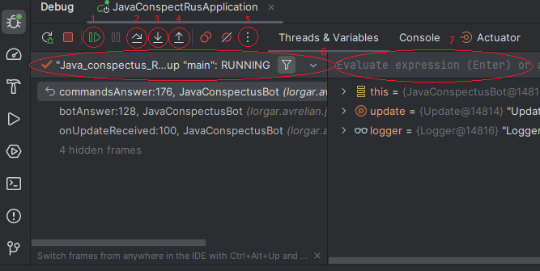

# 7 Инструменты разработчика

> [[_оглавление_]](../README.md/#7-инструменты-разработчика)

## 7.1 Документирование

> [[_оглавление_]](../README.md/#71-документирование)

### 7.1.1 Swagger

> [[_оглавление_]](../README.md/#71-документирование)

[**Swagger**](/conspect/definitions.md/#s) - это фреймворк для спецификации _RESTful API_.

[**Swagger UI**](/conspect/definitions.md/#s) - это графический интерфейс фреймворка _Swagger_, который позволяет
разработчикам описывать структуру своих _API_ и генерировать интерактивную документацию, клиентские библиотеки и
серверные модули для реализации _API_ на разных языках, а также отправлять запросы.

_Swagger_ предоставляет спецификацию для документирования _REST API_, которая называется
**_OpenAPI Specification (OAS)_**. Эта спецификация предоставляет чёткий и лаконичный способ описания эндпоинтов, их
параметров, моделей запросов и ответов и других аспектов _API_.

Существуют библиотеки, которые на основе _OAS_ могут сгенерировать интерактивную документацию для _API_, которая
позволит отправлять запросы, и получать ответы. Целесообразно использовать библиотеку _SpringDoc_, так как она
поддерживается и обновляется до сих пор.

#### 7.1.1.1 Подключение Swagger

> [[_оглавление_]](../README.md/#71-документирование)

Подключение _Swagger_ для версий _Spring Boot_ 2 и 3 происходит по-разному.

Для подключения _Swagger_ в приложение _Spring Boot 3_ необходимо добавить зависимости:

- для Web MVC в файл:
    - _pom.xml_:
  ```xml
  <!-- https://mvnrepository.com/artifact/org.springdoc/springdoc-openapi-starter-webmvc-ui -->
  <dependency>
      <groupId>org.springdoc</groupId>
      <artifactId>springdoc-openapi-starter-webmvc-ui</artifactId>
      <version>2.6.0</version>
  </dependency>
  ```
    - _build.gradle_:
  ```groovy
  // https://mvnrepository.com/artifact/org.springdoc/springdoc-openapi-starter-webmvc-ui
  implementation 'org.springdoc:springdoc-openapi-starter-webmvc-ui:2.6.0'
  ```
- для WebFlux в файл:
    - _pom.xml_:
  ```xml
  <!-- https://mvnrepository.com/artifact/org.springdoc/springdoc-openapi-starter-webflux-ui -->
  <dependency>
      <groupId>org.springdoc</groupId>
      <artifactId>springdoc-openapi-starter-webflux-ui</artifactId>
      <version>2.6.0</version>
  </dependency>
  ```
    - _build.gradle_:
  ```groovy
  // https://mvnrepository.com/artifact/org.springdoc/springdoc-openapi-starter-webflux-ui
  implementation 'org.springdoc:springdoc-openapi-starter-webflux-ui:2.6.0'
  ```

После добавления зависимостей необходимо также добавить аннотацию `@OpenAPIDefinition` к стартеру.

После подключения:

- _Swagger UI_ будет доступным по
  ссылке [http://localhost:8080/swagger-ui/index.html](http://localhost:8080/swagger-ui/index.html);
- спецификация для документирования _REST API_ будет доступна по
  ссылке [http://localhost:8080/v3/api-docs](http://localhost:8080/v3/api-docs).

> <span style="color:red">**_ВНИМАНИЕ!_**</span>  
> _Swagger UI_ рассчитан на корректную работу <span style="color:blue">**ТОЛЬКО**</span> с последней утверждённой
> версией _Spring Boot_.  
> То есть в версиях _Spring Boot_, имеющих какую-либо отметку, указанную в скобках (типа SNAPSHOT, M3 и т.д.),
> _Swagger UI_ корректно работать **НЕ БУДЕТ!**

#### 7.1.1.2 Документирование приложения

> [[_оглавление_]](../README.md/#71-документирование)

Документирование приложения в целом производится с помощью аннотации `@OpenAPIDefinition` посредством заполнения её
полей.

Пример:

```java

@SpringBootApplication
@OpenAPIDefinition(
        info = @Info(
                title = "Конспект по языку Java",
                description = "Конспект по языку Java на русском языке",
                version = "0.1.0",
                contact = @Contact(
                        name = "Токовенко Виктор",
                        email = "victor-14-244@mail.ru",
                        url = "https://github.com/Lorgar-Avrelian?tab=repositories"
                )
        )
)
public class JavaConspectRusApplication {

    public static void main(String[] args) {
        SpringApplication.run(JavaConspectRusApplication.class, args);
    }
}
```

#### 7.1.1.3 Документирование контроллеров

> [[_оглавление_]](../README.md/#71-документирование)

Документирование контроллеров производится с помощью аннотации `@Tag` посредством заполнения её полей.

Пример:

```java

@RestController
@RequestMapping(path = "/books")
@Tag(name = "Контроллер для книг", description = "Контроллер для работы с книгами")
public class BooksController {
    // Методы контроллера
}
```

Чтобы скрыть контроллер и не показывать его в списке отображаемых, необходимо применять аннотацию `@Hidden`.

Пример:

```java

@RestController
@Hidden
public class SpringWebIntroductionController {
    // Методы контроллера
}
```

#### 7.1.1.4 Документирование методов контроллера

> [[_оглавление_]](../README.md/#71-документирование)

Документирование методов контроллера производится с помощью аннотации `@Operation` посредством заполнения её полей.

Пример:

```java

@RestController
@RequestMapping(path = "/books")
@Tag(name = "Контроллер для книг", description = "Контроллер для работы с книгами")
public class BooksController {
    private final BookService bookService;

    public BooksController(BookService bookService) {
        this.bookService = bookService;
    }

    @PostMapping                    // http://localhost:8080/books      C - create
    @Operation(
            summary = "Создать",
            description = "Добавить информацию о книге",
            tags = "Книги",
            responses = {
                    @ApiResponse(
                            responseCode = "200",
                            description = "OK",
                            content = @Content(
                                    mediaType = MediaType.APPLICATION_JSON_VALUE,
                                    schema = @Schema(implementation = Book.class)
                            )
                    )
            }
    )
    public ResponseEntity<Book> createBook(@RequestBody Book book) {
        return ResponseEntity.ok(bookService.createBook(book));
    }

    @Operation(
            summary = "Найти",
            description = "Найти информацию о книге по ID",
            tags = "Книги",
            responses = {
                    @ApiResponse(
                            responseCode = "200",
                            description = "OK",
                            content = @Content(
                                    mediaType = MediaType.APPLICATION_JSON_VALUE,
                                    schema = @Schema(implementation = Book.class)
                            )
                    ),
                    @ApiResponse(
                            responseCode = "404",
                            description = "Not Found",
                            content = @Content(
                                    schema = @Schema(implementation = Void.class)
                            )
                    )
            }
    )
    @GetMapping(path = "/{id}")     // http://localhost:8080/books/1    R - read
    public ResponseEntity<Book> readBook(@PathVariable long id) {
        Book findedBook = bookService.findBook(id);
        if (findedBook != null) {
            return ResponseEntity.ok(findedBook);
        } else {
            return ResponseEntity.notFound().build();
        }
    }

    @Operation(
            summary = "Редактировать",
            description = "Отредактировать информацию о книге",
            tags = "Книги",
            responses = {
                    @ApiResponse(
                            responseCode = "200",
                            description = "OK",
                            content = @Content(
                                    mediaType = MediaType.APPLICATION_JSON_VALUE,
                                    schema = @Schema(implementation = Book.class)
                            )
                    ),
                    @ApiResponse(
                            responseCode = "400",
                            description = "Bad Request",
                            content = @Content(
                                    schema = @Schema(implementation = Void.class)
                            )
                    )
            }
    )
    @PutMapping                     // http://localhost:8080/books      U - update
    public ResponseEntity<Book> updateBook(@RequestBody Book book) {
        Book updatedBook = bookService.editBook(book);
        if (updatedBook != null) {
            return ResponseEntity.ok(updatedBook);
        } else {
            return ResponseEntity.status(HttpStatus.BAD_REQUEST).build();
        }
    }

    @Operation(
            summary = "Удалить",
            description = "Удалить информацию о книге по ID",
            tags = "Книги",
            responses = {
                    @ApiResponse(
                            responseCode = "200",
                            description = "OK",
                            content = @Content(
                                    mediaType = MediaType.APPLICATION_JSON_VALUE,
                                    schema = @Schema(implementation = Book.class)
                            )
                    ),
                    @ApiResponse(
                            responseCode = "403",
                            description = "Forbidden",
                            content = @Content(
                                    schema = @Schema(implementation = Void.class)
                            )
                    )
            }
    )
    @DeleteMapping(path = "/{id}")  // http://localhost:8080/books/1    D - delete
    public ResponseEntity<Book> deleteBook(@PathVariable long id) {
        Book deletedBook = bookService.deleteBook(id);
        if (deletedBook != null) {
            return ResponseEntity.ok(deletedBook);
        } else {
            return ResponseEntity.status(403).build();
        }
    }

    @Operation(
            summary = "Список",
            description = "Вывести список всех доступных книг",
            responses = {
                    @ApiResponse(
                            responseCode = "200",
                            description = "OK",
                            content = @Content(
                                    mediaType = MediaType.APPLICATION_JSON_VALUE,
                                    array = @ArraySchema(schema = @Schema(implementation = Book.class))
                            )
                    )
            }
    )
    @GetMapping
    public ResponseEntity<Collection<Book>> getAllBooks() {
        return ResponseEntity.status(200).body(bookService.getAllBooks());
    }
}
```

#### 7.1.1.5 Документирование параметров методов контроллера

> [[_оглавление_]](../README.md/#71-документирование)

Документирование параметров методов контроллера производится с помощью аннотации `@Parameter` посредством заполнения её
полей.

Пример:

```java

@DeleteMapping(path = "/{id}")  // http://localhost:8080/books/1    D - delete
public ResponseEntity<Book> deleteBook(@PathVariable @Parameter(description = "ID книги в имеющемся списке книг", required = true, schema = @Schema(implementation = Long.class)) long id) {
    Book deletedBook = bookService.deleteBook(id);
    if (deletedBook != null) {
        return ResponseEntity.ok(deletedBook);
    } else {
        return ResponseEntity.status(403).build();
    }
}
```

#### 7.1.1.6 Документирование сущностей

> [[_оглавление_]](../README.md/#71-документирование)

Документирование сущностей и их свойств производится с помощью аннотации `@Schema` посредством заполнения её полей.

Пример:

```java

@Schema(title = "Книга", description = "Сущность книги")
public class Book {
    @Schema(title = "ID", description = "ID книги", defaultValue = "1", required = true, minimum = "1", maximum = "9223372036854775807")
    private long id;
    @Schema(title = "Название", description = "Название книги", defaultValue = "Война и мир", required = true, minLength = 3, maxLength = 30)
    private String title;
    @Schema(title = "Автор", description = "Автор книги", defaultValue = "Л.Н. Толстой", required = true, minLength = 8, maxLength = 24)
    private String author;
    // Конструктор, геттеры, сеттеры, equals(), hashCode() и toString()
}
```

### 7.1.2 JavaDoc

> [[_оглавление_]](../README.md/#71-документирование)

Для документирования классов, их методов и _API_ используется _JavaDoc_.

[**JavaDoc**](/conspect/definitions.md/#j) - это генератор документации в _HTML_-формате из комментариев исходного кода
Java, который определяет стандарт для документирования классов Java, создания доклетов и тэглетов, позволяющих
программисту анализировать структуру Java-приложения.  
_JavaDoc_ также предоставляет _API_. В каждом случае комментарий должен находиться перед документируемым элементом.

С помощью _JavaDoc_ можно описывать:

- код - описание методов, классов, сущностей;
- _API_ - для большей прозрачности работы разных команд разработки;
- архитектура приложения - модули, связь с БД;
- все принятые решения, которые имеют важность;
- особенности алгоритма и комментарии к нему;
- требования к проекту и техническое задание от Заказчика;
- стандарты проекта и договоренности, которые разрабатываются самой командной разработки.

С помощью утилиты _JavaDoc_, входящей в состав _JDK_, комментарий документации можно извлекать и помещать в _НТМL_-файл.
Утилита _JavaDoc_ позволяет вставлять _HTML_-тэги и использовать специальные ярлыки (дескрипторы) документирования.
_НТМL_-тэги заголовков не используют, чтобы не нарушать стиль файла, сформированного утилитой.

Дескрипторы _JavaDoc_, начинающиеся со знака `@`, называются автономными и должны помещаться с начала строки
комментария (лидирующий символ `*` игнорируется). Дескрипторы, начинающиеся с фигурной скобки, например `{@code}`,
называются встроенными и могут применяться внутри описания.

> Для инициализация создания документации метода необходимо набрать в предшествующей строке кода `/**` и нажать
> кнопку <kbd>Enter</kbd>.

|             **Дескриптор**             |        **Применение**         |                       **Описание**                        |
|:--------------------------------------:|:-----------------------------:|:---------------------------------------------------------:|
|               `@author`                |       Класс, интерфейс        |                           Автор                           |
|               `@version`               |       Класс, интерфейс        |       Версия. Не более одного дескриптора на класс        |
|                `@since`                | Класс, интерфейс, поле, метод |            Указывает, с какой версии доступно             |
|                 `@see`                 | Класс, интерфейс, поле, метод |           Ссылка на другое место в документации           |
|                `@param`                |             Метод             |                  Входной параметр метода                  |
|               `@return`                |             Метод             |              Описание возвращаемого значения              |
| `@exception` класс_исключения описание |             Метод             | Описание исключения, которое может быть послано из метода |
|  `@throws` класс_исключения описание   |             Метод             | Описание исключения, которое может быть послано из метода |
|             `@deprecated`              | Класс, интерфейс, поле, метод |              Описание устаревших блоков кода              |
|          `{@link reference}`           | Класс, интерфейс, поле, метод |                          Ссылка                           |
|               `{@value}`               |        Статичное поле         |               Описание значения переменной                |

Пример использования:

```java
/**
 * Service for making CRUD operations with {@link Book} entities by using {@link JpaRepository} methods.
 *
 * @author Victor Tokovenko
 * @see JpaRepository
 * @see BookServiceImplDB
 * @see BookServiceImplHashMap
 */
@Service
public interface BookService {
    /**
     * Method is saving new {@link Book} to DB and returning entity of the saved {@link Book}.
     *
     * @param book that should be saved
     * @return {@code book} - that is saved
     * @throws RuntimeException when error received
     * @see BookServiceImplDB#createBook(Book)
     * @see BookServiceImplHashMap#createBook(Book)
     */
    Book createBook(Book book);

    /**
     * Method is returning entity of the {@link Book} by its ID.
     *
     * @param id of required {@link Book}
     * @return {@code book} - that is founded or {@link null} if {@link Book} is not founded
     * @see BookServiceImplDB#findBook(long)
     * @see BookServiceImplHashMap#findBook(long)
     */
    Book findBook(long id);

    /**
     * Method is saving edited {@link Book} and returning entity of the saved {@link Book}.
     *
     * @param book that should be edited
     * @return {@code book} - that is saved or {@link null} if {@link Book} is not founded
     * @see BookServiceImplDB#editBook(Book)
     * @see BookServiceImplHashMap#editBook(Book)
     */
    Book editBook(Book book);

    /**
     * Method is deleting {@link Book} and returning entity of the deleted {@link Book}.
     *
     * @param id of required {@link Book}
     * @return {@code book} - that is deleted or {@link null} if {@link Book} is not founded
     * @throws RuntimeException when error received
     * @see BookServiceImplDB#deleteBook(long)
     * @see BookServiceImplHashMap#deleteBook(long)
     */
    Book deleteBook(long id);

    /**
     * Method is returning {@link Collection} of all {@link Book}.
     *
     * @return {@code Collection<Book>} of founded books
     * @throws RuntimeException when error received
     * @see BookServiceImplDB#getAllBooks()
     * @see BookServiceImplHashMap#getAllBooks()
     */
    Collection<Book> getAllBooks();

    /**
     * Method is returning {@link Collection} of all {@link Book}.
     *
     * @param authorOrTitle part of author name or book title
     * @return {@code Collection<Book>} of founded books
     * @throws RuntimeException when error received
     * @see BookServiceImplDB#getAllBooks(String)
     * @see BookServiceImplHashMap#getAllBooks(String)
     */
    Collection<Book> getAllBooks(String authorOrTitle);
}
```

```java
/**
 * An implementation of {@link BookService}.<br>
 * Service for making CRUD operations with {@link Book} entities by using {@link JpaRepository} methods
 *
 * @author Victor Tokovenko
 * @see JpaRepository
 * @see BookService
 */
@Service
public class BookServiceImplDB implements BookService {
    private final BookRepository bookRepository;

    public BookServiceImplDB(BookRepository bookRepository) {
        this.bookRepository = bookRepository;
    }

    /**
     * Method is saving new {@link Book} to DB and returning entity of the saved {@link Book} from DB.<br>
     * Using {@link JpaRepository#save(Object)} method
     *
     * @param book that should be saved
     * @return {@code book} - that is saved
     * @throws RuntimeException when DB is not accessible
     * @see JpaRepository#save(Object)
     */
    @Override
    public Book createBook(Book book) {
        book.setId(0);
        return bookRepository.save(book);
    }

    /**
     * Method is returning entity of the {@link Book} from DB by its ID.<br>
     * Using {@link JpaRepository#findById(Object)}
     *
     * @param id of required {@link Book}
     * @return {@code book} - that is founded or {@link null} if {@link Book} is not founded
     * @see JpaRepository#findById(Object)
     */
    @Override
    public Book findBook(long id) {
        return bookRepository.findById(id).orElse(null);
    }

    /**
     * Method is saving edited {@link Book} to DB and returning entity of the saved {@link Book} from DB.<br>
     * Using {@link JpaRepository#save(Object)} and {@link JpaRepository#existsById(Object)} methods
     *
     * @param book that should be edited
     * @return {@code book} - that is saved or {@link null} if {@link Book} is not founded
     * @see JpaRepository#save(Object)
     * @see JpaRepository#existsById(Object)
     */
    @Override
    public Book editBook(Book book) {
        if (bookRepository.existsById(book.getId())) {
            return bookRepository.save(book);
        } else {
            return null;
        }
    }

    /**
     * Method is deleting {@link Book} from DB and returning entity of the deleted {@link Book}.<br>
     * Using {@link BookServiceImplDB#findBook(long)}, {@link JpaRepository#deleteById(Object)} and {@link JpaRepository#existsById(Object)} methods
     *
     * @param id of required {@link Book}
     * @return {@code book} - that is deleted or {@link null} if {@link Book} is not founded
     * @throws RuntimeException when DB is not accessible
     * @see BookServiceImplDB#findBook(long)
     * @see JpaRepository#deleteById(Object)
     * @see JpaRepository#existsById(Object)
     */
    @Override
    public Book deleteBook(long id) {
        if (bookRepository.existsById(id)) {
            Book book = findBook(id);
            bookRepository.deleteById(id);
            return book;
        } else {
            return null;
        }
    }

    /**
     * Method is returning {@link Collection} of all {@link Book} from DB.<br>
     * Using {@link JpaRepository#findAll()} method
     *
     * @return {@code Collection<Book>} of founded books
     * @throws RuntimeException when DB is not accessible
     * @see JpaRepository#findAll()
     */
    @Override
    public Collection<Book> getAllBooks() {
        return bookRepository.findAll();
    }

    /**
     * Method is returning {@link Collection} of all {@link Book} from DB.<br>
     * Using {@link BookRepository#findByAuthorContainsIgnoreCaseOrTitleContainsIgnoreCase(String, String)} method
     *
     * @param authorOrTitle part of author name or book title
     * @return {@code Collection<Book>} of founded books
     * @throws RuntimeException when DB is not accessible
     * @see BookRepository#findByAuthorContainsIgnoreCaseOrTitleContainsIgnoreCase(String, String)
     */
    @Override
    public Collection<Book> getAllBooks(String authorOrTitle) {
        return bookRepository.findByAuthorContainsIgnoreCaseOrTitleContainsIgnoreCase(authorOrTitle, authorOrTitle);
    }
}
```

```java
/**
 * An implementation of the {@link JpaRepository}.<br>
 * Repository for CRUD operations with {@link Book} entities
 *
 * @author Victor Tokovenko
 * @see JpaRepository
 */
@Repository
public interface BookRepository extends JpaRepository<Book, Long> {
    /**
     * Method is returning {@link Collection} of all {@link Book} from DB.
     *
     * @param author part of author name
     * @param title  part of book title
     * @return {@code Collection<Book>} of founded books
     */
    List<Book> findByAuthorContainsIgnoreCaseOrTitleContainsIgnoreCase(String author, String title);

    /**
     * Method is returning {@link Collection} of all {@link Book} of {@link Reader} with this ID from DB.
     *
     * @param readerId ID of reader
     * @return {@code Collection<Book>} of founded books
     */
    List<Book> findByReaderId(long readerId);
}
```

### 7.1.3 Wiki

> [[_оглавление_]](../README.md/#71-документирование)

[**Wiki**](/conspect/definitions.md/#w) - это платформы и сервисы для создания проектной документации и организации
совместного доступа к ней.

> На _GitHub_ _Wiki_ подключается к проекту по пути `Settings -> General -> Features`.

Проектное _Wiki_, как правило, создаётся с использованием языка разметки _Markdown_.

#### 7.1.3.1 Markdown

> [[_оглавление_]](../README.md/#71-документирование)

[**Markdown**](/conspect/definitions.md/#m) - это облегчённый язык разметки для форматирования текстовых документов.

_Markdown_ позволяет форматировать:

1. Заголовки:

```markdown
# Заголовок 1

## Заголовок 2

### Заголовок 3

#### Заголовок 4

##### Заголовок 5

###### Заголовок 6
```

2. Списки:

- нумерованные:

```markdown
1. Элемент 1
2. Элемент 2

1. Элемент 1
1. Элемент 2
```

- ненумерованные:

```markdown
* Элемент
* Элемент
    * Подэлемент
    * Подэлемент

- Элемент
- Элемент
    + Подэлемент
    + Подэлемент
```

- задач:

```markdown
- [x] Установить движок
- [ ] Создать страницы
- [ ] Настроить права
```

3. Тексты:

```markdown
Простой *наклонный* **жирный** ***жирный наклонный*** ~~зачеркнутый~~ <sup>надстрочный</sup> <sub>подстрочный</sub>
```

4. Горизонтальную черту:

```markdown
---

***

+++
```

5. Цитаты:

```markdown
> Век живи - век учись
```

6. Ссылки:

```markdown
[Главная](/home)

[Проектные группы](/groups#проектные-группы)
```

7. Таблицы:

```markdown
| Номер п/п | ФИО          | Возраст |
|-----------|--------------|---------|
| 1         | Вася Пупкин  | 19      |
| 2         | Маша Иванова | 21      |

Column | Column | Column
:----- | :----: | ----:
Left   | Center | Right
align  | align  | align
```

8. Блоки кода:

- внутритекстовые:

```markdown
    `int i = 5;`
```

- выделенные:

```markdown
    ```java
    @EnableScheduling
    public class JavaConspectRusApplication {
    
        public static void main(String[] args) {
            SpringApplication.run(JavaConspectRusApplication.class, args);
        }
    }
    ```
```

9. Сочетания клавиш:

```markdown
Чтобы скопировать текст нажмите <kbd>Ctrl</kbd> + <kbd>C</kbd>
```

10. Спойлеры:

```html

<details>
    <summary>Название</summary>
    Какой-нибудь длиинный дополнительный текст, который по умолчанию должен быть скрыт. Его можно показать, нажав на
    спойлер.
</details>
```

11. Emoji:

```markdown
:identifier:
```

> [[Ссылка]](https://www.webfx.com/tools/emoji-cheat-sheet/) на поддерживаемые _emoji_.

12. Формулы:

- внутритекстовые:

```markdown
$E=mc^2$
```

- выделенные:

```markdown
$$
\int\limits_a^b f(x) dx = F(b) - F(a)
$$
```

#### 7.1.3.2 README.md

> [[_оглавление_]](../README.md/#71-документирование)

Файл _README.md_, лежащий в корневой директории каждого из проектов, является основным файлом для описания самого
проекта.

Для документирования описания в файле используется язык разметки _Markdown_.

В _README.md_ указывается:

- название проекта;
- описание проекта (о чём проект и для чего создан);
- кто работал над проектом;
- функционал приложения (перечисление основных функций);
- демо проекта (ссылка на видео или фото-сопровождение, из которого понятно, какая функциональность заложена в
  приложении);
- перечень применённых технологий;
- порядок запуска проекта;
- дополнительные данные по проекту.

> [[Ссылка]](https://github.com/laravel/laravel) на пример оформления проекта.

## 7.2 Postman

> [[_оглавление_]](../README.md/#72-postman)

[**Postman**](/conspect/definitions.md/#p) - это приложение, предназначенное для проверки запросов с клиента на сервер и
получения ответа от бэкенда.

Интерфейс _Postman_ состоит из вкладок. Каждая вкладка - это настройки для конкретного запроса. Здесь можно настроить
метод запроса и прописать _URL_, к которому надо отправить запрос. Чтобы выполнить запрос, надо нажать кнопку
<kbd>Send</kbd>.


Чтобы отправлять _POST_-запросы нужно:

- перейти на вкладку <kbd>Body</kbd>;
- выбрать переключатель <kbd>raw</kbd> для добавления _JSON_-объекта;
- добавить в открывшемся поле объект в формате _JSON_;
- нажать кнопку <kbd>Send</kbd>.

Добавлять параметры в _URL_ можно двумя способами:

- с помощью командной строки, прописывая вручную;
- с помощью вкладки <kbd>Params</kbd>, добавляя параметры в столбцы _Key_ и _Value_.

Заголовки _HTTP_-запросов редактируются во вкладке <kbd>Headers</kbd>.

В случае, если в приложении настроен _Spring Security_, то параметры доступа для запросов можно редактировать во
вкладке <kbd>Authorization</kbd>.

## 7.3 PostgreSQL

> [[_оглавление_]](../README.md/#73-postgresql)

[**PostgreSQL**](/conspect/definitions.md/#p) - это бесплатная система управления базами данных c открытым исходным
кодом.

С помощью _PostgreSQL_ можно создавать, хранить базы данных и работать с данными с помощью запросов на языке _SQL_.

При установке _PostgreSQL_ на ЭВМ указываются:

- директория для хранения данных (по умолчанию для ОС Windows `C:\Program Files\PostgreSQL\17\data`);
- пароль для суперпользователя _Postgres_;
- порт, по которому будет запускаться сервер (по умолчанию **_5432_**).

После установки взаимодействие с базой данных _PostgreSQL_ возможно посредством приложения _pgAdmin_.

[**pgAdmin 4**](/conspect/definitions.md/#p) - это клиент для взаимодействия с базой данных _PostgreSQL_.

При первом запуске _pgAdmin 4_ просит ввести пароль для суперпользователя _Postgres_, который задавался во время
установки.

> Язык пользователя _pgAdmin 4_ изменяется по пути `File -> Preferences -> User Languages` в базовой английской
> транскрипции приложения или `Файл -> Настройки -> Язык пользователя` - для русской (в случае, если она была
> произведена).

Для подключения к серверам необходимо будет повторно вводить пароль для суперпользователя _Postgres_ как минимум
единожды.

> Для каждой из создаваемых баз данных рекомендуется создавать новую роль пользователя, поскольку администратор
> (суперпользователь _postgres_) у всех созданных баз данных должен быть один.

### 7.3.1 Добавление ролей пользователей

> [[_оглавление_]](../README.md/#73-postgresql)

Добавление новой роли пользователя производится в следующем порядке:

1. в меню _"Роли входа/группы"_ вызвать контекстное меню правой кнопкой мыши;


2. в контекстном меню сделать переход по пути _"Создать"_ -> _"Роль входа/группы"_;


3. во всплывающем окне во вкладке _"General"_ задать название роли;


4. на вкладке _"Определение"_ задать пароль для создаваемой роли;


5. на вкладке _"Права"_ задать все необходимые роли;


6. нажать кнопку <kbd>Сохранить</kbd>.

### 7.3.2 Создание базы данных

> [[_оглавление_]](../README.md/#73-postgresql)

Создание новой базы данных производится в следующем порядке:

1. в меню _"Базы данных"_ вызвать контекстное меню правой кнопкой мыши;


2. в контекстном меню сделать переход по пути _"Создать"_ -> _"База данных"_;


3. во всплывающем окне во вкладке _"General"_ задать название базы данных и владельца;


> Владельцем базы данных должен быть не суперпользователь (_postgres_)!  
> Порядок создания новой роли пользователей смотреть в
> разделе [[7.3.1 Добавление ролей пользователей]](/conspect/7.md/#731-добавление-ролей-пользователей).

4. на вкладке _"Определение"_ установить кодировку _UTF8_;


5. на вкладке _"SQL"_ проверить автоматически сформированный _SQL_-запрос по созданию новой базы данных;


6. нажать кнопку <kbd>Сохранить</kbd>.

## 7.4 Git

> [[_оглавление_]](../README.md/#74-git)

[**Git**](/conspect/definitions.md/#g) - это инструмент (или система контроля версий), который помогает отслеживать,
фиксировать и отменять какие-либо изменения в коде.

[**Gitflow**](/conspect/definitions.md/#g) - это определённая надстройка над моделью ветвления _Git_, которая включает в
себя использование _feature_-веток и несколько основных веток.


[**Репозиторий**](/conspect/definitions.md/#р) - это хранилище кода.  
По умолчанию код хранится на компьютере, его копия отправляется на удаленный репозиторий, например, GitHub или другое
веб-приложение (сайт).  
**GitHub/Bitbucket/GitLab** - это веб-приложения (сайты), в которых можно хранить, изменять, обновлять код. Это
удалённые репозитории по хранению кода, которые помогают организовывать командную работу, например ревью (проверка)
кода.

[**Ветка (branch)**](/conspect/definitions.md/#в) - это обособленная копия проекта, в которой хранится код и история его
изменений.  
В ветке можно изменять, удалять код, при этом эти изменения не затронут код в других ветках проекта. Веток может быть
сколько угодно, они создаются друг от друга.

[**Master**](/conspect/definitions.md/#m) - это основная ветка, которая создаётся тогда, когда создаётся сам
репозиторий (хранилище).  
В _мaster_ хранится самый проверенный и стабильный код, обновить его можно только через слияние с другими ветками,
которые были созданы от неё же (копии). Напрямую в _мaster_ что-то обновлять или менять можно только в очень крайних
случаях.

[**Commit**](/conspect/definitions.md/#c) - это запись в истории изменений, которая содержит _commit message_ (описание
внесенных изменений), а также содержит обновлённые файлы, подвергшиеся изменениям.  
Файл может быть один, а может быть несколько. Иногда _commit_ может содержать весь проект целиком (добавление проекта на
_GitHub_). _Commit_ осуществляется локально, но чтобы отправить его на _GitHub_, нужно осуществить _push_.

[**Push**](/conspect/definitions.md/#p) - это отправка новых коммитов на удалённый репозиторий.  
_Push_ отправляет коммиты, которые отсутствуют на удалённом репозитории. Если там нет ни одного, то отправляются все.
Если на удалённом репозитории отсутствует ветка, то _push_ создает её со всеми коммитами, что есть в локальной ветке.

[**Pull-request (Merge-request)**](/conspect/definitions.md/#p) - это запрос на слияние двух веток, с помощью которого
можно узнать, какие различия есть между двумя ветками (проектами).  
При пул-реквесте есть ветка-инициатор и ветка-получатель, и фиксируются все коммиты, которые есть в одной, но нет в
другой.

[**Merge**](/conspect/definitions.md/#m) - это непосредственно сам процесс слияния (объединения) двух веток.  
При этом ветка-получатель получает отсутствующие коммиты от ветки-отправителя.

[**Pull**](/conspect/definitions.md/#p) - это обновление локальной ветки за счёт коммитов на удалённом репозитории.

[**Fetch**](/conspect/definitions.md/#f) - это проверка, помогающая определить, есть ли новые коммиты в ветке на
удалённом репозитории, которые отсутствуют на локальной ветке.

[**Rebase**](/conspect/definitions.md/#r) - это объединение двух веток, при котором код одной ветки полностью заменяется
на код второй ветки.

[**Conflict**](/conspect/definitions.md/#c) - это ситуация, при котором нельзя объединить две ветки из-за конфликтов или
противоречий в их содержании (коде).

[**Cherry-pick**](/conspect/definitions.md/#c) - это копирование одного коммита из одной ветки в другую.

[**Revert (commit)**](/conspect/definitions.md/#r) - это отмена любого коммита в ветке за счёт создания нового коммита.

[**Reset**](/conspect/definitions.md/#r) - это отмена всех коммитов до определённого момента.  
Все промежуточные изменения между коммитами также отменяются.

Так как _Git_ работает по древовидной системе, алгоритм работы строится через использование веток.  
Любой репозиторий начинается с ветки _master_. Она является корнем дерева и существует на протяжении всего времени
существования проекта. Создаётся при инициализации репозитория. Представляет собой основной ствол, который даёт
возможность создавать "ответвления" в разные стороны по разным задачам.  
От ветки _master_ создаются ветки задач. При создании ветка подхватывает полную историю изменений ветки-родителя, однако
дальнейшие изменения никак с родителем не связаны, то есть новые изменения добавляются исключительно в новую ветку. В
единый момент времени веток, которые созданы от _master_, может быть несколько и каждая будет иметь свои варианты "
развития" истории изменений родителя, что при построении графа выглядит как полноценное дерево.  
Написание кода осуществляется в ветке задачи, а затем фиксируется в локальном репозитории через _commit_. Их
рекомендуется делать с учётом логического разграничения. Это даёт возможность проще найти изменения, связанные с
определенным фрагментом кода. Пока _commit_ не "запушен" в удалённый репозиторий, его описание можно менять.  
Далее коммиты следует отправлять в удалённый репозиторий через _push_. Отменить запушенные коммиты можно или путём
_revert_-коммита (оба коммита останутся в истории), который создаёт новый коммит с изменениями, "откатывающими"
нежелательный _commit_, или через _reset_ уровня _hard_, а затем _forced-push_ (удалит нежелательные _commit_ после
определённого момента, который и стал точкой _resetа_).  
После выполнения задачи и написания кода, между веткой и _master_ создаётся _pull-request_ (автоматически отображающий
все изменения между веткой задачи и _master_), проводится _review_ кода и, в случае положительной оценки, ветки
сливаются (выполняется _merge_), а ветка задачи удаляется за ненадобностью. В случае отрицательной оценки,
_pull-request_ остаётся открытым, пока код дорабатывается, или удаляется вместе с веткой задачи, если доработки не
требуются и изменения "забракованы".  
Иногда при слиянии веток могут возникать конфликты. В этой ситуации инициирующая ветка должна подтянуть в себя изменения
из принимающей (обычно _master_) и "совместить" конфликтующий код в один файл.


## 7.5 Intellij IDEA

> [[_оглавление_]](../README.md/#75-intellij-idea)

[**IDE (Integrated Development Environment)**](/conspect/definitions.md/#i) - это интегрированная среда разработки, или
программа, в которой можно писать, тестировать и запускать код, написанный разработчиком.

[**IDEA**](/conspect/definitions.md/#i) - это интегрированная среда разработки, которую разработала компания
_JetBrains_.  
Эта программа подходит для написания кода на разных языках, и на ней можно писать код на Java.

### 7.5.1 Горячие клавиши

> [[_оглавление_]](../README.md/#75-intellij-idea)

- генерация кода:

|                  **Сочетание клавиш**                  |         **Действие**          |
|:------------------------------------------------------:|:-----------------------------:|
|          <kbd>Ctrl</kbd> + <kbd>Пробел</kbd>           |      Автозаполнение кода      |
| <kbd>Ctrl</kbd> + <kbd>Shift</kbd> + <kbd>Пробел</kbd> |   Умное автодополнение кода   |
|           <kbd>Alt</kbd> + <kbd>Insert</kbd>           |          Создать код          |
|             <kbd>Ctrl</kbd> + <kbd>I</kbd>             | Реализовать методы интерфейса |
|             <kbd>Ctrl</kbd> + <kbd>O</kbd>             |  Реализовать методы родителя  |
|    <kbd>Ctrl</kbd> + <kbd>Alt</kbd> + <kbd>T</kbd>     |        Окружить кодом         |
|    <kbd>Ctrl</kbd> + <kbd>Alt</kbd> + <kbd>V</kbd>     |     Выделить в переменную     |
|    <kbd>Ctrl</kbd> + <kbd>Alt</kbd> + <kbd>M</kbd>     |       Выделить в метод        |
|   <kbd>Ctrl</kbd> + <kbd>Shift</kbd> + <kbd>T</kbd>    |         Создать тест          |

- поиск:

|               **Сочетание клавиш**               |         **Действие**          |
|:------------------------------------------------:|:-----------------------------:|
|       <kbd>Shift</kbd> + <kbd>Shift</kbd>        |         Искать везде          |
|          <kbd>Ctrl</kbd> + <kbd>F</kbd>          |        Поиск и замена         |
|         <kbd>Ctrl</kbd> + <kbd>F7</kbd>          |  Найти использование в файле  |
| <kbd>Ctrl</kbd> + <kbd>Alt</kbd> + <kbd>F7</kbd> | Найти использование в проекте |

- действия:

|                        **Сочетание клавиш**                         |          **Действие**          |
|:-------------------------------------------------------------------:|:------------------------------:|
|                  <kbd>Alt</kbd> + <kbd>Enter</kbd>                  |  Показать возможные действия   |
|                   <kbd>Ctrl</kbd> + <kbd>W</kbd>                    |        Умное выделение         |
|                   <kbd>Ctrl</kbd> + <kbd>P</kbd>                    | Показать параметры (аргументы) |
|                   <kbd>Ctrl</kbd> + <kbd>Q</kbd>                    | Показать документацию к методу |
|                   <kbd>Ctrl</kbd> + <kbd>D</kbd>                    | Продублировать текущую строку  |
|                 <kbd>Shift</kbd> + <kbd>Enter</kbd>                 |      Начать новую строку       |
|                  <kbd>Shift</kbd> + <kbd>F6</kbd>                   |         Переименовать          |
| <kbd>Shift</kbd> + <kbd>F9</kbd>, <kbd>Shift</kbd> + <kbd>F10</kbd> |      Компиляция и запуск       |

- комментарии:

|               **Сочетание клавиш**                |                     **Действие**                     |
|:-------------------------------------------------:|:----------------------------------------------------:|
|          <kbd>Ctrl</kbd> + <kbd>/</kbd>           |      Закомментировать/раскомментировать строку       |
| <kbd>Ctrl</kbd> + <kbd>Shift</kbd> + <kbd>/</kbd> | Закомментировать/раскомментировать выделенные строки |

- форматирование:

|              **Сочетание клавиш**               |     **Действие**      |
|:-----------------------------------------------:|:---------------------:|
| <kbd>Ctrl</kbd> + <kbd>Alt</kbd> + <kbd>L</kbd> | Переформатировать код |
| <kbd>Ctrl</kbd> + <kbd>Alt</kbd> + <kbd>O</kbd> | Оптимизировать импорт |

- навигация:

|                       **Сочетание клавиш**                        |     **Действие**      |
|:-----------------------------------------------------------------:|:---------------------:|
|                  <kbd>Ctrl</kbd> + <kbd>N</kbd>                   |   Перейти к классу    |
| <kbd>Ctrl</kbd> + <kbd>B</kbd>, <kbd>Ctrl</kbd> + <kbd>Клик</kbd> | Перейти к объявлению  |
|          <kbd>Ctrl</kbd> + <kbd>Alt</kbd> + <kbd>B</kbd>          | Перейти к применениям |

- дебаг:

|      **Сочетание клавиш**      |                  **Действие**                  |
|:------------------------------:|:----------------------------------------------:|
| <kbd>Alt</kbd> + <kbd>F8</kbd> | Окно evaluate expression (вычислить выражение) |

### 7.5.2 Debug

> [[_оглавление_]](../README.md/#75-intellij-idea)

[**Debug (дебаг)**](/conspect/definitions.md/#d) - это поиск, анализ и устранение ошибок в коде, которые были найдены.

_Intellij IDEA_ позволяет запускать приложения в режиме дебага.


Режим дебага позволяет приостанавливать ход выполнения алгоритма приложения при достижении точки остановки
(_break point_). Точки остановки - это строки, выделение которых производится путём клика левой кнопкой мыши по номеру
строки кода.


Ходом выполнения приложения после достижения алгоритмом первой точки остановки можно управлять посредством кнопок,
показанных на рисунке:



1. позволяет продолжить выполнение алгоритма до следующей точки остановки либо до конца, в случае отсутствия таковой;
2. позволяет перейти к следующему шагу выполнения кода;
3. позволяет провалиться в глубину вызовов методов данной конкретной строки кода, то есть перейти к следующему
   вызываемому методу;
4. позволяет подняться из глубины вызовов методов в данную конкретную строку кода, то есть перейти к предыдущему
   вызываемому методу;
5. позволяет выбрать дополнительные опции выполнения алгоритма (например, выбрать _Evaluate_ для расчёта текущих
   значений переменных или выражений);
6. позволяет переключаться между потоками и контролировать текущие значения переменных;
7. позволяет вводить набор выражений и переменных, текущие значения которых будут выводиться по ходу выполнения
   алгоритма.

## 7.6 Agile

> [[_оглавление_]](../README.md/#76-agile)

[**Agile**](/conspect/definitions.md/#a) - это гибкая методология разработки; ряд процессов разработки, определяющих
ценности и принципы, которыми руководствуются команды.

_Agile_ представляет собой целое направление в разработке, поэтому правила работы по нему декларированы в специальном
документе - _Agile Manifesto_. Сюда входят как практики, так и принципы, по которым должна работать команда.

Основные идеи _Agile_:

1. сотрудничество между разработчиками важнее, чем инструменты;
2. рабочая версия продукта имеет приоритет над документацией;
3. взаимопонимание между командой и заказчиком важнее чем условия контракта;
4. первоначальный план всегда можно изменить, если это необходимо.

Основные принципы _Agile_:

1. главным приоритетом является соответствие готовой программы ожиданиям заказчика;
2. изменение условий допускается на любом этапе, даже на финале разработки (если это способно повысить качество и
   конкурентоспособность ПО);
3. регулярная поставка рабочих версий программного продукта (каждые 14 дней, месяц или ежеквартально);
4. залог успеха - регулярное взаимодействие между заказчиком и разработчиками (желательно ежедневное);
5. проекты нужно строить среди тех, кто в них заинтересован, таких людей нужно обеспечить необходимыми условиями для
   работы и всяческой поддержкой;
6. лучший способ обмена информацией в команде - личная встреча;
7. рабочая версия ПО — лучший показатель прогресса;
8. все заинтересованные лица должны иметь возможность поддерживать нужный темп работы в течение всего процесса создания
   ПО;
9. техническое усовершенствование и хорошее проектирование улучшают гибкость;
10. важно придерживаться простоты и не создавать лишнее;
11. лучшие результаты получаются у тех команд, которые умеют самоорганизовываться;
12. участники команды должны регулярно думать о способах улучшения своей эффективности путем изменения рабочего
    процесса.

Согласно манифесту _Agile_, хороший процесс разработки ПО напрямую зависит от людей, которые задействованы в этом
процессе. Для этого нужно как можно более эффективно организовать их взаимодействие, создать максимально организованную
команду.

### 7.6.1 Методологии Agile

> [[_оглавление_]](../README.md/#76-agile)

В _Agile Manifesto_ существует несколько методологий, которые объясняют ценности и принципы:

- _Agile Modeling_;

> _Agile Modeling_ - это перечень принципов, терминов и практик, использование которых ускоряет и упрощает разработку
> моделей ПО и документацию. Цель _Agile Modeling_ состоит в улучшении моделирования и создании документации. Важно
> учесть, что сюда не входит кодирование, тестирование или вопросы, связанные с контролем над проектом, развёртыванием и
> поддержкой. Однако эта методология включает проверку кода.

- _Agile Unified Process_;

> _Agile Unified Process_ - это методология, которая упрощает для пользователей приближение (модель). Обычно применяется
> для разработки коммерческого софта.

- _Agile Data Method_;

> _Agile Data Method_ - это несколько похожих методологий, в которых условия заказчика достигаются благодаря
> сотрудничеству нескольких команд.

- _Rapid Application Development (DSDM)_;

> _DSDM_ подход отличается от остальных тем, что в нём наряду с разработчиками активное участие принимают пользователи
> будущего продукта.

- _Essential Unified Process_;

> _Essential Unified Process_ - это методология, использующая понимание практических действий, в которое включены:
> сценарий применения (описание поведенческой системы), поэтапная работа (формирование рабочих частей кода частями в
> пару недель), практики внутри команды (нужны для сплочения группы и увеличения эффективности работы) и практики внутри
> процесса (которые гласят, что начинать необходимо с малого, но при этом важно мыслить глобально).

- _Extreme programming_;

> _Extreme programming_ - это методология, главная задача которой управление регулярно изменяющимися требованиями к
> программам и приложениям и повышение качества разрабатываемого продукта. Она используется только в сфере создания
> программ и выстраивается вокруг четырех этапов: кодирование (по единым командным стандартам создания), тестирование (
> тесты составляются разработчиками до создания кода, который будут проверять), создание плана (планировать следует не
> только финальную стадию, но и промежуточные итерации) и слушание (как членов команды, так и потребителей).

- _Feature driven development_;

> _Feature driven development_ - это методология разработки, имеющая временное ограничение: “каждую функцию нужно
> реализовывать не дольше, чем за две недели”. Стоит учесть, что если сценарий использования невелик, его можно считать
> функцией. Если же он существенный, то его нужно разделить на несколько функций.

- _Getting Real_;

> _Getting Real_ - это итеративная методология, при которой сначала ведётся разработка интерфейса программы, а лишь
> затем ее функционала.

- _OpenUP_;

> _OpenUP_ - это методология разработки, который разделяет цикл проекта на четыре стадии: начальную, стадию уточнения,
> конструирования и передачи.

- _Scrum_.

> _Scrum_ - это метод разработки, который регулирует правила управления процессом разработки и позволяет применять уже
> имеющиеся практики кодирования с возможностью корректировки условий или внесением изменений. Использование этой
> методологии позволяет увидеть и устранить отклонения от ожидаемого результата на ранних стадиях разработки.

### 7.6.2 Scrum

> [[_оглавление_]](../README.md/#76-agile)

[**Scrum**](/conspect/definitions.md/#s) - это методология организации совместного рабочего процесса, в основе которой
лежит минимально необходимый набор мероприятий, артефактов и ролей, который за фиксированные небольшие промежутки
времени, называемые спринтами (_sprints_), предоставляет конечному пользователю работающий продукт с новыми
бизнес-возможностями, для которых определён наибольший приоритет.

[**Спринт (sprint)**](/conspect/definitions.md/#с) - это промежуток времени, достаточный для выполнения запланированных
задач, целью которых является создание новой версии программы.

[**Scrum-доска**](/conspect/definitions.md/#s) - это инструмент открытой демонстрации состояния текущей работы
_Scrum_-команды.

[**Цель спринта**](/conspect/definitions.md/#ц) - это краткое описание бизнес-цели спринта.


**Этапы спринта**:

1. Заполнение бэклога:

- хранилище всех задач;
- идеи;
- некритичные баги;
- технический долг;
- бизнес-задачи;

2. Планирование:

- определение цели спринта;
- выбор задач на спринт;
- проверка возможности реализации;
- распределение между участниками;

3. Цикл «разработка-тестирование»:

- 2–4 недели;
- стабилизация задач;
- ежедневные митинги (дэйли):
    * что сделано?
    * что планируется?
    * какие проблемы?

4. Этап «Демо»:

- встреча с Заказчиком;
- подтверждение готовности задач;
- небольшие доработки;

5. Поставка:

- новая версия программы;
- публикация для пользователей;

6. Ретроспектива:

- сбор обратной связи;
- планирование улучшений процессов.


